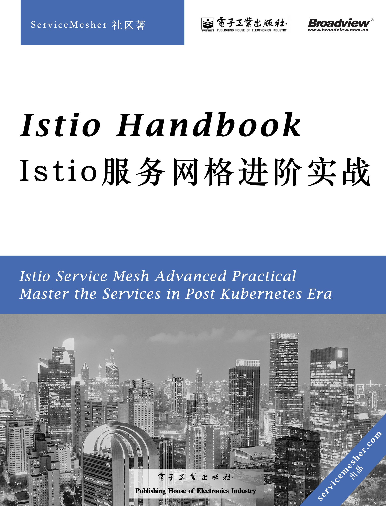
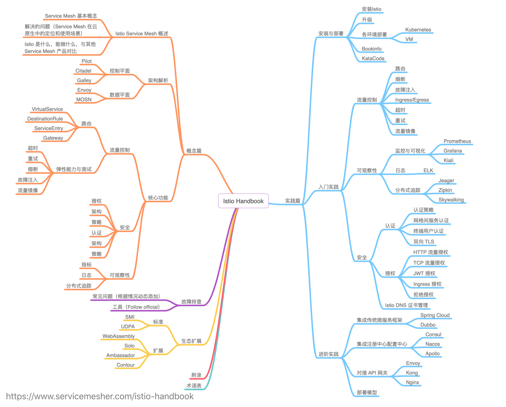

# Istio Handbook——Istio 服务网格进阶实战

Istio Service Mesh Advanced Practical - Master the Services in Post Kubernetes Era

[Istio](https://istio.io/zh) 是由 Google、IBM、Lyft 等共同开源的 Service Mesh（服务网格）框架，作为云原生时代下承 Kubernetes、上接 Serverless 架构的重要基础设施层，于 2017 年开始进入大众视野。

2018 年由蚂蚁金服发起成立了 [ServiceMesher 社区](https://www.servicemesher.com)，作为中国最早的一批研究和推广 Service Mesh 技术的开源社区决定整合社区资源，合作撰写一本开源的 Service Mesh 电子书以飨读者。

鉴于此前已经陆续有几本关于 Istio Service Mesh 的图书问世，本书区别于它们的是将更加注重基础知识的提炼及实战经验分享，建议读者同时结合 ServiceMesher 社区维护的 [Istio 官网中文版](https://istio.io/zh/)阅读。

您可以通过以下方式参与或阅读本书：

- 提交建议、勘误、参与撰写：<https://github.com/servicemesher/istio-handbook>
- 在线阅读：<https://www.servicemesher.com/istio-handbook>

## 快速开始

请访问 ServiceMesher 托管在 [katacoda](https://katacoda.com/istio-handbook) 上的课程。无需手动搭建 Kubernetes 集群，仅需 20 分钟即可快速试用 Istio 1.5 并运行 [Bookinfo](https://istio.io/zh/docs/examples/bookinfo/) 示例，完全免费。

## 关于本书

本书基于 Istio 1.5 版本编写，起源于 [rootsongjc/istio-handbook](https://github.com/rootsongjc/istio-handbook) 及 ServiceMesher 社区创作的 [Istio 知识图谱](https://github.com/servicemesher/istio-knowledge-map)。

  

本书概念图，封面图片[上海静安寺夜景](https://jimmysongio.tuchong.com/24318231/)，[Jimmy Song](https://jimmysong.io) 摄。

## 本书作者

| 头像 | GitHub | 姓名 | 头像 | GitHub | 姓名 |
| :---: | :---: | :---: | :---: | :---: | :---: |
|  | [rootsongjc](https://github.com/rootsongjc) | 宋净超 |  | [zhaohuabing](https://github.com/zhaohuabing) | 赵化冰 |
|  | [sunny0826](https://github.com/sunny0826) | 郭旭东 |  | [GuangmingLuo](https://github.com/GuangmingLuo) | 罗广明 |
|  | [malphi](https://github.com/malphi) | 马若飞 |  | [wangfakang](https://github.com/wangfakang) | 王发康 |
|  | [tony-Ma-yami](https://github.com/tony-Ma-yami) | 马博 |  | [hb-chen](https://github.com/hb-chen) | 陈洪波 |
|  | [dangpf](https://github.com/dangpf) | 党鹏飞 |  | [violetgo](https://github.com/violetgo) | 高威 |
|  | [wuti1609](https://github.com/wuti1609) | 马越 |  | [Lovnx](https://github.com/Lovnx) | 叶志远 |
|  | [AsCat](https://github.com/AsCat) | 翁扬慧 |  | [linda01232003](https://github.com/linda01232003) | 崔晓晴 |
|  | [wbpcode](https://github.com/wbpcode) | 王佰平 | | [sunzhaochang](https://github.com/sunzhaochang) | 孙召昌 |
|  | [zhongfox](https://github.com/zhongfox) | 钟华 |  | [tx19980520](https://github.com/tx19980520) | 谭骁 |

**[认领章节](wg/process.md)并提交 PR，成功合并后即可成为作者，期待你的加入。**

## 版权许可

本书采用[署名-非商业性使用-相同方式共享 4.0（CC BY-NC-SA 4.0）](https://creativecommons.org/licenses/by-nc-sa/4.0/deed.zh)许可，发行版权归属于电子工业出版社博文视点，未经授权请勿转载、印刷和发行。

本书著作权归属于 ServiceMesher 社区，[contributor](https://github.com/servicemesher/istio-handbook/graphs/contributors) 对其所编写的内容保留署名权，稿酬将作为社区发展基金向参与者公示。

## 参与贡献

- 请先阅读本书的[参与流程](wg/process.md)。
- 参与写作请参考[写作规范](wg/specification.md)。
- 有任何问题请与本书[编委会](wg/editorial-board.md)联系。
- 使用钉钉扫描下面的二维码加入本书讨论群。

    
  </a>

## 目录预览图

    
  </a>

## ServiceMesher 社区

获取更多关于服务网格的资讯、技术干货请加入 [ServiceMesher 社区](https://www.servicemesher.com)。

    
  </a>

