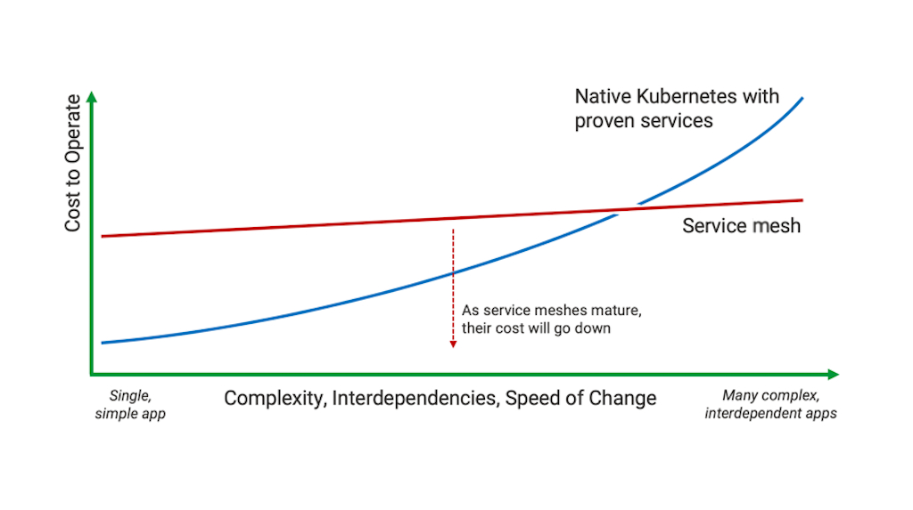

# 从边车模式到 Service Mesh

所谓边车模式（ Sidecar pattern ），也译作挎斗模式，是分布式架构中云设计模式的一种。因为其非常类似于生活中的边三轮摩托车而得名。该设计模式通过给应用程序加上一个“边车”的方式来拓展应用程序现有的功能。这种设计模式出现的很早，实现的方式也多种多样。现在这个模式更是随着微服务的火热与 Service Mesh 的逐渐成熟而进入人们的视野。

## 什么是边车模式

在 [Azure Architecture Center](https://docs.microsoft.com/en-us/azure/architecture/patterns/) 的云设计模式中是这么介绍边车模式的：

> Deploy components of an application into a separate process or container to provide isolation and encapsulation. 

> --- ***[Sidecar pattern](https://docs.microsoft.com/en-us/azure/architecture/patterns/sidecar)***

**这里要注意的是： 这里的 Sidecar 是分布式架构中云设计模式的一种，与我们目前在使用的 Istio 或 Linkerd 中的 Sidecar 是设计与实现的区别，后文中提到的边车模式均是指这种设计模式，请勿与 Istio 或 其他 Service Mesh 软件 中的 Sidecar 混淆。**

**边车模式**是一种分布式架构的设计模式。如上图所示，边车就是加装在摩托车旁来达到拓展功能的目的，比如行驶更加稳定，可以拉更多的人和货物，坐在边车上的人可以给驾驶员指路等。边车模式通过给应用服务加装一个“边车”来达到**控制**和**逻辑**的分离的目的。

比如日志记录、监控、流量控制、服务注册、服务发现、服务限流、服务熔断等在业务服务中不需要实现的控制面功能，可以交给“边车”，业务服务只需要专注实现业务逻辑即可。如上图那样，应用服务你只管开好你的车，打仗的事情就交给边车上的代理就好。这与分布式和微服务架构完美契合，真正的实现了控制和逻辑的分离与解耦。

## 边车模式设计

在设计上边车模式与网关模式有类似之处，但是其粒度更细。其为每个服务都配备一个“边车”，这个“边车“可以理解为一个 agent ，这个服务所有的通信都是通过这个 agent 来完成的，这个 agent 同服务一起创建，一起销毁。像服务注册、服务发现、监控、流量控制、日志记录、服务限流和服务熔断等功能完全可以做成标准化的组件和模块，不需要在单独实现其功能来消耗业务开发的精力和时间来开发和调试这些功能，这样可以开发出真正高内聚低耦合的软件。

这里有两种方法来实现边车模式：

**通过 SDK 、 Lib 等软件包的形式，在开发时引入该软件包依赖，使其与业务服务集成起来。**

这种方法可以与应用密切集成，提高资源利用率并且提高应用性能。但是这种方法是对代码有侵入的，受到编程语言和软件开发人员水平的限制，但当该依赖有 bug 或者需要升级时，业务代码需要重新编译和发布。同时，如果该依赖宣布停止维护或者闭源，那么会给该服务带来不小的影响。

**以 Sidecar 的形式，在运维的时候与应用服务集成在一起。**

这种方式对应用服务没有侵入性，不受编程语言和开发人员水平的限制，做到了控制与逻辑分开部署。但是会增加应用延迟，并且管理和部署的复杂度会增加。

## 边车模式解决了什么问题

边车模式在概念上是比较简单的，但是在实践中还是要了解边车模式到底解决了什么问题，我们为什么要使用边车模式？

**控制与逻辑分离的问题**

边车模式是基于将控制与逻辑分离和解耦的思想，通俗的讲就是让专业的人做专业的事，业务代码只需要关心其复杂的业务逻辑，其他的事情”边车“会帮其处理，从这个角度看，可能叫跟班或者秘书模式也不错 :)

日志记录、监控、流量控制、服务注册、服务发现、服务限流、服务熔断、鉴权、访问控制和服务调用可视化等，这些功能从本质上和业务服务的关系并不大，而传统的软件工程在开发层面完成这些功能，这导致了各种各样维护上的问题。

就好像一个厨师不是必须去关心食材的产地、饭店的选址、是给大厅的客人上菜还是给包房的客人上菜...他只需要做好菜就好，虽然上面的这些事他都可以做。而传统的软件工程就像是一个小饭店的厨师，他即是老板又是厨师，既需要买菜又需要炒菜，所有的事情都要他一个人做，如果客人一多，就会变的手忙脚乱；而控制与逻辑分离的软件，其逻辑部分就像是高档酒店的厨师，他只需要将菜做好即可，其他的事情由像”边车“这样的成员帮其处理。

**解决服务之间调用越来越复杂的问题**

随着分布式架构越来越复杂和微服务越拆越细，我们越来越迫切的希望有一个统一的控制面来管理我们的微服务，来帮助我们维护和管理所有微服务，这时传统开发层面上的控制就远远不够了。而边车模式可以很好的解决这个问题。

## 从边车模式到 Service Mesh

边车模式有效的分离了系统控制和业务逻辑，可以将所有的服务进行统一管理，让开发人员更专注于业务开发，显著的提升开发效率。而遵循这种模式进行实践从很早以前就开始了，开发人员一直试图将上文中我们提到的功能（如：流量控制、服务注册、服务发现、服务限流、服务熔断等）提取成一个标准化的 Sidecar ，通过 Sidecar 代理来与其他系统进行交互，这样可以大大简化业务开发和运维。而随着分布式架构和微服务被越来越多的公司和开发者接受并使用，这一需求日益凸显。

这就是 Service Mesh 服务网格诞生的契机，它是 CNCF（Cloud Native Computing Foundation，云原生基金会）目前主推的新一代微服务架构。 William Morgan 在 [What's a service mesh? And why do I need one?](https://buoyant.io/2017/04/25/whats-a-service-mesh-and-why-do-i-need-one/) 【[译文](https://blog.maoxianplay.com/posts/whats-a-service-mesh-and-why-do-i-need-one/)】中解释了什么是 Service Mesh 。

Service Mesh 有如下几个特点：

- 应用程序间通讯的中间层
- 轻量级网络代理
- 应用程序无感知
- 解耦应用程序的重试/超时、监控、追踪和服务发现

Service Mesh 将底层那些难以控制的网络通讯统一管理，诸如：流量管控，丢包重试，访问控制等。而上层的应用层协议只需关心业务逻辑即可。Service Mesh 是一个用于处理服务间通信的基础设施层，它负责为构建复杂的云原生应用传递可靠的网络请求。

## 你真的需要 Service Mesh 吗？

正如 NGINX 在其博客上发表的一篇文章名叫 [Do I Need a Service Mesh? ](https://www.nginx.com/blog/do-i-need-a-service-mesh/) 【[译文](http://www.servicemesher.com/blog/do-i-need-a-service-mesh/)】 的文章中提到：

> As the complexity of the application increases, service mesh becomes a realistic alternative to implementing capabilities service-by-service.

>随着应用程序复杂性的增加，服务网格将成为实现服务到服务的能力的现实选择。

图片来自：[Do I Need a Service Mesh?](https://www.nginx.com/blog/do-i-need-a-service-mesh/ )

随着我们的微服务越来越细分，我们所要管理的服务正在成倍的增长着，Kubernetes 提供了丰富的功能，使得我们可以快速的部署和调度这些服务，同时也提供了我们熟悉的方式来实现那些复杂的功能，但是当临界点到来时，可能就是我们真正要去考虑使用 Service Mesh 的时候了。

## 参考

- [Sidecar pattern - docs.microsoft.com](https://docs.microsoft.com/en-us/azure/architecture/patterns/sidecar)
- [What's a service mesh? And why do I need one? - buoyant.io](https://buoyant.io/2017/04/25/whats-a-service-mesh-and-why-do-i-need-one/)
- [Do I Need a Service Mesh? - www.nginx.com](https://www.nginx.com/blog/do-i-need-a-service-mesh/)
