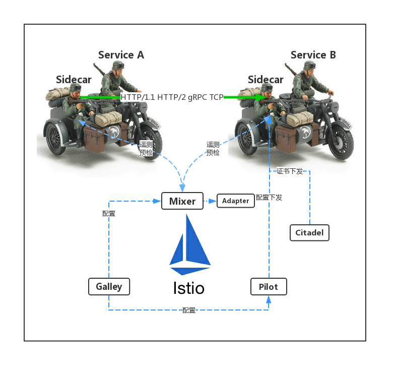

# Istio 架构解析

下面是以漫画的形式说明 Istio 是什么。

- Istio 是独立于平台的，可以在 Kubernetes 、 Consul 、虚拟机上部署的服务
- Istio 的组成
  - Envoy：智能代理、流量控制
  - Pilot：服务发现、流量管理
  - Mixer：访问控制、遥测
  - Citadel：终端用户认证、流量加密
  - Galley（1.1新增）：验证、处理和分配配置
- Service mesh 关注的方面
  - 可观察性
  - 安全性
  - 可运维性
  - 可拓展性
- Istio 的策略执行组件可以扩展和定制，同时也是可拔插的
- Istio 在数据平面为每个服务中注入一个 Envoy 代理以 Sidecar 形式运行来劫持所有进出服务的流量，同时对流量加以控制，通俗的讲就是应用程序你只管处理你的业务逻辑，其他的事情 Sidecar 会汇报给 Istio 控制平面处理
- 应用程序只需关注于业务逻辑（这才能生钱）即可，非功能性需求交给 Istio

## 设计目标
Istio 的架构设计中有几个关键目标，这些目标对于使系统能够应对大规模流量和高性能地服务处理至关重要。

- 最大化透明度：若想 Istio 被采纳，应该让运维和开发人员只需付出很少的代价就可以从中受益。为此，Istio 将自身自动注入到服务间所有的网络路径中。Istio 使用 sidecar 代理来捕获流量，并且在尽可能的地方自动编程网络层，以路由流量通过这些代理，而无需对已部署的应用程序代码进行任何改动。在 Kubernetes中，代理被注入到 pod 中，通过编写 iptables 规则来捕获流量。注入 sidecar 代理到 pod 中并且修改路由规则后，Istio 就能够调解所有流量。这个原则也适用于性能。当将 Istio 应用于部署时，运维人员可以发现，为提供这些功能而增加的资源开销是很小的。所有组件和 API 在设计时都必须考虑性能和规模。
- 可扩展性：随着运维人员和开发人员越来越依赖 Istio 提供的功能，系统必然和他们的需求一起成长。虽然我们期望继续自己添加新功能，但是我们预计最大的需求是扩展策略系统，集成其他策略和控制来源，并将网格行为信号传播到其他系统进行分析。策略运行时支持标准扩展机制以便插入到其他服务中。此外，它允许扩展词汇表，以允许基于网格生成的新信号来执行策略。
- 可移植性：使用 Istio 的生态系统将在很多维度上有差异。Istio 必须能够以最少的代价运行在任何云或预置环境中。将基于 Istio 的服务移植到新环境应该是轻而易举的，而使用 Istio 将一个服务同时部署到多个环境中也是可行的（例如，在多个云上进行冗余部署）。
- 策略一致性：在服务间的 API 调用中，策略的应用使得可以对网格间行为进行全面的控制，但对于无需在 API 级别表达的资源来说，对资源应用策略也同样重要。例如，将配额应用到 ML 训练任务消耗的 CPU 数量上，比将配额应用到启动这个工作的调用上更为有用。因此，策略系统作为独特的服务来维护，具有自己的 API，而不是将其放到代理/sidecar 中，这容许服务根据需要直接与其集成。

## 参考

- [Istio 是什么? - istio.io](https://istio.io/zh/docs/concepts/what-is-istio/)
- [Bookinfo 示例](https://istio.io/zh/docs/examples/bookinfo/)

