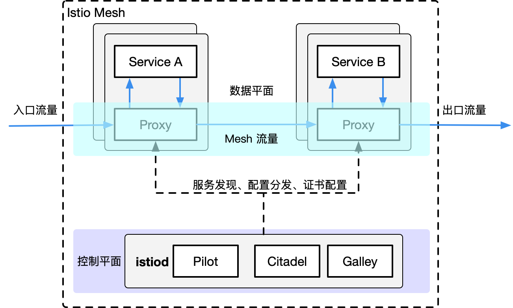
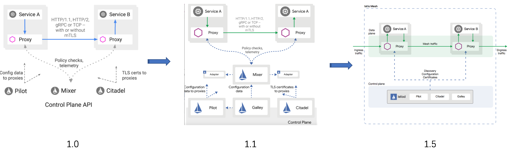

# 架构解析

作为新一代 Service Mesh 产品的领航者，Istio 创新性的在原有网格产品的基础上，添加了控制平面这一结构，使其产品形态更加的完善。这也是为什么它被称作第二代 Service Mesh 的原因。在此之后，几乎所有的网格产品都以此为基础进行架构的设计。毫不夸张的说，Istio 作为 Service Mesh 领域的弄潮儿，引领了时代的潮流，这也从一个侧面印证了它一经推出就大红大紫的原因。下面我们就来看看它的架构组成。

## Istio 的架构组成

Istio 的架构由两部分组成，分别是数据平面（Data Plane）和控制平面（Control Plane）。

- 数据平面：由整个网格内的 sidecar 代理组成，这些代理以 sidecar 的形式和应用服务一起部署。每一个 sidecar 会接管进入和离开服务的流量，并配合控制平面完成流量控制等方面的功能。可以把数据平面看做是网格内 sidecar 代理的网络拓扑集合。
- 控制平面：顾名思义，就是控制和管理数据平面中的 sidecar 代理，完成配置的分发、服务发现、和授权鉴权等功能。架构中拥有控制平面的优势在于，可以统一的对数据平面进行管理。试想一下，如果没有它，你想对网格内的代理进行配置的更新操作，恐怕就不是一件轻松的事情了。这也正是为什么拥有控制平面的产品，对 Linkerd 这种第一代 Service Mesh 具有巨大竞争优势的原因。在 Istio 1.5 版本中，控制平面由原来分散的、独立部署的几个组件整合为一个单体结构 istiod，变成了一个单进程、多模块的组织形态。

 

### 核心组件

下面我们简单的介绍一下 Istio 架构中几个核心组件的主要功能。

#### Envoy

Istio 的数据平面默认使用 Envoy 作为 sidecar 代理。Envoy 将自己定位于高性能的 sidecar 代理，也可以认为它是第一代 Service Mesh 产品。可以说，流量控制相关的绝大部分功能都是由 Envoy 提供的，这主要包括三个部分：

- 路由、流量转移。
- 弹性能力：如超时重试、熔断等。
- 调试功能：如故障注入、流量镜像。

#### Pilot

Pilot 组件的主要功能是将路由规则等配置信息转换为 sidecar 可以识别的信息，并下发给数据平面。可以把它简单的理解为是一个配置分发器（dispatcher），并辅助 sidecar 完成流量控制相关的功能。

#### Citadel

Citadel 是 Istio 中专门负责安全的组件，内置有身份和证书管理功能，可以实现较为强大的授权和认证等操作。

#### Galley

Galley 是 Istio 1.1 版本中新增加的组件，其目的是将 Pilot 和底层平台（如 Kubernetes）进行解耦。它分担了原本 Pilot 的一部分功能，主要负责配置的验证、提取和处理等功能。

## Istio 的设计目标

Istio 一经发布就希望打造一个最终形态的 Service Mesh 产品，功能异常丰富，可以说是胸怀宇宙。在设计理念上，Istio 并未遵从最小可行性产品（MVP）的演进策略，而是较为激进的全盘压上，想借此提供一个完善而强大的产品和架构体系。下面的几点设计目标促成了其架构的形态：

- 与应用透明：从本质上来说，与应用透明是 Service Mesh 的特性，一个合格的 Service Mesh 产品都应该具有这一特性，否则也就失去了网格产品的核心竞争力。Istio 在这一点上做的无可厚非。通过借助 Kubernetes 的 admission controller ，配合 webhook 可以完成 sidecar 的自动注入。在配置方面，也基本做到了对应用无侵入。
- 可扩展性：Istio 认为，运维和开发人员随着深入使用 Istio 提供的功能，会逐渐涌现更多的需求，主要集中在策略方面。因此，为策略系统提供足够的扩展性，成为了 Istio 的一个主要的设计目标。Mixer 组件就是在这一理念下诞生的，它被设计为一个插件模型，开发人员可以通过接入各种适配器（Adapter），来实现多样化的策略需求。毫不夸张的说，Mixer 的这种插件设计为 Istio 提供了无限的扩展性。
- 可移植性：考虑到现有云生态的多样性，Istio 被设计为可以支持几种不同的底层平台，也支持本地、虚拟机、云平台等不同的部署环境。不过从目前的情况来看，Istio 和 Kubernetes 还是有着较为紧密的依赖关系。
- 策略一致性：Istio 使用自己的 API 将策略系统独立出来，而不是集成到 sidecar 中，这允许服务根据需要直接与之集成。同时，Istio 在配置方面也注重统一和用户体验的一致。一个典型的例子是路由规则都统一由虚拟服务来配置，可在网格内、外以及边界的流量控制中复用。

## Istio 的架构变迁之旅

从 2017 年 5 月发布以来，Istio 经历了四个重要的版本和由此划分的三个发展阶段。在不到三年的产品迭代过程中，出现了两次重大的架构变动。功能的调整无可厚非，但架构的多次重构就较为少见了。我们来简要分析一下这个变迁历程。

- 0.1 版本：2017 年 5 月发布。作为第二代 Service Mesh 的开创者，宣告了 Istio 的诞生，也燃起了网格市场的硝烟与战火。
- 1.0 版本：发布于 2018 年 7 月，对外宣传生产环境可用。从 0.1 到 1.0 版本，开发时间经历了一年多，但持续的发布了多个 0.x 版本，这一阶段处于快速迭代期。
- 1.1 版本：发布于 2019 年 3 月，号称企业级可用的版本。一个小的版本号变化居然耗费了半年之久，其主要原因是出现了第一次架构重构，这一阶段算是调整期。
- 1.5 版本：发布于 2020 年 3 月，再次进行架构的重建，将多组件整合为单体形态的 istiod。从 1.1 到 1.5 版本的一年中，Istio 开始遵循季节性发布，进入了产品的稳定发展期。

在第一次架构变化中，Istio 团队认为虽然 Mixer 的插件模型为其带来了扩展性方面的优势，但与 Adapter 的相互依赖关系使得它会受到插件变化的影响。1.1 版本彻底贯彻了解耦原则，解决了存在的耦合问题，职责分明，结构清晰，做到了设计上的极致。然而物极必反，高度松散的结构引入了性能方面的问题，同时在易用性上也受人诟病。市场是检验真理的唯一标准，看到 Istio 在市场上的惨淡成绩后，Istio 团队痛定思痛，终于下定决心断臂自救，在 1.5 版本的时候以回归单体的形式进行了架构的重建，完成了一次自我救赎。

最新的 1.5 版本结构简洁，降低系统复杂度的同时也提升了易用性。尽管新版本还未受到市场的检验，但 Istio 团队敢于变革的勇气让我们对它的未来又有了新的期待。

接下来，我们会从控制平面和数据平面两方面，来详细介绍架构中各组件的主要功能和工作流程。