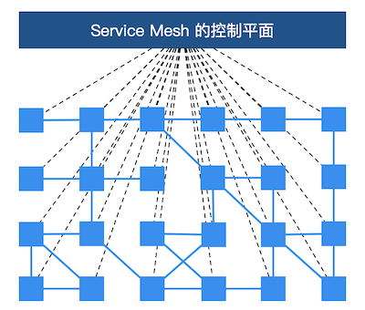

# Service Mesh 基本概念

2019年，在众多热门技术趋势中，**云原生**的关注度居高不下，很多开发者都对由此兴起的一众技术十分追捧，众多企业又开始探索云原生架构的转型与落地。这一年，中国的开发者们经历了从关注“云原生概念”到关注“云原生落地实践”的转变。而 Service Mesh 技术也因此越来越火热，受到越来越多开发者的关注，并拥有了大批拥趸。那么 Service Mesh 是什么呢？它为什么会受到开发者的关注？它和传统微服务应用有什么区别？

Service Mesh 一词最早由开发 Linkerd 的 Buoyant 公司提出，并于 2016 年 9 月29 日第一次公开使用了这一术语。William Morgan，Buoyant CEO，对 Service Mesh 这一概念定义如下：

> A service mesh is a dedicated infrastructure layer for handling service-to-service communication. It’s responsible for the reliable delivery of requests through the complex topology of services that comprise a modern, cloud native application. In practice, the service mesh is typically implemented as an array of lightweight network proxies that are deployed alongside application code, without the application needing to be aware.

翻译成中文如下：

Service Mesh 是一个专门处理服务通讯的基础设施层。它的职责是在由云原生应用组成服务的复杂拓扑结构下进行可靠的请求传送。在实践中，它是一组和应用服务部署在一起的轻量级的网络代理，并且对应用服务透明。

以上这段话有四个关键点：

- 本质：基础设施层。
- 功能：请求分发。
- 部署形式：网络代理。
- 特点：透明。

2017 年，随着 Linkerd 的传入，Service Mesh 进入国内社区的视野，并且由国内的技术布道师们翻译成“服务网格”。

服务网格从总体架构上来讲比较简单，不过是一堆紧挨着各项服务的用户代理，外加一组任务管理流程组成。代理在服务网格中被称为数据层或数据平面（data plane），管理流程被称为控制层或控制平面（control plane）。数据层截获不同服务之间的调用并对其进行“处理”；控制层协调代理的行为，并为运维人员提供 API，用来操控和测量整个网络。

更进一步地说，服务网格是一个专用的基础设施层，旨在“在微服务架构中实现可靠、快速和安全的服务间调用”。它不是一个“服务”的网格，而是一个“代理”的网格，服务可以插入这个代理，从而使网络抽象化。在典型的服务网格中，这些代理作为一个 sidecar（边车）被注入到每个服务部署中。服务不直接通过网络调用服务，而是调用它们本地的 sidecar 代理，而 sidecar 代理又代表服务管理请求，从而封装了服务间通信的复杂性。相互连接的 sidecar 代理集实现了所谓的数据平面，这与用于配置代理和收集指标的服务网格组件（控制平面）形成对比。

总而言之，Service Mesh 的基础设施层主要分为两部分：控制平面与数据平面。当前流行的两款开源服务网格 Istio 和 Linkerd 实际上都是这种构造。

控制平面的特点：

- 不直接解析数据包。
- 与控制平面中的代理通信，下发策略和配置。
- 负责网络行为的可视化。
- 通常提供 API 或者命令行工具可用于配置版本化管理，便于持续集成和部署。

数据平面的特点：

- 通常是按照无状态目标设计的，但实际上为了提高流量转发性能，需要缓存一些数据，因此无状态也是有争议的。
- 直接处理入站和出站数据包，转发、路由、健康检查、负载均衡、认证、鉴权、产生监控数据等。
- 对应用来说透明，即可以做到无感知部署。

那么服务网格的出现带来了哪些变革呢？

第一，微服务治理与业务逻辑的解耦。服务网格把 SDK 中的**大部分**能力从应用中剥离出来，拆解为独立进程，以 sidecar 的模式进行部署。服务网格通过将服务通信及相关管控功能从业务程序中分离并下沉到基础设施层，使其和业务系统完全解耦，使开发人员更加专注于业务本身。

> 注意，这里提到了一个词“大部分”，SDK 中往往还需要保留**协议编解码**的逻辑，甚至在某些场景下还需要一个轻量级的 SDK 来实现细粒度的治理与监控策略。例如，要想实现方法级别的调用链追踪，服务网格则需要业务应用实现 trace ID 的传递，而这部分实现逻辑也可以通过轻量级的 SDK 实现。因此，从代码层面来讲，服务网格并非是零侵入的。

第二，异构系统的统一治理。随着新技术的发展和人员更替，在同一家公司中往往会出现不同语言、不同框架的应用和服务，为了能够统一管控这些服务，以往的做法是为每种语言、每种框架都开发一套完整的 SDK，维护成本非常之高，而且给公司的中间件团队带来了很大的挑战。有了服务网格之后，通过将主体的服务治理能力下沉到基础设施，多语言的支持就轻松很多了。只需要提供一个非常轻量级的 SDK，甚至很多情况下都不需要一个单独的 SDK，就可以方便地实现多语言、多协议的统一流量管控、监控等需求。

此外，服务网格相对于传统微服务框架，还拥有三大技术优势：

- 可观察性。因为服务网格是一个专用的基础设施层，所有的服务间通信都要通过它，所以它在技术堆栈中处于独特的位置，以便在服务调用级别上提供统一的遥测指标。这意味着，所有服务都被监控为“黑盒”。服务网格捕获诸如来源、目的地、协议、URL、状态码、延迟、持续时间等线路数据。这本质上等同于 web 服务器日志可以提供的数据，但是服务网格可以为所有服务捕获这些数据，而不仅仅是单个服务的 web 层。需要指出的是，收集数据仅仅是解决微服务应用程序中可观察性问题的一部分。存储与分析这些数据则需要额外能力的机制的补充，然后作用于警报或实例自动伸缩等。
- 流量控制。通过 Service Mesh，可以为服务提供智能路由（蓝绿部署、金丝雀发布、A/B test）、超时重试、熔断、故障注入、流量镜像等各种控制能力。而以上这些往往是传统微服务框架不具备，但是对系统来说至关重要的功能。例如，服务网格承载了微服务之间的通信流量，因此可以在网格中通过规则进行故障注入，模拟部分微服务出现故障的情况，对整个应用的健壮性进行测试。由于服务网格的设计目的是有效地将来源请求调用连接到其最优目标服务实例，所以这些流量控制特性是“面向目的地的”。这正是服务网格流量控制能力的一大特点。
- 安全。在某种程度上，单体架构应用受其单地址空间的保护。然而，一旦单体架构应用被分解为多个微服务，网络就会成为一个重要的攻击面。更多的服务意味着更多的网络流量，这对黑客来说意味着更多的机会来攻击信息流。而服务网格恰恰提供了保护网络调用的能力和基础设施。服务网格的安全相关的好处主要体现在以下三个核心领域：服务的认证、服务间通讯的加密、安全相关策略的强制执行。

服务网格带来了巨大变革并且拥有其强大的技术优势，被称为第二代“微服务架构”。然而就像之前说的软件开发没有银弹，传统微服务架构有许多痛点，而服务网格也不例外，也有它的局限性。

- 增加了复杂度。服务网格将 sidecar 代理和其它组件引入到已经很复杂的分布式环境中，会极大地增加整体链路和操作运维的复杂性。
- 运维人员需要更专业。在容器编排器（如 Kubernetes）上添加 Istio 之类的服务网格，通常需要运维人员成为这两种技术的专家，以便充分使用二者的功能以及定位环境中遇到的问题。
- 延迟。从链路层面来讲，服务网格是一种侵入性的、复杂的技术，可以为系统调用增加显著的延迟。这个延迟是毫秒级别的，但是在特殊业务场景下，这个延迟可能也是难以容忍的。
- 平台的适配。服务网格的侵入性迫使开发人员和运维人员适应高度自治的平台并遵守平台的规则。

## 小结

以上分别介绍了服务网格的概念、服务网格相对于传统微服务架构的优缺点，对于后者，需要读者们辩证地去看待。从架构演进路径来看，从最早期的巨石单体（Monolithic）到分布式（Distributed），再到微服务（Microservices）、容器化（Containerization）、容器编排（Container Orchestration），最后到服务网格（Service Mesh）、无服务器（Serverless）。而服务网格正是这一演进路径中，至关重要的一环。

展望未来，Kubernetes 正在爆炸式发展，它已经成为企业落地应用的容器编排的首选。如果说 Kubernetes 已经彻底赢得了市场，并且基于 Kubernetes 的应用程序的规模和复杂性持续增加，那么就会有一个临界点，而服务网格则将是有效管理这些应用程序所必需的。随着服务网格技术的持续发展，其实现产品（如 Istio）的架构与功能的不断优化，服务网格将完全取代传统微服务架构，成为大小企业微服务化和上云改造的首选架构。
