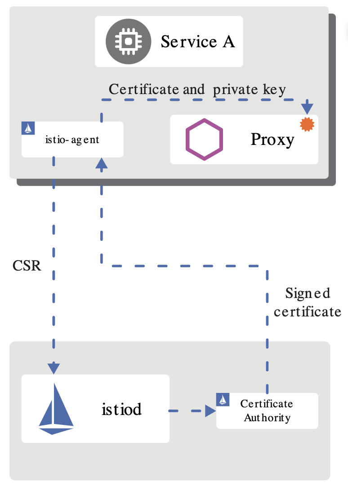

# Citadel

Citadel 是 Istio 中负责身份认证和证书管理的核心安全组件，1.5 版本之后取消了独立进程，作为一个模块被整合在 istiod 中。本小节我们来介绍一下 Citadel 的基本工作原理。

## Citadel 基本功能

总体来说，Istio 在安全架构方面主要包括以下内容：
- 证书签发机构（CA）负责密钥和证书管理
- API 服务器将安全配置分发给数据平面
- 客户端、服务端通过代理安全通信
- Envoy 代理管理遥测和审计

Istio 的身份标识模型使用一级服务标识来确定请求的来源，它可以灵活的标识终端用户、工作负载等。在平台层面，Istio 可以使用类似于服务名称来标识身份，或直接使用平台提供的服务标识。比如 Kubernetes 的 ServiceAccount，AWS IAM 用户、角色账户等。

在身份和证书管理方面，Istio 使用 X.509 证书，并支持密钥和证书的自动轮换。从 1.1 版本开始，Istio 开始支持安全发现服务器（SDS），随着不断的完善和增强，1.5 版本 SDS 已经成为默认开启的组件。Citadel 以前有两个功能：将证书以 Secret 的方式挂载到命名空间里；通过 SDS gRPC 接口与nodeagent(已废弃)通信。目前 Citadel 只需要完成与 SDS 相关的工作，其他功能被移动到了 istiod 中。

## Citadel 工作原理

Citadel 主要包括 CA 服务器、SDS 服务器、证书密钥控制器等模块，它们的工作原理如下。

### CA 服务器

Citadel 中的 CA 签发机构是一个 gRPC 服务器，启动时会注册两个 gRPC 服务，一个是 CA 服务，用来处理 CSR 请求（certificate signing request）；另外一个是证书服务，用来签发证书。CA 首先通过 `HandleCSR` 接口处理来自客户端的 CSR 请求，对客户端进行身份验证（包括 TLS 认证和 JWT 认证），验证成功后会调用 `CreateCertificate` 进行证书签发。

### SDS 服务器

SDS 即安全发现服务（Secret discovery service），它是一种在运行时动态获取证书私钥的 API，Envoy 代理通过 SDS 动态获取证书私钥。Istio 中的 SDS 服务器负责证书管理，并实现了安全配置的自动化。相比传统的方式，使用 SDS 主要有以下优点：
- 无需挂载 Secret 卷
- 动态更新证书，无需重启
- 可以监听多个证书密钥对

目前的版本中，SDS 是默认开启的，它的工作流程如下：
- Envoy 通过 SDS API 发送证书和密钥请求
- istio-agent 作为 Envoy 的代理，创建一个私钥和证书签名请求（CSR），并发送给 istiod
- CA 机构验证收到的 CSR 并生成证书
- istio-agent 将私钥和从 istiod 收到的证书通过 SDS API 发送给 Envoy
- 以上流程周期性执行实现密钥和证书轮换

### 证书密钥控制器

证书密钥控制器（CaSecretController）监听 `istio.io/key-and-cert` 类型的 Secret 资源，它会周期性的检查证书是否过期，并更新证书。

### 证书轮换

如果没有自动证书轮换功能，当证书过期时，就不得不重启签发，并重启代理。证书轮换解决了这一问题，提高了服务的可用性。Istio 里通过一个轮换器（Ratator）自动检查自签名的根证书，并在证书即将过期时进行更新，它本质上是一个协程（goroutine）在后台轮询实现的：
- 获取当前证书，解析证书的有效期并获取下一次轮换时间
- 启动定时器，如果发现证书到达轮换时间，从 CA 获取最新的证书密钥对
- 更新证书

## 小结

本节我们介绍了 Citadel 的基本组成和工作原理。随着 1.5 版本新架构的发布，Citadel 从独立的进程变成了 istiod 中的一个模块，其功能也逐渐被弱化，目前主要和 istiod、istio-agent 协同工作，负责证书和密钥管理。

## 参考
- [https://istio.io/latest/docs/concepts/security/](https://istio.io/latest/docs/concepts/security/)