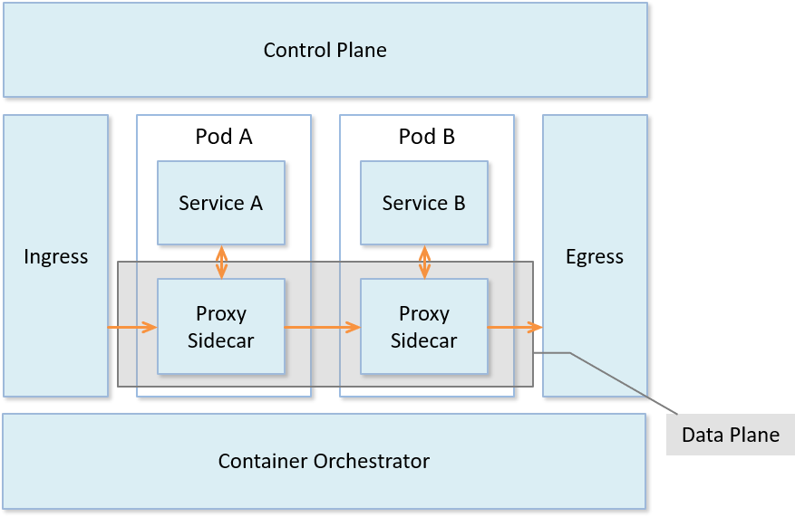
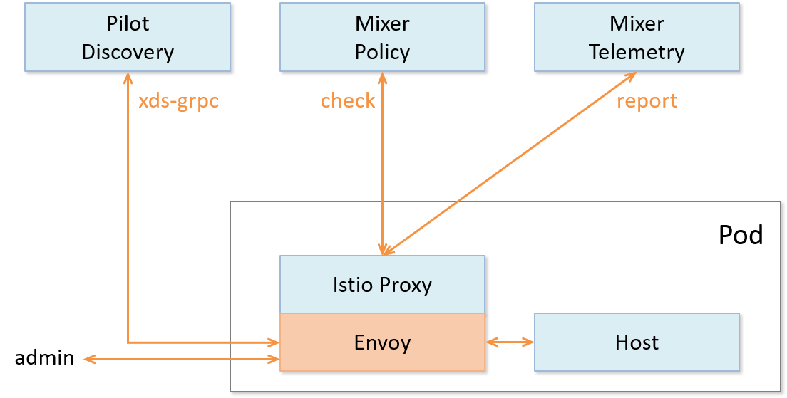

# 数据平面介绍

数据平面（data plane）是最先出现在分层网络中的概念，网络层一般被分为控制平面（control plane）与数据平面。控制平面主要为数据包的快速转发准备必要信息，如：路由协议，设备管理，命令行，ARP，IGMP 等；而数据平面则主要负责高速地处理和转发数据包，因为所有由网络处理器处理的数据包都必须经过这里，所以是影响整个系统性能的关键因素。这样划分的目的是把不同类型的工作分离开，避免不同类型的处理相互干扰。数据平面的转发工作无疑是网络层的重要工作，需要最高的优先级；而控制平面的路由协议等不需要在段时间内处理大量的包，可以将其放到次一级的优先级中。数据平面可以专注使用定制序列化等各种技术来提高传输速率，而控制平面则可以借助于通用库来达到更好的控制与保护效果。

服务网格（Service Mesh）是一个用于处理服务间通信的基础设施层，它负责为构建复杂的云原生应用传递可靠的网络请求。在实践中，服务网格通常实现为一组和应用程序部署在一起的轻量级的网络代理，但对应用程序来说是透明的。这看起来和分层网络中的网络层极为相似，因此作为 Service Mesh 的典型实现，Istio 采用同样的设计，如下图，将系统分为数据平面与控制平面。类似的，数据平面由通信代理组件（Envoy/Linkerd等）和组件之间的网络通信组成；控制平面负责对通信代理组件进行管理和配置。
  

 
Istio 数据平面核心是以边车（sidecar）模式运行的智能代理。边车模式将数据平面核心组件部署到单独的流程或容器中，以提供隔离和封装。边车应用与父应用程序共享相同的生命周期，与父应用程序一起创建和退出。边车应用附加到父应用程序，并为应用程序提供额外的特性支持，边车模式详细介绍请参照背书[边车模式](sidecar.md)中的相关内容。
如下图所示，数据平面的边车代理可以调节和控制微服务之间所有的网络通信，每个服务 Pod 启动时会伴随启动 istio-init 和 proxy 容器。其中 istio-init 容器主要功能是初始化 Pod 网络和对 Pod 设置 iptable 规则，设置完成后自动结束。Proxy 容器会启动两个服务：istio-agent 以及网络代理组件。istio-agent 的作用是同步管理数据，启动并管理网络代理服务进程，上报遥测数据；网络代理组件则根据管理策略完成流量管控、生成遥测数据。数据平面真正触及到对网络数据包的相关操作，是上层控制平面策略的具体执行者。

  
在 Istio 中，数据平面主要负责执行如下任务：
- 服务发现：探测所有可用的上游或后端服务实例
- 健康检测：探测上游或后端服务实例是否健康，是否准备好接收网络流量
- 流量路由：将网络请求路由到正确的上游或后端服务
- 负载均衡：在对上游或后端服务进行请求时，选择合适的服务实例接收请求，同时负责处理超时、断路、重试等情况
- 身份验证和授权：在 istio-agent 与 istiod 配合下，对网络请求进行身份验证、权限验证，以决定是否响应以及如何响应，使用 mTLS 或其他机制对链路进行加密等
- 链路追踪：对于每个请求，生成详细的统计信息、日志记录和分布式追踪数据，以便操作人员能够理解调用路径并在出现问题时进行调试

简单来说，数据平面的工作就是负责有条件地转换、转发以及观察进出服务实例的每个网络包。
  
现在常见的数据平面实现有：
- Envoy：Istio 默认使用的数据平面实现方案，使用C++开发，性能较高。
- MOSN：阿里巴巴公司开源，设计类似 Envoy，使用 Go 语言开发，优化过多协议支持。
- Linkerd：一个提供弹性云端原生应用服务网格的开源项目，也是面向微服务的开源 RPC 代理，使用 Scala 开发。它的核心是一个透明代理。因此也可作为典型的数据平面的实现。