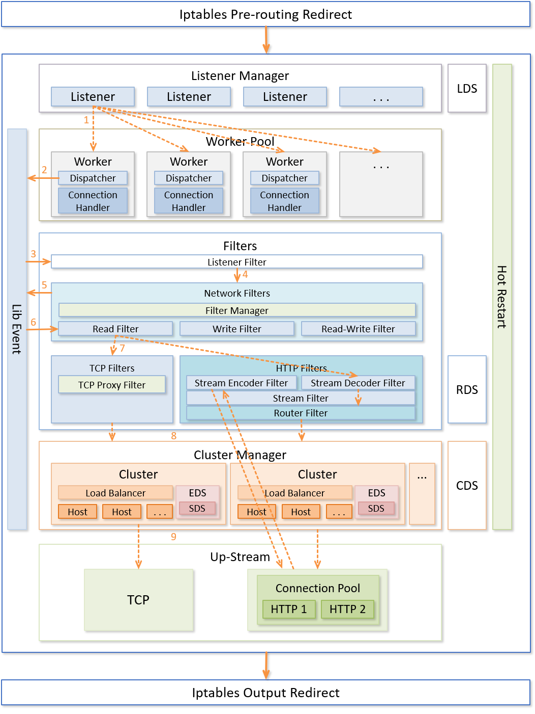
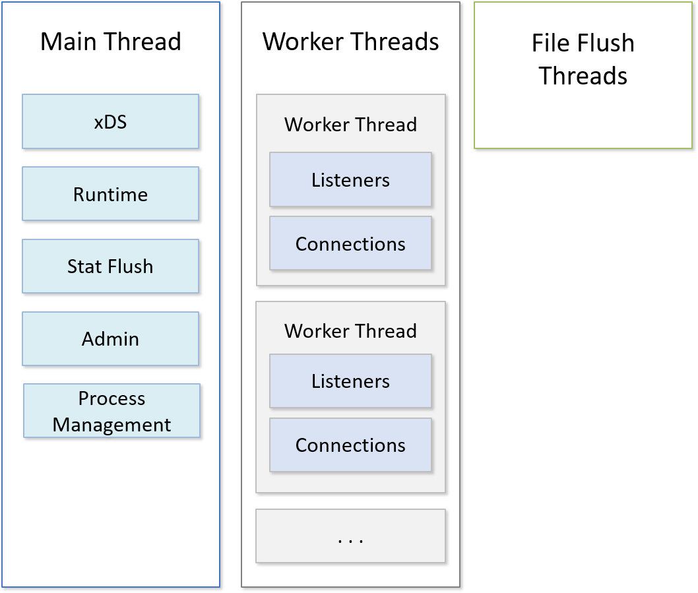
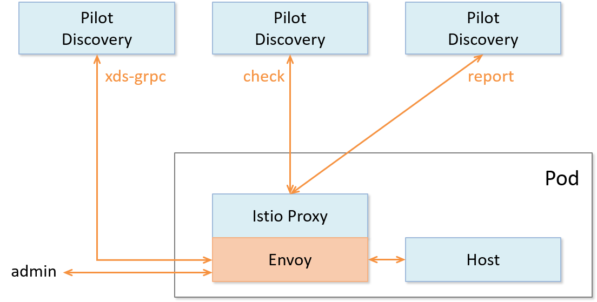

# Envoy

Envoy 是一款 CNCF 旗下由 Lyft 开源的使用 C++ 实现的面向 Service Mesh 的高性能网络代理服务。作为 Istio Service Mesh 中默认的数据平面，它以 Sidecar 的方式与应用程序并行运行在同一个 Pod 中。Envoy 本身不会干扰应用的正常运行，但当有网络流量流入流出应用时，都先会经过 Envoy 的容器。这个过程中，Envoy 在实现基础路由的同时，可以根据配置的规则实现流量治理，数据监控等功能。Envoy 本身作为一个七层网络代理和通信总线，它是以做到“网络对于应用来说是透明的，当网络和应用出现问题时应该能轻松定位到根本原因。”为设计目标的。

Envoy 官网地址 <https://www.envoyproxy.io/>。

Envoy 开源地址 <https://github.com/envoyproxy/envoy>。

## 框架介绍

对 Envoy 有了初步了解后，接下来我们将从其功能特性、架构设计、线程模型等方面对其进行深入解析。

### 功能特性

Envoy 作为优秀的七层网络代理，其特性主要体现在如下方面：

- 非侵入的架构：Envoy 是和应用服务并行运行的，透明地代理应用服务发出/接收的流量。应用服务只需要和 Envoy 通信，无需知道其他微服务应用在哪里。
- 兼容广泛的协议：
    - 作为 L3/L4 网络代理，支持 TCP、HTTP 代理和 TLS 认证；
    - 作为 L7 代理，Buffer、限流等高级功能；
    - 作为 L7 路由，Envoy 支持通过路径、权限、请求内容、运行时间等参数重定向路由请求，并支持 L7 的 MongoDB 和 DynamoDB
    - 顶级HTTP支持，同时支持 HTTP/1.1 和 HTTP/2, 并支持 gRPC 请求和响应。
- 优异的性能：基于 Modern C++11实现，性能优异。
— 丰富的支持功能：
    - 服务发现： 支持包括 DNS, EDS 在内的多种服务发现方案。
    - 健康检查：内置健康检查子系统。
    - Tracing：方便集成 Open Tracing 系统，追踪请求
    - 统计与监控：内置 stats 模块，方便集成诸如 prometheus/statsd 等监控方案
    - 动态配置：通过“动态配置API”实现配置的动态调整，而无需重启 Envoy 服务的。

### 架构解析

Envoy 的架构设计如下图所示，

其中：

- Listener 是 Envoy 内部的监听器，用来监听下游主机，下游主机通过 Listener 连接 Envoy。
- Worker 线程是 Listener Manager 根据配置文件中的本地监听端口启动的。这些线程通过 Libevent 处理 Socket 的 accept、epoll等相关事件
- Filter 模块在网络层中过滤数据流量，包含 Listener Filter、Read Filter 和 Write Filter等，目前支持 Client TLS authentication、Echo、External Authentication、Mongo Proxy、Rate Limit、Redis Proxy 及 TCP Proxy等。
- Cluster Manager 模块是集群管理模块，包括集群内部的 Host 管理、负载均衡、健康检查等。集群管理模块可能会不经过 L7 层，直接访问 L3/L4 层实现健康管理等。

Envoy 采用了类 Nginx 的架构，方式是：多线程 + 非阻塞 + 异步IO（Libevent）

### 线程模型

如图所示，Envoy 使用三种不同类型的线程：

- Main：此线程可以启动和关闭服务器。负责所有 xDS API 处理（包括 DNS ， 运行状况检查和常规集群管理 ）， 运行时 ，统计刷新，管理和一般进程管理（信号， 热启动等）。 在这个线程上发生的一切都是异步的和“非阻塞的”。通常，主线程负责所有不需要消耗大量 CPU 就可以完成的关键功能。 这可以保证大多数管理代码都是以单线程运行的。
- Worker：默认情况下，Envoy 为系统中的每个硬件线程生成一个工作线程。（可以通过 --concurrency 选项控制）。 每个 Worker 线程是一个“非阻塞”事件循环，负责监听每个侦听器，接受新连接，为每个连接实例化过滤器栈，以及处理所有连接生命周期内 IO 事件。 这也允许大多数连接处理代码以近似单线程运行。
- 文件刷新器：Envoy 写入的每个文件（主要是访问日志）都有一个独立的刷新线程。 这是因为即使用 O_NONBLOCK 写入文件系统有时也会阻塞。 当工作线程需要写入文件时，数据实际上被移入内存缓冲区，最终通过文件刷新线程刷新至磁盘。 这是一个共享内存区域，理论上说所有 Worker 都可以在同一个锁上阻塞，因为他们可能会同时尝试写内存缓冲区。 这一部分内容将在后面进一步讨论。

## 应用场景

Envoy 作为默认的 Istio 默认的数据平面实现，其以 Sidecar 的方式运行在 Kubernetes 集群中。但作为 L4、L7 网络代理组件，其也可以单独作为负载均衡组件或者 gateway 模块单独部署。下面我们讲对这两种方式进行讲解。

### 前端网关（gateway）

Envoy 是与 HAProxy 和 Nginx 一样，都是同一领域中的新型网络代理/网络服务器。因此 Envoy 也可以像 Nginx 那样作为应用的前端网关使用。其能够提供多协议支持、负载均衡、链路追踪、异常检测、动态配置等通用网关功能。

### Service Mesh 数据平面（sidecar）

如上图所示，在 Istio 中作为数据平面使用时，会将 Envoy 以及 Pilot-agent 一起打包到容器中使用。

Pilot 通过在 Envoy 启动文件中配置的 Pilot 的地址和端口，向 Envoy 动态下发 xDS 的 gRPC 配置。Envoy 把后端 Host 的服务发现也会上报给 Pilot 的 discovery 容器。

Mixer policy 基于配置的策略，对经过 Envoy 的请求进行 check，并返回 status 状态，决定是否继续连接。Envoy 在每次发起连接时都会先去 istio-proxy 中的 cache 查找是否有缓存的 policy，如果有，则根据缓存决定是否继续连接；如果没有则 istio-proxy会向 Mixer policy 发起请求得到 status 并缓存在 cache 中，Envoy 会根据这次远程调用 Mixer 的返回值决定是否继续。

Mixer telemetry 用于接收从 Envoy 发来的 report 信息，即 Envoy 在连接过程中的各类监控遥测数据。在 Report 时 istio-proxy 会将信息根据 attribute 的属性压缩成不同的 map，把 map 和对应的 global_dictionary 发送给 Mixer 的 telemetry。

## 小结

本节主要从功能特性、架构设计、线程模型以及应用场景等方面详细讲解了 Envoy 以及其在 Istio 中作为数据平面的使用方式。后续实践篇我们会结合实例来讲解 Envoy 的配置与使用。

## 参考资料

- 《云原生服务网格 Istio》
