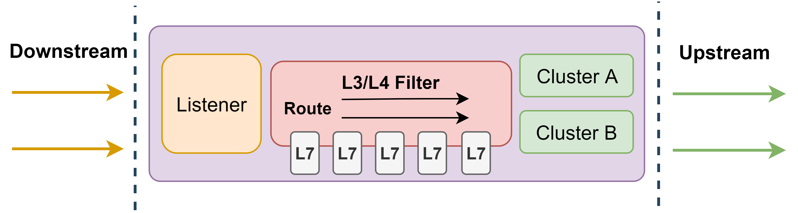
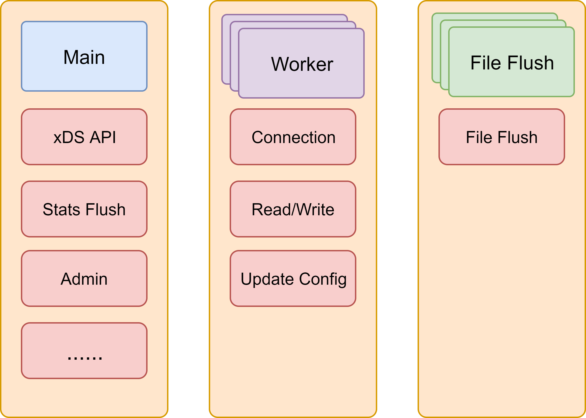
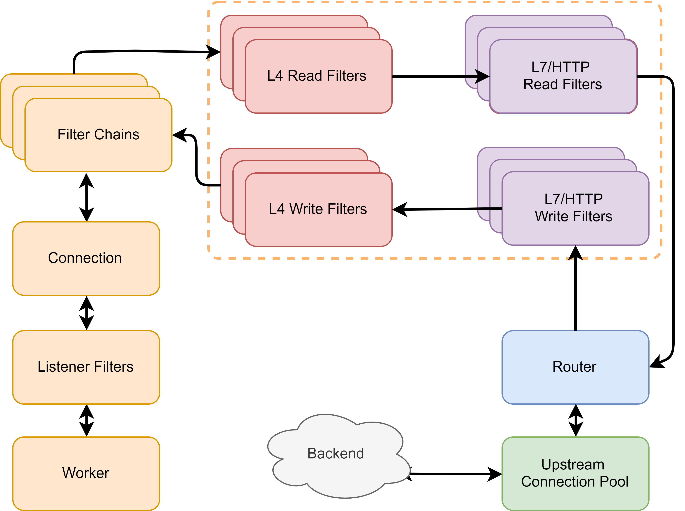
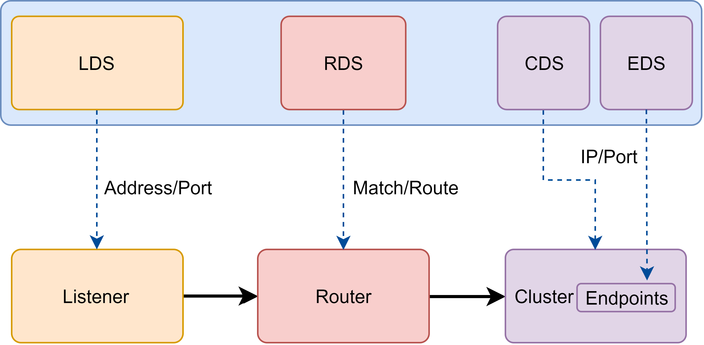
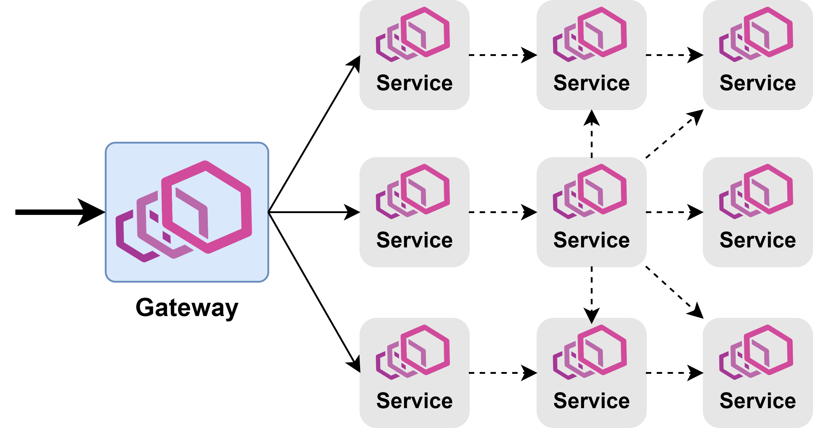

# Envoy

Envoy 是一款由 Lyft 开源的高性能数据和服务代理软件，使用现代 C++ 语言（C++11 以及 C++14）开发，提供四层和七层网络代理能力。2017 年 Envoy 被捐赠给 CNCF 基金会，最终成为 CNCF 继 Kubernetes 和 Prometheus 之后第三个毕业项目。尽管在设计之初 Envoy 没有将性能作为最终的目标，而是更加强调模块化、易测试、易开发等特性，可它仍旧拥有足可媲美 Nginx 等经典代理软件的超高性能。在保证性能的同时，Envoy 也提供了强大的流量治理能力和可观察性。其独创的 xDS 协议则成为了构建 Service Mesh 通用数据面 API（UDPA）的基石。具体来说，Envoy 具有以下的优点：

* 高性能：C++ 语言实现，基于 Libevent 事件机制以及非阻塞异步 IO，保障性能；
* 易扩展：利用其 L3/L4/L7 筛选器机制，Envoy 可以在各个层次进行功能扩展。包括但不限于：额外代理协议支持、HTTP 流量治理功能扩展等等。且由于其良好的封装和现代 C++ 对各种操作的简化，其开发过程非常友好；此外，Envoy 也提供了基于 WASM 的扩展支持以及基于 Lua 脚本的简单功能扩展；
* 多协议支持：原生支持代理 HTTP、Kafka、Dubbo、Redis 等多种协议；
* 动态化配置：基于 xDS 协议实现配置的完全动态化，简化配置更新操作，实现监听端口、路由规则、后端服务发现等全运行时动态下发及更新；
* 可观察性：内置日志，指标，追踪三个模块用于实现全方位、多维度流量和事件观察；
* HTTP 筛选器：社区原生提供了大量的功能强大的 HTTP 筛选器如限流、认证鉴权、缓存、压缩、GRPC 协议转换等等，开箱即用；
* 社区开放活跃：Envoy 完全开源，不存在对应的商业版本，保证了它的发展不会受限于商业化；而且 Envoy 社区非常活跃，不断向前推动 Envoy 的演进和发展。

得益于以上的种种特性，Envoy 可以说已经是云原生时代数据平面的事实标准。新兴微服务网关如 Gloo，Ambassador 都基于 Envoy 进行扩展开发；而在服务网格中，Istio、Kong 社区 Kuma、亚马逊 AWS App Mesh 都使用 Envoy 作为默认数据平面。接下来，本节将从系统架构、xDS 协议、可观察性以及应用场景四个方面介绍 Envoy 相关概念。

## 系统架构

在介绍更具体的内容之前，本小节先略微花一些篇幅来介绍 Envoy 中一些常见的概念。在 Envoy 中，数据请求的入口方向被称之为下游（Downstream），而数据请求的出口方向则称之为上游（Upstream）。Envoy 接收来自下游的请求并将之转发给上游。

在下游方向，Envoy 使用监听器（Listener）来监听数据端口，接受下游连接和请求；在上游方向，Envoy 使用集群（Cluster）来抽象上游服务，管理连接池以及与之相关的健康检查等配置。而在监听器和集群之间，Envoy 则使用筛选器（Filter）和路由（Router）将两者联系在一起。

相比于监听器、集群和路由等概念，筛选器可能需要稍微再多一点解释。筛选器是 Envoy 中可拔插的多种功能组件的统称，简单来说，筛选器就是插件。但是 Envoy 中 L3/L4 筛选器架构大大扩展了它的功能界限，以至于筛选器的内涵要比常规理解的“插件”要丰富的多，所以本小节选择了直译官方名称，称之为筛选器而非插件。Envoy 包含多种类型筛选器。其中 L3/L4 筛选器主要用于处理连接和协议解析，不同的 L3/L4 筛选器可以使得 Envoy 代理不同协议的网络数据，举例来说，Envoy 中最为核心的 HTTP 代理功能就是构筑在一个名为“HTTP 连接管理器（Http Connection Manager）”的 L4 筛选器之上的。而 L7 筛选器（绝大部分情况下 L7 筛选器都可以和 HTTP 筛选器划等号）则是作为 L4 筛选器的子筛选器存在，用于支撑实现更加丰富的流量治理能力。**监听器、集群、路由和筛选器构成了 Envoy 最为核心的骨架**。

### 线程模型

Envoy 采用多线程以及基于 Libevent 的事件触发机制来保证其超高的性能。在 Envoy 中，一共存在三种不同的线程，分别是：Main 线程、Worker 线程以及文件刷新线程。

Main 线程负责配置更新（对接 xDS 服务）、监控指标刷新和输出、对外提供 Admin 端口等工作。此外，Main 线程也负责整个进程的管理。如处理操作系统信号、Envoy 热重启等。

Worker 线程是一个非阻塞的事件循环，每个 Worker 线程都会监听所有的 Listener，并处理相关连接和请求事件。注意，操作系统会保证一个事件最终只会被一个 Worker 处理。在绝大多数时候，Worker 线程都只在不断的处理下游的请求和上游的响应。极少数情况下，Main 线程会将配置更新以事件的形式添加到 Worker的事件循环中来。

文件刷新线程负责将 Envoy 需要持久化的数据写入磁盘。在 Envoy 中，所有打开的文件（主要是日志文件）都分别对应一个独立的文件刷新线程用于周期性的把内存缓冲的数据写入到磁盘文件之中。而 Worker 线程在写文件时，实际只是将数据写入到内存缓冲区，最终由文件刷新线程落盘。如此可以避免 Worker 线程被磁盘 IO 所阻塞。

此外，为了尽可能的减少线程间由于数据共享而引入的争用以及锁操作，Envoy 设计了一套非常巧妙的 Thread Local Store 机制（简称 TLS），如果读者希望更进一步了解可以阅读 Envoy 社区提供的官方文档或者本节引用的原博客。本节不再深入介绍更多的关于 Envoy 线程模型相关的技术细节。

### 扩展能力

在对 Envoy 的整体框架以及其事件模型有了一个初步的了解之后，接下来本小节将再着重介绍 Envoy 强大功能的源泉：筛选器。正如前文所述，筛选器本质上就是插件，因此通过扩展开发筛选器，可以在不侵入 Envoy 主干源码的前提下，实现对 Envoy 功能的扩展增强。而且 L3/L4 筛选器架构大大拓宽了 Envoy 中“扩展”二字的可能性。在 Envoy 中大量的核心功能都是以可拔插的扩展构筑在其 L3/L4 筛选器架构之上的。不过本小节并不打算过多的介绍 Envoy 中筛选器开发或实现的具体细节，而是从原理和结构层面解析不同层次筛选器的工作机制，使读者对 Envoy 筛选器及其扩展能力有一个粗略但是完整的视图。

当操作系统接收到来自下游的连接时，会随机选择一个 Worker 来处理该事件。然后每一个监听器筛选器（Listener Filter）都会被用于处理该连接。监听器筛选器会在一个新连接被操作系统所接受之后但是 Envoy 仍未完全创建对应的连接对象之前发挥作用。此时，Listener 可以直接操作原始的套接字（Socket），也可以中断插件链执行。直到所有的监听器筛选器执行完成，一个可操作的 Envoy 连接对象才会被建立，Envoy 开始接受来自下游的请求或数据。而当该连接具体的请求或者数据到来之时，各个 L4（Network）筛选器开始工作。监听器筛选器很少被用到，对于绝大部分的开发者来说，即使是需要深度定制开发 Envoy，也极少会需要开发监听器筛选器。
L4 筛选器分为 Read 和 Write 两种不同类型，分别用于读取外部数据和向外部发送数据，它可以直接操作连接上的二进制字节流。在大部分的实现当中，L4 筛选器负责将连接中的二进制字节流解析为具有的协议语义的数据（如 HTTP Headers，Body 等）并交由 L7 筛选器进一步处理。Envoy 使用多个 L4 筛选器分别解析不同协议来实现多协议代理功能。目前社区已经提供了与 HTTP、Dubbo、Mongo、Kafka、Thrift 等协议对应的多种 L4 筛选器。而通过扩展 L4 筛选器，也可以轻松的在不侵入 Envoy 主干的前提下，扩展支持新的协议。**另外必须要说明的是，协议解析并不是 L4 筛选器的必备功能，同样存在一些非协议解析类型的 L4 筛选器，如工作在 L4 的限流、鉴权等筛选器。实际上，在 L4 筛选器和 L7 筛选器之间，应该有一层专门的编解码器。不过在常见的实现当中，编解码器都被集成到对应协议的 L4 筛选器中，所以本节提供的筛选器链路图中干脆也略去了对应的层次。**一般情况下，只有需要扩展 Envoy 以支持额外的协议之时，才需要扩展开发 L4 筛选器。

**L7 筛选器一般是对应协议的 L4 筛选器的子筛选器，如 HTTP 筛选器就是 L4 筛选器“HTTP 连接管理器”的子筛选器**。L4 筛选器在完成二进制数据的解析之后，会依次调用各个 L7 筛选器来处理解析后的具有协议语义的结构化数据，用于实现各种流量治理功能，包括但不限于限流、熔断、IP 黑白名单、认证鉴权、缓存、降级等等等等。实际上，路由组件也往往被实现为一个特殊的 L7 筛选器。当然，整个互联网是搭建在 HTTP 协议之上的，所以在 Envoy 中处处可见对 HTTP 协议的特化。在 Envoy 中，L7 筛选器几乎可以等价于 HTTP 筛选器，因为如 Kafka、Redis 等其他协议的 L4 筛选器目前还没有提供良好的 L7 支持。L7 筛选器是大部分开发者最常用也是最需要关注的类型。通过扩展 L7 筛选器，可以扩展支持各种特定的流量控制能力，而且社区本身也提供了大量的可靠、高性能的 L7 筛选器供用户直接使用。

在所有的 L7 筛选器都执行完成之后，路由组件（Router）将会被调用，将请求通过连接池发送给后端服务，并异步等待后端响应。在收到后端服务响应之后，Envoy 会倒序执行上述的插件链，将响应最终传递给客户端。至此，一个完整的请求转发和响应便完成了。

## xDS 协议

前文已经对 Envoy 的系统架构有了一个完整的介绍，现在，本节将继续介绍 Envoy 中最为关键和核心的一部分内容：xDS 协议。与 HAProxy 以及 Nginx 等传统网络代理依赖静态配置文件来定义各种资源以及数据转发规则不同，Envoy 几乎所有配置都可以通过订阅来动态获取，如监控指定路径下的文件、启动 **gRPC 流**或轮询 REST 接口，对应的发现服务以及各种各样的 API 统称为 xDS。Envoy 与 xDS 之间通过 Proto 约定请求和响应的数据模型，不同类型资源，对应的数据模型也不同。

以 Istio 中 Pilot 为例，当 Pilot 发现新的服务或路由规则被创建（通过监控 Kubernetes 集群中特定 CRD 资源变化、或者发现 Consul 服务注册和配置变化），Pilot 会通过已经和 Envoy 之间建立好的 gRPC 流将相关的配置推送到 Envoy。Envoy 接收到相关配置并校验无误之后，就会动态的更新运行时配置，使用新的配置更新相关资源。资源本身是很抽象的概念，**本小节为了方便统一介绍而使用资源二字代指 Envoy 根据相关配置创建出来的具有某种特定功能或者目的的实体，前文中的监听器、集群、路由以及筛选器就是 Envoy 最为核心的四种资源**。针对不同类型的资源，Envoy 提供了不同的 xDS API，包括 LDS、CDS、RDS等等。接下来本小节将逐一介绍。

LDS 用于向 Envoy 下发监听器的相关配置用于动态创建新的监听器或者更新已有监听器。其包括监听器的地址、监听端口、完整的筛选器链等等。在实际的生产环境当中，LDS 往往是整个 Envoy 正常工作的基础。

CDS 用于向 Envoy 下发集群的相关配置用于创建新的集群或者更新已有的集群。其中包括健康检查配置、连接池配置等等。一般情况下，CDS 服务会将其发现的所有可访问的后端服务抽象为集群配置后全量推送给 Envoy。而与 CDS 紧密相关的另一种xDS 服务称之为 EDS。CDS 服务负责集群类型的推送。而当该集群类型为 EDS 时，说明该集群的所有可访问的端点（Endpoints）也需要由通过 xDS 协议动态下发，而不使用 DNS 等手段解析。负责下发端点的服务就称之为 EDS。

RDS 用于下发动态的路由规则。路由中最关键的配置包含匹配规则和目标集群，此外，也可能包含重试、分流、限流等等。

筛选器作为核心的一种资源，但是并没有与之对应的专门的 xDS API 用于发现和动态下发筛选器的配置。筛选器的所有配置都是嵌入在 LDS、RDS、以及 CDS 当中，比如 LDS 下发的监听器和 CDS 下发的集群中会包含筛选器链的配置，而 RDS 推送的路由配置当中，也可能包含与具体路由相关的一些筛选器配置。

## 可观察性

作为云原生时代的新型网络代理，可观察性也是不得不提到的一部分内容。在 Envoy 设计之初，就对其可观察性非常重视，并且通过日志（Access log），指标（Metrics），追踪（Tracing）三个模块从三个不同的维度来实现对所有流经 Envoy 的请求的统计、观察和监测。

日志是对 Envoy 中事件（主要是指下游请求）的详细记录，用于定位一些疑难问题。Envoy 提供了灵活的的标记符系统来让用户可以自由的组装和定义自己的日志格式以及所包含的内容。同时，Envoy 也提供了强大的日志过滤能力，在数据量较大时，可以以此过滤掉非关键数据。借助 xDS 协议，无论是日志格式还是过滤规则，都可以在运行时动态的变化和修改。

指标是对 Envoy 中事件的数值化统计，往往需要搭配 Prometheus 等事件数据库配合使用。Envoy 提供了筛选器、集群等多种维度的丰富的指标，包括请求响应码类型、响应耗时区间、异常事件记录等等。而且 Envoy 允许筛选器自由的扩展属于自己的独特指标计数，如 HTTP 限流、鉴权等筛选器都扩展了对应的指标，使得 Envoy 也可以从某个具体的流量治理功能的角度观察流量情况。

追踪是对 Envoy 以及上下游服务中多个事件因果关系的记录，必须要上下游服务同时支持，并对接外部追踪系统。Envoy 原生支持了 Lightstep、Zipkin 等多种追踪系统，无需额外的修改或者开发，只需要简单的配置即可。

当然，可观察性是一个非常宏大的议题，日志、指标、追踪任何主题都可以扩展出一个新的章节，本小节也只是蜻蜓点水的介绍了一下 Envoy 所具备的特性。如果希望了解更多相关可观察的内容，可以参考本书[可观察性](observability.md)中的相关内容。

## 应用场景

作为一个服务代理软件，Envoy 本身并不限定自己的使用方法。但它最常扮演的是两种角色，一种是作为集群流量入口的 API 网关（Gateway），管理南北向流量；另一种是作为服务 Sidecar，拦截并治理服务网格中东西向流量。由于本书是以 Istio 为主体，介绍服务网格的相关内容，所以本书中 Envoy 绝大部分时候都是以第二种角色出现。

## 小结

本节详细的介绍了 Envoy 中的核心概念以及整体架构，希望能够使用户对 Istio 默认数据面具备基本的了解和认识。后续的章节当中，本书将进一步介绍 Envoy 实践方面的相关内容。 

## 参考

* [Envoy threading model](https://blog.envoyproxy.io/envoy-threading-model-a8d44b922310)
* [How to Write Envoy Filters Like a Ninja!](https://blog.envoyproxy.io/how-to-write-envoy-filters-like-a-ninja-part-1-d166e5abec09)
* [The Basics of Envoy and Envoy Extensibility](https://www.tetrate.io/blog/envoybasicsandextensibility/)
* [Envoy-入门介绍与xDS协议](https://dun.163.com/news/p/eb1a80e497f14947b033f17b53e8869e)
