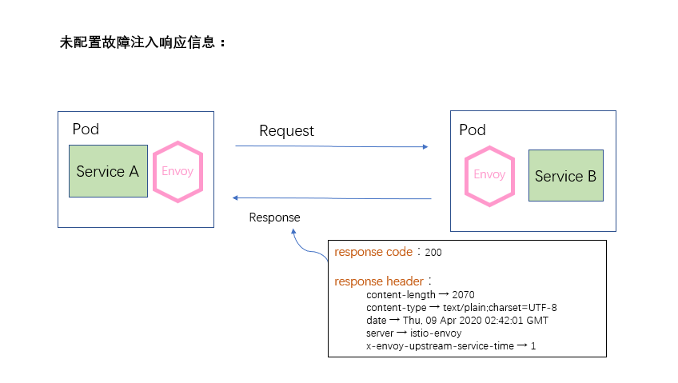
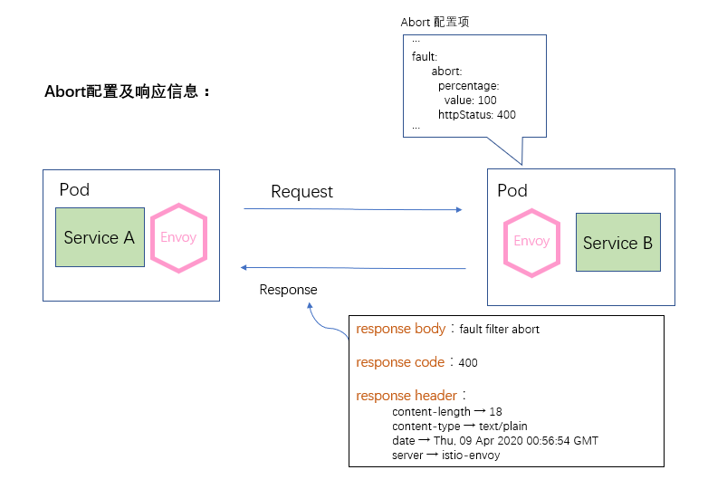
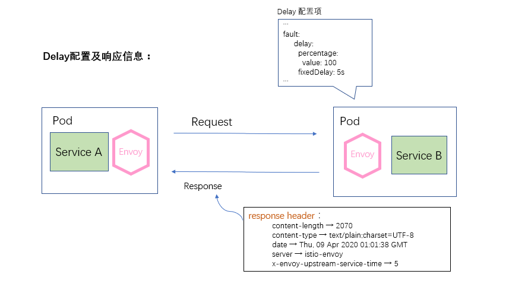

# 故障注入

在一个微服务架构的系统中，为了让系统达到较高的健壮性要求，通常需要对系统做定向错误测试。比如电商中的订单系统、支付系统等若出现故障那将是非常严重的生产事故，因此必须在系统设计前期就需要考虑多样性的异常故障并对每一种异常设计完善的恢复策略或优雅的回退策略，尽全力规避类似事故的发生，使得当系统发生故障时依然可以正常运作。而在这个过程中，服务故障模拟一直以来是一个非常繁杂的工作，于是在这样的背景下就衍生出了故障注入技术手段，故障注入是用来模拟上游服务请求响应异常行为的一种手段。通过人为模拟上游服务请求的一些故障信息来检测下游服务的故障策略是否能够承受这些故障并进行自我恢复。

Istio 提供了一种无侵入式的故障注入机制，让开发测试人员在不用调整服务程序的前提下，通过配置即可完成对服务的异常模拟。Istio 1.5 仅支持网络层的故障模拟，即支持模拟上游服务的处理时长、服务异常状态、自定义响应状态码等故障信息，暂不支持对于服务主机内存、CPU 等信息故障的模拟。他们都是通过配置上游主机的 VirtualService 来实现的。当我们在 VirtualService 中配置了故障注入时，上游服务的 Envoy 代理在拦截到请求之后就会做出相应的响应。目前，Istio 提供两种类型的故障注入，abort 类型与 delay 类型。

- **abort**：非必配项，配置一个 Abort 类型的对象。用来注入请求异常类故障。简单的说，就是用来模拟上游服务对请求返回指定异常码时，当前的服务是否具备处理能力。它对应于 Envoy 过滤器中的 [config.filter.http.fault.v2.FaultAbort](https://www.envoyproxy.io/docs/envoy/latest/api-v2/config/filter/http/fault/v2/fault.proto#envoy-api-msg-config-filter-http-fault-v2-faultabort) 配置项，当 VirtualService 资源应用时，Envoy 将会该配置加载到过滤器中并处理接收到的流量。
- **delay**：非必配项，配置一个 Delay 类型的对象。用来注入延时类故障。通俗一点讲，就是人为模拟上游服务的响应时间，测试在高延迟的情况下，当前的服务是否具备容错容灾的能力。它对应于 Envoy 过滤器中的 [config.filter.fault.v2.FaultDelay](https://www.envoyproxy.io/docs/envoy/latest/api-v2/config/filter/fault/v2/fault.proto#envoy-api-msg-config-filter-fault-v2-faultdelay) 配置型，同样也是在应用 Istio 的 VirtualService 资源时，Envoy 将该配置加入到过滤器中。

实际上，Istio 的故障注入正是基于 Envoy 的 config.filter.http.fault.v2.HTTPFault 过滤器实现的，它的局限性也来自于 Envoy 故障注入机制的局限性。对于 Envoy 的 HttpFault 的详细介绍请参考 [Envoy 文档](https://www.envoyproxy.io/docs/envoy/latest/api-v2/config/filter/http/fault/v2/fault.proto#envoy-api-msg-config-filter-http-fault-v2-httpfault)。对比 Istio 故障注入的配置项与 Envoy 故障注入的配置项，不难发现，Istio 简化了对于故障控制的手段，去掉了 Envoy 中通过 HTTP header 控制故障注入的配置。

### HTTPFaultInjection.Abort：

- **httpStatus**：必配项，是一个整型的值。表示注入 HTTP 请求的故障状态码。
- **percentage**：非必配项，是一个 Percent 类型的值。表示对多少请求进行故障注入。如果不指定该配置，那么所有请求都将会被注入故障。
- **percent**：已经废弃的一个配置，与 percentage 配置功能一样，已经被 percentage 代替。

如下的配置表示对 `v1` 版本的 `ratings.prod.svc.cluster.local` 服务访问的时候进行故障注入，`0.1`表示有千分之一的请求被注入故障， `400` 表示故障为该请求的 HTTP 响应码为 `400` 。

```yaml
apiVersion: networking.istio.io/v1alpha3
kind: VirtualService
metadata:
  name: ratings-route
spec:
  hosts:
  - ratings.prod.svc.cluster.local
  http:
  - route:
    - destination:
        host: ratings.prod.svc.cluster.local
        subset: v1
    fault:
      abort:
        percentage:
          value: 0.1
        httpStatus: 400
```

### HTTPFaultInjection.Delay：

- **fixedDelay**：必配项，表示请求响应的模拟处理时间。格式为：`1h/1m/1s/1ms`， 不能小于 `1ms`。
- **percentage**：非必配项，是一个 Percent 类型的值。表示对多少请求进行故障注入。如果不指定该配置，那么所有请求都将会被注入故障。
- **percent**：已经废弃的一个配置，与 `percentage` 配置功能一样，已经被 `percentage` 代替。

如下的配置表示对 `v1` 版本的 `reviews.prod.svc.cluster.local` 服务访问的时候进行延时故障注入，`0.1` 表示有千分之一的请求被注入故障，`5s` 表示`reviews.prod.svc.cluster.local` 延时 `5s`返回。

```yaml
apiVersion: networking.istio.io/v1alpha3
kind: VirtualService
metadata:
  name: reviews-route
spec:
  hosts:
  - reviews.prod.svc.cluster.local
  http:
  - match:
    - sourceLabels:
        env: prod
    route:
    - destination:
        host: reviews.prod.svc.cluster.local
        subset: v1
    fault:
      delay:
        percentage:
          value: 0.1
        fixedDelay: 5s
```


接下来，我们使用一个例子对比下没有配置故障注入、配置 Abort 类型故障、配置 Delay 类型故障这三种情况下请求的响应请况。我们的例子中是使用`Service A`服务向 `Service B`服务发送一个请求。

首先我们收集下未配置故障注入情况下请求的响应信息。如下图所示，`Service B`服务正常响应，响应码为`200`。响应头中`content-length`标头表示本次响应体的大小、`content-type`标头表示本次响应内容的数据格式与字符集、`server`标头表示本次响应来源，这里可以看到响应来自`Service B`服务的 istio-envoy 代理。`x-envoy-upstream-service-time`表示上游服务的处理时间。



接下来我们 在`Service B`服务的 VirtualService 上注入 Abort 类型的故障。



如上图所示，相比较正常的 Response 响应体，发现本次请求的响应体中返回的响应体为 “fault filter abort”，这说明配置生效了。返回的响应码为`400`，与我们的配置一致。而请求响应体中没有返回`x-envoy-upstream-service-time`参数。这说明当请求到达`Service B`的 Envoy 代理后直接被拦截并返回`400`，请求并没有被转发处理。

接下来，我们在`Service B`服务的 VirtualService 上注入 Delay 类型的故障。



如上图所示，我们配置了将所有对`Service B`服务的请求全部延迟 `5s` 处理。相比较正常的 Response 响应体，发现本次请求正常响应，响应数据大小与未配置故障注入时一致。唯一的区别在于`x-envoy-upstream-service-time`值为`5`， 表示`Service B`服务处理了`5s`的时间才返回。这里需要注意的是并不是`Service B`服务本身处理需要这么长的时间，而是 Envoy 将请求拦截后等待了`5s`才将请求转发。

### 总结

Istio 本身虽然也有服务自我故障恢复的机制，但是我们必须对服务异常码进行必要的回退处理或故障转移，否则上游服务即使恢复也将会发生持续性重新故障。另外当系统中在多个地方配置了故障注入策略时，他们都是独立进行工作的，比如你在下游服务中配置了请求上游服务超时时间为2s, 而在上游服务的 VirtualService 的故障注入中配置了3秒的延迟，这时，下游服务中的配置将优先生效。

通过以上对 Istio 故障注入的介绍、配置、及实现原理的介绍，不难看出故障注入一般适用在开发测试阶段，非常方便在该阶段对功能及接口进行测试。它依赖于 Envoy 的特性将故障注入与业务代码分离，使得业务代码更加的纯粹，故障注入测试时更加简洁方便，这个功能大大降低了模拟测试的复杂度。但需要注意的是，在上线前一定要对配置文件做检查校正，防止此类配置推送到生产坏境。

