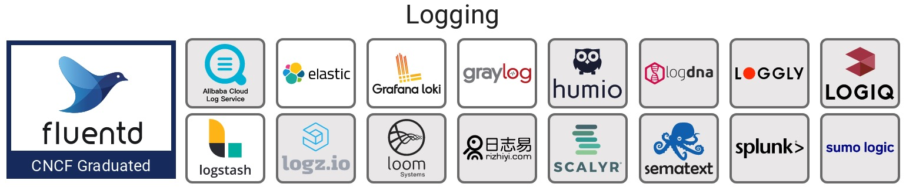

# 日志

### 传统日志

在软件领域，程序运行的事件快照往往通过日志来呈现，日志当中通常含有非常有价值的信息，可以说，任何故障细节的回溯都离不开日志。传统的开发模式之下，应用程序运行于物理机或者虚拟机环境，日志通常是输出到文件当中，这使得问题排查与日志生命周期管理十分不便。使用日志定位故障有极端的优缺点，极端的优点是几乎能够完全感知事故现场的情况，极端的缺点是它是所有排查手段当中最费事费力，且资源开销最大的一种手段，它的采集、存储、传输、与处理成本都比较高。这是个微服务的时代，一个微服务集群动辄拥有上千个节点，按照传统的思维来管理服务日志，会让人望而却步，于是日志的后期管理问题成为了一个迫切需要解决的问题。常见的做法是将服务与日志分离，将日志进行集中化管理，把日志的生命周期托管到第三方组件，服务维护人员得以快速便捷地定位故障。

### 云原生日志

伴随着以 Kubernetes 为代表的云原生技术的崛起，可观察性（Observability）理念逐渐深入人心，但是可观察性并没有摒弃日志这个抓手，在基于容器的云环境下也离不开日志，日志顺理成章地成为了云原生可观察性的核心关注点之一，与链路追踪、指标并驾齐驱。云原生基金会（CNCF）在其关于可观察性的 Landscape 当中，独辟了一块关于日志的技术版图，可见日志在云原生领域的重要性。

当今的容器化技术可以直接以 stdout 标准输出的形式来控制日志，这是目前比较推崇的做法，一些初创团队可以采用这种方式。但在实际情况下，有可能会涉及到存量服务的迁移，而这些存量服务会将日志输出到文件，处理这些日志文件就没有那么简单了，因为文件位于容器内部，从宿主机上不易访问。最简单的处理方式，就是在容器当中再单独 run 一个日志采集进程，这个进程就可以读取日志文件，以增量的形式将日志发送到日志中心，再进行聚合与存储，这是目前主流的处理方式。

### Istio 日志

Istio 的核心设计理念之一就是为网格内的服务提供良好的可观察性，使开发与运维人员能够更好地监测到网格内的服务运行情况。Istio 可以监测到网格内的服务通信的流转情况，并生成详细的遥测日志数据，任何请求与事件的元信息都可以获取到。在 Istio 中，可以自定义 schema 来获取具有一定格式的日志信息，日志信息可以经过容器 stdout 标准输出，也可以通过第三方插件导出到特定的收集器，一切取决于实际情况。