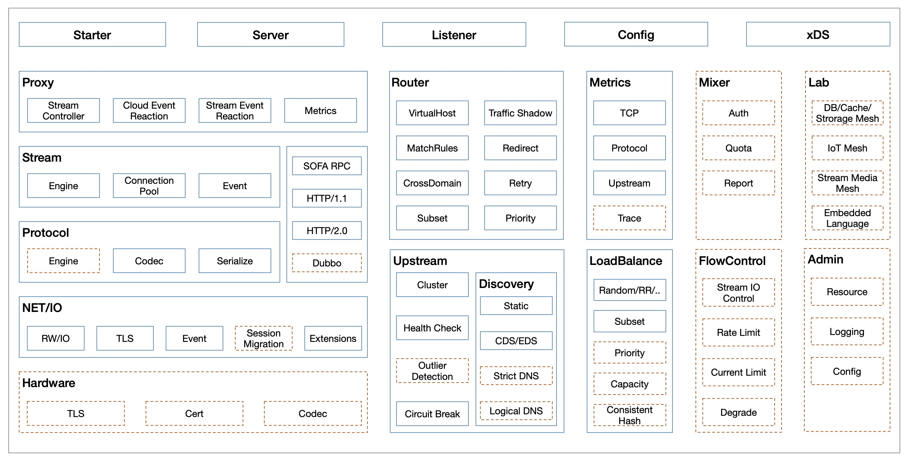
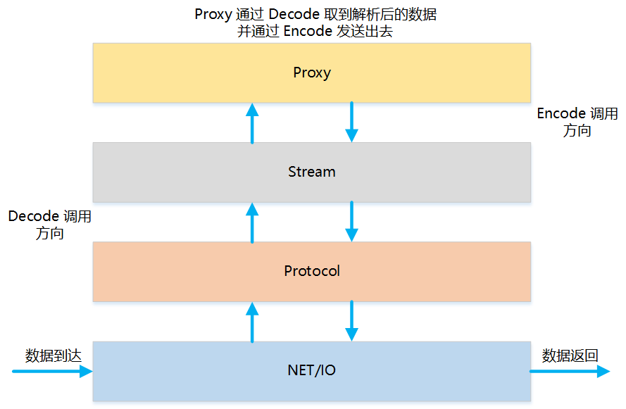
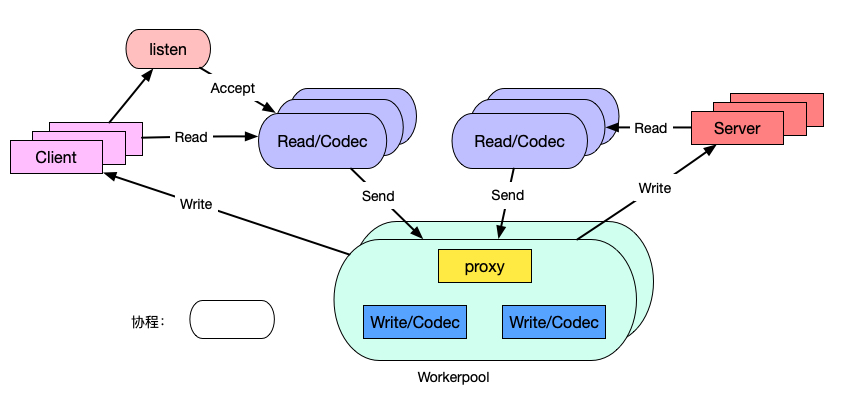
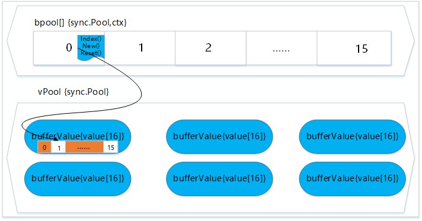
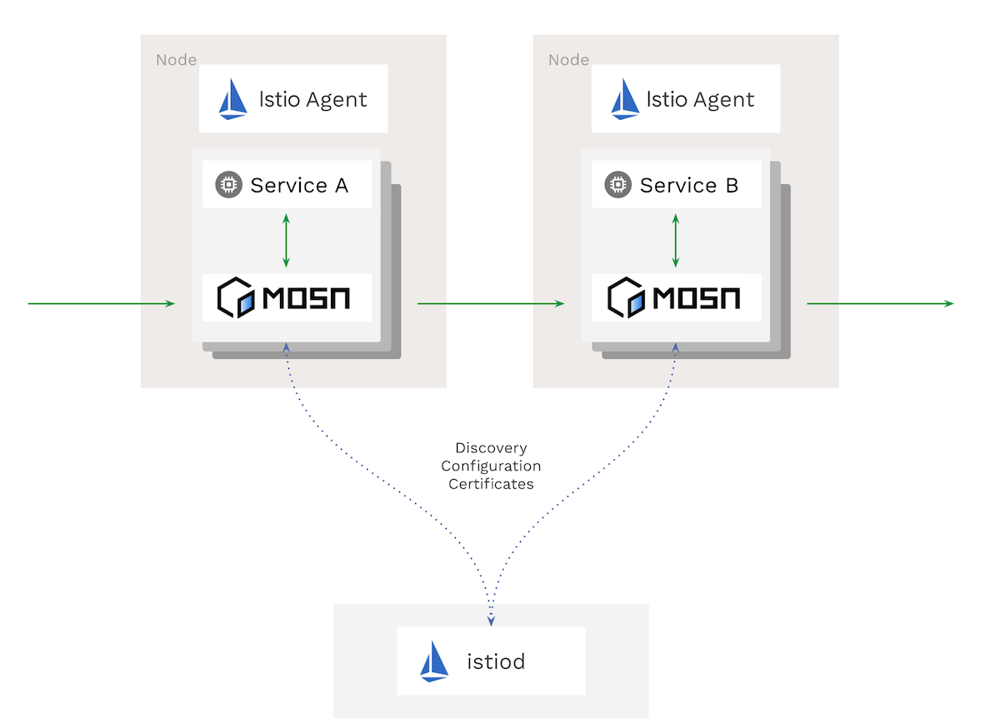

# MOSN

MOSN（Modular Open Smart Network-proxy）是一款蚂蚁金服开源的使用 Go 语言开发的网络代理软件，作为云原生的网络数据平面，旨在为服务提供多协议、模块化、智能化、安全的代理能力。MOSN 可以与任何支持 xDS API 的 Service Mesh 集成（如 Istio），另外也可以作为独立的四/七层负载均衡器、API Gateway、云原生 Ingress 等场景下使用。

MOSN 开源地址 <https://github.com/mosn/mosn>。

## 框架介绍

对 MOSN 有了初步了解后，接下来我们将从其功能特性、架构分层、内存及连接池等方面对 MOSN 进行深入剖析。

### 功能特性

下图展示的是组成 MOSN 的各个模块：

其中：

- Starter、Server、Listener、Config 为 MOSN 启动模块，用于完成 MOSN 的运行
- 最左侧的 Hardware、NET/IO、Protocol、Stream、Proxy、xDS 为 MOSN 架构的核心模块，用来实现 Service Mesh 的核心功能
- Router 为 MOSN 的路由模块，支持的功能包括：
  - VirtualHost 形式的路由功能
  - 基于 Subset 的子集群路由匹配
  - 路由重试以及重定向功能
- Upstream 为后端管理模块，支持的功能包括：
  - Cluster 动态更新
  - Host 动态更新
  - 对 Cluster 的主动/被动健康检查
  - 熔断保护机制
  - CDS/EDS 对接能力
- Metrics 模块可对协议层的数据做记录和追踪
  - Metrics 当前统计了网络读写流量、请求状态、连接数等元数据
  - Trace 框架集成 SkyWalking 组件，可方便的观察请求的链路 
- LoadBalance 是负载均衡管理模块，当前支持 RR、Random、Subset LB、Original_Dst 等负载均衡算法
- Mixer 模块用来适配外部的服务，如鉴权、资源信息上报等
- FlowControl 模块是流量控制模块，当前集成了 Sentinel SDK 可用来做限流保护
- Lab 模块是用来集成 IOT、DB、Media 等 Mesh 服务
- Admin 模块是 MOSN 的资源控制器，用来查看和管理其运行状态及资源信息

### 架构解析

MOSN 延续 OSI（Open Systems Interconnection）的分层思想，将其系统分为 NET/IO、Protocol、Stream、Proxy 四层，如下图所示：

其中：

- NET/IO 作为网络层，监测连接和数据包的到来，同时作为 listener filter 和 network filter 的挂载点
- Protocol 作为多协议引擎层，对数据包进行检测，并使用对应协议做 decode/encode 处理
- Stream 对 decode 的数据包做二次封装为 stream，作为 stream filter的挂载点
- Proxy 作为 MOSN 的转发框架，对封装的 stream 做 proxy 处理

MOSN 整体框架采用分治的架构思想，每一层通过工厂设计模式向外暴露其接口，方便用户灵活地注册自身的需求。通过协程池的方式使得用户以同步的编码风格实现异步功能特性。通过区分协程类型，MOSN 实现了 read 和 proxy worker 两大类协程，read 协程主要是处理网络的读取及协议解析，proxy worker 协程用来完成读取后数据的加工、路由、转发等。其架构如下图所示：

### 内存及连接池

MOSN 为了规避 Runtime GC 带来的卡顿自身做了内存池的封装方便多种对象高效地复用内存，另外为了提升服务网格之间的建连性能还设计了多种协议的连接池从而方便地实现连接复用及管理。

MOSN 的 Proxy 模块在 Downstream 收到 Request 的时候，在经过路由、负载均衡等模块处理获取到 Upstream Host 以及对应的转发协议时，通过 Cluster Manager 获取对应协议的连接池 ，如果连接池不存在则创建并加入缓存中，之后在长连接上创建 Stream，并发送数据。

如下图所示为连接池工作的示意图：

MOSN 在 sync.Pool 之上封装了一层资源对象的注册管理模块，可以方便的扩展各种类型的对象进行复用和管理。其中 bpool 是用来存储各类对象的构建方法，vpool 用来存放 bpool 中各个实例对象具体的值。运行时通过 bpool 里保存的构建方法来创建对应的对象通过 index 关联记录到 vpool 中，使用完后通过 sync.Pool 进行空闲对象的管理达到复用，如下图所示：

## 应用场景

MOSN 不仅可以作为独立的四/七层负载均衡软件，也可以被集成到 Istio 里作为 Sidecar 或 Kubernetes 里的 Ingress Gateway 等使用，下面介绍这两种主流的使用场景。

### Sidecar

MOSN 作为 Istio 的数据面时，与 Istiod 组件通过 xDS 协议进行通信，运行时动态获取服务的路由、监听、Cluster 等配置信息，从而使得 MOSN 的服务治理能力可完美地和 Istio 结合。

### Gateway

MOSN 提供负载均衡、路由管理、可观测性、多协议、配置热生效等通用 Gateway 的能力，使用者可以将其作为南北向的七层 Gateway 为服务提供流量管理和监控能力。

## 小结

本节我们主要围绕 MOSN 是什么、可以做什么以及架构原理等方面做了简单介绍。在下一节我们将会详细介绍下 MOSN 在 Service Mesh 中是如何配合 Istio 发挥数据面的能力。

## 参考资料

- [MOSN 官网博客](https://mosn.io/zh/blog/code/)
