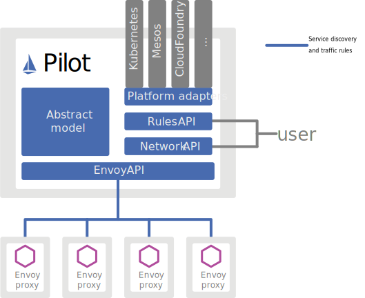
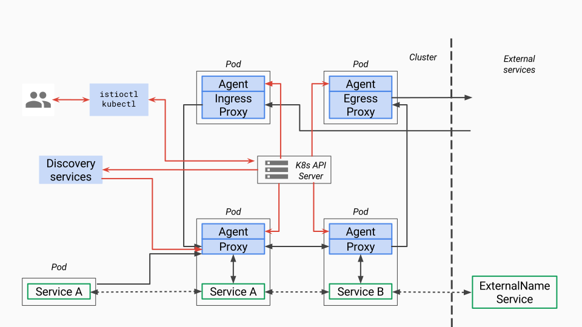

# Pilot

### Pilot 简介

在应用从单体架构向微服务架构演进的过程中，微服务之间的服务发现、负载均衡、熔断、限流等服务治理需求是无法回避的问题。

在Service Mesh出现之前，通常的做法是将此类公共的基础功能以SDK的形式嵌入业务代码中。

但是这种强耦合的方案无疑会增加业务开发的难度，代码维护的成本，业务代码的质量稳定性风险。如果SDK需要新增新的特性，业务侧也很难配合SDK开发人员进行全方位升级，如果这里的协助涉及到跨部门/事业群，则情况更甚。所以很容易照成SDK的版本碎片化问题。

如果存在跨语言应用间的交互，对于多语言SDK的支持造成的低效也令人很难接受。相当于需要将类似的功能以不同语言重复实现，实现这类代码既很难给开发人员带来成就感，如果实现时涉及到了语言特性，也很难直接翻译。

而Service Mesh的本质则是将此类通用的功能沉淀至Proxy中，由Proxy接管服务的流量并对其进行治理。

在这个思路下，可以通过流量劫持的手段，做到代码零侵入性。

这样可以让业务开发人员更关心业务功能。

而底层功能由于对业务零侵入，也使得基础功能的升级和快速的更新迭代称为可能。

Istio 流量管理的核心组件是 Pilot，它管理和配置部署在特定 Istio 服务网格中的所有 Envoy 代理实例。它允许您指定在 Envoy 代理之间使用什么样的路由流量规则，并配置故障恢复功能，如超时、重试和熔断器。它还维护了网格中所有服务的规范模型，并使用这个模型通过发现服务让 Envoy 了解网格中的其他实例。

每个 Envoy 实例都会维护负载均衡信息信息，这些信息来自 Pilot 以及对负载均衡池中其他实例的定期健康检查。从而允许其在目标实例之间智能分配流量，同时遵循其指定的路由规则。

Pilot 负责管理通过 Istio 服务网格发布的 Envoy 实例的生命周期。

### Pilot 架构

#### Pilot架构总览

根据上图,Pilot主要实现了下述功能：

##### 统一的服务模型

Pilot定义了网格中服务的标准模型，这个标准模型独立于各种底层平台。由于有了该标准模型，各个不同的平台可以通过适配器和Pilot对接，将自己特有的服务数据格式转换为标准格式，填充到Pilot的标准模型中。

例如Pilot中的Kubernetes适配器通过Kubernetes API服务器得到kubernetes中service和pod的相关信息，然后翻译为标准模型提供给Pilot使用。通过适配器模式，Pilot还可以从Mesos, Cloud Foundry, Consul等平台中获取服务信息，还可以开发适配器将其他提供服务发现的组件集成到Pilot中。

##### 标准数据面 API

Pilo使用了一套起源于Envoy项目的标准数据面API来将服务信息和流量规则下发到数据面的sidecar中。

通过采用该标准API，Istio将控制面和数据面进行了解耦，为多种数据面sidecar实现提供了可能性。事实上基于该标准API已经实现了多种Sidecar代理和Istio的集成，除Istio目前集成的Envoy外，例如蚂蚁金服开源的Golang版本的Sidecar MOSN(Modular Observable Smart Netstub)（SOFAMesh中Golang版本的Sidecar)。

##### 业务DSL语言

Pilot还定义了一套DSL（Domain Specific Language）语言，DSL语言提供了面向业务的高层抽象，可以被运维人员理解和使用。运维人员使用该DSL定义流量规则并下发到Pilot，这些规则被Pilot翻译成数据面的配置，再通过标准API分发到Envoy实例，可以在运行期对微服务的流量进行控制和调整。

Pilot的规则DSL是采用K8S API Server中的Custom Resource (CRD)实现的，因此和其他资源类型如Service Pod Deployment的创建和使用方法类似，都可以用Kubectl进行创建。

通过运用不同的流量规则，可以对网格中微服务进行精细化的流量控制，如按版本分流，断路器，故障注入，灰度发布等。

#### Pilot 架构细节

说明：图中红色的线表示控制流，黑色的线表示数据流。蓝色部分为和Pilot相关的组件。

Pilot 组件主要包含两部分，pilot-agent 和 pilot-discovery：

* pilot-agent：该进程根据K8S API Server中的配置信息生成Envoy的配置文件，并负责启动Envoy进程。注意Envoy的大部分配置信息都是通过xDS接口从Pilot中动态获取的，因此Agent生成的只是用于初始化Envoy的少量静态配置。
* pilot-discovery：该进程是pilot的核心组件，主要的功能是从Service provider（如kubernetes或者consul）中获取服务信息、再从K8S API Server中获取流量规则(K8S CRD Resource)，并将服务信息和流量规则转化为数据面可以理解的格式，通过标准的数据面API下发到网格中的各个sidecar中。

