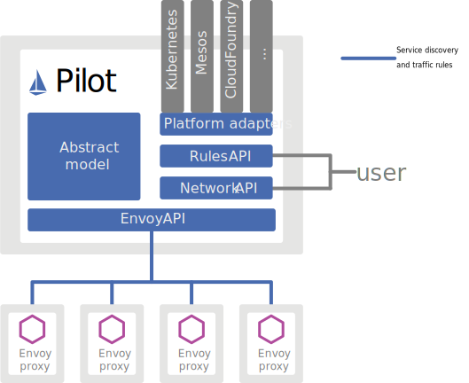
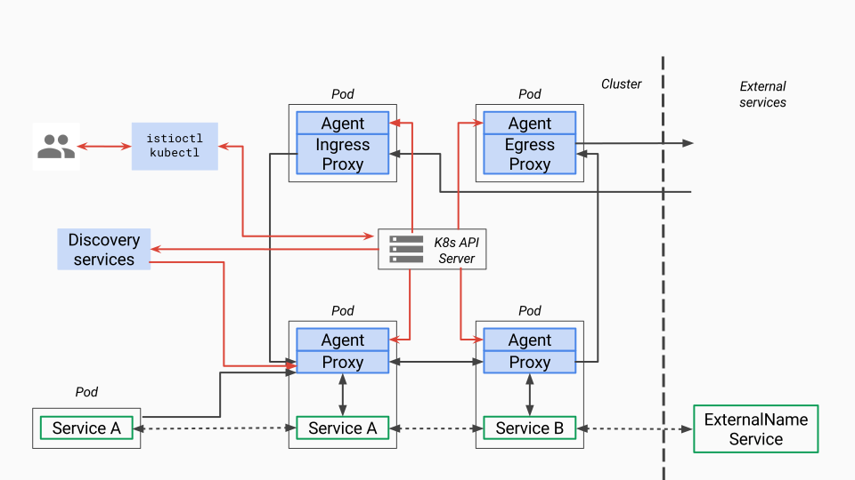
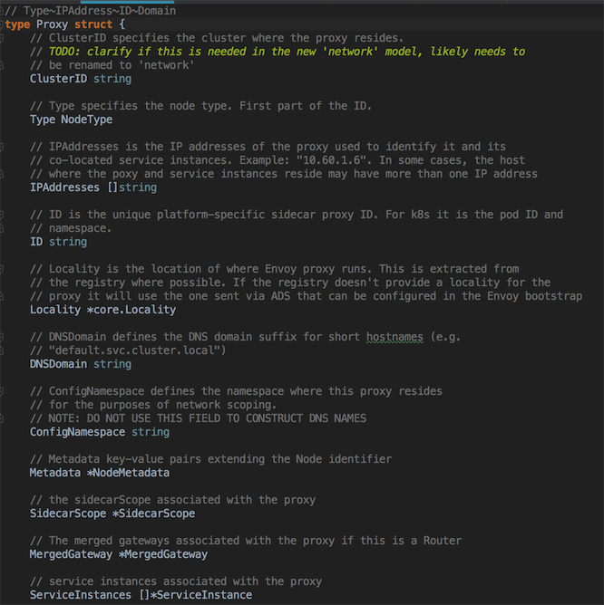
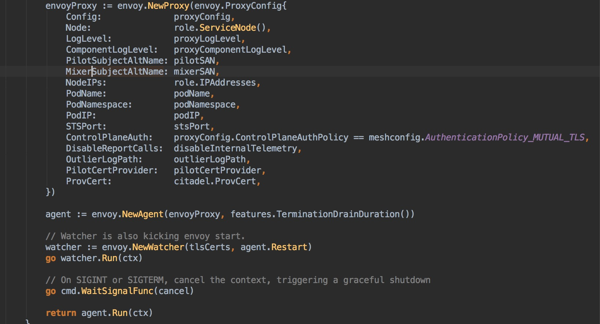
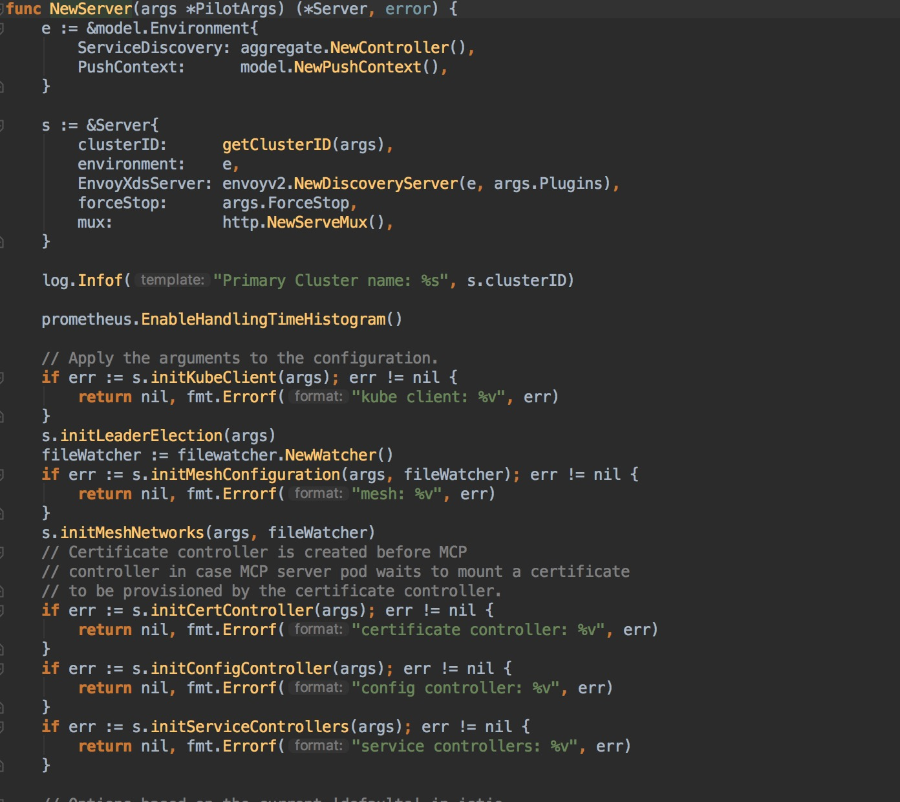
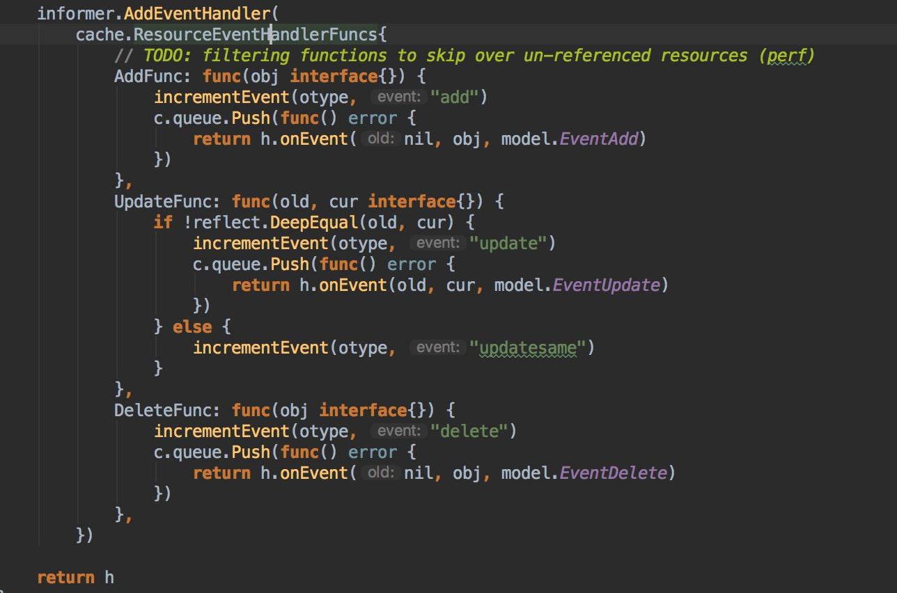

# Pilot

## Pilot 简介

在应用从单体架构向微服务架构演进的过程中，微服务之间的服务发现、负载均衡、熔断、限流等服务治理需求是无法回避的问题。

在 Service Mesh 出现之前，通常的做法是将这些基础功能以 SDK 的形式嵌入业务代码中，但是这种强耦合的方案会增加开发的难度，增加维护成本，增加质量风险。比如 SDK 需要新增新特性，业务侧也很难配合 SDK 开发人员进行升级，所以很容易造成 SDK 的版本碎片化问题。如果再存在跨语言应用间的交互，对于多语言 SDK 的支持也非常的低效。一方面是相当于相同的代码以不同语言重复实现，实现这类代码既很难给开发人员带来成就感，团队稳定性难以保障；另一方面是如果实现这类基础框架时涉及到了语言特性，其他语言的开发者也很难直接翻译。

而 Service Mesh 的本质则是将此类通用的功能沉淀至 Proxy 中，由 Proxy 接管服务的流量并对其进行治理。在这个思路下，可以通过流量劫持的手段，做到代码零侵入性。这样可以让业务开发人员更关心业务功能。而底层功能由于对业务零侵入，也使得基础功能的升级和快速的更新迭代成为可能。

Istio 是近年来 Service Mesh 的代表作，而 Istio 流量管理的核心组件就是是 Pilot。Pilot 主要功能就是管理和配置部署在特定 Istio 服务网格中的所有 Envoy 代理实例。它管理 Envoy 代理之间的路由流量规则，并配置故障恢复功能，如超时、重试和熔断。

## Pilot 架构



根据上图， Pilot 几个关键的模块如下：

### Abstract Model

为了实现对不同服务注册中心 （Kubernetes，consul） 的支持，Pilot 需要对不同的输入来源的数据有一个统一的存储格式，也就是 Abstract Model。

Abstract Model 中定义的关键成员包括 HostName（service 名称）、Ports（service 端口）、Address（service ClusterIP）、Resolution （负载均衡策略） 等。

### Platform adapters

Pilot 的实现是基于 Platform adapters 的，借助 Platform adapters ，负责实现服务注册中心数据到 Abstract Model 之间的数据转换。

例如 Pilot 中的 Kubernetes 适配器通过 Kubernetes API 服务器得到 Kubernetes 中 service 和 pod 的相关信息，然后翻译为标准模型提供给 Pilot 使用。

通过适配器模式， Pilot 还可以从 Consul 等平台中获取服务信息，还可以开发适配器将其他提供服务发现的组件集成到 Pilot 中。

### Envoy API

Pilot 使用了一套起源于 Envoy 项目的标准数据面 API 来将服务信息和流量规则下发到数据面的 Sidecar 中。这套标准数据面 API，也叫 xDS。

Envoy 通过 xDS API 可以动态获取 Listener （监听器），Route （路由）， Cluster （集群）及 Endpoint （集群成员）配置：

* LDS，Listener 发现服务：Listener 监听器控制 Envoy 启动端口监听（目前只支持 TCP 协议），并配置 L3/L4 层过滤器，当网络连接达到后，配置好的网络过滤器堆栈开始处理后续事件。
* RDS，Router 发现服务：用于 HTTP 连接管理过滤器动态获取路由配置，路由配置包含 HTTP 头部修改（增加、删除 HTTP 头部键值），virtual hosts （虚拟主机），以及 virtual hosts 定义的各个路由条目。
* CDS，Cluster 发现服务：用于动态获取 Cluster 信息。
* EDS，Endpoint 发现服务：用与动态维护端点信息，端点信息中还包括负载均衡权重、金丝雀状态等，基于这些信息，Envoy 可以做出智能的负载均衡决策。

通过采用该标准 API ， Istio 将控制面和数据面进行了解耦，为多种数据面 Sidecar 实现提供了可能性。例如蚂蚁金服开源的 Golang 版本的 Sidecar MOSN (Modular Observable Smart Netstub)。

### User API

Pilot 还定义了一套 UserAPI ， UserAPI 提供了面向业务的高层抽象，可以被运维人员理解和使用。

运维人员使用该 API 定义流量规则并下发到 Pilot ，这些规则被 Pilot 翻译成数据面的配置，再通过标准数据面 API 分发到 Envoy 实例，可以在运行期对微服务的流量进行控制和调整。

通过运用不同的流量规则，可以对网格中微服务进行精细化的流量控制，如按版本分流，断路器，故障注入，灰度发布等。

## Pilot 实现



图中红色的线表示控制流，黑色的线表示数据流。蓝色部分为和 Pilot 相关的组件。关键的组件如下：

* Discovery service：即 pilot-discovery，主要功能是从 Service provider（如 kubernetes 或者 consul ）中获取服务信息，从 K8S API Server 中获取流量规则(K8S CRD Resource)，并将服务信息和流量规则转化为数据面可以理解的格式，通过标准的数据面 API 下发到网格中的各个 Sidecar 中。
* agent：即 pilot-agent 组件，该进程根据 Kubernetes API Server 中的配置信息生成 Envoy 的配置文件，负责启动、监控 Envoy 进程。
* proxy：既 Envoy，是所有服务的流量代理，直接连接 pilot-discovery ，间接地从 Kubernetes 等服务注册中心获取集群中微服务的注册情况。
* service A/B：使用了 Istio 的应用，如 Service A/B，的进出网络流量会被 proxy 接管。

下面介绍下 Pilot 相关的组件 pilot-agent、pilot-discovery 的关键实现：

### pilot-agent

pilot-agent 负责的主要工作如下：

* 生成 Envoy 的配置
* Envoy 的启动与监控

#### 生成 Envoy 配置

Envoy 的配置主要在 pilot-agent 的 init 方法与 proxy 命令处理流程的前半部分生成。其中 init 方法为 pilot-agent 二进制的命令行配置大量的 flag 与默认值，而 proxy 命令处理流程则负责将这些 flag 组装成为 ProxyConfig 对象以启动 Envoy。下面分析几个相对重要的配置。



role 默认的对象为 proxy，关键参数如下：

* Type：pilot-agent 的 role 有两种运行模式。根据 role.Type 变量定义，最新版本有2个类型， sidecar、router 。默认是 sidecar。
* IPAddress， ID， Domain：可以接受参数，依据注册中心的类型，给予默认值。默认处理方式是 Kubernetes。在 Kubernetes 默认值下，IPAddress 默认为 INSTANCE_IP，ID 默认为 POD_NAME。
* Istio 可以对接的第三方注册中心有 Kubernetes、Consul、MCP、Mock。



Envoy 配置文件及命令行参数主要有2个：

* Envoy 的启动目录默认为`/usr/local/bin/envoy`
* Envoy 的启动参数相关代码在`func (e *envoy) args`中。


```
startupArgs := []string{"-c", fname,
        "--restart-epoch", fmt.Sprint(epoch),
        "--drain-time-s", fmt.Sprint(int(convertDuration(e.Config.DrainDuration) / time.Second)),
        "--parent-shutdown-time-s", fmt.Sprint(int(convertDuration(e.Config.ParentShutdownDuration) / time.Second)),
        "--service-cluster", e.Config.ServiceCluster,
        "--service-node", e.Node,
        "--max-obj-name-len", fmt.Sprint(e.Config.StatNameLength),
        "--local-address-ip-version", proxyLocalAddressType,
        "--log-format", fmt.Sprintf("[Envoy (Epoch %d)] ", epoch) + "[%Y-%m-%d %T.%e][%t][%l][%n] %v",
    }
```

Envoy 启动参数关键释义：
* –restart-epoch：epoch 决定了Envoy 热重启的顺序，第一个 Envoy 进程对应的 epoch 为0，后面新建的 Envoy 进程对应 epoch 顺序递增1
* –drain-time-s：在 pilot-agent init 函数中指定默认值为2秒，可通过 pilot-agent proxy 命令的 drainDuration flag 指定
* –parent-shutdown-time-s：在 pilot-agent init 函数中指定默认值为3秒，可通过 pilot-agent proxy 命令的 parentShutdownDuration flag 指定
* –service-cluster：在 pilot-agent init 函数中指定默认值为 "istio-proxy" ，可通 pilot-agent proxy 命令的 serviceCluster flag 指定
* –service-node：将 agent.role 的 Type，IPAddress，ID 和 Domain 用”~”连接起来。

#### Envoy 的启动与监控

* 创建 `envoy` 对象，结构体包含 proxyConfig、role.serviceNode、loglevel 和 pilotSAN（service account name）等。
* 创建 agent 对象，包含前面创建的 `envoy` 结构体，一个 epochs 的 map，1个 channel：statusCh。
* 创建 watcher ，包含证书和 agent.Restart 方法并启动协程执行 watcher.Run。
* watcher.Run 首先执行 agent.Restart，启动 Envoy 。然后启动协程调用 watchCerts ，用于监控各种证书，如果证书文件发生变化，则重新生成证书签名并重启 Envoy。
* 创建 context，启动协程调用 cmd.WaitSignalFunc 以等待进程接收到 SIGINT, SIGTERM 信号，接受到信号之后通过 context 通知 agent，agent 接到通知后调用 terminate 来 kill 所有 Envoy 进程，并退出 agent 进程	
* agent.Run 主进程堵塞，监听 statusCh，这里的 status 其实就是 exitStatus，在监听到 exitStatus 后，会删除当前 epochs 中的 channel 资源。

### pilot-discovery

pilot-discovery 扮演服务注册中心、Istio 控制平面到 Envoy 之间的桥梁作用。pilot-discovery 的主要功能如下：

* 监控服务注册中心（如 Kubernetes）的服务注册情况。在 Kubernetes 环境下，会监控 service、endpoint、pod、node 等资源信息。
* 监控 Istio 控制面信息变化，在 Kubernetes 环境下，会监控包括 RouteRule、 VirtualService、Gateway、EgressRule、ServiceEntry 等以 Kubernetes CRD 形式存在的 Istio 控制面配置信息。
* 将上述两类信息合并组合为 Envoy 可以理解的（即遵循 Envoy data plane api 的）配置信息，并将这些信息以 gRPC 协议提供给 Envoy。

pilot-discovery 关键实现逻辑如下：

#### 初始化及启动



pilot-discovery 的初始化主要在 pilot-discovery 的 init 方法和在 discovery 命令处理流程中调用的 bootstrap.NewServer 完成，关键步骤如下：

* 创建 Kubernetes apiserver client，可以在 pilot-discovery 的 discovery 命令的 kubeconfig flag 中提供文件路径，默认为空。
* 读取 mesh 配置，包含 MixerCheckServer、MixerReportServer、ProxyListenPort、RdsRefreshDelay、MixerAddress 等一些列配置，默认 mesh 配置文件"/etc/istio/config/mesh"。
* 初始化与配置存储中心的连接（initConfigController 方法）对 Istio 做出的各种配置，比如 route rule、virtualservice 等，需要保存在配置存储中心（config store）内。
* 配置与服务注册中心（service registry）的连接（initServiceControllers 方法）
* 初始化 discovery 服务（initDiscoveryService），将 discovery 服务注册为 Config Controller 和 Service Controller 的 Event Handler，监听配置和服务变化消息。
* 启动 gRPC Server 并接收来自 Envoy 端的连接请求。
* 接收 Envoy 端的 xDS 请求，从 Config Controller、Service Controller 中获取配置和服务信息，生成响应消息发送给 Envoy。
* 监听来自 Config Controller 、Service Controller 的变化消息，并将配置、服务变化内容通过 xDS 接口推送到 Envoy。

#### 配置信息监控与处理

ConfigController 是 Pilot 实现配置信息监控与处理的核心，他关联的几个几个关键的结构体如下：

```
type ConfigStore interface {
	Schemas() collection.Schemas
	Get(typ resource.GroupVersionKind, name, namespace string) *Config
	List(typ resource.GroupVersionKind, namespace string) ([]Config, error)
	Create(config Config) (revision string, err error)
	Update(config Config) (newRevision string, err error)
	Delete(typ resource.GroupVersionKind, name, namespace string) error
	Version() string
	GetResourceAtVersion(version string, key string) (resourceVersion string, err error)
	GetLedger() ledger.Ledger
	SetLedger(ledger.Ledger) error
}

type ConfigStoreCache interface {
	RegisterEventHandler(kind resource.GroupVersionKind, handler func(Config, Config, Event))
	Run(stop <-chan struct{})
	HasSynced() bool
}


//controller 实现了 ConfigStore 接口和 ConfigStoreCache 接口
type controller struct {
	client *Client
	queue  queue.Instance
	kinds  map[resource.GroupVersionKind]*cacheHandler
}

type Task func() error

type Instance interface {
	Push(task Task)
	Run(<-chan struct{})
}

//kubernets 下的 ConfigConntroller，由 makeKubeConfigController 创建
func NewController(client *Client， options controller2.Options) model.ConfigStoreCache {
	out := &controller{
		client: client,
		queue:  queue.NewQueue(1 * time.Second),
		kinds:  make(map[resource.GroupVersionKind]*cacheHandler),
	}

	// add stores for CRD kinds
	for _, s := range client.Schemas().All() {
		out.addInformer(s, options.WatchedNamespace, options.ResyncPeriod)
	}

	return out
}

```

ConfigController 用于处理 Istio 流控 CRD, 如 VirtualService、DestinationRule 等

* ConfigStore 对象利用 client-go 库从 Kubernetes 获取 route rule、virtual service 等 CRD 形式存在控制面信息，转换为 model 包下的 Config 对象，对外提供 Get、List、Create、Update、Delete 等 CRUD 服务。
* ConfigStoreCache 则主要扩展了： 注册 Config 变更事件处理函数 RegisterEventHandler 、开始处理流程的 Run 方法。

Pilot 中，目前实现了 ConfigStoreCache 的 controller 主要有以下五种：

* crd/controller/controller.go
* serviceregistry/mcp/controller.go
* kube/gateway/controller.go
* kube/ingress/controller.go
* memory/controller.go

其中比较关键的是 crd controller。CRD 是 CustomResourceDefinition 的缩写 ，CRD Contriller 利用 SharedIndexInformer 实现对 CRD 资源的 list/watch 。将 Add、Update、Delete 事件涉及到的 CRD 资源对象封装为一个 Task ，并 push 到 ConfigController 的 queue 里，关键代码的实现如下：



mcp controller，是 Istio 为了为了解决 Istio 与 Kubernetes 的耦合问题提出的概念及实现方式。MCP 的全写是 Mesh Configuration Protocol，他定义了一个向 Istio 控制面下发配置数据的标准协议，Pilot 作为 MCP Client，任何实现了 MCP 协议的 Server 都可以通过 MCP 协议向Pilot 下发配置，从而解除了和 Kubernetes 的耦合，默认不会走到此逻辑。

## 参考

Service Mesh 深度学习系列（一）| istio pilot-agent 模块分析-http://www.sel.zju.edu.cn/?p=831

Service Mesh 深度学习系列（二）| istio pilot 模块分析-http://www.sel.zju.edu.cn/?p=825

Service Mesh 深度学习系列（三）| xds 协议解密-http://www.sel.zju.edu.cn/?p=761

深入理解 Istio 核心组件之 Pilot-https://www.cnblogs.com/YaoDD/p/11391342.html

Service Mesh 深度学习系列 part1—istio 源码分析之 pilot-agent 模块分析-https://www.servicemesher.com/blog/istio-service-mesh-source-code-pilot-agent-deepin/

Istio 庖丁解牛四：pilot discovery-https://www.servicemesher.com/blog/istio-analysis-4/

Istio Pilot 代码深度解析-https://www.jianshu.com/p/22ed096b960f

服务网格 Istio 初探 -Pilot 组件-https://www.infoq.cn/article/T9wjTI2rPegB0uafUKeR

流量管理-https://archive.istio.io/v1.2/zh/docs/concepts/traffic-management/

流量管理-https://archive.istio.io/v1.1/zh/docs/concepts/traffic-management/

Traffic Management-https://istio.io/docs/concepts/traffic-management/
