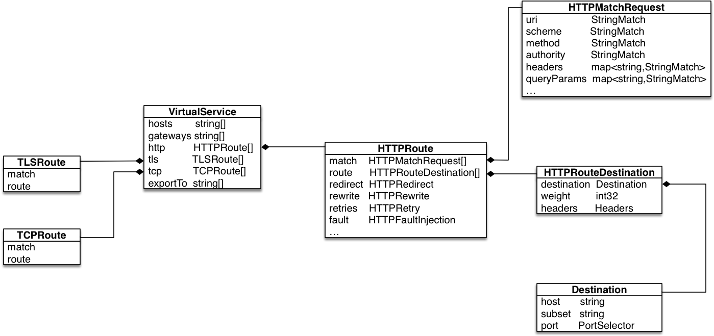
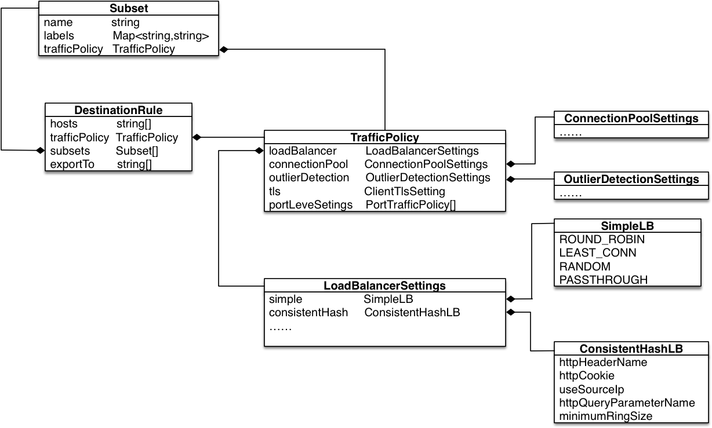
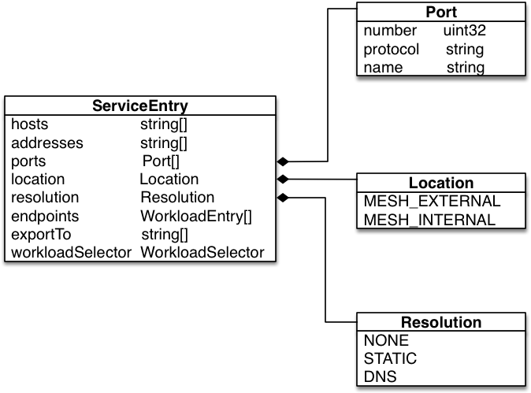

# 路由
路由在维基百科中的定义是：通过互联的网络将信息从源地址传输到目的地址的活动。在 Istio 中的路由，结合维基百科的定义，即从源服务到目标服务的调用。在 Istio 中，通过下面几个重要的 CRD（CustomResourceDefinitions）来实现路由转发，包括 VirtualService、DestinationRule 以及 ServiceEntry：

* VirtualService 定义了路由的行为，包括匹配条件等；
* DestinationRule 定义路由后的目标规则，包括负载均衡、连接池等配置；
* ServiceEntry 实现了一种将外部服务暴露在网格内的能力；

Istio 通过以上 CRD 的配置就可以实现服务之间的治理，如实现熔断、重试、超时等功能，同时也可以通过配置实现金丝雀发布，A/B 测试等功能。
本章主要介绍 Istio 如何通过 CRD 控制数据面的路由能力，并对路由中典型的流控策略进行介绍，包括权重分流、负载均衡、熔断配置等。

## VirtualService(虚拟服务)
VirtualService 定义了请求在网格中如何路由。通过 VirtualService 提供丰富的路由规则配置，对网格中的流量进行治理。VirtualService 的简单类图(本节展示的并不是完整的类图，而是以 UML 类图的表述形式，描述具体 CRD 的数据定义)如下图所示：



如图所示，VirtualService（以下简称 VS ）主要包括的配置属性为：hosts、gateways、http、tls、tcp 以及 exportsTo：

* hosts: string 数组类型，定义了路由所指向的目标主机，可以是通配符 '*', 也可以指定确定的主机名；
* gateways: string 数组类型，定义了该 VS 所作用的网关或 sidecar；声明网关 Gateway，采用 "<gateway namespace>/<gateway name>"，如果不指定 namespace，则默认为 VirtualService 所属 namespace；
默认该字段为 mesh，表示该VS作用于网格内的所有 sidecar。需要注意的是，如果需要作用于 gateway 和 sidecar，需要显示声明 mesh 和具体的 gateway；
* http: HTTPRoute 数组类型，定义 HTTP 路由规则，用于处理 HTTP 流量，主要包括 HTTP、HTTP2、GRPC；
* tls: TLSRoute 数组类型，用于处理非终结 TLS 和 HTTPS 流量；
* tcp: TCPRoute 数组类型，用于处理所有非 HTTP、TLS 的流量；
* exportTo: 声明该 VS 的作用域，'.' 代表本 namespace, '*' 代表整个网格；

从类图可以看出，HTTPRoute 提供的配置属性最多，HTTP 也是当前 Istio 中支持最完整的协议。本文通过对 HTTPRoute 的详细剖析，阐述 Istio 路由。

可以看到 HTTPRoute 的主要配置包括：match、route、redirect、rewrite、retries 等。通过 HTTPRoute，定义 match 条件以及满足条件后路由策略。满足 HTTPMatchRequest 匹配条件的流量，都被路由至 HTTPRouteDestination 定义的目的，执行 HTTPRedirect 定义的重定向，HTTPRewrite 定义的重写，HTTPRetry 定义的重试以及 HTTPFaultInjection 定义的故障注入等策略。

HTTPMatchRequest 定义了路由规则的匹配条件，包括 uri、method、authority、headers、queryParams 等匹配条件。其中 uri，method，authority 为 StringMatch 类型。StringMatch 类型描述了 string 的匹配类型，包括精确（exact）、前缀（prefix）以及正则（regex）三种类型。而 Headers 和 queryParams 则是 Map<string, StringMatch> 类型。
需要注意的是 match 字段是 HTTPMatchRequest 的数组类型，每一组 HTTPMatchRequest 中的条件是与的关系，即所有的匹配条件均满足，方可进行 match。但是不同的 match 之间是或的关系，只要满足任意一组 match 即可执行路由策略。因此 match 之间是顺序优先匹配，一旦 match 匹配成功，就不会进行后续的 match。

在下面的示例中，虽然 match 包含了两个 HTTPMatchRequest 元素（其中包括 uri 以 /ratings/ 开头的请求，或 uri 以 /ratings/v2/ 开头并且 header 中的 end-user 取值为 jason 的请求），但是由于 uri 以 /ratings/ 开头 match 会优先匹配，所以，该 VirtualService 的 match 匹配生效的只是第一个 match 匹配。

```yaml
apiVersion: networking.istio.io/v1alpha3
kind: VirtualService
metadata:
  name: ratings-route
spec:
  hosts:
  - ratings.prod.svc.cluster.local
  http:
  - match:
    - uri:
        prefix: "/ratings/"
    - headers:
        end-user:
          exact: jason
      uri:
        prefix: "/ratings/v2/"
    route:
    - destination:
        host: ratings.prod.svc.cluster.local
```
match 定义了路由规则的匹配条件，route 定义了满足匹配条件后流量的目的地。

HTTPRoute 中的 route 是 HTTPRouteDestination 数组类型，主要包括三个配置属性，分别为 destination、weight 和 headers：

* destination: 必填字段，定义流量的目标地址，destination 中声明的 host 必须是 Istio 注册中心中的真实服务，可以是网格内注册的服务也可以是 ServiceEntry 定义的网格外的服务；
同时 destination 中的 subset 字段声明了服务中的不同子集，通过和 DestinationRule 的结合，达到版本分流的效果，实现 A/B 测试和金丝雀发布；
* weight: 流量打到对应 destination 的权重比例，默认为 100，所有 HTTPRouteDestination 中的 weight 之和必须等于 100；
* headers: 作为 route 的高级配置，用于对请求（request）/ 响应（response）中的 header 进行高级配置，分别包括 request header 的 set、add、remove 操作，以及 response header 的 set、add、remove 操作；

在下面的示例中，基于 Kubernetes 注册发现，主机名即为 Kubernetes 服务名，对于匹配 uri 为 /ratings/ 前缀的请求，路由到 ratings.prod.svc.cluster.local 的后端，其中 25% 的流量打到 v1 版本，75% 的流量打到 v2 版本，同时会 remove 掉名称为 rate 的响应 header。

```yaml
apiVersion: networking.istio.io/v1alpha3
kind: VirtualService
metadata:
  name: ratings-route
spec:
  hosts:
  - ratings.prod.svc.cluster.local
  http:
  - match:
    - uri:
        prefix: "/ratings/"
    route:
    - destination:
        host: ratings.prod.svc.cluster.local
        subset: v1
      weight: 25
    - destination:
        host: ratings.prod.svc.cluster.local
        subset: v2
      weight: 75
      headers:
        response:
          remove:
          - rate
```
VirtualService 定义了丰富的路由规则，本章主要通过 HTTPRoute 的剖析，带读者初识路由，想更加详细了解 VirtualService 配置的读者可以详细阅读官方文档 [VirtualService](https://istio.io/latest/docs/reference/config/networking/virtual-service/#VirtualService)

## DestinationRule（目标规则）
上一节我们提到了 destination 中的 subset，在示例中也看到了 subset 的声明。读者可能会有疑问，这个 subset 的定义来自哪里呢。答案就是下面将要介绍的 DestinationRule。

VirtualService 定义了路由规则，指明了流量通过何种匹配方式进行转发。DestinationRule 通过定义服务子集，声明路由指向不同的服务实例。同时，通过 DestinationRule 提供流控策略配置，包括负载均衡，异常检测等高级配置，更丰富的对流量进行治理。

DestinationRule（目标规则）的主要配置属性包括：hosts、trafficPolicy、subsets、exportTo。DestinationRule 类图如下所示：



* hosts: string 类型，对应注册中心中的服务名，可以为 Kubernetes 中的服务名或在 ServiceEntry 中定义的主机名；
* trafficPolicy: 目标规则的流控策略，包括可以配置负载均衡策略 (LoadBalancer)、连接池配置（ConnectionPool）、异常检测（OutlierDetection）等配置；
* subsets: 定义服务的不同版本，支持在同版本上配置不同的流控策略，具体的配置即 TrafficPolicy；
* exportTo: 声明该 Destination 的作用域，'.' 代表本 namespace, '*' 代表整个网格；

从类图可以看出其中最为复杂的也是最丰富的配置便是 trafficPolicy 的配置。本文主要通过负载均衡策略的配置为读者拨云见日，快速了解 DestinationRule 的相关配置提供帮助。

LoadBalancer 用于定义流控策略中的负载均衡配置，主要定义包括简单负载均衡（SimpleLB）以及一致性哈希负载均衡（ConsistentHashLB）。其中 SimpleLB 主要包括几种典型的负载均衡算法，即 ROUND ROBIN (轮询策略，也是默认的负载均衡算法)，LEAST_CONN (最少请求连接)，RANDOM（随机)。同样的，ConsistentHashLB 提供了基于 httpHeaderName (HTTP 请求头)，httpCookie(Cookie)，useSourceIp (源 IP)，httpQueryParameterName(http query) 的一致性 Hash 计算因子，同时提供了 Hash 环大小的配置，默认为 1024。需要明确的是，在配置负载均衡策略时候，SimpleLB 和 ConsistentHashLB 只能选择一个，同时，每一种策略中的 LB 算法也只能选择其中一个进行配置。

在下面展示的示例中，定义一个 DestinationRule, 本文基于 Kubernetes 注册中心，因此服务名即为服务 host。可以看到，服务的 host 为：ratings.prod.svc.cluster.local，通过 subsets 定义 subset 名称为 version3, 代表所有 label 包含 version:v3 的服务实例。通过 trafficPolicy 中的 LoadBalancer 定义，version3 的负载均衡策略为 ROUND_ROBIN；其他服务实例的负载均衡策略则为 LEAST_CONN。

```yaml
apiVersion: networking.istio.io/v1alpha3
kind: DestinationRule
metadata:
  name: bookinfo-ratings
spec:
  host: ratings.prod.svc.cluster.local
  trafficPolicy:
    loadBalancer:
      simple: LEAST_CONN
  subsets:
  - name: version3 
    labels:
      version: v3
    trafficPolicy:
      loadBalancer:
        simple: ROUND_ROBIN
```
通过 DestinationRule 和 VirtualService 的配置，读者已经可以实现流量在服务不同版本的控制，轻而易举的完成金丝雀发布或 A/B 测试。同时，可以对服务配置对应的负载均衡，连接池等流控策略。

## ServiceEntry
前文也提到了，可以将网格外的服务加入网格内，进行流量控制。那就需要 ServiceEntry 登场了。Istio 提供了 ServiceEntry 这个 CRD，将外部服务纳入 Istio 的服务发现，即可完成向网格内服务一样的管理。

ServiceEntry的简单类图如下所示，



可以看到，ServiceEntry 的主要配置包括，hosts, address, ports, location, resolution, endpoints, exportTo 以及 workloadSelector。
其中 endpoints 在 Istio 1.6 版本之前是 Endpoint 类型，在 1.6 版本，Istio 引入了 Workload Entry，专注于定义外部服务地址；并在 ServiceEntry 中增加了 workloadSelector 字段，使得 ServiceEntry 与 Workload Entry 一起，定义网格外或无法通过注册中心同步的服务，使得他们能够和网格内的服务一样得到治理。

本节主要介绍 ServiceEntry 的配置及相关概念，对 WorkloadEntry 感兴趣的读者，可以参考官方文档 [WorkloadEntry](https://istio.io/latest/docs/reference/config/networking/workload-entry/)：

* hosts: 必填字段，定义与 ServiceEntry 相关的主机名，可以是一个 DNS 域名，也可以使用通配符前缀进行泛域名匹配。该字段需要和 VirtualService 以及 DestinationRule 中的 Host 相对应；
* addresses: 表示与服务相关联的虚拟 IP 地址，可以是 CIDR 这种前缀表达式；
* ports: 必填字段，表示与外部服务关联的端口；
* location: 表示服务为网格内部（MESH_INTERNAL）或网格外部 (MESH_EXTERNAL)；
* resolution: 必填字段，定义服务主机的发现模式，可以定义为 NONE（表示目标地址是一个明确的 IP ), STATIC（endpoints 中设置了服务实例的地址), DNS（未设置 endpoints, 则通过 hosts 中指定的 DNS 地址进行解析）；
* endpoints: 表示与服务相关的网络地址，在 Istio 1.6 之前是 Endpoint 类型，1.6 版本后是 WorkloadEntry 数组类型；
* exportTo: 同 VirtualService 和 DestinationRule 中的该字段定义相同，表示该 ServiceEntry 的作用于，'*' 代表作用于所有 namespace，'.' 代表作用于本 namespace；

下面的示例，在 egress namespace 中定义一个名为 external-svc-httpbin 的 ServiceEntry CRD。定义了服务 host 为 httpbin.com，暴露在 80 端口上的协议为 HTTP 协议。同时，声明了该 ServiceEntry 的作用域仅为 egress 命名空间。即控制了该 ServiceEntry 仅可被 egress 命名空间中定义的 VirtualService 以及 DestinationRule 资源使用。

```yaml
apiVersion: networking.istio.io/v1alpha3
kind: ServiceEntry
metadata:
  name: external-svc-httpbin
  namespace : egress
spec:
  hosts:
  - httpbin.com
  exportTo:
  - "."
  location: MESH_EXTERNAL
  ports:
  - number: 80
    name: http
    protocol: HTTP
  resolution: DNS
 ```
## 小结
本节主要讲解路由的概念，通过对 VirtualService，DestinationRule 以及 ServiceEntry 三个 CRD 的配置及示例讲解，带读者认识了 Istio 中的路由。
 
## 参考
 - [istio.io/Configuration/Traffic Management](https://istio.io/latest/docs/reference/config/networking/)
