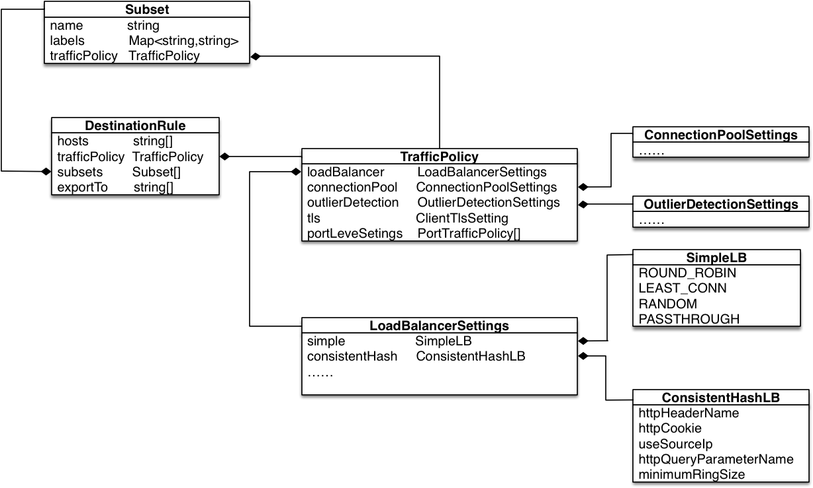

# 路由
维基百科中给路由的定义是：通过互联的网络将信息从源地址传输到目的地址的活动。在Istio中的路由，结合维基百科的定义，即从源服务到目标服务的调用。


在Istio中，通过几个重要的CRD（CustomResourceDefinitions）来实现路由转发，包括VirtualService、DestinationRule以及ServiceEntry。

其中VirtualService定义了路由的行为，包括匹配条件等；DestinationRule定义路由后的目标规则，包括负载均衡、连接池等配置；ServiceEntry定义了一种将外部服务暴露在网格内的能力。

通过以上的CRD，Istio可以非常简单的对服务间访问进行流量控制，通过可以通过组合配置，实现熔断、重试、超时等流量控制；同时也可以通过配置实现金丝雀发布，A/B测试等功能。

本章主要介绍通过核心CRD实现路由的能力，并对路由中典型的流控策略进行介绍，包括权重分流、负载均衡、熔断配置等。


## VirtualService(虚拟服务)
VirtualService定义了请求在网格中如何路由。通过VirtualService提供丰富的路由规则配置，对网格中的流量进行治理。VirtualService的简单类图(本节展示的并不是完整的类图，而是以UML类图的表述形式，描述具体CRD的数据定义)如下图所示：


如图所示，我们可以清晰的看到，VirtualService（以下简称VS）主要包括的配置属性为：hosts、gateways、http、tls、tcp以及exportsTo。

* hosts: string数组类型。定义了路由所指向的目标主机。可以是通配符*, 也可以指定确定的主机名。
* gateways: string数组类型。定义了该VS所作用的网关/sidecar。声明Gateway，采用<gateway namespace>/<gateway name>，如果不指定namespace，则默认为VirtualService所属namespace。
默认该字段为mesh，表示该VS作用于网格内的所有sidecar。需要注意的是，如果需要作用于gateway和sidecar，需要显示声明mesh和具体的gateway。
* http: HTTPRoute数组类型。定义HTTP路由规则，用于处理HTTP流量，主要包括HTTP、HTTP2、GRPC。
* tls: TLSRoute数组类型。用于处理非终结TLS和HTTPS流量。
* tcp: TCPRoute数组类型。用于处理所有非HTTP、TLS的流量。
* exportTo: 声明该VS的作用域，'.'代表本namespace, '*'代表整个网格。

从类图可以看出，HTTPRoute提供的配置属性最多，HTTP也是当前Istio中支持最完整的协议。本文通过对HTTPRoute的详细剖析，阐述Istio路由。

可以看到HTTPRoute的主要配置包括：match、route、redirect、rewrite、retries等。通过HTTPRoute，定义match条件以及满足条件后路由策略。将满足HTTPMatchRequest匹配条件的流量，都被路由至HTTPRouteDestination定义的目的，执行HTTPRewrite定义的重定向，HTTPRewrite定义的重写，HTTPRetry定义的重试以及HTTPFaultInjection定义的故障注入等策略。

HTTPMatchRequest定义了路由规则的匹配条件，包括uri、method、authority、headers、queryParams等匹配条件。其中uri，method，authority为StringMatch类型。StringMatch类型描述了string的匹配类型，包括精确（exact）、前缀（prefix）以及正则（regex）三种类型。而Headers和queryParams则是Map<string, StringMatch>类型。
需要注意的是match字段是HTTPMatchRequest的数组类型，每一组HTTPMatchRequest中的条件是与的关系，即所有的匹配条件均满足，方可进行match。但是不同的match之间是或的关系，只要满足任意一组match即可执行路由策略。因此match之间是顺序优先匹配，一旦match匹配成功，就不会进行后续的match。

在下面的示例中，虽然match包含了两个HTTPMatchRequest元素，其中包括uri以/ratings/开头的请求，或者uri以/ratings/v2/开头并且header中的end-user取值为jason的请求。但是，由于uri以/ratings/开头match会优先匹配，所以，该VirtualService的match匹配生效的只是第一个match匹配。

```yaml
apiVersion: networking.istio.io/v1alpha3
kind: VirtualService
metadata:
  name: ratings-route
spec:
  hosts:
  - ratings.prod.svc.cluster.local
  http:
  - match:
    - uri:
        prefix: "/ratings/"
    - headers:
        end-user:
          exact: jason
      uri:
        prefix: "/ratings/v2/"
    route:
    - destination:
        host: ratings.prod.svc.cluster.local
```
match定义了路由规则的匹配条件，route定义了满足匹配条件后流量的目的地。

HTTPRoute中的route是HTTPRouteDestination数组类型，主要包括三个配置属性，分别为destination、weight和headers。

* destination: 必填字段，定义流量的目标地址。destination中声明的host必须是Istio注册中心中的真实服务，可以是网格内注册的服务也可以是ServiceEntry定义的网格外的服务。
同时destination中的subset字段声明了服务中的不同子集。通过和DestinationRule的结合，达到版本分流的效果，实现A/B测试和金丝雀发布。
* weight: 流量打到对应destination的权重比例，默认为100。所有HTTPRouteDestination中的weight之和必须等于100。
* headers: 作为route的高级配置，用于对请求（request）/响应（response）中的header进行高级配置。分别包括request header的set、add、remove操作，以及respoonse header的set、add、remove操作。

在下面的示例中，本文基于Kubernetes注册发现，主机名即为Kubernetes服务名。
对于匹配uri为/ratings/前缀的请求，路由到ratings.prod.svc.cluster.local的后端。25%的流量打到v1版本；75%的流量打到v2版本，同时对remove掉响应header rate。

```yaml
apiVersion: networking.istio.io/v1alpha3
kind: VirtualService
metadata:
  name: ratings-route
spec:
  hosts:
  - ratings.prod.svc.cluster.local
  http:
  - match:
    - uri:
        prefix: "/ratings/"
    route:
    - destination:
        host: ratings.prod.svc.cluster.local
        subset: v1
      weight: 25
    - destination:
        host: ratings.prod.svc.cluster.local
        subset: v2
      weight: 75
      headers:
        response:
          remove:
          - rate
```
VirtualService定义了丰富的路由规则，本章主要通过HTTPRoute的剖析，带读者初识路由，想更加详细了解VirtualService配置的读者可以详细阅读官方文档 [VirtualService](https://istio.io/latest/docs/reference/config/networking/virtual-service/#VirtualService)

## DestinationRule（目标规则）
上一节我们提到了destination中的subset，在示例中也看到了subset的声明。读者可能会有疑问，这个subset的定义来自哪里呢。答案就是本节将要介绍的DestinationRule。
VirtualService定义了路由规则，指明了流量通过何种匹配方式进行转发。DestinationRule通过定义服务子集，声明路由指向不同的服务实例。同时，通过DestinationRule提供的流控策略配置，包括负载均衡，异常检测等高级配置，更丰富的对流量进行治理。

DestinationRule（目标规则）的主要配置属性包括：hosts、trafficPolicy、subsets、exportTo。DesintaionRule类图如下所示:



* hosts: string类型，对应注册中心中的服务名。可以为Kubernetes中的服务名或在ServiceEntry中定义的主机名。
* trafficPolicy: 目标规则的流控策略，包括可以配置负载均衡策略(loadBalancer)、连接池配置（connectionPool）、异常检测（OutlierDetection）等配置。
* subsets: 定义服务的不同版本，支持在同版本上配置不同的流控策略，具体的配置即TrafficPolicy。
* exportTo: 声明该Destination的作用域，'.'代表本namespace, '*'代表整个网格。

从类图可以看出其中最为复杂的也是最丰富的配置便是trafficPolicy的配置。本文主要通过负载均衡策略的配置为读者拨云见日，快速了解DestinationRule的相关配置提供帮助。

loadBalancer用于定义流控策略中的负载均衡配置，主要定义包括简单负载均衡（SimpleLB）以及一致性哈希负载均衡（ConsistentHashLB）。其中SimpleLB主要包括几种典型的负载均衡算法，即ROUND ROBIN(也是默认的负载均衡算法)，LEAST_CONN(最少请求连接)，RANDOM（随机)。同样的，
ConsistentHashLB提供了基于httpHeaderName(HTTP请求头)，httpCookie(Cookie)，useSourceIp(源IP)，httpQueryParameterName(http query)的一致性Hash计算因子，同时提供了Hash环大小的配置，默认为1024。需要明确的是，在配置负载均衡策略时候，SimpleLB和ConsistentHashLB
只能选择一个，同时，每一种策略中的LB算法也只能选择其中一个进行配置。

在下面展示的示例中，定义一个DestinationRule，本文基于Kubernetes注册中心，因此服务名即为服务host。可以看到，服务的host为：ratings.prod.svc.cluster.local，通过subset定义subset名称为version3, 代表所有label包含version:v3的服务实例。通过通过trafficPolicy中的
loadBalancer定义，version3的负载均衡策略为ROUND_ROBIN；其他服务实例的负载均衡策略则为LEAST_CONN。

```yaml
apiVersion: networking.istio.io/v1alpha3
kind: DestinationRule
metadata:
  name: bookinfo-ratings
spec:
  host: ratings.prod.svc.cluster.local
  trafficPolicy:
    loadBalancer:
      simple: LEAST_CONN
  subsets:
  - name: version3 
    labels:
      version: v3
    trafficPolicy:
      loadBalancer:
        simple: ROUND_ROBIN
```
通过DestinationRule和VirtualService的配置，读者已经可以实现流量在服务不同版本的控制，轻而易举的完成金丝雀发布或A/B测试。同时，可以对服务配置对应的负载均衡，连接池等流控策略。

## ServiceEntry
前文也提到了，可以将网格外的服务加入网格内，进行流量控制。那就需要ServiceEntry登场了。Istio提供了ServiceEntry这个CRD，将外部服务纳入Istio的服务发现，即可完成向网格内服务一样的
管理。

ServiceEntry的简单类图如下所示，


可以看到，ServiceEntry的主要配置包括，hosts,address,ports,location,resolution,endpoints,exportTo以及workloadSelector。
其中endpoints在Istio 1.6版本之前是Endpoint类型，在1.6版本，Istio引入了Workload Entry，专注于定义外部服务地址；并在ServiceEntry中增加了workloadSelector字段，使得ServiceEntry与Workload Entry一起，定义网格外或无法通过注册中心同步的服务，使得他们能够和网格内的服务一样，得到治理。
本节主要介绍ServiceEntry的配置及相关概念，对WorkloadEntry感兴趣的读者，可以参考官方文档 [WorkloadEntry](https://istio.io/latest/docs/reference/config/networking/workload-entry/)

* hosts: 必填字段，定义与ServiceEntry相关的主机名，可以是一个DNS域名，也可以使用通配符前缀进行泛域名匹配。该字段需要和VirtualService以及DestinationRule中的Host相对应。
* addresses: 表示与服务相关联的虚拟IP地址，可以是CIDR这种前缀表达式。
* ports: 必填字段，表示与外部服务关联的端口。
* location: 表示服务为网格内部（MESH_INTERNAL）/网格外部(MESH_EXTERNAL)。
* resolution: 必填字段，定义服务主机的发现模式。可以定义为NONE（表示目标地址是一个明确的IP), STATIC（endpoints中设置了服务实例的地址),DNS（未设置endpoints,则通过hosts中指定的DNS地址进行解析）。
* endpoints: 表示与服务相关的网络地址。在Istio 1.6之前是Endpoint类型，1.6版本后，为WorkloadEntry数组类型。
* exportTo:  同VirtualService和DestinationRule中的该字段定义相同，表示该ServiceEntry的作用于，'*'代表作用于所有namespace，'.'代表作用于本namespace。

下面的示例，在egress namespace中定义一个名为external-svc-httpbin的ServiceEntrty CRD。定义了服务host为httpbin.com，暴露在80端口上的协议为HTTP协议。同时，声明了，该ServiceEntry的作用域仅为egress namespace。
即控制了该ServiceEntry仅可被egress namespace中定义的VirtualService以及DestinationRule资源使用。

```yaml
apiVersion: networking.istio.io/v1alpha3
kind: ServiceEntry
metadata:
  name: external-svc-httpbin
  namespace : egress
spec:
  hosts:
  - httpbin.com
  exportTo:
  - "."
  location: MESH_EXTERNAL
  ports:
  - number: 80
    name: http
    protocol: HTTP
  resolution: DNS
 ```

## 小结
本节主要讲解路由的概念，通过对VirtualService，DestinationRule以及ServiceEntry三个CRD资源的配置及示例讲解，带读者认识Istio中的路由。
 
## 参考
 - [istio.io/Configuration/Traffic Management](https://istio.io/latest/docs/reference/config/networking/)