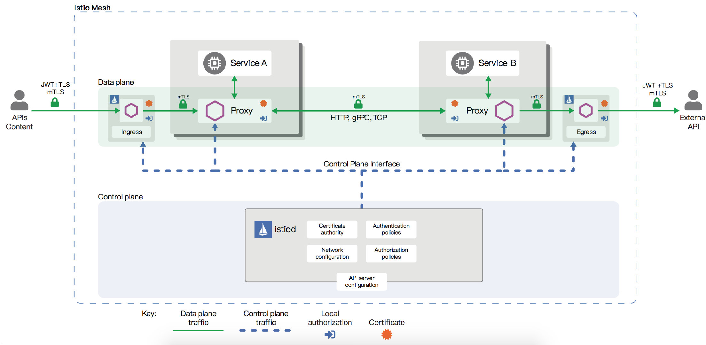

# 安全

安全对于微服务这样的分布式系统来说至关重要。与单体应用在进程内进行通信不同，网络成为了服务间通信的纽带，这使得它对安全有了更迫切的需求。比如为了抵御外来攻击，我们需要对流量进行加密；为保证服务间通信的可靠性，需要使用mTLS的方式进行交互；为控制不同身份的访问，需要设置不同粒度的授权策略。作为一个服务网格，Istio 提供了一整套完整的安全解决方案。它可以以透明的方式，为我们的微服务应用添加安全策略。

Istio 中的安全架构是由多个组件协同完成的。Citadel 是负责安全的主要组件，用于密钥和证书的管理；Pilot 会将安全策略配置分发给 Envoy 代理；Envoy 执行安全策略来实现访问控制。下图展示了 Istio 的安全架构和运作流程。

Istio 提供的安全功能主要分为认证和授权两部分。

## 认证

Istio 提供两种类型的认证：

- 对等认证（Peer authentication）：用于服务到服务的认证。这种方式是通过双向TLS（mTLS）来实现的，即客户端和服务端都要验证彼此的合法性。Istio 中提供了内置的密钥和证书管理机制，可以自动进行密钥和证书的生成、分发和轮换，而无需修改业务代码。
- 请求认证（Request authentication）：也叫最终用户认证，验证终端用户或客户端。Istio 使用目前业界流行的 JWT（JSON Web Token）作为实现方案。

Istio 的 mTLS 提供了一种宽容模式（permissive mode）的配置方法，使得服务可以同时支持纯文本和 mTLS 流量。用户可以先用非加密的流量确保服务间的连通性，然后再逐渐迁移到 mTLS，这种方式极大的降低了迁移和调试的成本。

Istio 还提供了多种粒度的认证策略，可以支持网格级别、命名空间级别和工作负载级别的认证，用户可以灵活的配置各种级别的策略和组合。

## 授权

Istio 的授权策略可以为网格中的服务提供不同级别的访问控制，比如网格级别、命名空间级别和工作负载级别。授权策略支持 `ALLOW` 和 `DENY` 动作，每个 Envoy 代理都运行一个授权引擎，当请求到达代理时，授权引擎根据当前策略评估请求的上下文，并返回授权结果 `ALLOW` 或 `DENY`。授权功能没有显示的开关进行配置，默认就是启动状态，只需要将配置好的授权策略应用到对应的工作负载就可以进行访问控制了。

Istio 中的授权策略通过自定义资源`AuthorizationPolicy`来配置。除了定义策略指定的目标（网格、命名空间、工作负载）和动作（容许、拒绝）外，Istio 还提供了丰富的策略匹配规则，比如可以设置来源、目标、路径、请求头、方法等条件，甚至还支持自定义匹配条件，其灵活性可以极大的满足用户需求。

