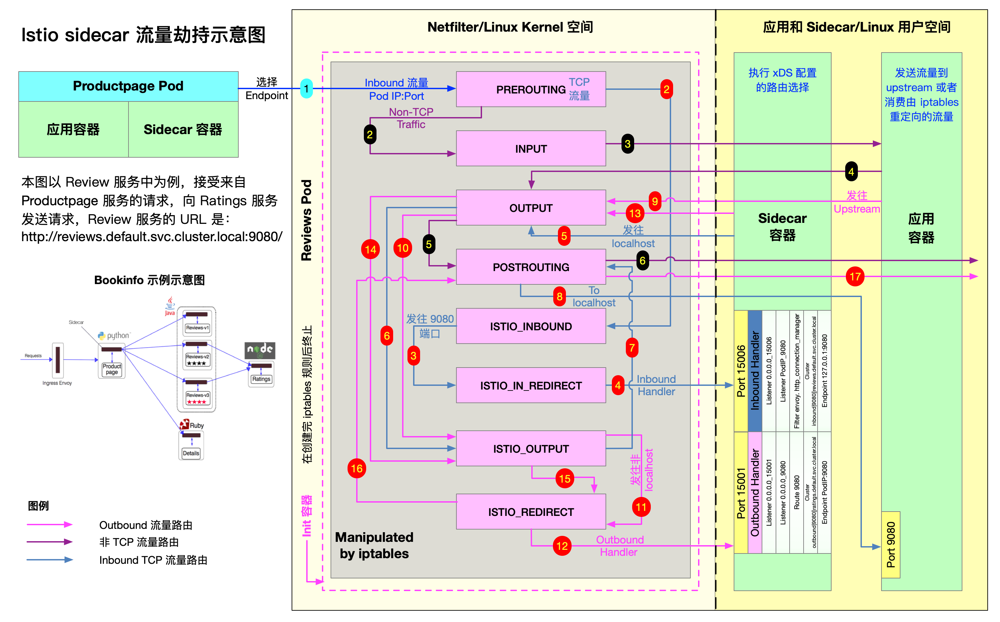
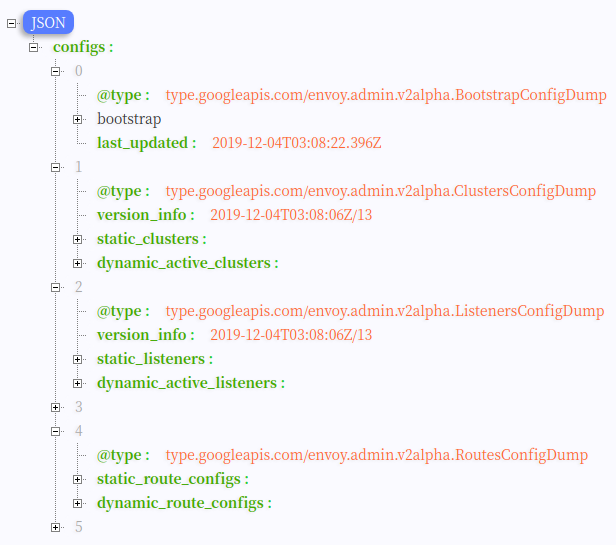
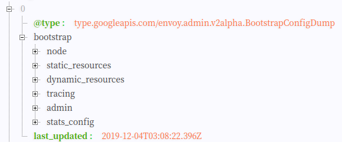
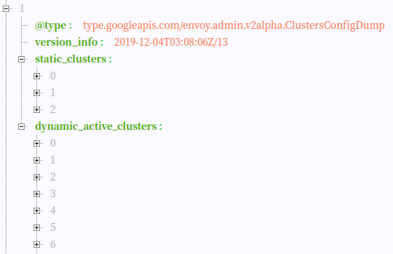
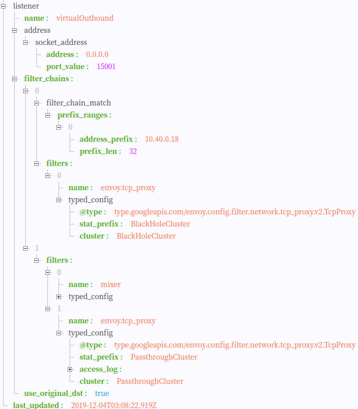
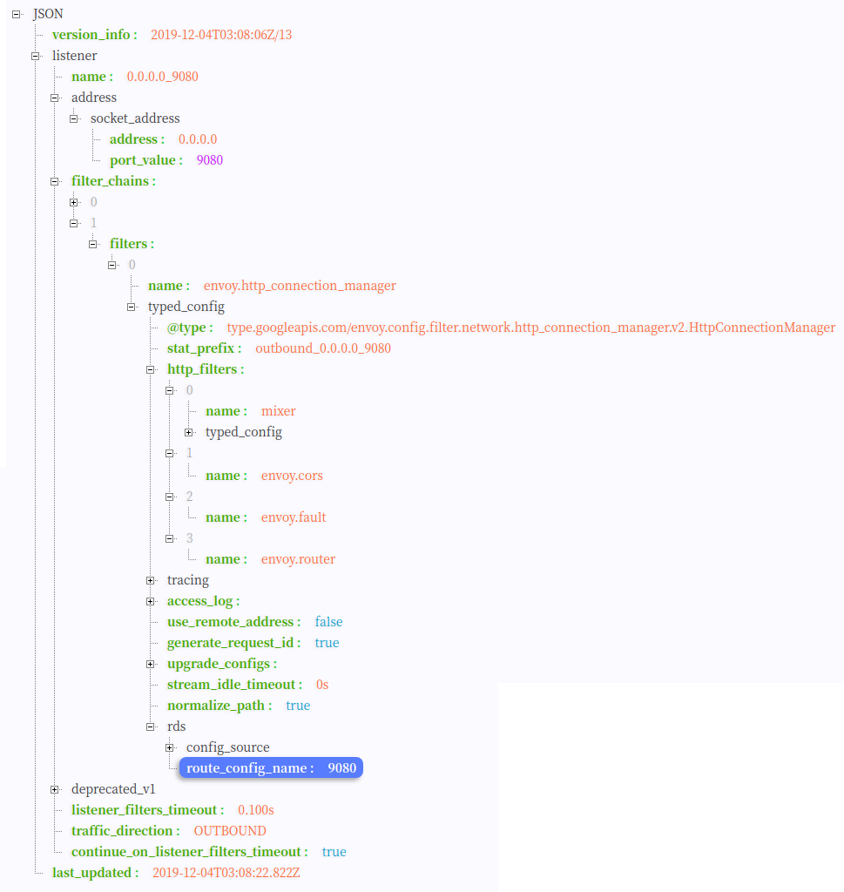
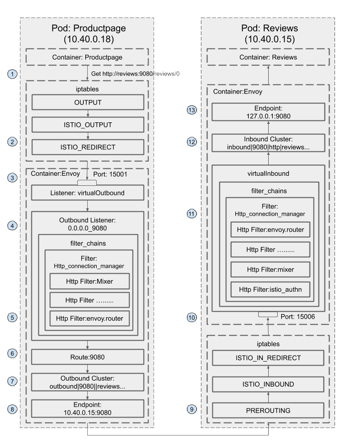

# Sidecar 注入及透明流量劫持

本节将为大家介绍以下内容：

- 什么是 sidecar 模式和它的优势在哪里。
- Istio 中是如何做 sidecar 注入的？
- Sidecar proxy 是如何做透明流量劫持的？
- 流量是如何路由到 upstream 的？

## Sidecar 模式

将应用程序的功能划分为单独的进程运行在同一个最小调度单元中（例如 Kubernetes 中的 Pod）可以被视为 **sidecar 模式**。如下图所示，sidecar 模式允许您在应用程序旁边添加更多功能，而无需额外第三方组件配置或修改应用程序代码。


就像连接了 Sidecar 的三轮摩托车一样，在软件架构中， Sidecar 连接到父应用并且为其添加扩展或者增强功能。Sidecar 应用与主应用程序松散耦合。它可以屏蔽不同编程语言的差异，统一实现微服务的可观察性、监控、日志记录、配置、断路器等功能。

### 使用 Sidecar 模式的优势

使用 sidecar 模式部署服务网格时，无需在节点上运行代理，但是集群中将运行多个相同的 sidecar 副本。在 sidecar 部署方式中，每个应用的容器旁都会部署一个伴生容器（如 Envoy 或 MOSN），这个容器称之为 sidecar 容器。Sidecar 接管进出应用容器的所有流量。在 Kubernetes 的 Pod 中，在原有的应用容器旁边注入一个 Sidecar 容器，两个容器共享存储、网络等资源，可以广义的将这个包含了 sidecar 容器的 Pod 理解为一台主机，两个容器共享主机资源。

因其独特的部署结构，使得 sidecar 模式具有以下优势：

- 将与应用业务逻辑无关的功能抽象到共同基础设施，降低了微服务代码的复杂度。
- 因为不再需要编写相同的第三方组件配置文件和代码，所以能够降低微服务架构中的代码重复度。
- Sidecar 可独立升级，降低应用程序代码和底层平台的耦合度。

## Istio 中的 sidecar 注入

Istio 中提供了以下两种 sidecar 注入方式：

- 使用 `istioctl` 手动注入。
- 基于 Kubernetes 的 [突变 webhook 入驻控制器（mutating webhook addmission controller](https://kubernetes.io/docs/reference/access-authn-authz/admission-controllers/) 的自动 sidecar 注入方式。

不论是手动注入还是自动注入，sidecar 的注入过程都需要遵循如下步骤：

1. Kubernetes 需要了解待注入的 sidecar 所连接的 Istio 集群及其配置；
1. Kubernetes 需要了解待注入的 sidecar 容器本身的配置，如镜像地址、启动参数等；
1. Kubernetes 根据 sidecar 注入模板和以上配置填充 sidecar 的配置参数，将以上配置注入到应用容器的一侧；

使用下面的命令可以手动注入 sidecar。

```bash
istioctl kube-inject -f ${YAML_FILE} | kuebectl apply -f -
```

该命令会使用 Istio 内置的 sidecar 配置来注入，下面使用 Istio详细配置请参考 [Istio 官网](https://istio.io/docs/setup/additional-setup/sidecar-injection/#manual-sidecar-injection)。

注入完成后您将看到 Istio 为原有 pod template 注入了 `initContainer` 及 sidecar proxy相关的配置。

### Init 容器

Init 容器是一种专用容器，它在应用程序容器启动之前运行，用来包含一些应用镜像中不存在的实用工具或安装脚本。

一个 Pod 中可以指定多个 Init 容器，如果指定了多个，那么 Init 容器将会按顺序依次运行。只有当前面的 Init 容器必须运行成功后，才可以运行下一个 Init 容器。当所有的 Init 容器运行完成后，Kubernetes 才初始化 Pod 和运行应用容器。

Init 容器使用 Linux Namespace，所以相对应用程序容器来说具有不同的文件系统视图。因此，它们能够具有访问 Secret 的权限，而应用程序容器则不能。

在 Pod 启动过程中，Init 容器会按顺序在网络和数据卷初始化之后启动。每个容器必须在下一个容器启动之前成功退出。如果由于运行时或失败退出，将导致容器启动失败，它会根据 Pod 的 `restartPolicy` 指定的策略进行重试。然而，如果 Pod 的 `restartPolicy` 设置为 Always，Init 容器失败时会使用 `RestartPolicy` 策略。

在所有的 Init 容器没有成功之前，Pod 将不会变成 `Ready` 状态。Init 容器的端口将不会在 Service 中进行聚集。 正在初始化中的 Pod 处于 `Pending` 状态，但应该会将 `Initializing` 状态设置为 true。Init 容器运行完成以后就会自动终止。

关于 Init 容器的详细信息请参考 [Init 容器 - Kubernetes 中文指南/云原生应用架构实践手册](https://jimmysong.io/kubernetes-handbook/concepts/init-containers.html)。

## Sidecar 注入示例分析

以 Istio 官方提供的 `bookinfo` 中 `productpage`  的 YAML 为例，关于 `bookinfo` 应用的详细 YAML 配置请参考 [bookinfo.yaml](https://github.com/istio/istio/blob/master/samples/bookinfo/platform/kube/bookinfo.yaml)。

下文将从以下几个方面讲解：

- Sidecar 容器的注入
- iptables 规则的创建
- 路由的详细过程

```yaml
apiVersion: apps/v1
kind: Deployment
metadata:
  name: productpage-v1
  labels:
    app: productpage
    version: v1
spec:
  replicas: 1
  selector:
    matchLabels:
      app: productpage
      version: v1
  template:
    metadata:
      labels:
        app: productpage
        version: v1
    spec:
      serviceAccountName: bookinfo-productpage
      containers:
      - name: productpage
        image: docker.io/istio/examples-bookinfo-productpage-v1:1.15.0
        imagePullPolicy: IfNotPresent
        ports:
        - containerPort: 9080
        volumeMounts:
        - name: tmp
          mountPath: /tmp
      volumes:
      - name: tmp
        emptyDir: {}
```

再查看下 `productpage` 容器的 [Dockerfile](https://github.com/istio/istio/blob/master/samples/bookinfo/src/productpage/Dockerfile)。

```docker
FROM python:3.7.4-slim

COPY requirements.txt ./
RUN pip install --no-cache-dir -r requirements.txt

COPY test-requirements.txt ./
RUN pip install --no-cache-dir -r test-requirements.txt

COPY productpage.py /opt/microservices/
COPY tests/unit/* /opt/microservices/
COPY templates /opt/microservices/templates
COPY static /opt/microservices/static
COPY requirements.txt /opt/microservices/

ARG flood_factor
ENV FLOOD_FACTOR ${flood_factor:-0}

EXPOSE 9080
WORKDIR /opt/microservices
RUN python -m unittest discover

USER 1

CMD ["python", "productpage.py", "9080"]
```

我们看到 `Dockerfile` 中没有配置 `ENTRYPOINT`，所以 `CMD` 的配置 `python productpage.py 9080`  将作为默认的 `ENTRYPOINT`，记住这一点，再看下注入 sidecar 之后的配置。

```bash
$ istioctl kube-inject -f samples/bookinfo/platform/kube/bookinfo.yaml
```

我们只截取其中与 `productpage` 相关的 `Deployment` 配置中的部分 YAML 配置。

```yaml
      containers:
      - image: docker.io/istio/examples-bookinfo-productpage-v1:1.15.0 # 应用镜像
        name: productpage
        ports:
        - containerPort: 9080
      - args:
        - proxy
        - sidecar
        - --domain
        - $(POD_NAMESPACE).svc.cluster.local
        - --configPath
        - /etc/istio/proxy
        - --binaryPath
        - /usr/local/bin/envoy
        - --serviceCluster
        - productpage.$(POD_NAMESPACE)
        - --drainDuration
        - 45s
        - --parentShutdownDuration
        - 1m0s
        - --discoveryAddress
        - istiod.istio-system.svc:15012
        - --zipkinAddress
        - zipkin.istio-system:9411
        - --proxyLogLevel=warning
        - --proxyComponentLogLevel=misc:error
        - --connectTimeout
        - 10s
        - --proxyAdminPort
        - "15000"
        - --concurrency
        - "2"
        - --controlPlaneAuthPolicy
        - NONE
        - --dnsRefreshRate
        - 300s
        - --statusPort
        - "15020"
        - --trust-domain=cluster.local
        - --controlPlaneBootstrap=false
        image: docker.io/istio/proxyv2:1.5.1 # sidecar proxy
        name: istio-proxy
        ports:
        - containerPort: 15090
          name: http-envoy-prom
          protocol: TCP
      initContainers:
      - command:
        - istio-iptables
        - -p
        - "15001"
        - -z
        - "15006"
        - -u
        - "1337"
        - -m
        - REDIRECT
        - -i
        - '*'
        - -x
        - ""
        - -b
        - '*'
        - -d
        - 15090,15020
        image: docker.io/istio/proxyv2:1.5.1 # init 容器
        name: istio-init
```

Istio 给应用 Pod 注入的配置主要包括：

- Init 容器 `istio-init`：用于 pod 中设置 iptables 端口转发
- Sidecar 容器 `istio-proxy`：运行 sidecar 代理，如 Envoy 或 MOSN

接下来将分别解析下这两个容器。

## Init 容器解析

Istio 在 pod 中注入的 Init 容器名为 `istio-init`，我们在上面 Istio 注入完成后的 YAML 文件中看到了该容器的启动命令是：

```bash
istio-iptables -p 15001 -z 15006 -u 1337 -m REDIRECT -i '*' -x "" -b '*' -d 15090,15020
```

我们再检查下该容器的 [Dockerfile](https://github.com/istio/istio/blob/master/pilot/docker/Dockerfile.proxyv2) 看看 `ENTRYPOINT` 是怎么确定启动时执行的命令。

```docker
# 前面的内容省略
# The pilot-agent will bootstrap Envoy.
ENTRYPOINT ["/usr/local/bin/pilot-agent"]
```

我们看到 `istio-init` 容器的入口是 `/usr/local/bin/istio-iptables` 命令行，该命令行工具的代码的位置在 Istio 源码仓库的 [tools/istio-iptables](https://github.com/istio/istio/tree/master/tools/istio-iptables) 目录。

注意：在 Istio 1.1 版本时还是使用 `isito-iptables.sh` 命令行来操作 IPtables。

### Init 容器启动入口

Init 容器的启动入口是 `istio-iptables` 命令行，该命令行工具的用法如下：

```bash
$ istio-iptables [flags]
  -p: 指定重定向所有 TCP 流量的 sidecar 端口（默认为 $ENVOY_PORT = 15001）
  -m: 指定入站连接重定向到 sidecar 的模式，“REDIRECT” 或 “TPROXY”（默认为 $ISTIO_INBOUND_INTERCEPTION_MODE)
  -b: 逗号分隔的入站端口列表，其流量将重定向到 Envoy（可选）。使用通配符 “*” 表示重定向所有端口。为空时表示禁用所有入站重定向（默认为 $ISTIO_INBOUND_PORTS）
  -d: 指定要从重定向到 sidecar 中排除的入站端口列表（可选），以逗号格式分隔。使用通配符“*” 表示重定向所有入站流量（默认为 $ISTIO_LOCAL_EXCLUDE_PORTS）
  -o：逗号分隔的出站端口列表，不包括重定向到 Envoy 的端口。
  -i: 指定重定向到 sidecar 的 IP 地址范围（可选），以逗号分隔的 CIDR 格式列表。使用通配符 “*” 表示重定向所有出站流量。空列表将禁用所有出站重定向（默认为 $ISTIO_SERVICE_CIDR）
  -x: 指定将从重定向中排除的 IP 地址范围，以逗号分隔的 CIDR 格式列表。使用通配符 “*” 表示重定向所有出站流量（默认为 $ISTIO_SERVICE_EXCLUDE_CIDR）。
  -k：逗号分隔的虚拟接口列表，其入站流量（来自虚拟机的）将被视为出站流量。
  -g：指定不应用重定向的用户的 GID。(默认值与 -u param 相同)
  -u：指定不应用重定向的用户的 UID。通常情况下，这是代理容器的 UID（默认值是 1337，即 istio-proxy 的 UID）。
  -z: 所有进入 pod/VM 的 TCP 流量应被重定向到的端口（默认 $INBOUND_CAPTURE_PORT = 15006）。
```

以上传入的参数都会重新组装成 [`iptables` ](https://wangchujiang.com/linux-command/c/iptables.html) 规则，关于该命令的详细用法请访问 [tools/istio-iptables/pkg/cmd/root.go](https://github.com/istio/istio/blob/master/tools/istio-iptables/pkg/cmd/root.go)。

该容器存在的意义就是让 sidecar 代理可以拦截所有的进出 pod 的流量，15090 端口（Mixer 使用）和 15092 端口（Ingress Gateway）除外的所有入站（inbound）流量重定向到 15006 端口（sidecar），再拦截应用容器的出站（outbound）流量经过 sidecar 处理（通过 15001 端口监听）后再出站。关于 Istio 中端口用途请参考 [Istio 官方文档](https://istio.io/zh/docs/ops/deployment/requirements/)。

**命令解析**

这条启动命令的作用是：

- 将应用容器的所有流量都转发到 sidecar 的 15006 端口。
- 使用 `istio-proxy` 用户身份运行， UID 为 1337，即 sidecar 所处的用户空间，这也是 `istio-proxy` 容器默认使用的用户，见 YAML 配置中的 `runAsUser` 字段。
- 使用默认的 `REDIRECT` 模式来重定向流量。
- 将所有出站流量都重定向到 sidecar 代理（通过 15001 端口）。

因为 Init 容器初始化完毕后就会自动终止，因为我们无法登陆到容器中查看 iptables 信息，但是 Init 容器初始化结果会保留到应用容器和 sidecar 容器中。

## iptables 注入解析

为了查看 iptables 配置，我们需要登陆到 sidecar 容器中使用 root 用户来查看，因为 `kubectl` 无法使用特权模式来远程操作 docker 容器，所以我们需要登陆到 `productpage` pod 所在的主机上使用 `docker` 命令登陆容器中查看。

如果您使用 minikube 部署的 Kubernetes，可以直接登录到 minikube 的虚拟机中并切换为 root 用户。查看 iptables 配置，列出 NAT（网络地址转换）表的所有规则，因为在 Init 容器启动的时候选择给  `istio-iptables` 传递的参数中指定将入站流量重定向到 sidecar 的模式为 `REDIRECT`，因此在 iptables 中将只有 NAT 表的规格配置，如果选择 `TPROXY` 还会有 `mangle` 表配置。`iptables` 命令的详细用法请参考 [iptables](https://wangchujiang.com/linux-command/c/iptables.html)，规则配置请参考 [iptables 规则配置](http://www.zsythink.net/archives/1517)。

我们仅查看与 `productpage` 有关的 iptables 规则如下。

```bash
# 进入 minikube 并切换为 root 用户，minikube 默认用户为 docker
$ minikube ssh
$ sudo -i

# 查看 productpage pod 的 istio-proxy 容器中的进程
$ docker top `docker ps|grep "istio-proxy_productpage"|cut -d " " -f1`
UID                 PID                 PPID                C                   STIME               TTY                 TIME                CMD
1337                10576               10517               0                   08:09               ?                   00:00:07            /usr/local/bin/pilot-agent proxy sidecar --domain default.svc.cluster.local --configPath /etc/istio/proxy --binaryPath /usr/local/bin/envoy --serviceCluster productpage.default --drainDuration 45s --parentShutdownDuration 1m0s --discoveryAddress istiod.istio-system.svc:15012 --zipkinAddress zipkin.istio-system:9411 --proxyLogLevel=warning --proxyComponentLogLevel=misc:error --connectTimeout 10s --proxyAdminPort 15000 --concurrency 2 --controlPlaneAuthPolicy NONE --dnsRefreshRate 300s --statusPort 15020 --trust-domain=cluster.local --controlPlaneBootstrap=false
1337                10660               10576               0                   08:09               ?                   00:00:33            /usr/local/bin/envoy -c /etc/istio/proxy/envoy-rev0.json --restart-epoch 0 --drain-time-s 45 --parent-shutdown-time-s 60 --service-cluster productpage.default --service-node sidecar~172.17.0.16~productpage-v1-7f44c4d57c-ksf9b.default~default.svc.cluster.local --max-obj-name-len 189 --local-address-ip-version v4 --log-format [Envoy (Epoch 0)] [%Y-%m-%d %T.%e][%t][%l][%n] %v -l warning --component-log-level misc:error --concurrency 2

# 进入 nsenter 进入 sidecar 容器的命名空间（以上任何一个都可以）
$ nsenter -n --target 10660
```

在该进程的命名空间下查看其 iptables 规则链。

```bash
# 查看 NAT 表中规则配置的详细信息。
$ iptables -t nat -L -v
# PREROUTING 链：用于目标地址转换（DNAT），将所有入站 TCP 流量跳转到 ISTIO_INBOUND 链上。
Chain PREROUTING (policy ACCEPT 2701 packets, 162K bytes)
 pkts bytes target     prot opt in     out     source               destination
 2701  162K ISTIO_INBOUND  tcp  --  any    any     anywhere             anywhere

# INPUT 链：处理输入数据包，非 TCP 流量将继续 OUTPUT 链。
Chain INPUT (policy ACCEPT 2701 packets, 162K bytes)
 pkts bytes target     prot opt in     out     source               destination

# OUTPUT 链：将所有出站数据包跳转到 ISTIO_OUTPUT 链上。
Chain OUTPUT (policy ACCEPT 79 packets, 6761 bytes)
 pkts bytes target     prot opt in     out     source               destination
   15   900 ISTIO_OUTPUT  tcp  --  any    any     anywhere             anywhere

# POSTROUTING 链：所有数据包流出网卡时都要先进入POSTROUTING 链，内核根据数据包目的地判断是否需要转发出去，我们看到此处未做任何处理。
Chain POSTROUTING (policy ACCEPT 79 packets, 6761 bytes)
 pkts bytes target     prot opt in     out     source               destination

# ISTIO_INBOUND 链：将所有入站流量重定向到 ISTIO_IN_REDIRECT 链上，目的地为 15090（mixer 使用）和 15020（Ingress gateway 使用，用于 Pilot 健康检查）端口的流量除外，发送到以上两个端口的流量将返回 iptables 规则链的调用点，即 PREROUTING 链的后继 POSTROUTING。
Chain ISTIO_INBOUND (1 references)
 pkts bytes target     prot opt in     out     source               destination
    0     0 RETURN     tcp  --  any    any     anywhere             anywhere             tcp dpt:ssh
    2   120 RETURN     tcp  --  any    any     anywhere             anywhere             tcp dpt:15090
 2699  162K RETURN     tcp  --  any    any     anywhere             anywhere             tcp dpt:15020
    0     0 ISTIO_IN_REDIRECT  tcp  --  any    any     anywhere             anywhere

# ISTIO_IN_REDIRECT 链：将所有的入站流量跳转到本地的 15006 端口，至此成功的拦截了流量到 sidecar 中。
Chain ISTIO_IN_REDIRECT (3 references)
 pkts bytes target     prot opt in     out     source               destination
    0     0 REDIRECT   tcp  --  any    any     anywhere             anywhere             redir ports 15006

# ISTIO_OUTPUT 链：选择需要重定向到 Envoy（即本地） 的出站流量，所有非 localhost 的流量全部转发到 ISTIO_REDIRECT。为了避免流量在该 Pod 中无限循环，所有到 istio-proxy 用户空间的流量都返回到它的调用点中的下一条规则，本例中即 OUTPUT 链，因为跳出 ISTIO_OUTPUT 规则之后就进入下一条链 POSTROUTING。如果目的地非 localhost 就跳转到 ISTIO_REDIRECT；如果流量是来自 istio-proxy 用户空间的，那么就跳出该链，返回它的调用链继续执行下一条规则（OUTPUT 的下一条规则，无需对流量进行处理）；所有的非 istio-proxy 用户空间的目的地是 localhost 的流量就跳转到 ISTIO_REDIRECT。
Chain ISTIO_OUTPUT (1 references)
 pkts bytes target     prot opt in     out     source               destination
    0     0 RETURN     all  --  any    lo      127.0.0.6            anywhere
    0     0 ISTIO_IN_REDIRECT  all  --  any    lo      anywhere            !localhost            owner UID match 1337
    0     0 RETURN     all  --  any    lo      anywhere             anywhere             ! owner UID match 1337
   15   900 RETURN     all  --  any    any     anywhere             anywhere             owner UID match 1337
    0     0 ISTIO_IN_REDIRECT  all  --  any    lo      anywhere            !localhost            owner GID match 1337
    0     0 RETURN     all  --  any    lo      anywhere             anywhere             ! owner GID match 1337
    0     0 RETURN     all  --  any    any     anywhere             anywhere             owner GID match 1337
    0     0 RETURN     all  --  any    any     anywhere             localhost
    0     0 ISTIO_REDIRECT  all  --  any    any     anywhere             anywhere

# ISTIO_REDIRECT 链：将所有流量重定向到 Sidecar（即本地） 的 15001 端口。
Chain ISTIO_REDIRECT (1 references)
 pkts bytes target     prot opt in     out     source               destination
    0     0 REDIRECT   tcp  --  any    any     anywhere             anywhere             redir ports 15001
```

 下图展示的是 `productpage` 服务请求访问 `http://reviews.default.svc.cluster.local:9080/`，当流量进入 `reviews` 服务内部时，`reviews` 服务内部的 sidecar proxy 是如何做流量拦截和路由转发的。



第一步开始时，`productpage` Pod 中的 sidecar 已经通过 EDS 选择出了要请求的 `reviews` 服务的一个 Pod，知晓了其 IP 地址，发送 TCP 连接请求。

`reviews` 服务有三个版本，每个版本有一个实例，三个版本中的 sidecar 工作步骤类似，下文只以其中一个 Pod 中的 sidecar 流量转发步骤来说明。

## 流量路由过程详解

### Sidecar  配置文件解析

我们通过查看 sidecar 配置文件的具体内容来理解其内部的处理逻辑。首先采用下面的命令来将 `productpage` 服务 sidecar 的配置导出到文件中。

```
kubectl exec -it productpage-v1-6d8bc58dd7-ts8kw -c istio-proxy curl http://127.0.0.1:15000/config_dump > config_dump
```

该文件内容比较长，但结构还是比较清晰的。下面我们来对其中的关键内容进行一一分析。文件的结构如下图所示：

  

文件中的配置主要包括以下内容：

#### Bootstrap

从名字可以知道这是 sidecar 的初始化配置，展开该配置节点，可以看到文件中的内容中包含 sidecar 所处的节点信息，sidecar 的管理接口，以及 xDS 服务器地址等配置信息。这些信息是在 sidecar 启动时通过初始化配置文件传递给 sidecar 的。

  

#### Clusters 

Cluster 是一个服务实例的集群，一个cluster 中包含一个到多个 endpoint，每个 endpoint 都可以对外提供服务。sidecar 根据负载均衡算法将请求发送到这些 endpoint 中。

在 `productpage` 的 配置中包含 static_clusters 和 dynamic_active_clusters 两种 cluster，其中 static_clusters 是来自于 初始化配置文件 envoy-rev0.json 的 xDS server 和 zipkin server 等信息。dynamic_active_clusters 是通过 xDS 接口从 Istio 控制面获取的动态服务信息。

  

Dynamic cluster中又分为以下几类 ：

##### Outbound Cluster

这部分的 cluster 占了绝大多数，该类 cluster 对应于 sidecar 所在节点的外部服务。例如，对于 `productpage` 来说, `reviews` 是一个外部服务，因此其 cluster 名称中包含 outbound 字样。

从下面 `reviews`  服务对应的 cluster 配置中可以看到，其类型为 EDS，即表示该 cluster 的 endpoint 来自于动态发现，其 eds_config 配置为 ads，指向了 static resource 中配置的 xds-grpc cluster,即 Pilot 的地址。

```json
{
    "version_info": "2019-12-04T03:08:06Z/13",
    "cluster": {
        "name": "outbound|9080||reviews.default.svc.cluster.local",
        "type": "EDS",
        "eds_cluster_config": {
            "eds_config": {
                "ads": {}
            },
            "service_name": "outbound|9080||reviews.default.svc.cluster.local"
        },
        "connect_timeout": "1s",
        "circuit_breakers": {
            "thresholds": [
                {
                    "max_connections": 4294967295,
                    "max_pending_requests": 4294967295,
                    "max_requests": 4294967295,
                    "max_retries": 4294967295
                }
            ]
        }
    },
    "last_updated": "2019-12-04T03:08:22.658Z"
}
```

可以通过 Pilot 的调试接口获取该 cluster 中的所有 endpoint：

```
curl http://10.97.222.108:15014/debug/edsz > pilot_eds_dump
```

导出的文件较长，为方便读者阅读，本文只贴出 `reviews` 服务相关的 endpoint 配置。从下面的文件内容可以看到，`reviews` cluster 配置了3个 endpoint 地址，对应 `reviews` pod 的 IP。

```json
{
    "clusterName": "outbound|9080||reviews.default.svc.cluster.local",
    "endpoints": [
        {
            "lbEndpoints": [
                {
                    "endpoint": {
                        "address": {
                            "socketAddress": {
                                "address": "10.40.0.15",
                                "portValue": 9080
                            }
                        }
                    },
                    "metadata": {
                        "filterMetadata": {
                            "envoy.transport_socket_match": {
                                "tlsMode": "istio"
                            },
                            "istio": {
                                "uid": "kubernetes://reviews-v1-75b979578c-pw8zs.default"
                            }
                        }
                    },
                    "loadBalancingWeight": 1
                },
                {
                    "endpoint": {
                        "address": {
                            "socketAddress": {
                                "address": "10.40.0.16",
                                "portValue": 9080
                            }
                        }
                    },
                    "metadata": {
                        "filterMetadata": {
                            "envoy.transport_socket_match": {
                                "tlsMode": "istio"
                            },
                            "istio": {
                                "uid": "kubernetes://reviews-v3-54c6c64795-wbls7.default"
                            }
                        }
                    },
                    "loadBalancingWeight": 1
                },
                {
                    "endpoint": {
                        "address": {
                            "socketAddress": {
                                "address": "10.40.0.17",
                                "portValue": 9080
                            }
                        }
                    },
                    "metadata": {
                        "filterMetadata": {
                            "envoy.transport_socket_match": {
                                "tlsMode": "istio"
                            },
                            "istio": {
                                "uid": "kubernetes://reviews-v2-597bf96c8f-l2fp8.default"
                            }
                        }
                    },
                    "loadBalancingWeight": 1
                }
            ],
            "loadBalancingWeight": 3
        }
    ]
}
```

##### Inbound Cluster

该类 cluster 对应于 sidecar 自身所在节点上的服务。对于 `productpage` pod 上的 sidecar，其对应的 Inbound Cluster 只有一个，即 `productpage`。该 cluster 对应的host为 127.0.0.1,即 `productpage` 在本地环回地址上的监听。由于 iptable 规则中排除了 127.0.0.1,入站请求通过该 Inbound Cluster 处理后将不会被 sidecar 拦截，而是直接发送给 `productpage` 进程处理。

```json
{
    "version_info": "2019-12-04T03:08:06Z/13",
    "cluster": {
        "name": "inbound|9080|http|productpage.default.svc.cluster.local",
        "type": "STATIC",
        "connect_timeout": "1s",
        "circuit_breakers": {
            "thresholds": [
                {
                    "max_connections": 4294967295,
                    "max_pending_requests": 4294967295,
                    "max_requests": 4294967295,
                    "max_retries": 4294967295
                }
            ]
        },
        "load_assignment": {
            "cluster_name": "inbound|9080|http|productpage.default.svc.cluster.local",
            "endpoints": [
                {
                    "lb_endpoints": [
                        {
                            "endpoint": {
                                "address": {
                                    "socket_address": {
                                        "address": "127.0.0.1",
                                        "port_value": 9080
                                    }
                                }
                            }
                        }
                    ]
                }
            ]
        }
    },
    "last_updated": "2019-12-04T03:08:22.658Z"
}
```

##### BlackHoleCluster

这是一个特殊的 cluster，并没有配置后端处理请求的 host。如其名字所暗示的一样，请求进入该 cluster 后将被直接丢弃掉。如果一个请求没有找到其对的目的服务，则被发到该 cluster。

```json
{
    "version_info": "2019-12-04T03:08:06Z/13",
    "cluster": {
        "name": "BlackHoleCluster",
        "type": "STATIC",
        "connect_timeout": "1s"
    },
    "last_updated": "2019-12-04T03:08:22.658Z"
}

```

##### PassthroughCluster

和 BlackHoleCluter 相反，发向 PassthroughCluster 的请求会被直接发送到其请求中要求的原始目地的，sidecar 不会对请求进行重新路由。

```json
{
    "version_info": "2019-12-04T03:08:06Z/13",
    "cluster": {
        "name": "PassthroughCluster",
        "type": "ORIGINAL_DST",
        "connect_timeout": "1s",
        "lb_policy": "CLUSTER_PROVIDED",
        "circuit_breakers": {
            "thresholds": [
                {
                    "max_connections": 4294967295,
                    "max_pending_requests": 4294967295,
                    "max_requests": 4294967295,
                    "max_retries": 4294967295
                }
            ]
        }
    },
    "last_updated": "2019-12-04T03:08:22.658Z"
}
```

#### Listeners

Sidecar  采用 listener 来接收并处理来自 downstream 的请求，listener 采用了插件式的架构，可以通过配置不同的 filter 在 Listener 中插入不同的处理逻辑。Istio 中就配置了用于进行策略检查和 metric 上报的 Mixer filter。

Listener 可以绑定到 IP Socket 或 者Unix Domain Socket 上，以接收来自客户端的请求;也可以不绑定，从其他 listener 接收转发来的数据。Istio 利用了listener 的这一特点，通过 VirtualOutboundListener 在一个端口接收所有出向请求，然后再按照请求的端口分别转发给不同的 listener 分别进行处理。


##### VirtualOutbound Listener 

sidecar 中有一个在15001端口监听的入口监听器。Iptable 会将 pod 中业务进程的对外请求拦截后重定向到本地的15001端口。该监听器接收后并不进行业务处理，而是根据请求的目的端口分发给其他监听器处理。这也是该监听器取名为 "virtual"（虚拟）监听器的原因。

sidecar 是如何做到按请求的目的端口进行分发的呢？ 从下面 VirtualOutbound Listener 的配置中可以看到[use_original_dest](https://www.envoyproxy.io/docs/envoy/latest/configuration/listeners/listener_filters/original_dst_filter) 被设置为 true,表明监听器接收到的请求后，将转交给和请求原目的地址关联的 listener 进行处理。 

如果在配置中找不到和请求目的地端口的 listener，则将会根据 Istio 的全局配置选项 outboundTrafficPolicy 进行处理。存在两种情况：

* 如果 [outboundTrafficPolicy](https://istio.io/docs/reference/config/istio.mesh.v1alpha1/#MeshConfig-OutboundTrafficPolicy) 设置为 ALLOW_ANY：表明允许发向任何外部服务的请求，不管该服务是否在 Pilot 的服务注册表中。在该策略下，Pilot 将会在下发给 sidecar 的 VirtualOutbound Listener 中加入一个 upstream cluster 为  [PassthroughCluster](#passthroughcluster) 的 TCP proxy filter，找不到匹配端口 listener 的请求会被该 TCP proxy filter 处理，请求将会被发送到其IP头中的原始目的地地址。
* 如果 [outboundTrafficPolicy](https://istio.io/docs/reference/config/istio.mesh.v1alpha1/#MeshConfig-OutboundTrafficPolicy) 设置为 REGISTRY_ONLY：只允许发向 Pilot 服务注册表中存在的服务的对外请求。在该策略下，Pilot 将会在 VirtualOutbound Listener 加入一个 upstream cluster 为 [BlackHoleCluster](#blackholecluster) 的 TCP proxy filter，找不到匹配端口 listener 的请求会被该 TCP proxy filter 处理，由于 BlackHoleCluster 中没有配置 upstteam host，请求实际上会被丢弃。

下图是 Bookinfo 示例中 `productpage` sidecar 的 Virutal Outbound Listener 配置，outboundTrafficPolicy 配置为 ALLOW_ANY，因此 listener 的 filterchain 中第二个 filter 是一个 upstream cluster 为 PassthroughCluster 的 TCP proxy filter。注意该 filter 没有 filter_chain_match 匹配条件，因此如果进入该 listener 的请求在配置中找不到对于目的端口的listener 进行处理，就会缺省进入该 filter 进行处理。

filterchain 中的第一个 filter 为一个 upstream cluster 为 BlackHoleCluster 的 TCP proxy filter，该 filter 设置了filter_chain_match 匹配条件，只有发向10.40.0.18这个 IP 的出向请求才会进入该 filter 处理。这里的10.40.0.18其实是`productpage` 服务自身的 IP 地址。该 filter 的目的是为了防止服务向自己发送请求可能导致的死循环。



##### Outbound Listener

Outbound listener 接收从 virtualOutbound listener 分发过来的出向请求，并根据配置的 filter 进行相应的处理。

Productpage Pod中的Envoy创建了多个Outbound Listener，包括：

* 0.0.0.0_9080 :处理对 details,reviews 和 rating 服务的出向请求
* 0.0.0.0_9411 :处理对 zipkin 的出向请求
* 0.0.0.0_15031 :处理对 ingressgateway 的出向请求
* 0.0.0.0_3000 :处理对 grafana 的出向请求
* ......

除了对应到业务的9080 listener 之外，其他 listener 都是 Istio 用于处理自身组件之间通信使用的，如和控制面组件 Pilot，Mixer 进行通讯的 listener。

我们这里主要分析一下9080这个业务端口的 listenrer。从配置文件中可以看到，该 listener 的 "bind_to_port" 设置为 false，因此该 listener 并没有被绑定到 tcp 端口上，其接收到的所有请求都转发自15001端口的 virtualOutbound listener。

监听器的名称是 0.0.0.0_9080, 由于地址是0.0.0.0，因此可以匹配发向任意IP的9080的请求，Bookinfo 示例程序中的`productpage`,`revirews`,`ratings`,`details` 四个 service 都是9080端口，那么 sidecar 如何区别这四个不同的 service 呢？

首先需要区分入向（发送给 `productpage`）请求和出向（发送给其他几个服务）请求：

* 发给 `productpage` 的入向请求，Iptables 规则会将其重定向到15006端口上的 VirtualInbound listener 上，因此不会进入0.0.0.0_9080 listener 处理。
* 从 `productpage` 外发给 `reviews`、`details` 和 `ratings` 的出向请求，virtualOutbound listener 无法找到和其目的 IP 完全匹配的 listener，因此根据通配原则转交给0.0.0.0_9080这个 Outbound Listener 处理。

> 备注：根据业务逻辑，实际上 `productpage` 并不会调用 `ratings` 服务，但 Istio 并不知道各个业务之间会如何调用，因此将所有的服务信息都下发到了 sidecar 中。这样做对 sidecar 的内存占用和效率有一定影响，如果希望去掉 sidecar 配置中的无用数据，可以通过 [sidecar](https://istio.io/docs/reference/config/networking/sidecar/) 规则对 ingress 和 egress service 配置进行调整。

由于对应到 `reviews`、`details` 和 `ratings` 三个服务，当0.0.0.0_9080接收到出向请求后，并不能直接发送到一个downstream cluster 中，而是需要根据请求的服务进行路由。下图为 `productpage` 服务中导出的0.0.0.0_9080 outbound listener，我们可以看到该 listener 配置了一个[路由规则9080](#routes)，在路由规则中会根据不同的请求目的地对请求进行处理。



##### VirtualInbound Listener

在较早的版本中，Istio采用同一个 VirtualListener 在端口15001上同时处理入向和出向的请求。该方案存在一些潜在的问题，例如可能会导致出现死循环，参见[这个 PR](https://github.com/istio/istio/pull/15713)。在1.4以后的版本中，Istio 单独创建了一个 VirtualInboundListener，在15006端口监听入向请求，原来的15001端口只用于处理出向请求。

当 VirtualInboundListener 接收到请求后，将直接在 VirtualInboundListener 采用一系列 filterChain 对入向请求进行处理，而不是像 VirtualOutboundListener 一样分发给其它独立的 listener 进行处理。

这样修改后，sidecar 配置中入向和出向的请求处理流程被完全拆分开，请求处理流程更为清晰，可以避免由于配置导致的一些潜在错误。

下图是 Bookinfo 例子中 `reviews` sidecar 的 virutalInbound listener 配置。


该 listener 中第三个 filterchain 用于处理 `review` 服务的入向请求。该 filterchain 的匹配条件为 `review` 服务的 pod IP 和9080端口，配置了一个 http_connection_manager filter，http_connection_manager  中又嵌入了 istio_auth，Mixer，envoy.router 等 http filter，经过这些 filter 进行处理后，请求最终将被转发给 "inbound|9080||reviews.default.svc.cluster.local" 这个 [inbound cluster](#inbound-cluster)，该 inbound cluster 中配置的 upstream 为127.0.0.1:9080，由于iptable 设置中127.0.0.1不会被拦截,该请求将发送到同 pod 的 `reviews` 服务的9080端口上进行业务处理。

VirtualInbound listener 中的第一个 filterchain 的匹配条件为所有 IP，用于缺省处理未在 Pilot 服务注册表中注册的服务。

#### Routes

Istio 为每个端口设置了一个缺省的路由规则，以根据 HTTP 请求的 host 来进行路由分发。

下面是 `proudctpage` 服务中9080的路由配置，从文件中可以看到对应了5个 virtual host，分别是 `details`、`productpage`、`ratings`、`reviews` 和 allow_any，前三个virtual host分别对应到不同服务的 [outbound cluster](#outbound-cluster)。最后一个对应到 [PassthroughCluster](#passthroughcluster),即当入向的i请求没有找到对应的服务时，也会让其直接通过。

```json
{
    "version_info": "2019-12-04T03:08:06Z/13",
    "route_config": {
        "name": "9080",
        "virtual_hosts": [
            {
                "name": "details.default.svc.cluster.local:9080",
                "domains": [
                    "details.default.svc.cluster.local",
                    "details.default.svc.cluster.local:9080",
                    "details",
                    "details:9080",
                    "details.default.svc.cluster",
                    "details.default.svc.cluster:9080",
                    "details.default.svc",
                    "details.default.svc:9080",
                    "details.default",
                    "details.default:9080",
                    "10.101.41.162",
                    "10.101.41.162:9080"
                ],
                "routes": [
                    {
                        "match": {
                            "prefix": "/"
                        },
                        "route": {
                            "cluster": "outbound|9080||details.default.svc.cluster.local",
                            "timeout": "0s",
                            "retry_policy": {
                                "retry_on": "connect-failure,refused-stream,unavailable,cancelled,resource-exhausted,retriable-status-codes",
                                "num_retries": 2,
                                "retry_host_predicate": [
                                    {
                                        "name": "envoy.retry_host_predicates.previous_hosts"
                                    }
                                ],
                                "host_selection_retry_max_attempts": "5",
                                "retriable_status_codes": [
                                    503
                                ]
                            },
                            "max_grpc_timeout": "0s"
                        },
                        "decorator": {
                            "operation": "details.default.svc.cluster.local:9080/*"
                        },
                        "typed_per_filter_config": {
                            "mixer": {
                                "@type": "type.googleapis.com/istio.mixer.v1.config.client.ServiceConfig",
                                "disable_check_calls": true,
                                "mixer_attributes": {
                                    "attributes": {
                                        "destination.service.host": {
                                            "string_value": "details.default.svc.cluster.local"
                                        },
                                        "destination.service.name": {
                                            "string_value": "details"
                                        },
                                        "destination.service.namespace": {
                                            "string_value": "default"
                                        },
                                        "destination.service.uid": {
                                            "string_value": "istio://default/services/details"
                                        }
                                    }
                                },
                                "forward_attributes": {
                                    "attributes": {
                                        "destination.service.host": {
                                            "string_value": "details.default.svc.cluster.local"
                                        },
                                        "destination.service.name": {
                                            "string_value": "details"
                                        },
                                        "destination.service.namespace": {
                                            "string_value": "default"
                                        },
                                        "destination.service.uid": {
                                            "string_value": "istio://default/services/details"
                                        }
                                    }
                                }
                            }
                        },
                        "name": "default"
                    }
                ]
            },
            {
                "name": "productpage.default.svc.cluster.local:9080",
                "domains": [
                    "productpage.default.svc.cluster.local",
                    "productpage.default.svc.cluster.local:9080",
                    "productpage",
                    "productpage:9080",
                    "productpage.default.svc.cluster",
                    "productpage.default.svc.cluster:9080",
                    "productpage.default.svc",
                    "productpage.default.svc:9080",
                    "productpage.default",
                    "productpage.default:9080",
                    "10.100.240.212",
                    "10.100.240.212:9080"
                ],
                "routes": [
                    {
                        "match": {
                            "prefix": "/"
                        },
                        "route": {
                            "cluster": "outbound|9080||productpage.default.svc.cluster.local"
													
													......
                        }
                ]
            },
            {
                "name": "ratings.default.svc.cluster.local:9080",
                "domains": [
                    "ratings.default.svc.cluster.local",
                    "ratings.default.svc.cluster.local:9080",
                    "ratings",
                    "ratings:9080",
                    "ratings.default.svc.cluster",
                    "ratings.default.svc.cluster:9080",
                    "ratings.default.svc",
                    "ratings.default.svc:9080",
                    "ratings.default",
                    "ratings.default:9080",
                    "10.101.170.120",
                    "10.101.170.120:9080"
                ],
                "routes": [
                    {
                        "match": {
                            "prefix": "/"
                        },
                        "route": {
                            "cluster": "outbound|9080||ratings.default.svc.cluster.local",
                            													
													......
                        }
                ]
            },
            {
                "name": "reviews.default.svc.cluster.local:9080",
                "domains": [
                    "reviews.default.svc.cluster.local",
                    "reviews.default.svc.cluster.local:9080",
                    "reviews",
                    "reviews:9080",
                    "reviews.default.svc.cluster",
                    "reviews.default.svc.cluster:9080",
                    "reviews.default.svc",
                    "reviews.default.svc:9080",
                    "reviews.default",
                    "reviews.default:9080",
                    "10.102.108.56",
                    "10.102.108.56:9080"
                ],
                "routes": [
                    {
                        "match": {
                            "prefix": "/"
                        },
                        "route": {
                            "cluster": "outbound|9080||reviews.default.svc.cluster.local",
                            													
													......
                        }
                ]
            },
            {
                "name": "allow_any",
                "domains": [
                    "*"
                ],
                "routes": [
                    {
                        "match": {
                            "prefix": "/"
                        },
                        "route": {
                            "cluster": "PassthroughCluster"
                        },
                        "typed_per_filter_config": {
                            "mixer": {
                                "@type": "type.googleapis.com/istio.mixer.v1.config.client.ServiceConfig",
                                "disable_check_calls": true,
                                "mixer_attributes": {
                                    "attributes": {
                                        "destination.service.name": {
                                            "string_value": "PassthroughCluster"
                                        }
                                    }
                                },
                                "forward_attributes": {
                                    "attributes": {
                                        "destination.service.name": {
                                            "string_value": "PassthroughCluster"
                                        }
                                    }
                                }
                            }
                        }
                    }
                ]
            }
        ],
        "validate_clusters": false
    },
    "last_updated": "2019-12-04T03:08:22.935Z"
}
```

### Bookinfo端到端调用分析

下面我们来分析一个端到端的调用请求，通过调用请求的流程把这些配置串连起来，以从全局上理解 Istio 控制面的流量控制能力是如何在数据面的 sidecar上实现的。

下图描述了从 `productpage`  服务调用 `reviews` 服务时，在 两个 sidecar  内部的逻辑处理流程。



1. Productpage` 发起对 `eviews` 服务的调用：`http://reviews:9080/reviews/0` 。` 
2. 请求被 `productpage` pod 的 iptable 规则拦截，重定向到本地的15001端口。
3. 在15001端口上监听的 Virtual Outbound Listener 收到了该请求。
4. 请求被 Virtual Outbound Listener 根据原目标 IP（通配）和端口（9080）转发到0.0.0.0_9080这个 outbound listener。
```json
{
    "version_info": "2019-12-04T03:08:06Z/13",
    "listener": {
        "name": "virtualOutbound",
        "address": {
            "socket_address": {
                "address": "0.0.0.0",
                "port_value": 15001
            }
        },
        ......

         "use_original_dst": true //请求转发给和原始目的IP:Port匹配的listener
    },
    "last_updated": "2019-12-04T03:08:22.919Z"
}
```
5. 根据0.0.0.0_9080 listener 的 http_connection_manager filter 配置,该请求采用“9080” route 进行分发。
```json
 {
    "version_info": "2019-12-04T03:08:06Z/13",
    "listener": {
        "name": "0.0.0.0_9080",
        "address": {
            "socket_address": {
                "address": "0.0.0.0",
                "port_value": 9080
            }
        },
        "filter_chains": [
            {
                "filters": [
                    {
                        "name": "envoy.http_connection_manager",
                        "typed_config": {
                            "@type": "type.googleapis.com/envoy.config.filter.network.http_connection_manager.v2.HttpConnectionManager",
                            "stat_prefix": "outbound_0.0.0.0_9080",
                            "http_filters": [
                                {
                                    "name": "mixer",
                                    ......
                                },
                                {
                                    "name": "envoy.cors"
                                },
                                {
                                    "name": "envoy.fault"
                                },
                                {
                                    "name": "envoy.router"
                                }
                            ],
                            ......
                            
                            "rds": {
                                "config_source": {
                                    "ads": {}
                                },
                                "route_config_name": "9080" //采用“9080” route进行分发
                            }
                        }
                    }
                ]
            }
        ],
        "deprecated_v1": {
            "bind_to_port": false
        },
        "listener_filters_timeout": "0.100s",
        "traffic_direction": "OUTBOUND",
        "continue_on_listener_filters_timeout": true
    },
    "last_updated": "2019-12-04T03:08:22.822Z"
}   
```
6. “9080”这个 route 的配置中，host name 为 reviews:9080的请求对应的 cluster 为outbound|9080||reviews.default.svc.cluster.local
```json
{
    "name": "reviews.default.svc.cluster.local:9080",
    "domains": [
        "reviews.default.svc.cluster.local",
        "reviews.default.svc.cluster.local:9080",
        "reviews",
        "reviews:9080",
        "reviews.default.svc.cluster",
        "reviews.default.svc.cluster:9080",
        "reviews.default.svc",
        "reviews.default.svc:9080",
        "reviews.default",
        "reviews.default:9080",
        "10.102.108.56",
        "10.102.108.56:9080"
    ],
    "routes": [
        {
            "match": {
                "prefix": "/"
            },
            "route": {
                "cluster": "outbound|9080||reviews.default.svc.cluster.local",
                "timeout": "0s",
                "retry_policy": {
                    "retry_on": "connect-failure,refused-stream,unavailable,cancelled,resource-exhausted,retriable-status-codes",
                    "num_retries": 2,
                    "retry_host_predicate": [
                        {
                            "name": "envoy.retry_host_predicates.previous_hosts"
                        }
                    ],
                    "host_selection_retry_max_attempts": "5",
                    "retriable_status_codes": [
                        503
                    ]
                },
                "max_grpc_timeout": "0s"
            },
            "decorator": {
                "operation": "reviews.default.svc.cluster.local:9080/*"
            },
            "typed_per_filter_config": {
                "mixer": {
                    "@type": "type.googleapis.com/istio.mixer.v1.config.client.ServiceConfig",
                    "disable_check_calls": true,
                    "mixer_attributes": {
                        "attributes": {
                            "destination.service.host": {
                                "string_value": "reviews.default.svc.cluster.local"
                            },
                            "destination.service.name": {
                                "string_value": "reviews"
                            },
                            "destination.service.namespace": {
                                "string_value": "default"
                            },
                            "destination.service.uid": {
                                "string_value": "istio://default/services/reviews"
                            }
                        }
                    },
                    "forward_attributes": {
                        "attributes": {
                            "destination.service.host": {
                                "string_value": "reviews.default.svc.cluster.local"
                            },
                            "destination.service.name": {
                                "string_value": "reviews"
                            },
                            "destination.service.namespace": {
                                "string_value": "default"
                            },
                            "destination.service.uid": {
                                "string_value": "istio://default/services/reviews"
                            }
                        }
                    }
                }
            },
            "name": "default"
        }
    ]
}
```
7. outbound|9080||reviews.default.svc.cluster.local cluster 为动态资源，通过 eds 查询得到该 cluster 中有3个endpoint。
```json
{
    "clusterName": "outbound|9080||reviews.default.svc.cluster.local",
    "endpoints": [
        {
            "lbEndpoints": [
                {
                    "endpoint": {
                        "address": {
                            "socketAddress": {
                                "address": "10.40.0.15",
                                "portValue": 9080
                            }
                        }
                    },
                    "metadata": {
                        "filterMetadata": {
                            "envoy.transport_socket_match": {
                                "tlsMode": "istio"
                            },
                            "istio": {
                                "uid": "kubernetes://reviews-v1-75b979578c-pw8zs.default"
                            }
                        }
                    },
                    "loadBalancingWeight": 1
                },
                {
                    "endpoint": {
                        "address": {
                            "socketAddress": {
                                "address": "10.40.0.16",
                                "portValue": 9080
                            }
                        }
                    },
                    "metadata": {
                        "filterMetadata": {
                            "envoy.transport_socket_match": {
                                "tlsMode": "istio"
                            },
                            "istio": {
                                "uid": "kubernetes://reviews-v3-54c6c64795-wbls7.default"
                            }
                        }
                    },
                    "loadBalancingWeight": 1
                },
                {
                    "endpoint": {
                        "address": {
                            "socketAddress": {
                                "address": "10.40.0.17",
                                "portValue": 9080
                            }
                        }
                    },
                    "metadata": {
                        "filterMetadata": {
                            "envoy.transport_socket_match": {
                                "tlsMode": "istio"
                            },
                            "istio": {
                                "uid": "kubernetes://reviews-v2-597bf96c8f-l2fp8.default"
                            }
                        }
                    },
                    "loadBalancingWeight": 1
                }
            ],
            "loadBalancingWeight": 3
        }
    ]
}
```
8. 请求被转发到其中一个endpoint 10.40.0.15，即 reviews-v1 所在的 pod。
9. 然后该请求被 iptable 规则拦截，重定向到本地的15006端口。
10. 在15006端口上监听的 Virtual  Inbound Listener 收到了该请求。
11. 根据匹配条件，请求被 Virtual Inbound Listener 内部配置的 Http connection manager filter 处理，该 filter 设置的路由配置为将其发送给 inbound|9080|http|reviews.default.svc.cluster.local 这个 inbound cluster。
```json
{
    "version_info": "2019-12-04T03:07:44Z/12",
    "listener": {
        "name": "virtualInbound",
        "address": {
            "socket_address": {
                "address": "0.0.0.0",
                "port_value": 15006
            }
        },
        "filter_chains": [
            ......
            {
                "filter_chain_match": {
                    "prefix_ranges": [
                        {
                            "address_prefix": "10.40.0.15",
                            "prefix_len": 32
                        }
                    ],
                    "destination_port": 9080
                },
                "filters": [
                    {
                        "name": "envoy.http_connection_manager",
                        "typed_config": {
                            "@type": "type.googleapis.com/envoy.config.filter.network.http_connection_manager.v2.HttpConnectionManager",
                            "stat_prefix": "inbound_10.40.0.15_9080",
                            "http_filters": [
                                {
                                    "name": "istio_authn",
                                    ......
                                },
                                {
                                    "name": "mixer",
                                    ......
                                },
                                {
                                    "name": "envoy.cors"
                                },
                                {
                                    "name": "envoy.fault"
                                },
                                {
                                    "name": "envoy.router"
                                }
                            ],
                            ......
                            "route_config": {
                                "name": "inbound|9080|http|reviews.default.svc.cluster.local",
                                "virtual_hosts": [
                                    {
                                        "name": "inbound|http|9080",
                                        "domains": [
                                            "*"
                                        ],
                                        "routes": [
                                            {
                                                "match": {
                                                    "prefix": "/"
                                                },
                                                ......
                                                "route": {
                                                    "timeout": "0s",
                                                    "max_grpc_timeout": "0s",
                                                    "cluster": "inbound|9080|http|reviews.default.svc.cluster.local" //对应的inbound cluster
                                                }
                                            }
                                        ]
                                    }
                                ],
                                "validate_clusters": false
                            }
                        }
                    }
                ],
                ......
}
```
12. inbound|9080|http|reviews.default.svc.cluster.local cluster 配置的host为127.0.0.1：9080。
```json
{
    "version_info": "2019-12-04T03:08:06Z/13",
    "cluster": {
        "name": "inbound|9080|http|productpage.default.svc.cluster.local",
        "type": "STATIC",
        "connect_timeout": "1s",
        "circuit_breakers": {
            "thresholds": [
                {
                    "max_connections": 4294967295,
                    "max_pending_requests": 4294967295,
                    "max_requests": 4294967295,
                    "max_retries": 4294967295
                }
            ]
        },
        "load_assignment": {
            "cluster_name": "inbound|9080|http|productpage.default.svc.cluster.local",
            "endpoints": [
                {
                    "lb_endpoints": [
                        {
                            "endpoint": {
                                "address": {
                                    "socket_address": {
                                        "address": "127.0.0.1", //cluster配置的endpoint地址
                                        "port_value": 9080
                                    }
                                }
                            }
                        }
                    ]
                }
            ]
        }
    },
    "last_updated": "2019-12-04T03:08:22.658Z"
}
```
13. 请求被转发到127.0.0.1：9080，即 `reviews` 服务进行业务处理。

## 小结

本节使用了 Istio 官方提供的 bookinfo 示例，按图索骥得带领读者了解了 sidecar 注入、iptables 透明流量劫持及 sidecar 中流量路由背后的实现细节。Sidecar 模式和流量透明劫持是 Istio 服务网格的特色和基础功能，理解该功能的背后过程及实现细节，将有助于大家理解 service mesh 的原理和本书后面章节中的内容，因此希望读者可以在自己的环境中从头来试验一遍以加深理解。

## 参考

- [Debugging Envoy and Istiod](https://istio.io/docs/ops/diagnostic-tools/proxy-cmd/)
