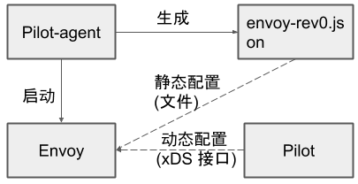
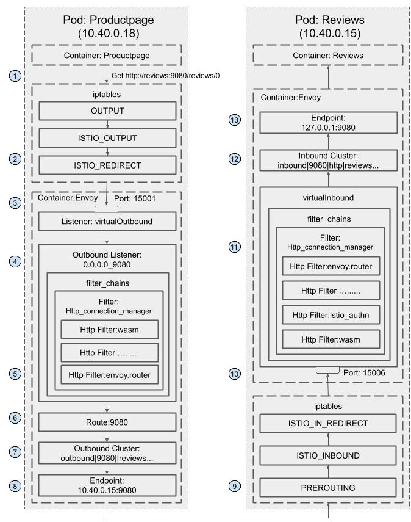

# Sidecar 流量路由机制分析

流量管理是 Istio 服务网格的一项核心能力，Istio 中的很多功能，包括请求路由，负载均衡，灰度发布，流量镜像等，都是依托于其流量管理的能力实现的。在 Istio 服务网格中，Pilot 提供了控制面的流量管理接口，而真正的流量路由则是由数据面的 sidecar 实现的。本节将对 sidecar 的流量路由机制进行分析，以帮助读者理解 Istio 流量管理的实现原理。
> 备注：本节将对大量 Envoy 的配置文件内容进行分析。文中采用了 json 格式来展示 Envoy 的配置， json 本身并不支持注释，但为了向读者解释配置文件中的各部分内容的作用，本文将采用“// 注释...”的格式添加注释进行说明。另外，为了方便阅读，将重点展示配置中和流量路由相关的部分，省略部分内容。建议读者在阅读本节时参考[Github中的完整配置文件](https://github.com/servicemesher/istio-handbook-resources/tree/master/code/concepts/bookinfo-bookinfo-config-dump/)，以助于对本文的理解。

## 基本的概念和术语

为了理解 sidecar 中的流量处理机制，我们需要理解 Envoy 中的一些基本概念。下面介绍了 Envoy 中和流量处理相关的一些术语，如果需要了解更多关于 Envoy 的内容，请参考本书的数据平面章节。

* Host： 能够进行网络通信的实体（如移动设备、服务器上的应用程序）。在此文档中，host 是一个逻辑上的网络应用程序。一个物理硬件上可能运行有多个 host，只要它们是可以独立寻址的。在 EDS 接口中，也使用 “endpoint” 来表示一个应用实例，对应一个 IP + port 的组合。
* Downstream： 下游 host 连接到 Envoy，发送请求并接收响应。
* Upstream： 上游 host 接收来自 Envoy 的连接和请求，并返回响应。
* Listener： 监听器是一个命名网络地址（例如，端口、unix domain socket等)，可以被下游客户端连接。Envoy 中暴露一个或者多个给下游主机连接的监听器。在 Envoy 中,listener 可以绑定到端口上直接对外提供服务，也可以不绑定到端口上，而是接收其他 listener 转发的请求。
* Cluster： 集群是指 Envoy 连接的一组上游主机，集群中的主机是对等的，对外提供相同的服务，这些主机一起组成了一个可以提供负载均衡和高可用的服务集群。Envoy 通过服务发现来发现集群的成员。可以选择通过主动健康检查来确定集群成员的健康状态。Envoy 通过负载均衡策略决定将请求路由到哪个集群成员。

## XDS服务接口

Pilot 通过 xDS 接口向数据面的 sidecar 下发动态配置信息，以对网格中的数据流量进行控制。xDS 中的 DS 意为 discovery service，即发现服务，表示 xDS 接口使用动态发现的方式提供数据面所需的配置数据。而 x 则是一个代词，表示有多种 discovery service。本节不对 xDS 接口展开进行描述，关于 xDS 接口的更多内容参见本书的 xDS 章节部分的介绍。

## Envoy 配置介绍

Envoy 是一个四层/七层代理，其架构非常灵活，采用了插件式的机制来实现各种功能，可以通过配置的方式对其功能进行定制。Envoy 提供了两种配置的方式：通过配置文件向 Envoy 提供静态配置，或者通过 xDS 接口向 Envoy 下发动态配置。在 Istio 中同时采用了这两种方式对 Envoy 的功能进行设置。

### Envoy 初始化配置文件

在 Istio 中，Envoy 的大部分配置都来自于控制面通过 xDS 接口下发的动态配置，包括网格中服务相关的 service cluster, listener, route 规则等。但 Envoy 是如何知道 xDS server 的地址呢？这就是在 Envoy 初始化配置文件中以静态资源的方式配置的。 Sidecar 容器中有一个 pilot-agent 进程，该进程根据启动参数生成 Envoy 的初始配置文件，并采用该配置文件来启动 Envoy 进程。

可以使用下面的命令将productpage pod中该文件导出来查看其中的内容：

```bash
kubectl exec productpage-v1-6d8bc58dd7-ts8kw -c istio-proxy cat /etc/istio/proxy/envoy-rev0.json > envoy-rev0.json
```

该初始化配置文件的结构如下所示：

```json
{
    "node": {...},
    "stats_config": {...},
    "admin": {...},
    "dynamic_resources": {...},
    "static_resources": {...},
    "tracing": {...}
}
```

该配置文件中包含了下面的内容：

* node： 包含了 Envoy 所在节点的相关信息，如节点的 id，节点所属的 Kubernetes 集群，节点的 IP 地址，等等。
* admin： Envoy 的日志路径以及管理端口。
* dynamic_resources： 动态资源,即来自 xDS 服务器下发的配置。
* static_resources： 静态资源，包括预置的一些 listener 和 cluster，例如调用跟踪和指标统计使用到的 listener 和 cluster。
* tracing： 分布式调用追踪的相关配置。

### Envoy 完整配置

从 Envoy 初始化配置文件中，我们可以看出 Istio 中 Envoy sidecar 真正的配置实际上是由两部分组成的。Pilot-agent 在启动 Envoy 时将 xDS server 信息通过静态资源的方式配置到 Envoy 的初始化配置文件中，Envoy 启动后再通过 xDS server 获取网格中的服务信息、路由规则等动态资源。

Envoy 完整配置的生成流程如下图所示：



1. Pilot-agent 根据启动参数生成 Envoy 的初始配置文件 envoy-rev0.json，该文件告诉 Envoy 从指定的 xDS server 中获取动态配置信息，并配置了 xDS server 的地址信息，即控制面的 Pilot 服务器地址。
2. Pilot-agent 使用 envoy-rev0.json 启动 Envoy 进程。
3. Envoy 根据初始配置获得 Pilot 地址，采用 xDS 接口从 Pilot 获取到 listener，cluster，route 等动态配置信息。
4. Envoy 根据获取到的动态配置启动 Listener，并根据 listener 的配置，结合 route  和 cluster  对拦截到的流量进行处理。

可以看到，Envoy 中实际生效的配置是由初始化配置文件中的静态配置和从 Pilot 获取的动态配置一起组成的。因此只对 envoy-rev0 .json 进行分析并不能看到网络中流量管理的全貌。那么有没有办法可以看到 Envoy 中实际生效的完整配置呢？Envoy 提供了相应的管理接口，我们可以采用下面的命令导出  productpage-v1 服务 sidecar 的完整配置。

```bash
kubectl exec -it productpage-v1-6d8bc58dd7-ts8kw -c istio-proxy curl http://127.0.0.1:15000/config_dump > config_dump
```

该配置文件的内容如下：

```json
{
 "configs": [
  {
   "@type": "type.googleapis.com/envoy.admin.v3.BootstrapConfigDump",
   "bootstrap": {},
   "last_updated": "2020-03-11T08:14:03.630Z"
   },
  {
   "@type": "type.googleapis.com/envoy.admin.v3.ClustersConfigDump",
   "version_info": "2020-03-11T08:14:06Z/23",
   "static_clusters": [...],
   "dynamic_active_clusters": [...]
  },
  {
    "@type": "type.googleapis.com/envoy.admin.v3.ListenersConfigDump",
    "version_info": "2020-03-11T08:13:39Z/22",
	"static_listeners": [...],
    "dynamic_listeners": [...]
  },
  {
   "@type": "type.googleapis.com/envoy.admin.v3.RoutesConfigDump",
   "static_route_configs": [...],
   "dynamic_route_configs": [...],
  },
  {
   "@type": "type.googleapis.com/envoy.admin.v3.SecretsConfigDump",
   "dynamic_active_secrets": [...]
   }
 ]
}
```

从导出的文件中可以看到 Envoy 中主要由以下几部分内容组成：

* BootstrapConfigDump： 初始化配置，来自于初始化配置文件中配置的内容。
* ClustersConfigDump： 集群配置，包括对应于外部服务的 outbound cluster 和 自身所在节点服务的 inbound cluster。
* ListenersConfigDump： 监听器配置，包括用于处理对外业务请求的 outbound listener，处理入向业务请求的 inbound listener，以及作为流量处理入口的 virtual listener。
* RoutesConfigDump： 路由配置，用于 HTTP 请求的路由处理。
* SecretsConfigDump： TLS 双向认证相关的配置，包括自身的证书以及用于验证请求方的 CA 根证书。

下面我们对该配置文件中和流量路由相关的配置一一进行详细分析。

#### Bootstrap

从名字可以看出这是 Envoy 的初始化配置，打开该节点，可以看到其中的内容和 envoy-rev0.json 是一致的，这里不再赘述。 需要注意的是在 bootstrap 部分配置的一些内容也会被用于其他部分，例如 clusters 部分就包含了 bootstrap 中定义的一些静态 cluster 资源。

```json
{
 "@type": "type.googleapis.com/envoy.admin.v3.BootstrapConfigDump",
 "bootstrap": {
  "node": {...},
  "stats_config": {...},
  "admin": {...},
  "dynamic_resources": {...},
  "static_resources": {...},
  "tracing": {...}
 },
 "last_updated": "2020-03-11T08:14:03.630Z"
},
```

#### Clusters

这部分配置定义了 Envoy 中所有的 cluster，即服务集群，cluster 中包含一个到多个 endpoint，每个 endpoint 都可以提供服务，Envoy 根据负载均衡算法将请求发送到这些 endpoint 中。

从配置文件结构中可以看到，在 productpage 的 clusters 配置中包含 static_clusters 和 dynamic_active_clusters 两部分，其中 static_clusters 是来自于 envoy-rev0.json 的初始化配置中的 prometheus_stats、xDS server、zipkin server 信息。dynamic_active_clusters 是 Envoy 通过 xDS 接口从 Istio 控制面获取的服务信息。

其中 dynamic cluster 又分为以下几类：

##### Outbound Cluster

这部分的 cluster  占了绝大多数，该类 cluster  对应于 Envoy 所在节点的外部服务。以 reviews 为例，对于 productpage 来说,reviews 是一个外部服务，因此其 cluster  名称中包含 outbound 字样。

从 reviews 服务对应的 cluster 配置中可以看到，其类型为 EDS，即表示该 cluster  的 endpoint 来自于动态发现，动态发现中 eds_config 则指向了ads，最终指向 static resource 中配置的 xds-grpc cluster ,即 Pilot 的地址。

```json
{
 "version_info": "2020-03-11T08:13:39Z/22",
 "cluster": {
  "@type": "type.googleapis.com/envoy.api.v2.Cluster",
  "name": "outbound|9080||reviews.default.svc.cluster.local",
  "type": "EDS",
  "eds_cluster_config": {
   "eds_config": {
    "ads": {}
   },
   "service_name": "outbound|9080||reviews.default.svc.cluster.local"
  },
  "connect_timeout": "1s",
  "circuit_breakers": {},
  "filters": [],
  "transport_socket_matches": []
 },
 "last_updated": "2020-03-11T08:14:04.664Z"
}
```

可以通过Pilot的调试接口获取该 cluster 的 endpoint：

```bash
curl http://10.97.222.108:15014/debug/edsz > pilot_eds_dump
```

从导出的文件内容可以看到，reviews cluster 配置了3个 endpoint 地址，是 reviews 的 pod ip。

```json
{
  "clusterName": "outbound|9080||reviews.default.svc.cluster.local",
  "endpoints": [
    {
      "lbEndpoints": [
        {
          "endpoint": {
            "address": {
              "socketAddress": {
                "address": "10.40.0.15",
                "portValue": 9080
              }
            }
          },
          "metadata": {},
          "loadBalancingWeight": 1
        },
        {
          "endpoint": {
            "address": {
              "socketAddress": {
                "address": "10.40.0.16",
                "portValue": 9080
              }
            }
          },
          "metadata": {},
          "loadBalancingWeight": 1
        },
        {
          "endpoint": {
            "address": {
              "socketAddress": {
                "address": "10.40.0.17",
                "portValue": 9080
              }
            }
          },
          "metadata": {},
          "loadBalancingWeight": 1
        }
      ],
      "loadBalancingWeight": 3
    }
  ]
}
```

##### Inbound Cluster

对于 Envoy 来说，inbound cluster 对应于入向请求的 upstream 集群， 即 Envoy 自身所在节点的服务。对于 productpage Pod 上的 Envoy，其对应的 Inbound cluster 只有一个，即 productpage。该 cluster 对应的 host 为127.0.0.1,即环回地址上 productpage 的监听端口。由于 iptable 规则中排除了127.0.0.1,入站请求通过该 Inbound cluster 处理后将跳过 Envoy，直接发送给 productpage 进程处理。

```json
{
 "version_info": "2020-03-11T08:13:39Z/22",
 "cluster": {
  "@type": "type.googleapis.com/envoy.api.v2.Cluster",
  "name": "inbound|9080|http|productpage.default.svc.cluster.local",
  "type": "STATIC",
  "connect_timeout": "1s",
  "circuit_breakers": {
   "thresholds": []
  },
  "load_assignment": {
   "cluster_name": "inbound|9080|http|productpage.default.svc.cluster.local",
   "endpoints": [
    {
     "lb_endpoints": [
      {
       "endpoint": {
        "address": {
         "socket_address": {
          "address": "127.0.0.1",
          "port_value": 9080
         }
        }
       }
      }
     ]
    }
   ]
  }
 },
 "last_updated": "2020-03-11T08:14:04.684Z"
}
```

##### BlackHoleCluster

这是一个特殊的 cluster ，其中并没有配置后端处理请求的 host。如其名字所表明的一样，请求进入该 cluster 后如同进入了一个黑洞，将被丢弃掉，而不是发向一个 upstream host。 

```json
{
     "version_info": "2020-03-11T08:13:39Z/22",
     "cluster": {
      "@type": "type.googleapis.com/envoy.api.v2.Cluster",
      "name": "BlackHoleCluster",
      "type": "STATIC",
      "connect_timeout": "1s",
      "filters": []
     },
     "last_updated": "2020-03-11T08:14:04.665Z"
```

##### PassthroughCluster

该 cluster 的 type 被设置为 ORIGINAL_DST 类型， 表明任何发向该 cluster 的请求都会被直接发送到其请求中的原始目地的，Envoy 不会对请求进行重新路由，

```json
{
 "version_info": "2020-03-11T08:13:39Z/22",
 "cluster": {
  "@type": "type.googleapis.com/envoy.api.v2.Cluster",
  "name": "PassthroughCluster",
  "type": "ORIGINAL_DST",
  "connect_timeout": "1s",
  "lb_policy": "CLUSTER_PROVIDED",
  "circuit_breakers": {
   "thresholds": []
  },
  "filters": []
 },
 "last_updated": "2020-03-11T08:14:04.666Z"
}
```

#### Listeners

Envoy 采用 listener 来接收并处理 downstream 发过来的请求，listener 采用了插件式的架构，可以通过配置不同的 filter 在 listener 中插入不同的处理逻辑。

Listener 可以绑定到 IP Socket 或者 Unix Domain Socket 上，以接收来自客户端的请求;也可以不绑定，而是接收从其他 listener 转发来的数据。Istio 利用了 Envoy listener 的这一特点，通过 VirtualOutboundListener 在一个端口接收所有出向请求，然后再按照请求的端口分别转发给不同的 listener 分别处理。

##### VirtualOutbound Listener

Istio 在 Envoy 中配置了一个在15001端口监听的虚拟入口监听器。Iptable 规则将 Envoy 所在 pod 的对外请求拦截后发向本地的15001端口，该监听器接收后并不进行业务处理，而是根据请求的目的端口分发给其他监听器处理。这就是该监听器取名为 "virtual”（虚拟）监听器的原因。

Envoy 是如何做到按请求的目的端口进行分发的呢？ 从下面 VirtualOutbound listener 的配置中可以看到 use_original_dest 属性被设置为 true, 这表示该监听器在接收到来自 downstream 的请求后，会将请求转交给匹配该请求原目的地址的 listener （即名字格式为 0.0.0.0_请求目的端口 的 listener）进行处理。

如果在 Enovy 的配置中找不到匹配请求目的端口的 listener，则将会根据 Istio 的 outboundTrafficPolicy 全局配置选项进行处理。存在两种情况：

* 如果 outboundTrafficPolicy 设置为 ALLOW_ANY：这表明网格允许发向任何外部服务的请求，无论该服务是否在 Pilot 的服务注册表中。在该策略下，Pilot 将会在下发给 Enovy 的 VirtualOutbound listener 加入一个 upstream cluster 为PassthroughCluster 的 TCP proxy filter，找不到匹配端口 listener 的请求会被该 TCP proxy filter 处理，请求将会被发送到其IP头中的原始目的地地址。
* 如果 outboundTrafficPolicy 设置为 REGISTRY_ONLY：只允许发向 Pilot 服务注册表中存在的服务的对外请求。在该策略下，Pilot 将会在下发给 Enovy 的 VirtualOutbound listener 加入一个 upstream cluster 为 BlackHoleCluster 的 TCP proxy filter，找不到匹配端口 listene r的请求会被该 TCP proxy filter 处理，由于 BlackHoleCluster 中没有配置 upstteam host，请求实际上会被丢弃。

下图是 bookinfo 例子中 productpage 服务中 Enovy Proxy 的 Virutal Outbound Listener 配置。由于 outboundTrafficPolicy 的默认配置为 ALLOW_ANY，因此 listener 的 filterchain 中第二个 filter chain 中是一个 upstream cluster 为 PassthroughCluster 的 TCP proxy filter。注意该 filter 没有 filter_chain_match 匹配条件，因此如果进入该 listener 的请求在配置中找不到匹配其目的端口的 listener，就会缺省进入该 filter 进行处理。

filterchain 中的第一个 filter chain 中是一个 upstream cluster 为 BlackHoleCluster 的 TCP proxy filter，该 filter 设置了 filter_chain_match 匹配条件，只有发向 10.40.0.18 这个 IP 的出向请求才会进入该 filter 处理。10.40.0.18 是 productpage 服务自身的IP地址。该 filter 的目的是为了防止服务向自己发送请求可能导致的死循环。

```json
{
 "name": "virtualOutbound",
 "active_state": {
  "version_info": "2020-03-11T08:13:39Z/22",
  "listener": {
   "@type": "type.googleapis.com/envoy.api.v2.Listener",
   "name": "virtualOutbound",
   "address": {
    "socket_address": {
     "address": "0.0.0.0",
     "port_value": 15001
    }
   },
   "filter_chains": [
    {
     "filter_chain_match": {
      "prefix_ranges": [
       {
        "address_prefix": "10.40.0.18",
        "prefix_len": 32
       }
      ]
     },
     "filters": [
      {
       "name": "envoy.tcp_proxy",
       "typed_config": {
        "@type": "type.googleapis.com/envoy.config.filter.network.tcp_proxy.v2.TcpProxy",
        "stat_prefix": "BlackHoleCluster",
        "cluster": "BlackHoleCluster"
       }
      }
     ]
    },
    {
     "filters": [
      {
       "name": "envoy.tcp_proxy",
       "typed_config": {
        "@type": "type.googleapis.com/envoy.config.filter.network.tcp_proxy.v2.TcpProxy",
        "stat_prefix": "PassthroughCluster",
        "cluster": "PassthroughCluster",
        "access_log": []
    }
   ],
   "use_original_dst": true,
   "traffic_direction": "OUTBOUND"
  },
  "last_updated": "2020-03-11T08:14:04.929Z"
 }
},
```

##### Outbound Listener

Envoy 为网格中的外部服务按端口创建多个 Outbound listener，以用于处理出向请求。bookinfo 示例程序中使用了9080作为微服务的业务端口，因此我们这里主要分析9080这个业务端口的 listenrer。和其他所有 Outbound listener 一样，该 listener 配置了"bind_to_port”: false 属性，因此该 listener 没有被绑定到 tcp 端口上，其接收到的所有请求都转发自15001端口的 Virtual listener。

该listener 的名称为0.0.0.0_9080,因此会匹配发向任意 IP 的9080端口的请求，bookinfo 程序中的 productpage,revirews,ratings,details 四个服务都使用了9080端口，那么 Envoy 如何区别处理这四个服务呢？
> 备注： 根据业务逻辑，实际上 productpage 并不会调用 ratings 服务，但 Istio 并不知道各个业务之间会如何调用，因此将所有的服务信息都下发到了 Envoy 中。这样做对 Envoy 的内存占用和效率有一定影响，如果希望去掉 Envoy 配置中的无用数据，可以通过 sidecar CRD 对 Envoy 的 ingress 和 egress service 配置进行调整。


首先，iptables 拦截到 productpage 向外发出的 HTTP 请求，并转发到同一 pod 中的 Envoy sidecar 监听的 15001 virtualOutbound listener 进行处理。 Envoy 根据目的端口匹配到0.0.0.0_9080这个 Outbound listener，并转交给该 listener。

如下面的配置所示，当0.0.0.0_9080接收到出向请求后，并不会直接发送到一个 downstream cluster，而是配置了一个路由规则9080，在该路由规则中会根据不同的请求目的地对请求进行处理。

```json
{
 "name": "0.0.0.0_9080",
 "active_state": {
  "version_info": "2020-03-11T08:13:39Z/22",
  "listener": {
   "@type": "type.googleapis.com/envoy.api.v2.Listener",
   "name": "0.0.0.0_9080",
   "address": {
    "socket_address": {
     "address": "0.0.0.0",
     "port_value": 9080
    }
   },
   "filter_chains": [
    {
     "filters": [
      {
       "name": "envoy.http_connection_manager",
       "typed_config": {
        "@type": "type.googleapis.com/envoy.config.filter.network.http_connection_manager.v2.HttpConnectionManager",
        "stat_prefix": "outbound_0.0.0.0_9080",
        "rds": {
         "config_source": {
          "ads": {}
         },
         "route_config_name": "9080"
        },
        ...
       }
      }
     ]
    }
   ],
   "deprecated_v1": {
    "bind_to_port": false
   },
   "traffic_direction": "OUTBOUND"
  },
  "last_updated": "2020-03-11T08:14:04.927Z"
 }
}
```

##### VirtualInbound Listener

在较早的版本中，Istio 采用同一个 VirtualListener 在端口15001上同时处理入向和出向的请求。该方案存在一些潜在的问题，例如可能会导致出现死循环，参见[这个PR](https://github.com/istio/istio/pull/15713)。在1.4版本之后，Istio 为 Envoy 单独创建了 一个VirtualInboundListener，在15006端口监听入向请求，原来的15001端口只用于处理出向请求。

另外一个变化是当 VirtualInboundListener 接收到请求后，将直接在 VirtualInboundListener 采用一系列 filterChain 对入向请求进行处理，而不是像 VirtualOutboundListene 一样分发给其它独立的 listener 进行处理。

这样修改后，Envoy 配置中入向和出向的请求处理流程被完全拆分开，请求处理流程更为清晰，可以避免由于配置导致的一些潜在错误。

下图是 bookinfo 例子中 reviews 服务中 Enovy Proxy 的 VirutalInbound listener 配置。 在配置中采用注释标注了各个不同作用的 filter chain。

```json
{
 "name": "virtualInbound",
 "active_state": {
  "version_info": "2020-03-11T08:13:14Z/21",
  "listener": {
   "@type": "type.googleapis.com/envoy.api.v2.Listener",
   "name": "virtualInbound",
   "address": {
    "socket_address": {
     "address": "0.0.0.0",
     "port_value": 15006
    }
   },
   "filter_chains": [
     {...} //passthrough，启用tls
	 {...} //passthrough,未启用tls
	 {...} //处理发向15020端口的监控检查
	 {...} //9080业务端口，启用tls
	 {...} //9080业务端口，未启用tls
   ],
   "listener_filters": [
    {
     "name": "envoy.listener.original_dst"
    },
    {
     "name": "envoy.listener.tls_inspector"
    }
   ],
   "listener_filters_timeout": "1s",
   "traffic_direction": "INBOUND",
   "continue_on_listener_filters_timeout": true
  },
  "last_updated": "2020-03-11T08:13:39.372Z"
 }
}
```

如该配置所示，reviews 服务中一共配置了5个 filter chain，其中最后两个 filter chain 用于业务处理，一个用于处理 HTTPS 请求；一个用于处理 plain HTTP 请求。

除了 TLS 相关的配置以外，这两个业务处理的 filter chain 的处理逻辑是相同的。 我们打开 HTTPS filter chain，以查看其内部的内容：

```json
{
 "filter_chain_match": {
  "prefix_ranges": [
   {
    "address_prefix": "10.40.0.15",
    "prefix_len": 32
   }
  ],
  "destination_port": 9080,
  "application_protocols": [
   "istio-peer-exchange",
   "istio",
   "istio-http/1.0",
   "istio-http/1.1",
   "istio-h2"
  ]
 },
 "filters": [
  {
   "name": "envoy.filters.network.metadata_exchange",
   "config": {
    "protocol": "istio-peer-exchange"
   }
  },
  {
   "name": "envoy.http_connection_manager",
   "typed_config": {
    "@type": "type.googleapis.com/envoy.config.filter.network.http_connection_manager.v2.HttpConnectionManager",
    "stat_prefix": "inbound_10.40.0.15_9080",
    "route_config": {
     "name": "inbound|9080|http|reviews.default.svc.cluster.local",
     "virtual_hosts": [
      {
       "name": "inbound|http|9080",
       "domains": [
        "*"
       ],
       "routes": [
        {
         "match": {
          "prefix": "/"
         },
         "route": {
          "cluster": "inbound|9080|http|reviews.default.svc.cluster.local",
          "timeout": "0s",
          "max_grpc_timeout": "0s"
         },
         "decorator": {
          "operation": "reviews.default.svc.cluster.local:9080/*"
         },
         "name": "default"
        }
       ]
      }
     ],
     "validate_clusters": false
    },
    "http_filters": [
     {
      "name": "envoy.filters.http.wasm",
      ......
     },
     {
      "name": "istio_authn",
      ......
     },
     {
      "name": "envoy.cors"
     },
     {
      "name": "envoy.fault"
     },
     {
      "name": "envoy.filters.http.wasm",
      ......
     {
      "name": "envoy.router"
     }
    ],
    "tracing": {
     ......
    },
    "server_name": "istio-envoy",
    ......
   }
  }
 ],
 },
 "transport_socket": {
  "name": "envoy.transport_sockets.tls",
  "typed_config": {
   "@type": "type.googleapis.com/envoy.api.v2.auth.DownstreamTlsContext",
   "common_tls_context": {
    "alpn_protocols": [
     "istio-peer-exchange",
     "h2",
     "http/1.1"
    ],
    "tls_certificate_sds_secret_configs": [
     {
      "name": "default",
      "sds_config": {
       "api_config_source": {
        "api_type": "GRPC",
        "grpc_services": [
         {
          "envoy_grpc": {
           "cluster_name": "sds-grpc"
          }
         }
        ]
       }
      }
     }
    ],
    "combined_validation_context": {
     "default_validation_context": {},
     "validation_context_sds_secret_config": {
      "name": "ROOTCA",
      "sds_config": {
       "api_config_source": {
        "api_type": "GRPC",
        "grpc_services": [
         {
          "envoy_grpc": {
           "cluster_name": "sds-grpc"
          }
         }
        ]
       }
      }
     }
    }
   },
   "require_client_certificate": true
  }
 }
}
```

该 filterchain 配置了一个 http_connection_manager filter，http_connection_manager 中又配置了 wasm、istio_authn、envoy.router等 http filter，Istio 中提供的一些基础能力，例如安全认证、指标收集、请求限流等，就是通过这些 filter 实现的。请求经过这些 HTTP filter 处理后，最终被转发给 "inbound|9080|http|reviews.default.svc.cluster.local" 这个 Inbound cluster，该 Inbound cluster  中配置的 Upstream 为127.0.0.1:9080，因此该请求将发送到和 sidecar 同一个 pod 上的 reviews 服务的9080端口上进行业务处理。

在 transport_socket 部分配置的是 tls 双向认证所需的证书信息，从配置中可以得知，Envoy 将通过 SDS （Secret Discovery Service） 获取自身的服务器证书和验证客户端证书所需的根证书。

如果一个入向访问的目的端口不能匹配到业务服务的 filterchain，则会进入到 passthrough 的 filter chain 进行处理，该 filter chain 对应的 cluster 为 InboundPassthroughClusterIpv4，结合 iptables 规则， 该 cluster 将会把请求转发到其本地的原始目的端口处理。

#### Routes

这部分配置是 Envoy 的 HTTP 路由规则。在前面 listener 的分析中，我们看到 Outbound listener 是以端口为最小粒度来进行处理的，而不同的服务可能采用了相同的端口，因此需要通过 Route 来进一步对发向同一目的端口的不同服务的请求进行区分和处理。Istio  在下发给 sidecar 的缺省路由规则中为每个端口设置了一个路由规则，然后再根据 host 来对请求进行路由分发。

下面是 proudctpage 服务中 9080 的路由配置，从文件中可以看到对应了5个 virtual host，分别是 details、productpage、ratings、reviews 和 allow_any，前三个 virtual host 分别对应到不同服务的 [outbound cluster](#outbound-cluster)。最后一个对应到 [PassthroughCluster](#passthroughcluster),即当入向的请求没有找到对应的服务时，也会让其直接通过。

```json
{
 "version_info": "2020-03-11T08:13:39Z/22",
 "route_config": {
  "@type": "type.googleapis.com/envoy.api.v2.RouteConfiguration",
  "name": "9080",
  "virtual_hosts": [
   {
    "name": "allow_any",
    "domains": [
     "*"
    ],
    "routes": [
     {
      "match": {
       "prefix": "/"
      },
      "route": {
       "cluster": "PassthroughCluster",
       "timeout": "0s"
      }
     }
    ]
   },
   {
    "name": "details.default.svc.cluster.local:9080",
    "domains": [
     "details.default.svc.cluster.local",
     "details.default.svc.cluster.local:9080",
     "details",
     "details:9080",
     "details.default.svc.cluster",
     "details.default.svc.cluster:9080",
     "details.default.svc",
     "details.default.svc:9080",
     "details.default",
     "details.default:9080",
     "10.96.60.140",
     "10.96.60.140:9080"
    ],
    "routes": [
     {
      "match": {
       "prefix": "/"
      },
      "route": {
       "cluster": "outbound|9080||details.default.svc.cluster.local",
       "timeout": "0s",
       "retry_policy": {
        "retry_on": "connect-failure,refused-stream,unavailable,cancelled,resource-exhausted,retriable-status-codes",
        "num_retries": 2,
        "retry_host_predicate": [
         {
          "name": "envoy.retry_host_predicates.previous_hosts"
         }
        ],
        "host_selection_retry_max_attempts": "5",
        "retriable_status_codes": [
         503
        ]
       },
       "max_grpc_timeout": "0s"
      },
      "decorator": {
       "operation": "details.default.svc.cluster.local:9080/*"
      },
      "name": "default"
     }
    ]
   },
   {
    "name": "productpage.default.svc.cluster.local:9080",
    "domains": [
     "productpage.default.svc.cluster.local",
     ......
    ],
    "routes": [
     {
      "match": {
       "prefix": "/"
      },
      "route": {
       "cluster": "outbound|9080||productpage.default.svc.cluster.local",
       ......
    ]
   },
   {
    "name": "ratings.default.svc.cluster.local:9080",
    "domains": [
     "ratings.default.svc.cluster.local",
     ......
    ],
    "routes": [
     {
      "match": {
       "prefix": "/"
      },
      "route": {
       "cluster": "outbound|9080||ratings.default.svc.cluster.local",
       ......
    ]
   },
   {
    "name": "reviews.default.svc.cluster.local:9080",
    "domains": [
     "reviews.default.svc.cluster.local",
     ......
    ],
    "routes": [
     {
      "match": {
       "prefix": "/"
      },
      "route": {
       "cluster": "outbound|9080||reviews.default.svc.cluster.local",
       ......
},
```

## Bookinfo 端到端调用分析

通过前面对 Envoy 配置文件的分析，我们对 Envoy 上生成的各种配置数据的结构，包括 listener、cluster、route 和 endpoint 有了一定的了解。那么这些配置是如何有机地结合在一起，以对经过网格中的流量进行路由的呢？

下面我们通过 bookinfo 示例程序中一个端到端的调用请求把这些相关的配置串连起来，使用该完整的调用流程来帮助理解 Istio 控制面的流量控制能力是如何在数据面的 Envoy 上实现的。

下图描述了 bookinfo 示例程序中 productpage 服务调用 reviews 服务的请求流程：


1. Productpage 发起对 reviews 服务的调用：`http://reviews:9080/reviews/0` 。
2. 请求被 productpage Pod 的 iptable 规则拦截，重定向到本地的15001端口。
3. 在15001端口上监听的 VirtualOutbound listener 收到了该请求。
4. 请求被 VirtualOutbound listener 根据原目标 IP（通配）和端口（9080）转发到0.0.0.0_9080这个 outbound listener。
```json
{
 "name": "virtualOutbound",
 "active_state": {
  "version_info": "2020-03-11T08:13:39Z/22",
  "listener": {
   "@type": "type.googleapis.com/envoy.api.v2.Listener",
   "name": "virtualOutbound",
   "address": {
    "socket_address": {
     "address": "0.0.0.0",
     "port_value": 15001
    }
   },
   ......
   
   "use_original_dst": true,
   "traffic_direction": "OUTBOUND"
  },
  "last_updated": "2020-03-11T08:14:04.929Z"
}
```
5. 根据0.0.0.0_9080 listener 的 http_connection_manager filte r配置,该请求采用“9080” route 进行分发。
```json
{
     "name": "0.0.0.0_9080",
     "active_state": {
      "version_info": "2020-03-11T08:13:39Z/22",
      "listener": {
       "@type": "type.googleapis.com/envoy.api.v2.Listener",
       "name": "0.0.0.0_9080",
       "address": {
        "socket_address": {
         "address": "0.0.0.0",
         "port_value": 9080
        }
       },
       "filter_chains": [
       ......
	   {
         "filters": [
          {
           "name": "envoy.http_connection_manager",
           "typed_config": {
            "@type": "type.googleapis.com/envoy.config.filter.network.http_connection_manager.v2.HttpConnectionManager",
            "stat_prefix": "outbound_0.0.0.0_9080",
            "rds": {
             "config_source": {
              "ads": {}
             },
             "route_config_name": "9080"
            },
            "http_filters": [
             {
              "name": "envoy.filters.http.wasm",
              ......
             },
             {
              "name": "istio.alpn",
              ......
             },
             {
              "name": "envoy.cors"
             },
             {
              "name": "envoy.fault"
             },
             {
              "name": "envoy.filters.http.wasm",
              ......
             },
             {
              "name": "envoy.router"
             }
            ],
            "tracing": {
             "client_sampling": {
              "value": 100
             },
             "random_sampling": {
              "value": 100
             },
             "overall_sampling": {
              "value": 100
             }
            },
            ......           
           }
          }
         ]
        }
       ],
       "deprecated_v1": {
        "bind_to_port": false
       },
       "traffic_direction": "OUTBOUND"
      },
      "last_updated": "2020-03-11T08:14:04.927Z"
     }
    },
```
6. “9080”这个 route 的配置中，host name 为 reviews:9080的请求对应的 cluster 为outbound|9080||reviews.default.svc.cluster.local。
```json
{
 "version_info": "2020-03-11T08:13:39Z/22",
 "route_config": {
  "@type": "type.googleapis.com/envoy.api.v2.RouteConfiguration",
  "name": "9080",
  "virtual_hosts": [
   ......
    "name": "ratings.default.svc.cluster.local:9080",
    "domains": [
     "ratings.default.svc.cluster.local",
     "ratings.default.svc.cluster.local:9080",
     "ratings",
     "ratings:9080",
     "ratings.default.svc.cluster",
     "ratings.default.svc.cluster:9080",
     "ratings.default.svc",
     "ratings.default.svc:9080",
     "ratings.default",
     "ratings.default:9080",
     "10.102.90.243",
     "10.102.90.243:9080"
    ],
    "routes": [
     {
      "match": {
       "prefix": "/"
      },
      "route": {
       "cluster": "outbound|9080||ratings.default.svc.cluster.local",
       "timeout": "0s",
       "retry_policy": {
        "retry_on": "connect-failure,refused-stream,unavailable,cancelled,resource-exhausted,retriable-status-codes",
        "num_retries": 2,
        "retry_host_predicate": [
         {
          "name": "envoy.retry_host_predicates.previous_hosts"
         }
        ],
        "host_selection_retry_max_attempts": "5",
        "retriable_status_codes": [
         503
        ]
       },
       "max_grpc_timeout": "0s"
      },
      "decorator": {
       "operation": "ratings.default.svc.cluster.local:9080/*"
      },
      "name": "default"
     }
    ]
   },
   {
    "name": "reviews.default.svc.cluster.local:9080",
    "domains": [
     "reviews.default.svc.cluster.local",
     "reviews.default.svc.cluster.local:9080",
     "reviews",
     "reviews:9080",
     "reviews.default.svc.cluster",
     "reviews.default.svc.cluster:9080",
     "reviews.default.svc",
     "reviews.default.svc:9080",
     "reviews.default",
     "reviews.default:9080",
     "10.107.156.4",
     "10.107.156.4:9080"
    ],
    "routes": [
     {
      "match": {
       "prefix": "/"
      },
      "route": {
       "cluster": "outbound|9080||reviews.default.svc.cluster.local",
       "timeout": "0s",
       "retry_policy": {
        "retry_on": "connect-failure,refused-stream,unavailable,cancelled,resource-exhausted,retriable-status-codes",
        "num_retries": 2,
        "retry_host_predicate": [
         {
          "name": "envoy.retry_host_predicates.previous_hosts"
         }
        ],
        "host_selection_retry_max_attempts": "5",
        "retriable_status_codes": [
         503
        ]
       },
       "max_grpc_timeout": "0s"
      },
      "decorator": {
       "operation": "reviews.default.svc.cluster.local:9080/*"
      },
      "name": "default"
     }
    ]
   }
  ],
  "validate_clusters": false
 },
 "last_updated": "2020-03-11T08:14:04.971Z"
}
```
7. outbound|9080||reviews.default.svc.cluster.local cluster 为动态资源，通过 eds 查询得到该 cluster 中有3个 endpoint。
```json
{
  "clusterName": "outbound|9080||reviews.default.svc.cluster.local",
  "endpoints": [
    {
      "lbEndpoints": [
        {
          "endpoint": {
            "address": {
              "socketAddress": {
                "address": "10.40.0.15",
                "portValue": 9080
              }
            }
          },
          "metadata": {},
          "loadBalancingWeight": 1
        },
        {
          "endpoint": {
            "address": {
              "socketAddress": {
                "address": "10.40.0.16",
                "portValue": 9080
              }
            }
          },
          "metadata": {},
          "loadBalancingWeight": 1
        },
        {
          "endpoint": {
            "address": {
              "socketAddress": {
                "address": "10.40.0.17",
                "portValue": 9080
              }
            }
          },
          "metadata": {},
          "loadBalancingWeight": 1
        }
      ],
      "loadBalancingWeight": 3
    }
  ]
}
```
8. 请求被转发到其中一个 endpoint 10.40.0.15，即 Reviews-v1 所在的 Pod。
9. 然后该请求被 iptable 规则拦截，重定向到本地的15006端口。
10. 在15006端口上监听的 VirtualInbound listener 收到了该请求。
11. 根据匹配条件，请求被 VirtualInbound listener 内部配置的 Http connection manager filter 处理，该 filter 设置的路由配置为将其发送给 inbound|9080|http|reviews.default.svc.cluster.local 这个 inbound cluster。
```json
{
 "name": "virtualInbound",
 "active_state": {
  "version_info": "2020-03-11T08:13:14Z/21",
  "listener": {
   "@type": "type.googleapis.com/envoy.api.v2.Listener",
   "name": "virtualInbound",
   "address": {
    "socket_address": {
     "address": "0.0.0.0",
     "port_value": 15006
    }
   },
   "filter_chains": [
    {
     "filter_chain_match": {
      "prefix_ranges": [
       {
        "address_prefix": "10.40.0.15",
        "prefix_len": 32
       }
      ],
      "destination_port": 9080,
      "application_protocols": [
       "istio-peer-exchange",
       "istio",
       "istio-http/1.0",
       "istio-http/1.1",
       "istio-h2"
      ]
     },
     "filters": [
      {
       "name": "envoy.filters.network.metadata_exchange",
       "config": {
        "protocol": "istio-peer-exchange"
       }
      },
      {
       "name": "envoy.http_connection_manager",
       "typed_config": {
        "@type": "type.googleapis.com/envoy.config.filter.network.http_connection_manager.v2.HttpConnectionManager",
        "stat_prefix": "inbound_10.40.0.15_9080",
        "route_config": {
         "name": "inbound|9080|http|reviews.default.svc.cluster.local",
         "virtual_hosts": [
          {
           "name": "inbound|http|9080",
           "domains": [
            "*"
           ],
           "routes": [
            {
             "match": {
              "prefix": "/"
             },
             "route": {
              "cluster": "inbound|9080|http|reviews.default.svc.cluster.local",
              "timeout": "0s",
              "max_grpc_timeout": "0s"
             },
             "decorator": {
              "operation": "reviews.default.svc.cluster.local:9080/*"
             },
             "name": "default"
            }
           ]
          }
         ],
         "validate_clusters": false
        },
        "http_filters": [
         {
          "name": "envoy.filters.http.wasm",
          ......
         },
         {
          "name": "istio_authn",
          ......
         },
         {
          "name": "envoy.cors"
         },
         {
          "name": "envoy.fault"
         },
         {
          "name": "envoy.filters.http.wasm",
          ......
         },
         {
          "name": "envoy.router"
         }
        ],
        ......
       }
      }
     ],
     "metadata": {...},
     "transport_socket": {...}
   ],
   ......
 }
}
```
12. inbound|9080|http|reviews.default.svc.cluster.local cluster 配置的 host 为127.0.0.1：9080。
```json
{
 "version_info": "2020-03-11T08:13:14Z/21",
 "cluster": {
  "@type": "type.googleapis.com/envoy.api.v2.Cluster",
  "name": "inbound|9080|http|reviews.default.svc.cluster.local",
  "type": "STATIC",
  "connect_timeout": "1s",
  "circuit_breakers": {
   "thresholds": [
    {
     "max_connections": 4294967295,
     "max_pending_requests": 4294967295,
     "max_requests": 4294967295,
     "max_retries": 4294967295
    }
   ]
  },
  "load_assignment": {
   "cluster_name": "inbound|9080|http|reviews.default.svc.cluster.local",
   "endpoints": [
    {
     "lb_endpoints": [
      {
       "endpoint": {
        "address": {
         "socket_address": {
          "address": "127.0.0.1",
          "port_value": 9080
         }
        }
       }
      }
     ]
    }
   ]
  }
 },
 "last_updated": "2020-03-11T08:13:39.118Z"
}
```
13. 请求被转发到127.0.0.1：9080，即 reviews 服务进行业务处理。

# 小结
 
本节介绍了 Istio 中 sidecar 内部配置的数据结构和内容，并通过 bookinfo 示例程序的一个端到端调用分析了 Envoy 是 如何实现服务网格中的流量路由的。虽然文中未涉及按照版本对请求路由、流量镜像、故障注入、熔断等高级流量管理功能，但读者也可以参考本节介绍的方法对这些功能进行分析，以透过表面的概念更进一步深入理解 Istio 流量管理的实现机制。