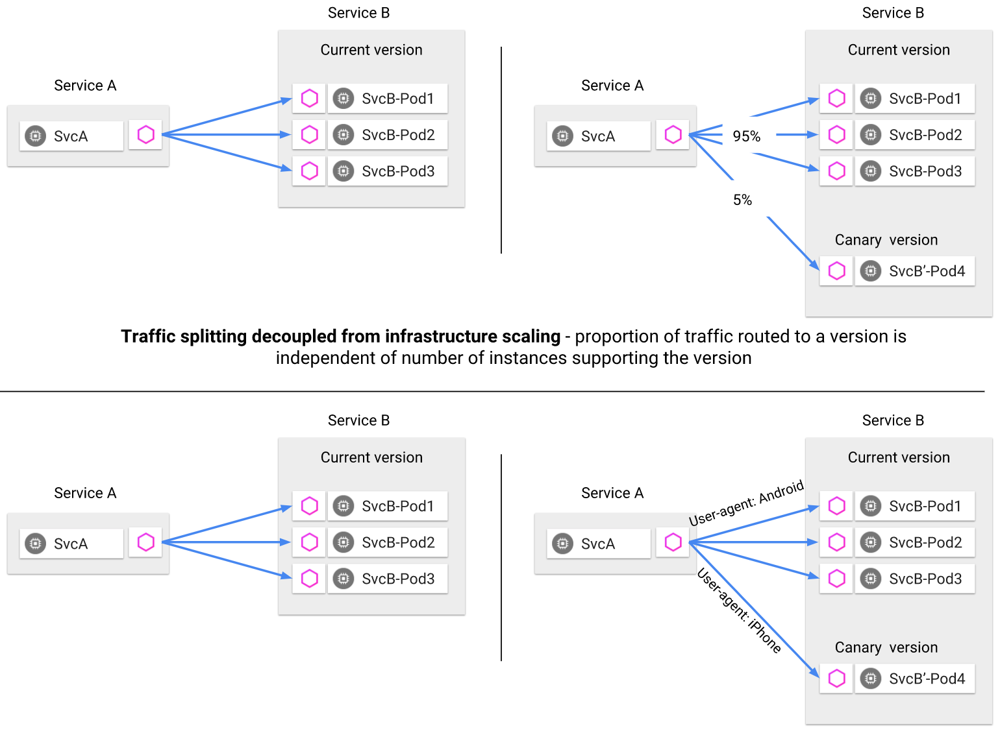
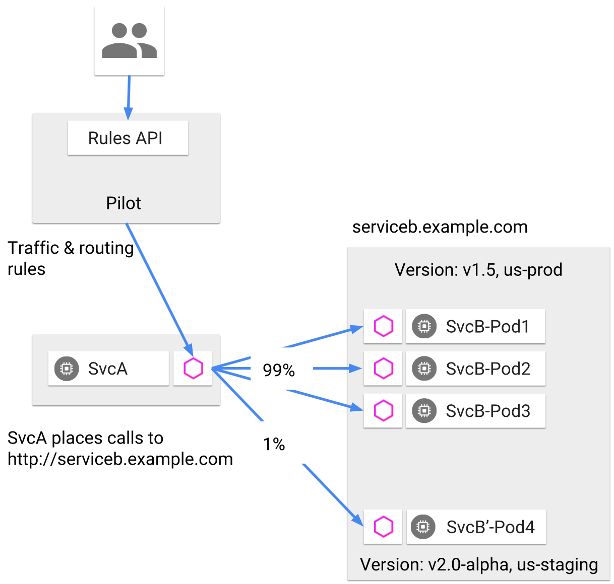
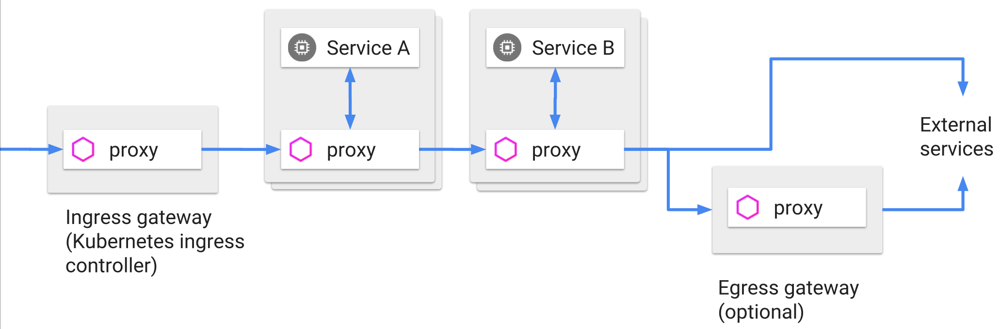

# 流量控制

微服务应用最大的痛点就是处理服务间的通信，而这一问题的核心其实就是流量管理。首先我们来看看传统的微服务应用在没有服务网格介入的情况下，是如何完成诸如金丝雀发布这样的动态路由。我们假设不借助任何现成的第三方框架，用一个最简单的实现方法：就是在服务间添加一个负载均衡（比如Nginx）做代理，通过修改配置的权重来分配流量。这种方式使得对流量的管理和基础设施（云服务器、虚拟机、实体机等）绑定在了一起，难以维护。

而使用Istio就可以轻松的实现各种维度的流量控制。下图展示了两种不同的金丝雀发布策略。第一种是根据权重把5%的流量路由给新版本；第二种是根据请求的头信息User-Agent把使用iPhone的用户流量路由到新版本。

总得来说，Istio中的流量控制功能主要分为三个方面：

- 请求路由和流量转移
- 弹性功能，包括熔断、超时、重试
- 调试能力，包括故障注入和流量镜像

下面我们来具体了解一下Istio在这三方面的能力。

## 路由和流量转移

Istio为了控制服务请求，引入了服务版本（version）的概念，可以通过版本这一标签将服务进行区分。版本的设置是非常灵活的，可以根据服务的迭代编号进行定义（如v1、v2版本）；也可以根据部署环境进行定义（比如dev、staging、production）；或者是自定义的任何用于区分服务的某种标记。通过版本标签，Istio就可以定义灵活的路由规则来控制流量，上面提到的金丝雀发布这类应用场景就很容易实现了。

下图展示了使用服务版本实现路由分配的例子。服务版本定义了版本号（v1.5、v2.0-alpha）和环境（us-prod、us-staging）两种信息。服务B包含了4个Pod，其中3个是部署在生产环境的v1.5版本，而Pod4是部署在预生产环境的v2.0-alpha版本。运维人员可以根据服务版本来指定路由规则，使99%的流量流向v1.5版本，而1%的流量进入v2.0-alpha版本。

除了上面介绍的控制服务间通信以外，也可以控制网格边界的流量。可以在系统的入口和出口处部署代理，让所有流入和流出的流量都由代理进行转发。这两个负责入和出的代理就叫做入口网关和出口网关，它们把守着进入和流出服务网格的流量。下图展示了Ingress和Egress在请求流中的位置，有了他们俩，出入网格的流量也可以进行控制了。

Istio还支持进行流量策略的设置。比如你可以对连接池相关属性进行设置，通过修改最大连接等参数，实现对请求负载的控制。还可以对负载均衡的策略进行设置，在轮询、随机、最少访问等策略之间进行切换。还可以设置异常探测的策略，将满足异常条件的实例从负载均衡池中摘除，以保证服务的稳定性。

## 弹性功能

除了最核心的路由和流量转移功能外，Istio 还提供了一定的弹性功能。目前支持超时、重试和熔断。简单来说，超时就是设置一个等待时间，当上游服务到响应时间超过这个时间上限，就不去等待直接返回，这就是所谓的快速失败。超时主要的目的是控制故障的范围，避免故障进行扩散。而重试一般是用来解决网络抖动时通信失败的问题。如果因为网络原因，或者上游服务临时出现问题时，可以通过重试来提高系统的可用性。在 Istio 里添加超时和重试都非常简单，只需要在路由配置里添加`timeout`和`retry`这两个关键字就可以实现。

另外一个重要的弹性功能是熔断，它是一种非常有用的过载保护手段，可以避免服务的级联失败。熔断一共有三个状态，当上游服务可以返回正常时，熔断开关处于关闭状态；一旦失败的请求数超过了失败计数器记录的上限，就切换到打开状态，让服务快速失败，熔断还有一个半开状态，通过一个超时时钟，在一定时间后切换到半开状态，让请求尝试去访问上游服务，看看服务是否已经恢复正常。如果服务恢复就关闭熔断，否则再次切换为打开状态。Istio 里面的熔断需要在自定义资源 `DestinationRule` 的 `TrafficPolicy`里进行设置。

## 调试能力

Istio还提供了对流量进行调试的能力，包括故障注入和流量镜像。对流量进行调试可以让系统具有更好的容错能力，也方便我们在问题排查时通过调试来快速定位原因所在。

### 故障注入

简单来说，故障注入就是在系统中人为的设置一些故障，来测试系统的稳定性和系统恢复的能力。比如将某服务设置一个延迟，使其长时间的无响应，然后检测调用方是否能处理这种超时问题而自身不受影响（比如及时的终止对故障发生方的调用，避免自己被拖慢，以免让故障扩展）。

Isito支持注入两种类型的故障：延迟和中断。延迟是模拟网络延迟或服务过载的情况。中断是模拟上游服务崩溃的情况，以HTTP的错误码和TCP连接失败来表现。Istio的故障注入实现很方便，在路由配置中添加`fault`关键字就可以实现。

### 流量镜像

流量镜像又叫影子流量，就是通过复制一份请求并把它发送到镜像服务，从而实现流量的复制功能。流量镜像的主要应用场景有以下几种。其中最主要的就是进行线上问题排查。一般情况下，因为系统环境，特别是数据环境，用户使用习惯等问题，我们很难在开发环境中模拟出真实的生产环境中出现的所有问题，同时生产环境也不容易记录太过详细的日志，因此很难定位到问题。有了流量镜像，我们就可以把真实的请求发送到镜像服务，再打开debug日志来查看详细的信息。除此以外，还可以通过它来观察生产环境的请求处理能力，比如在镜像服务进行压力测试。也可以将复制的请求信息用于数据分析。流量镜像在Istio里实现起来也非常简单，只需要在路由配置中通添加`mirror`关键字即可。

## 实现流量控制的自定义资源

Istio 里用于实现流量控制的 CRDs 主要有以下几个：

- VirtualService：用于网格内路由的设置；

- DestinationRule：定义路由的目标服务和流量策略；

- ServiceEntry：注册外部服务到网格内，并对其流量进行管理；

- Ingress、Egress gateway：控制进出网格的流量；

- Sidecar：对流量的代理进行整体设置；

Istio 通过这些自定义资源，实现了对网格内部、网格外部、进出网格边界的流量的全面的控制。也就是说所有和网格产生交互的流量都可以被Istio所控制，其设计可以说是非常完善了。下图展示了这几种资源的一个示意图。

