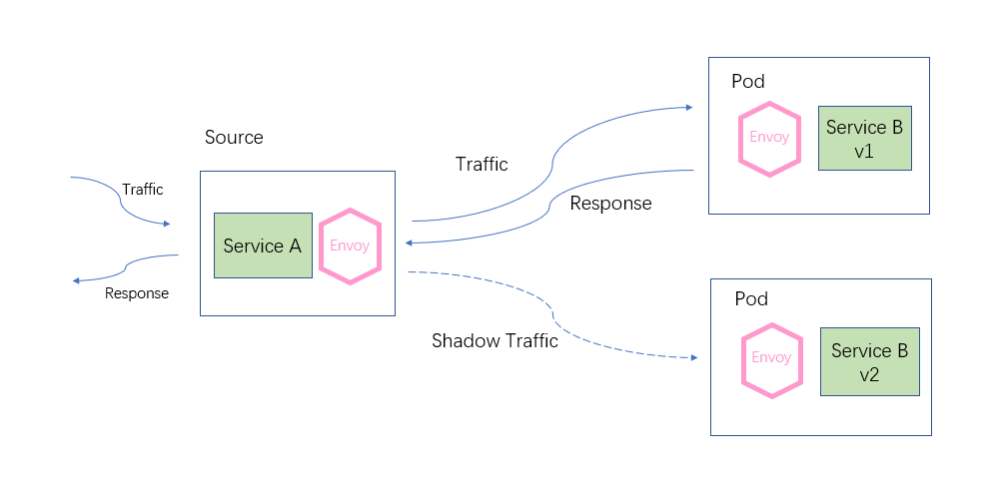
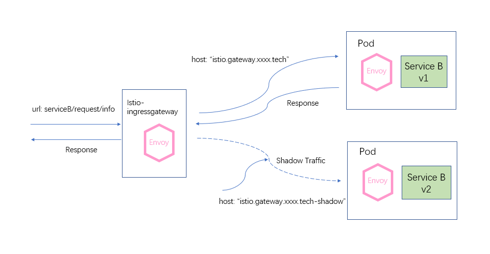

# 流量镜像

### 流量镜像是什么

流量镜像（Mirroring / traffic-shadow），也叫作影子流量，是指通过一定的配置将线上的真实流量复制一份到镜像服务中去，我们通过流量镜像转发以达到在不影响线上服务的情况下对流量或请求内容做具体分析的目的，它的设计思想是只做转发而不接收响应（fire and forget）。这个功能在传统的微服务架构里是很难做到的，一方面，传统服务之间的通讯是由 SDK 支持的，那么对流量镜像的支持就代表着在业务服务逻辑中有着镜像逻辑相关代码的侵入，这会影响业务服务的代码的整洁性。另一方面，流量镜像的功能是需要非常灵活的，多维度，可动态管控的一个组件。如果将这样的一个组件集成到 SDK 中去完成它的使命后却无法及时清除，这样的设计势必是臃肿而繁琐。所幸的是，随着微服务架构的发展，Service Mesh 登上了历史舞台，成为新一代的服务架构引领者。而 Istio 作为 Service Mesh 优秀的落地架构，利用它本身使用 Envoy 代理转发流量的特性，轻松的支持了流量镜像的功能，再加上它的实现不需要任何代码的侵入，只需要在配置文件中简单加上几个配置节即可完成，这些设计以及实现方式足以让开发测试人员眼前一亮。那么流量镜像到底能解决什么样具体的问题呢？

### 流量镜像能够为我们带来什么

很多情况下，当我们对服务做了重构，或者我们对项目做了重大优化时，怎么样保证服务是健壮的呢？在传统的服务里，我们只能通过大量的测试，模拟在各种情况下服务的响应情况。虽然也有手工测试、自动化测试、压力测试等一系列手段去检测它，但是测试本身就是一个样本化的行为，即使测试人员再完善它的测试样例，无法全面的表现出线上服务的一个真实流量形态。往往当项目发布之后，总会出现一些意外，比如你服务里收到客户使用的某些数据库不认识的特殊符号，再比如用户在本该输入日期的输入框中输入了 “--” 字样的字符，又比如用户使用乱码替换你的 token 值批量恶意攻击服务等等，这样的情况屡见不鲜。数据的多样性，复杂性决定了开发人员在开发阶段根本是无法考虑周全的。

而流量镜像的设计，让这类问题得到了最大限度的解决。流量镜像讲究的不再是使用少量样本去评估一个服务的健壮性，而是在不影响线上坏境的前提下将线上流量持续的镜像到我们的预发布坏境中去，让重构后的服务在上线之前就结结实实地接受一波真实流量的冲击与考验，让所有的风险全部暴露在上线前夕，通过不断的暴露问题，解决问题让服务在上线前夕就拥有跟线上服务一样的健壮性。由于测试坏境使用的是真实流量，所以不管从流量的多样性，真实性，还是复杂性上都将能够得以展现，同时预发布服务也将表现出其最真实的处理能力和对异常的处理能力。运用这种模式，一方面，我们将不会再跟以前一样在发布服务前夕内心始终忐忑不安，只能祈祷上线之后不会出现问题。另一方面，当大量的流量流入重构服务之后，开发过程中难以评估的性能问题也将完完整整的暴露出来，此时开发人员将会考虑它服务的性能，测试人员将会更加完善他们的测试样例。通过暴露问题，解决问题，再暴露问题，再解决问题的方式循序渐进地完善预发布服务来增加我们上线的成功率。同时也变相的促进我们开发测试人员技能水平的提高。

当然，流量镜像的作用不仅仅只是解决上面这样的场景问题，我们可以根据它的特性，解决更多的问题。比如，假如我们在上线后突然发现一个线上问题，而这个问题在测试坏境中始终不能复现。那么这个时候我们就能利用它将异常流量镜像到一个分支服务中去，然后我们可以随意在这个分支服务上进行分析调试，这里所说的分支服务，可以是原服务的只用于问题分析而不处理正式业务的副本服务，也可以是一个只收集镜像流量的组件类服务。又比如突然需要收集某个时间段某些流量的特征数据做分析，像这种临时性的需求，使用流量镜像来处理非常合适，既不影响线上服务的正常运转，也达到了收集分析的目的。

### 流量镜像的实现原理

实际上在 Istio 中，服务间的通讯都是被 Envoy 代理拦截并处理的， Istio 流量镜像的设计也是基于 Envoy 特性实现的。它的流量转发如下图所示。可以看到，当流量进入到`Service A`时，因为在`Service A`的 Envoy 代理上配置了流量镜像规则，那么它首先会将原始流量转发到`v1`版本的 `Service B`服务子集中去 。同时也会将相同的流量复制一份，异步地发送给`v2`版本的`Service B` 服务子集中去，可以明显的看到，`Service A` 发送完镜像流量之后并不关心它的响应情况。



在很多情况下，我们需要将真实的流量数据与镜像流量数据进行收集并分析，那么当我们收集完成后应该怎样区分哪些是真实流量，哪些是镜像流量呢？ 实际上，Envoy 团队早就考虑到了这样的场景，他们为了区分镜像流量与真实流量，在镜像流量中修改了请求标头中 `host` 值来标识，它的修改规则是：在原始流量请求标头中的 `host` 属性值拼接上`“-shadow”` 字样作为镜像流量的 `host` 请求标头。

为了能够更清晰的对比出原始流量与镜像流量的区别，我们使用以下的一个示例来说明：

如下图所示，我们发起一个`http://istio.gateway.xxxx.tech/serviceB/request/info`的请求，请求首先进入了`istio-ingressgateway` ，它是一个 Istio 的 Gateway 资源类型的服务，它本身就是一个 Envoy 代理。在这个例子里，就是它对流量进行了镜像处理。可以看到，它将流量转发给`v1`版本`Service B`服务子集的同时也复制了一份流量发送到了`v2`版本的`Service B`服务子集中去。



在上面的请求链中，请求标头数据有什么变化呢？下图收集了它们请求标头中的所有信息，可以明显的对比出正式流量与镜像流量请求标头中`host`属性的区别（部分相同的属性值过长，这里只截取了前半段）。从图中我们可以看出，首先就是host属性值的不同，而区别就是多了一个`“-shadow”`的后缀。再者发现`x-forwarded-for`属性也不相同，`x-forwarded-for`协议头的格式是：`x-forwarded-for: client1, proxy1, proxy2`， 当流量经过 Envoy 代理时这个协议头将会把代理服务的 IP 添加进去。实例中`10.10.2.151`是我们云主机的 IP，而`10.10.2.121`是`isito-ingressgateway`所对应Pod的 IP 。从这里也能看到，镜像流量是由`istio-ingressgatway`发起的。除了这两个请求标头的不同，其他配置项是完全一样的。


### 流量镜像的配置

上面我们介绍了流量镜像的原理及使用场景，接下来我们再介绍下流量的镜像如何配置才能生效。在 Istio 架构里，镜像流量是借助于 VirtualService 这个资源中的 `HTTPRoute` 配置项的`mirror`与`mirrorPercent`这两项子配置项来实现的，这两个配置项的定义也是非常的简单。

- **mirror**：配置一个 Destination 类型的对象，这里就是我们镜像流量转发的服务地址。具体的 [**VirtualService**](https://www.servicemesher.com/istio-handbook/concepts/virtualservice.html) 配置与[**DestinationRule**](https://www.servicemesher.com/istio-handbook/concepts/destinationrule.html) 对象配置属性请参考相关介绍页。
- **mirrorPercent**：配置一个数值，这个配置项用来指定有多少的原始流量将被转发到镜像流量服务中去，它的有效值为`0~100`，如果配置成`0`则表示不发送镜像流量。

下面的例子就是我们在示例中使用到的`Service B`的镜像流量配置，其中，`mirror.host`配置项是配置一个域名或者在Istio 注册表中注册过的服务名称，可以看到，该配置指定了镜像流量需要发送的目标服务地址为`serviceB`。`mirror.subset`配置项配置一个`Service B`服务的服务子集名称 ，指定了要将镜像流量镜像到`v2`版本的`Service B`服务子集中去。`mirror_percent`配置将`100%`的真实流量进行镜像发送。所以下面的配置整体表示当流量到来时，将请求转发到`v1`版本的`service B`服务子集中，再以镜像的方式发送到`v2`版本的`service B`服务上一份，并将真实流量全部镜像。

```yaml
apiVersion: networking.istio.io/v1alpha3
kind: VirtualService
metadata:
  name: serviceB
spec:
  hosts:
  - istio.gateway.xxxx.tech
  gateways:
  - ingressgateway.istio-system.svc.cluster.local
  http:
  - match:
    - uri:
        prefix: /serviceB
    rewrite:
      uri: /
    route:
    - destination:
        host: serviceB
        subset: v1
    mirror:
      host: serviceB
      subset: v2
    mirror_percent: 100
```

`service B` 服务对应的 DestinationRule 配置如下 ：

```yaml
apiVersion: networking.istio.io/v1alpha3
kind: DestinationRule
metadata:
  name: serviceB
  namespace: default
spec:
  host: serviceB
  subsets:
  - name: v2
    labels:
      version: v2
  - name: v1
    labels:
      version: v1
```


### 总结

- 镜像流量从设计上讲与业务服务解耦，这意味着是一种无侵入式的设计。这样我们就在业务服务上无须考虑副本流量的问题，专注于业务处理。而且在进行镜像流量的配置时也不用考虑对业务服务的影响。
- 从原理上讲，它使用这种异步发送不关心响应（fire and forget）的方式，丝毫不会影响到我们的线上坏境正常运作。
- 从配置复杂度上讲简单并且容易上手，通过简单的几个配置项即可完成，这将大大减轻了我们的学习成本，也将大大提高了我们调试、测试的效率。
- 从表现上讲完美复制真实的流量，除了请求标头的`host`、`x-forwarded-for`等属性，我们几乎可以认为它就是真实的流量。

综上介绍，Istio的镜像流量功能是一个非常优雅而实用的功能，我们的微服务架构有了这么强大的功能来加持，对我们调试、测试、预上线演练等工作是一个重大技术支撑。我们可以用它来收集补充我们的测试案例，使用峰值时间段流量来测试服务的抗压能力以及检测部分容错容灾能力，当绝大部分问题都在上线之前得到暴露、验证并解决时，上线这件事不再让人惧怕，它将变成一件非常容易的事情。

最后，我们说明一下，根据镜像流量特性，前面提到的使用分支服务调试测试环境上无法复现的线上问题是一个很巧妙的应用，虽然它能够支持这样的操作，但非常不建议这样做。一方面原因是调试这样的动作本身就不应该在线上坏境进行，况且操作线上 VirtualService 是非常敏感的，在VirtualService 更新的时候，很容易引起请求调用链的卡顿。另一方面，在调试完毕后，有时候有可能由于粗心会忘记删除调用链路中某处的镜像流量配置。那么可以想象一下，如果这些流量是商品详情页面的相关的，并且遇到了双11大促节日会发生什么样的后果。