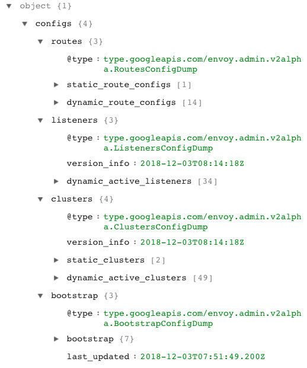
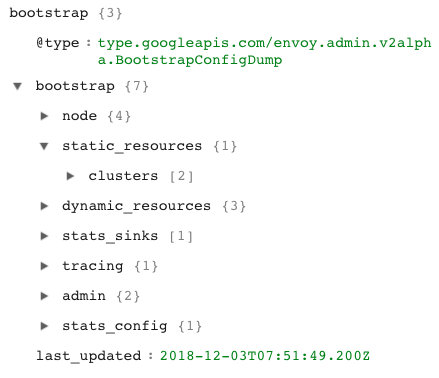

# Envoy proxy 配置详解

Istio envoy sidecar proxy 配置中包含以下四个部分。

- **bootstrap**：Envoy proxy 启动时候加载的静态配置。
- **listeners**：监听器配置，使用 LDS 下发。
- **clusters**：集群配置，静态配置中包括 xds-grpc 和 zipkin 地址，动态配置使用  CDS 下发。
- **routes**：路由配置，静态配置中包括了本地监听的服务的集群信息，其中引用了 cluster，动态配置使用 RDS 下发。

每个部分中都包含静态配置与动态配置，其中 bootstrap 配置又是在集群启动的时候通过 sidecar 启动参数注入的，配置文件在 `/etc/istio/proxy/envoy-rev0.json`。

Enovy 的配置 dump 出来后的结构如下图所示。



由于 bootstrap 中的配置是来自 Envoy 启动时加载的静态文件，主要配置了节点信息、tracing、admin 和统计信息收集等信息，这不是本文的重点，大家可以自行研究。



上图是 bootstrap 的配置信息。

[Bootstrap](https://www.envoyproxy.io/docs/envoy/latest/api-v2/config/bootstrap/v2/bootstrap.proto.html#envoy-api-msg-config-bootstrap-v2-bootstrap) 是 Envoy 中配置的根本来源，[Bootstrap](https://www.envoyproxy.io/docs/envoy/latest/api-v2/config/bootstrap/v2/bootstrap.proto.html#envoy-api-msg-config-bootstrap-v2-bootstrap) 消息中有一个关键的概念，就是静态和动态资源的之间的区别。例如 [Listener](https://www.envoyproxy.io/docs/envoy/latest/api-v2/api/v2/lds.proto.html#envoy-api-msg-listener) 或 [Cluster](https://www.envoyproxy.io/docs/envoy/latest/api-v2/api/v2/cds.proto.html#envoy-api-msg-cluster) 这些资源既可以从 [static_resources](https://www.envoyproxy.io/docs/envoy/latest/api-v2/config/bootstrap/v2/bootstrap.proto.html#envoy-api-field-config-bootstrap-v2-bootstrap-static-resources) 静态的获得也可以从 [dynamic_resources](https://www.envoyproxy.io/docs/envoy/latest/api-v2/config/bootstrap/v2/bootstrap.proto.html#envoy-api-field-config-bootstrap-v2-bootstrap-dynamic-resources) 中配置的 [LDS](http://www.servicemesher.com/envoy/configuration/listeners/lds.html#config-listeners-lds) 或 [CDS](http://www.servicemesher.com/envoy/configuration/cluster_manager/cds.html#config-cluster-manager-cds) 之类的 xDS 服务获取。

### Listener

Listener 顾名思义，就是监听器，监听 IP 地址和端口，然后根据策略转发。

**Listener 的特点**

- 每个 Envoy 进程中可以有多个 Listener，Envoy 与 Listener 之间是一对多的关系。
- 每个 Listener 中可以配置一条 filter 链表（filter_chains），Envoy 会根据 filter 顺序执行过滤。
- Listener 可以监听下游的端口，也可以接收来自其他 listener 的数据，形成链式处理。
- filter 是可扩展的。
- 可以静态配置，也可以使用 LDS 动态配置。
- 目前只能监听 TCP，UDP 还未支持。

**Listener 的数据结构**

Listener 的数据结构如下，除了 `name`、`address` 和 `filter_chains` 为必须配置之外，其他都为可选的。

```json
{
  "name": "...",
  "address": "{...}",
  "filter_chains": [],
  "use_original_dst": "{...}",
  "per_connection_buffer_limit_bytes": "{...}",
  "metadata": "{...}",
  "drain_type": "...",
  "listener_filters": [],
  "transparent": "{...}",
  "freebind": "{...}",
  "socket_options": [],
  "tcp_fast_open_queue_length": "{...}",
  "bugfix_reverse_write_filter_order": "{...}"
}
```

下面是关于上述数据结构中的常用配置解析。

- **name**：该 listener 的 UUID，唯一限定名，默认60个字符，例如 `10.254.74.159_15011`，可以使用命令参数指定长度限制。

- **address**：监听的逻辑/物理地址和端口号，例如

  ```json
  "address": {
         "socket_address": {
          "address": "10.254.74.159",
          "port_value": 15011
         }
  }
  ```

- **filter_chains**：这是一个列表，Envoy 中内置了一些通用的 filter，每种 filter 都有特定的数据结构，Enovy 会根据该配置顺序执行 filter。Envoy 中内置的 filter 有：[envoy.client_ssl_auth](https://www.envoyproxy.io/docs/envoy/v1.8.0/configuration/network_filters/client_ssl_auth_filter#config-network-filters-client-ssl-auth)、[envoy.echo](https://www.envoyproxy.io/docs/envoy/v1.8.0/configuration/network_filters/echo_filter#config-network-filters-echo)、[enovy.http_connection_manager](https://www.envoyproxy.io/docs/envoy/v1.8.0/configuration/http_conn_man/http_conn_man#config-http-conn-man)、[envoy.mongo_proxy](https://www.envoyproxy.io/docs/envoy/v1.8.0/configuration/network_filters/mongo_proxy_filter#config-network-filters-mongo-proxy)、[envoy.rate_limit](https://www.envoyproxy.io/docs/envoy/v1.8.0/configuration/network_filters/rate_limit_filter#config-network-filters-rate-limit)、[enovy.redis_proxy](https://www.envoyproxy.io/docs/envoy/v1.8.0/configuration/network_filters/redis_proxy_filter#config-network-filters-redis-proxy)、[envoy.tcp_proxy](https://www.envoyproxy.io/docs/envoy/v1.8.0/configuration/network_filters/tcp_proxy_filter#config-network-filters-tcp-proxy)、[http_filters](https://www.envoyproxy.io/docs/envoy/v1.8.0/intro/arch_overview/http_filters)、[thrift_filters](https://www.envoyproxy.io/docs/envoy/v1.8.0/configuration/thrift_filters/thrift_filters)等。这些 filter 可以单独使用也可以组合使用，还可以自定义扩展，例如使用 Istio 中的 [EnvoyFilter 配置](https://istio.io/zh/docs/reference/config/istio.networking.v1alpha3/#envoyfilter)。

- **use_original_dst**：这是一个布尔值，如果使用 iptables 重定向连接，则代理接收的端口可能与[原始目的地址](http://www.servicemesher.com/envoy/configuration/listener_filters/original_dst_filter.html)的端口不一样。当此标志设置为 true 时，Listener 将重定向的连接切换到与原始目的地址关联的 Listener。如果没有与原始目的地址关联的 Listener，则连接由接收它的 Listener 处理。默认为 false。注意：该参数将被废弃，请使用[原始目的地址](http://www.servicemesher.com/envoy/configuration/listener_filters/original_dst_filter.html)的 Listener filter 替代。该参数的主要用途是，Envoy 通过监听 15001 端口将应用的流量截取后再由其他 Listener 处理而不是直接转发出去，详情见 [Virtual Listener](https://zhaohuabing.com/post/2018-09-25-istio-traffic-management-impl-intro/#virtual-listener)。

关于 Listener 的详细介绍请参考 [Envoy v2 API reference - listener](https://www.envoyproxy.io/docs/envoy/latest/api-v2/api/v2/lds.proto#envoy-api-msg-listener)。

### Cluster

Cluster 是指 Envoy 连接的一组逻辑相同的上游主机。Envoy 通过[服务发现](http://www.servicemesher.com/envoy/intro/arch_overview/service_discovery.html)来发现 cluster 的成员。可以选择通过[主动健康检查](http://www.servicemesher.com/envoy/intro/arch_overview/health_checking.html#arch-overview-health-checking)来确定集群成员的健康状态。Envoy 通过[负载均衡策略](http://www.servicemesher.com/envoy/intro/arch_overview/load_balancing.html#arch-overview-load-balancing)决定将请求路由到 cluster 的哪个成员。

**Cluster 的特点**

- 一组逻辑上相同的主机构成一个 cluster。
- 可以在 cluster 中定义各种负载均衡策略。
- 新加入的 cluster 需要一个热身的过程才可以给路由引用，该过程是原子的，即在 cluster 热身之前对于 Envoy 及 Service Mesh 的其余部分来说是不可见的。
- 可以通过多种方式来配置 cluster，例如静态类型、严格限定 DNS、逻辑 DNS、EDS 等。

**Cluster 的数据结构**

Cluster 的数据结构如下，除了 `name` 字段，其他都是可选的。

```json
{
  "name": "...",
  "alt_stat_name": "...",
  "type": "...",
  "eds_cluster_config": "{...}",
  "connect_timeout": "{...}",
  "per_connection_buffer_limit_bytes": "{...}",
  "lb_policy": "...",
  "hosts": [],
  "load_assignment": "{...}",
  "health_checks": [],
  "max_requests_per_connection": "{...}",
  "circuit_breakers": "{...}",
  "tls_context": "{...}",
  "common_http_protocol_options": "{...}",
  "http_protocol_options": "{...}",
  "http2_protocol_options": "{...}",
  "extension_protocol_options": "{...}",
  "dns_refresh_rate": "{...}",
  "dns_lookup_family": "...",
  "dns_resolvers": [],
  "outlier_detection": "{...}",
  "cleanup_interval": "{...}",
  "upstream_bind_config": "{...}",
  "lb_subset_config": "{...}",
  "ring_hash_lb_config": "{...}",
  "original_dst_lb_config": "{...}",
  "least_request_lb_config": "{...}",
  "common_lb_config": "{...}",
  "transport_socket": "{...}",
  "metadata": "{...}",
  "protocol_selection": "...",
  "upstream_connection_options": "{...}",
  "close_connections_on_host_health_failure": "...",
  "drain_connections_on_host_removal": "..."
}
```

下面是关于上述数据结构中的常用配置解析。

- **name**：如果你留意到作为 Sidecar 启动的 Envoy 的参数的会注意到 `--max-obj-name-len 189`，该选项用来用来指定 cluster 的名字，例如 `inbound|9080||ratings.default.svc.cluster.local`。该名字字符串由 `|` 分隔成四个部分，分别是 `inbound` 或 `outbound` 代表入向流量或出向流量、端口号、subcluster 名称、FQDN，其中 subcluster 名称将对应于 Istio `DestinationRule` 中配置的 `subnet`，如果是按照多版本按比例路由的话，该值可以是版本号。
- **type**：即[服务发现类型](https://www.envoyproxy.io/docs/envoy/latest/intro/arch_overview/service_discovery#arch-overview-service-discovery-types)，支持的参数有 `STATIC`（缺省值）、`STRICT_DNS`、`LOGICAL_DNS`、`EDS`、`ORIGINAL_DST`。
- **hosts**：这是个列表，配置负载均衡的 IP 地址和端口，只有使用了  `STATIC`、`STRICT_DNS`、`LOGICAL_DNS` 服务发现类型时才需要配置。
- **eds_cluster_config**：如果使用 `EDS` 做服务发现，则需要配置该项目，其中包括的配置有 `service_name` 和 `ads`。

关于 Cluster 的详细介绍请参考 [Envoy v2 API reference - cluster](https://www.envoyproxy.io/docs/envoy/latest/api-v2/api/v2/cds.proto#cluster)。

### Route

我们在这里所说的路由指的是 [HTTP 路由](http://www.servicemesher.com/envoy/intro/arch_overview/http_routing.html)，这也使得 Envoy 可以用来处理网格边缘的流量。HTTP 路由转发是通过路由过滤器实现的。该过滤器的主要职能就是执行[路由表](https://www.envoyproxy.io/docs/envoy/latest/api-v1/route_config/route_config#config-http-conn-man-route-table)中的指令。除了可以做重定向和转发，路由过滤器还需要处理重试、统计之类的任务。

**HTTP 路由的特点**

- 前缀和精确路径匹配规则。
- 可跨越多个上游集群进行基于[权重/百分比的路由](https://www.envoyproxy.io/docs/envoy/latest/api-v1/route_config/route#config-http-conn-man-route-table-route-weighted-clusters)。
- 基于[优先级](http://www.servicemesher.com/envoy/intro/arch_overview/http_routing.html#arch-overview-http-routing-priority)的路由。
- 基于[哈希](https://www.envoyproxy.io/docs/envoy/latest/api-v1/route_config/route#config-http-conn-man-route-table-hash-policy)策略的路由。

**Route 的数据结构**

```json
{
  "name": "...",
  "virtual_hosts": [],
  "internal_only_headers": [],
  "response_headers_to_add": [],
  "response_headers_to_remove": [],
  "request_headers_to_add": [],
  "request_headers_to_remove": [],
  "validate_clusters": "{...}"
}
```

下面是关于上述数据结构中的常用配置解析。

- **name**：该名字跟 `envoy.http_connection_manager` filter 中的 `http_filters.rds.route_config_name` 一致，在 Istio Service Mesh 中为 Envoy 下发的配置中的 Route 是以监听的端口号作为名字，而同一个名字下面的 `virtual_hosts` 可以有多个值（数组形式）。
- **virtual_hosts**：因为 **VirtualHosts** 是 Envoy 中引入的一个重要概念，我们在下文将详细说明 `virtual_hosts` 的数据结构。
- **validate_clusters**：这是一个布尔值，用来设置开启使用 cluster manager 来检测路由表引用的 cluster 是否有效。如果是路由表是通过 [route_config](https://www.envoyproxy.io/docs/envoy/latest/api-v2/config/filter/network/http_connection_manager/v2/http_connection_manager.proto#envoy-api-field-config-filter-network-http-connection-manager-v2-httpconnectionmanager-route-config) 静态配置的则该值默认设置为 true，如果是使用 [rds](https://www.envoyproxy.io/docs/envoy/latest/api-v2/config/filter/network/http_connection_manager/v2/http_connection_manager.proto#envoy-api-field-config-filter-network-http-connection-manager-v2-httpconnectionmanager-rds) 动态配置的话，则该值默认设置为 false。

关于 Route 的详细介绍请参考 [Envoy v2 API reference - HTTP route configuration](https://www.envoyproxy.io/docs/envoy/latest/api-v2/api/v2/rds.proto)。

#### route.VirtualHost

VirtualHost 即上文中 Route 配置中的 `virtual_hosts`，VirtualHost 是路由配置中的顶级元素。每个虚拟主机都有一个逻辑名称以及一组根据传入请求的 host header 路由到它的域。这允许单个 Listener 为多个顶级域路径树提供服务。基于域选择了虚拟主机后 Envoy  就会处理路由以查看要路由到哪个上游集群或是否执行重定向。

**VirtualHost 的数据结构**

下面是 VirtualHost 的数据结构，除了 `name` 和 `domains` 是必须配置项外，其他皆为可选项。

```json
{
  "name": "...",
  "domains": [],
  "routes": [],
  "require_tls": "...",
  "virtual_clusters": [],
  "rate_limits": [],
  "request_headers_to_add": [],
  "request_headers_to_remove": [],
  "response_headers_to_add": [],
  "response_headers_to_remove": [],
  "cors": "{...}",
  "per_filter_config": "{...}",
  "include_request_attempt_count": "..."
}
```

下面是关于上述数据结构中的常用配置解析。

- **name**：该 VirtualHost 的名字，一般是 FQDN 加端口，如 `details.default.svc.cluster.local:9080`。
- **domains**：这是个用来匹配 VirtualHost 的域名（host/authority header）列表，也可以使用通配符，但是通配符不能匹配空字符，除了仅使用 `*` 作为 domains，注意列表中的值不能重复和存在交集，只要有一条 domain 被匹配上了，就会执行路由。Istio 会为该值配置所有地址解析形式，包括 IP 地址、FQDN 和短域名等。
- **routes**：针对入口流量的有序路由列表，第一个匹配上的路由将被执行。我们在下文将详细说明 route 的数据结构。

下面是一个实际的 VirtualHost 的例子，该配置来自 [Bookinfo 应用](https://istio.io/zh/docs/examples/bookinfo/)的 details 应用的 Sidecar 服务。

```json
{
            "name": "details.default.svc.cluster.local:9080",
            "domains": [
                "details.default.svc.cluster.local",
                "details.default.svc.cluster.local:9080",
                "details",
                "details:9080",
                "details.default.svc.cluster",
                "details.default.svc.cluster:9080",
                "details.default.svc",
                "details.default.svc:9080",
                "details.default",
                "details.default:9080",
                "10.254.4.113",
                "10.254.4.113:9080"
            ],
            "routes": [
                {
                    "match": {
                        "prefix": "/"
                    },
                    "route": {
                        "cluster": "outbound|9080||details.default.svc.cluster.local",
                        "timeout": "0s",
                        "max_grpc_timeout": "0s"
                    },
                    "decorator": {
                        "operation": "details.default.svc.cluster.local:9080/*"
                    },
                    "per_filter_config": {
                        "mixer": {
                            "forward_attributes": {
                                "attributes": {
                                    "destination.service.uid": {
                                        "string_value": "istio://default/services/details"
                                    },
                                    "destination.service.host": {
                                        "string_value": "details.default.svc.cluster.local"
                                    },
                                    "destination.service.namespace": {
                                        "string_value": "default"
                                    },
                                    "destination.service.name": {
                                        "string_value": "details"
                                    },
                                    "destination.service": {
                                        "string_value": "details.default.svc.cluster.local"
                                    }
                                }
                            },
                            "mixer_attributes": {
                                "attributes": {
                                    "destination.service.host": {
                                        "string_value": "details.default.svc.cluster.local"
                                    },
                                    "destination.service.uid": {
                                        "string_value": "istio://default/services/details"
                                    },
                                    "destination.service.name": {
                                        "string_value": "details"
                                    },
                                    "destination.service.namespace": {
                                        "string_value": "default"
                                    },
                                    "destination.service": {
                                        "string_value": "details.default.svc.cluster.local"
                                    }
                                }
                            },
                            "disable_check_calls": true
                        }
                    }
                }
            ]
        }
```

关于 route.VirtualHost 的详细介绍请参考 [Envoy v2 API reference - route.VirtualHost](https://www.envoyproxy.io/docs/envoy/latest/api-v2/api/v2/route/route.proto#envoy-api-msg-route-virtualhost)。

#### route.Route

路由既是如何匹配请求的规范，也是对下一步做什么的指示（例如，redirect、forward、rewrite等）。

**route.Route 的数据结构**

下面是是 route.Route 的数据结构，除了 `match` 之外其余都是可选的。

```json
{
  "match": "{...}",
  "route": "{...}",
  "redirect": "{...}",
  "direct_response": "{...}",
  "metadata": "{...}",
  "decorator": "{...}",
  "per_filter_config": "{...}",
  "request_headers_to_add": [],
  "request_headers_to_remove": [],
  "response_headers_to_add": [],
  "response_headers_to_remove": []
}
```

下面是关于上述数据结构中的常用配置解析。

- **match**：路由匹配参数。例如 URL prefix（前缀）、path（URL 的完整路径）、regex（规则表达式）等。
- **route**：这里面配置路由的行为，可以是 [route](https://www.envoyproxy.io/docs/envoy/latest/api-v2/api/v2/route/route.proto#envoy-api-field-route-route-route)、[redirect](https://www.envoyproxy.io/docs/envoy/latest/api-v2/api/v2/route/route.proto#envoy-api-field-route-route-redirect) 和 [direct_response](https://www.envoyproxy.io/docs/envoy/latest/api-v2/api/v2/route/route.proto#envoy-api-field-route-route-direct-response)，不过这里面没有专门的一个配置项用来配置以上三种行为，而是根据实际填充的配置项来确定的。例如在此处添加 `cluster` 配置则暗示路由动作为”route“，表示将流量路由到该 cluster。详情请参考 [route.RouteAction](https://www.envoyproxy.io/docs/envoy/latest/api-v2/api/v2/route/route.proto#route-routeaction)。
- **decorator**：被匹配的路由的修饰符，表示被匹配的虚拟主机和 URL。该配置里有且只有一个必须配置的项 `operation`，例如 `details.default.svc.cluster.local:9080/*`。
- **per_filter_config**：这是一个 map 类型，`per_filter_config` 字段可用于为 filter 提供特定路由的配置。Map 的 key 应与 filleter 名称匹配，例如用于 HTTP buffer filter 的 `envoy.buffer`。该字段是特定于 filter 的，详情请参考 [HTTP filter](https://www.envoyproxy.io/docs/envoy/latest/configuration/http_filters/http_filters#config-http-filters)。

关于 route.Route 的详细介绍请参考 [Envoy v2 API reference - route.Route](https://www.envoyproxy.io/docs/envoy/latest/api-v2/api/v2/route/route.proto#envoy-api-msg-route-route)。

## 参考

- [Envoy v2 API 概览 - servicemesher.com](http://www.servicemesher.com/envoy/configuration/overview/v2_overview.html)
- [监听器发现服务（LDS）- servicemesher.com](http://www.servicemesher.com/envoy/configuration/listeners/lds.html)
- [路由发现服务（RDS）- servicemesher.com](http://www.servicemesher.com/envoy/configuration/http_conn_man/rds.html)
- [集群发现服务（CDS）- servicemesher.com](http://www.servicemesher.com/envoy/configuration/cluster_manager/cds.html)
