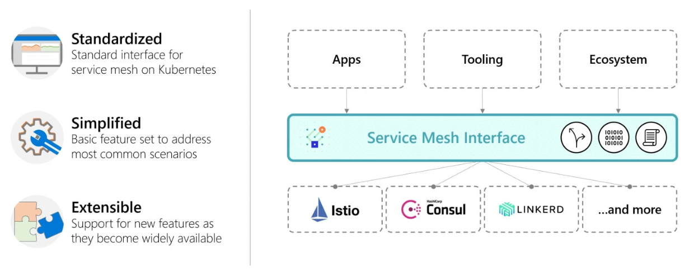

# SMI

SMI 是 Service Mesh Interface 的缩写，最早于2019年5月由微软和 Red Hat 牵头在 KubeCon 被提出，意在为运行在 Kubernetes 上服务网格提供统一的接口标准，它是一套约定规范，而不是具体的服务网格实现。

## SMI 诞生背景

SMI 的正式提出距离 Istio 0.1 版本的发布刚好有两年时间，彼时服务网格的生态系统正在兴起，而 Istio 作为牵头的控制面实现也已经进入了 1.1 正式版。服务网格的价值逐步被大家认可，市场上也出现了服务网格的各种不同实现，比如 Linkerd、Consul Connect 等，甚至还有一些非开源的实现，这导致了服务网格市场的碎片化问题。对于用户而言，需要选择不同的服务网格实现，这将导致学习、迁移成本非常高，因为各家实现都有伴随着不同的概念定义、接口约定等。

因此 SMI 顺势而出，希望在各种服务网格的实现之上建立一个抽象的 API 层，通过这个抽象来解耦和屏蔽底层的具体技术实现，好让上层的应用、工具、生态系统可以建立在统一的接口标准之上，从而提升不同服务网格实现之间的可移植性和互通性，降低用户的整体使用门槛。

下图清楚的描述了 SMI 的自身定位和推出愿景：

左侧描述的是 SMI 的核心设计理念：标准化、轻量化、可扩展。所谓标准化正是上文提到的也是它最重要的设计目标，希望通过一套统一的规范来约定不同服务网格实现来解决碎片化的问题。而轻量化则是指用户在使用服务网格时应该无需关注内部技术实现，只需关注上层的使用方式，通过定义基础的功能合集来覆盖大多数的使用场景。最后一点可扩展性指的是 SMI 在设计的时候需充分考虑后续的能力扩展，当有新的功能被广泛应用的时候 SMI 应当能够非常容易进行支持。

而图片右侧则是直观描述了 SMI 的定位是介于上层的应用、工具、生态系统和下层的服务网格具体实现，例如 Istio、Consul、Linkerd 等，正如上述介绍，它是中间的一层抽象，用于统一不同的网格实现，为用户提供标准的使用接口规范。

## SMI 规范内容

作为一套标准规范，SMI 具体应该提供什么？官方网站上描述如下：

- 为运行在 Kubernetes 上的服务网格提供了标准接口定义
- 为最通用的服务网格使用场景提供了基本功能合集
- 为服务网格提供了随时间推移不断支持新实现的灵活性
- 依赖于服务网格技术来为生态系统提供了创新的空间

在 SMI 的 Github 项目介绍里，明确了规范设计的**目标**：

SMI API 的目标是通过提供一组通用的，可移植的服务网格接口定义，使得基于 Kubernetes 的网格用户可以无需关心服务网格的具体实现，从而可以通过使用这些通用接口定义来实现上层的应用程序，无需紧密绑定到任何特定实现。

同时，为了让大家对 SMI 有更加明确的目标界定，也指出了它的**非目标**定义：

SMI 项目本身不涉及具体的服务网格实现，只是试图定义通用标准规范。同样，SMI 不会定义服务网格的具体功能范围，它只是一个通用子集。也欢迎 SMI 的供应商添加超出现有规范之外的特定扩展。 我们希望随着时间的推移，如果有更多功能被用户普遍接受而成为服务网格一部分，这些新的定义也将会被迁移到 SMI 标准规范里来。

在项目介绍里， 同时也提出了规范目前涵盖的网格能力范围以及接口实现：

- Traffic Policy（流量策略）：在不同的服务之间应用身份和传输加密等策略
  - Traffic Access Control（流量访问控制）：根据客户端的身份标识来配置对特定 pod 的访问以及路由，以将应用的访问锁定在可被允许的用户和服务。
  - Traffic Specs（流量规范）：定义了基于不同协议的流量表示方式，这些资源通过与访问控制和其它策略协同工作以在协议级别进行流量管理。
- Traffic Telemetry（流量遥测）：捕获例如错误率、服务间调用延迟等关键指标。
  - Traffic Metrics（流量指标）：为控制台和自动扩缩容工具暴露一些通用的流量指标。
- Traffic Management（流量管理）：在不同服务之间进行流量切换。
  - Traffic Split（流量分割）：通过在不同服务之间逐步调整流量百分比，以帮服务进行金丝雀发布。

目前 SMI 规范的内容只是定义了上述的几个方面，相对于 istio 的实现而言，确实只是覆盖了其中最为通用的业务场景。值得注意的是，SMI 之所以在提出的时候就表明只为基于 Kubernetes 之上的服务网格提供规范，是因为 SMI 是通过 Kubernetes Custom Resource Definitions（CRD）和 Extension API Servers 来实现的。通过这种方式 API 可以很方便被安装到 Kubernetes 集群上，并使用一些 Kubernetes 周边的标准工具进行操作。

## SMI 生态系统

SMI 既然作为服务网格标准规范，制定相关的接口只是第一步，最终要的是整个服务网格生态里各个玩家的支持。官方网站列举了目前 SMI 生态圈里的部分服务网格厂商，如下图所示。

其中不乏一些大家比较熟悉的，例如 Linkerd、Consul、Service Mesh Hub 等，图中有个不太显眼的文字表示的 Istio，链接指向的却是 Istio 基于 SMI 规范适配实现的 Github 项目仓库，而该项目的主要贡献者则大多来自微软而不是 Istio 项目的开发团队。除上述的网格实现厂商，官方还罗列了很多合作伙伴，如下图所示。

除了熟悉的微软、Red Hat、Linkerd 之外，还有服务网格领域目前比较活跃的 solo.io，涉及的产品非常广，除了比较知名的基于 Envoy 实现的 API 网关 Gloo 之外，更是推出了 Service Mesh Hub 和 WebAssembly Hub，意在为服务网格的用户提供统一的上层应用平台。

不难从上述的两张图中看出，SMI 的推出为市面上的各个服务网格实现提供一套标准的规范，而作为服务网格的最大玩家 Istio，截止目前为止却没有正面回应 SMI，甚至连基于 SMI 规范的 Istio 适配实现都是由 SMI 这边的团队开发的，Istio 官方团队背后究竟有什么顾虑，有点耐人寻味。另外一个点，Istio 于 2020 年正在逐步计划对虚拟机的支持，而 SMI 似乎一开始定位则是基于 Kubernetes 平台的，这两者之间是否会有冲突，目前看来也仍存在很多不确定性。

## 小结

随着服务网格生态不断发展，越来越多的玩家加入到了服务网格的实现厂商里，有开源的也有闭源的内部实现，而 SMI 作为服务网格领域目前唯一的标准规范制定者，意在解决市面上不同的厂商网格技术实现之间差异化给用户带来的使用问题。从初衷来看，它的诞生对用户而言是受益的，通过屏蔽不必要的内部概念，使用标准的接口抽象定义即可实现一套上层应用，从而让用户在不同的网格实现间可以进行自由切换，大大降级了网格的使用难度，不至于绑定在特定的某个平台或技术实现上；

SMI 已经得到了大多数服务网格厂商的支持，唯独目前最为权威的控制面 Istio 没有正面表态，究竟 SMI 能否真的成为服务网格的标准规范，可能还需要更多的时间进行验证。

不过，有个好消息是，SMI 于 2020 年 4 月作为一个沙盒项目加入了 CNCF，这无疑又是往前迈出了一步。

## 参考

- [SMI 官方网站](https://smi-spec.io/)
- [SMI Github](https://github.com/servicemeshinterface/smi-spec)
- [Service Mesh Interface详细介绍](https://www.servicemesher.com/blog/service-mesh-interface-detail/)
- [smi-joins-cncf](https://smi-spec.io/blog/smi-joins-cncf/)
- [Interoperability with the new Service Mesh Interface](https://www.redhat.com/en/blog/interoperability-new-service-mesh-interface)

