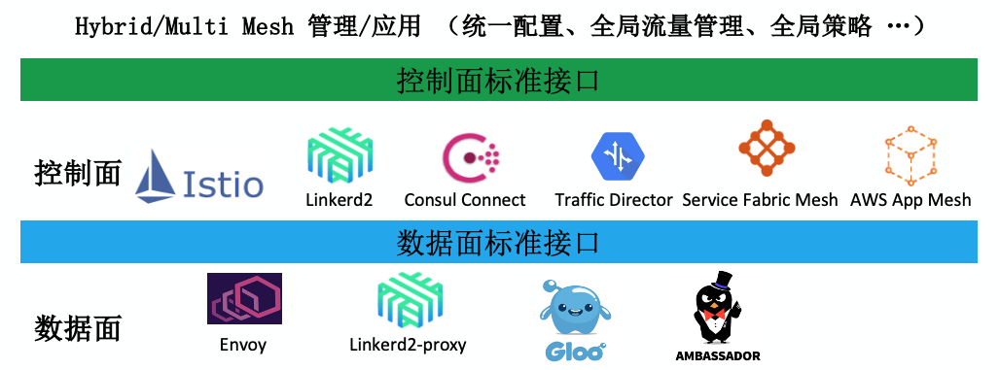

# 标准

随着 Service Mesh 技术的不断发展，越来越多的组织和个人投入到 Service Mesh 的技术浪潮中，涌现出了一系列开源项目和商业产品。这些产品包括但不限于：

* 数据面：Envoy、Linkerd2-proxy、Gloo、Ambassador 等等，包括负责 Mesh 内部东西向流量的 Sidecar 和在 Mesh 边缘负责南北向流量的 Gateway 两类产品。
* 控制面：Istio、Linkerd2、Consul Connect 等单独部署的产品，以及各个云厂商推出的 Service Mesh 管理服务。

这些不同的 Service Mesh 项目和产品提供了类似的流量管理和服务治理能力，每个产品各有特色和侧重点，并且往往采用了不同的 API 接口。不同 Service Mesh 产品之间互不兼容的接口导致了厂商锁定的问题，这和云原生的宗旨是背道而驰的：用户往往希望尝试不同的 Service Mesh 产品，并能根据自身的需求在不同的 Service Mesh 产品之间进行自由切换。除此之外，Service Mesh 作为云原生基础设施被集成在了云厂商提供的服务中，用户也希望通过一致的接口对这些 Service Mesh 进行统一管理。

业界意识到了该问题，并提出了采用标准接口来解决不同 Service Mesh 产品的互连互通。如下图所示，采用数据面标准接口来规范控制面和数据面之间的配置下发，采用控制面标准接口来统一不同控制面产品的管理。本章将对这些 Service Mesh 的相关标准进行一一介绍。

