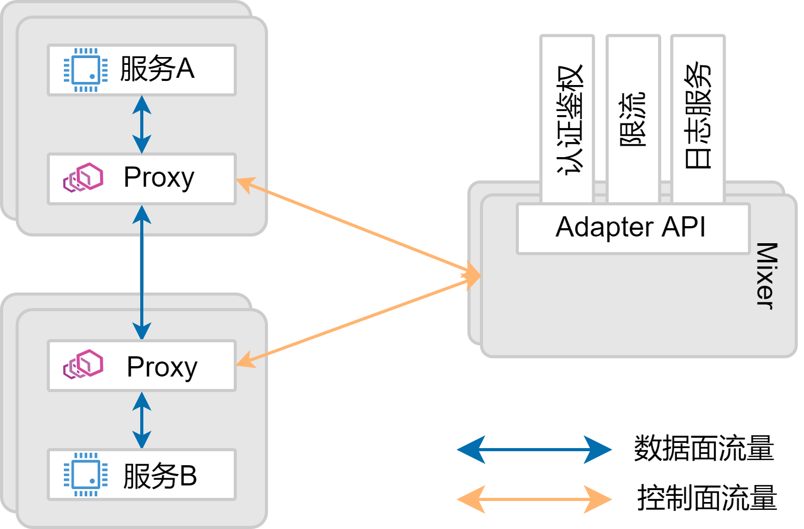
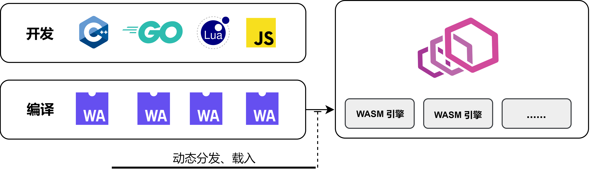

# WebAssembly

Istio 希望完全接管微服务集群中东西流量并提供灵活、可观察、易配置的服务间流量治理能力。但是面对千变万化的需求和复杂的应用环境，期望 Istio 本身或者数据面 Envoy 来覆盖所有的场景显然是不现实的。强大、全面往往是因为**易扩展**。 

为了能够帮助用户应对各种复杂的场景，Istio 提出了基于 **Mixer** 组件的扩展机制。该机制由 Mixer 组件和一套 Mixer Adapter API 构成。基于 Mixer 的扩展独立于数据面主体之外，作为单独的服务执行。
具体来说，Istio 在数据面 Envoy 中扩展实现了状态收集和上报的能力，在请求和响应时通过GRPC调用向外部 Mixer 组件上报相关属性和状态。同时，Istio 开发人员则通过实现对应的 Mixer Adapter API 对外部 Mixer 组件功能进一步扩展。外部 Mixer 组件接收到数据面 Envoy 请求后依次调用各个 Adapter 来实现服务间访问控制、限流、计费系统以及流量监控等等功能。

此类扩展可以完全无侵入的实现数据面流量治理能力的增强。而且 Mixer Adapter API 的抽象屏蔽了数据面的实现细节，扩展会具有更好的可移植性；独立进程执行和部署，具备更强的伸缩性。但是 Mixer 也引入了大量额外的外部调用和数据交互，带来了巨大的性能开销。

为此，Istio 在1.5版本的巨大变革之中，抛弃了现有的 Mixer 扩展机制，转身拥抱基于 WebAssembly（以下简称WASM））的 in-proxy 扩展（或者应该称之为 Mixer V2）：扩展直接集成在数据面中，在同一个进程中执行，而无需外部调用来实现相关的流量治理能力。

本节将简单的介绍 WASM 技术以及 WASM 是如何被嵌入到 Service Mesh 的巨大版图中来的。

## 什么是 WASM

WASM 是一种源自于前端的技术，是为了解决日益提高的前端应用复杂性和有限的脚本语言（JavaScript）性能之间的矛盾而诞生。WASM 本身并不是一种语言，而是一种字节码标准，一个“编译目标”。WASM 字节码抹平了 x86, ARM 等不同 CPU 架构之间的区别。虽然 WASM 字节码不能直接在任何 CPU 架构上执行，但由于它与机器码非常相近，因此能够以非常快的速度被 WASM 引擎（或者也可以称之为 WASM 虚拟机）翻译为对应架构的机器码，获得和机器码相近的性能。从原理上看， WASM 和 Java 字节码非常相似。

理论上，所有语言，包括 JavaScript、C、C++、Rust、Go、Java 等都可以编译成 WASM 字节码。对于 JavaScript 等脚本语言，可以通过编译为 WASM 字节码，由 WASM 虚拟机直接装载执行而不是解释执行，以获得性能上的巨大提升。对于 Go、C++ 等语言，也可以编译为 WASM 字节码，使得 Go、C++ 等后端语言能够在 Web 中使用，且能保留作为编译型语言的高性能。

WASM 本身是为 Web 而设计，因此天然具有跨平台支持；同时，通过 WASM 虚拟机的沙箱隔离，也使得执行 WASM 字节码相比于直接执行机器码有更高的安全性。

原本 WASM 作为前端技术，只被嵌入在浏览器内核中，用于加速 Web 应用。但是 Envoy 社区提出将 WASM 技术引入到后端代理中，使得 WASM 的种种优异特性也能够为 API 网关，为 Service Mesh 增效赋能。

## WASM 和 Envoy

作为一种新型网络代理，Envoy 在设计之初就充分考虑到了其可扩展性，简单继承并重写几个接口就可以在不侵入 Envoy 主干源码的前提下扩展 Envoy 功能。而且 Envoy 使用 Modern C++ 语言，大大降低了 Envoy 开发和扩展的难度。但是原生 Envoy 扩展仍旧不免有以下几个方面的掣肘：

* 对于没有 C++ 技术栈积累的团队而言，即使是 Modern C++ 也仍旧存在一定的门槛；
* 扩展的生效必须要重新编译和打包 Envoy 二进制，并需要重启网关或者 Sidecar；
* C++ 扩展可能会引入内存安全问题，影响 Envoy 整体的稳定性和安全性。

为了解决以上的问题，Envoy 做了两方面的工作。第一，提供了名为 lua 的特殊扩展，允许控制面通过 xDS 协议动态下发 Lua 脚本并由 Envoy 解释执行。 第二，也是本节的主题，Envoy 引入了 WASM 技术用于开发 Envoy 扩展。

Envoy 自身嵌入了 WASM（Google V8）引擎，用于支持 WASM 字节码执行，并开放相关接口用于和 WASM 虚拟机交互数据。开发者可以使用各种语言开发 Envoy 扩展并编译为 .wasm 字节码文件。最后，通过 Envoy 封装的名为 wasm 的原生 C++ 扩展来获取字节码文件以及相关配置并交予 WASM 虚拟机执行。相比于原生 C++ 扩展，WASM 扩展具有以下几个方面的优势：

* WASM 字节码具备与机器码相似的性能，保证了 WASM 扩展性能；
* WASM 扩展在沙箱中执行，更安全，单个功能扩展不会影响到 Envoy 主体功能，可靠性和安全性更高；
* WASM 扩展可以以 .wasm 文件动态分发、共享以及装载运行，且不受平台限制；
* WASM 扩展无语言限制，理论上所有支持 WASM 的语言都可以用于开发 Envoy 扩展，开发效率更高。

Envoy 对 WASM 扩展的支持使得 WASM 引入到 Service Mesh，引入到 Istio 生态系统具有了基础设施的支持。

## WASM 和 Mesh

在 Envoy 对 WASM 支持的基础之上，Istio 社区和 Solo.io 共同推动了 WASM 在 Service Mesh 中的发展和落地。在 Istio 1.5 的大更新中，Istio 使用 WASM 重写了几个扩展（基于WASM API而非原生Envoy C++ HTTP插件API）。虽然 Istio 也支持将相关扩展编译为 .wasm 文件并在沙箱中动态载入执行，但是考虑到 Istio 1.5 对 WASM 支持仍旧是 Alpha 版本，所以此类方法暂时不是默认选项。Istio 1.5 版本给整个 Istio 生态带来了巨大的变化。不单单是部署架构发生了巨大的调整，其扩展机制也全面改道，从 Mixer 切换到 WASM。虽然航向的改变仍旧有一段路要走，但是 WASM 无疑将成为 Istio 生态中不可或缺的一部分。
而为了更好的在 Istio，在 Service Mesh 中应用 WASM 扩展, Solo.io 建立了 WebAssembly Hub 服务，用于构建，共享，发现和部署 WASM 扩展。WebAssembly Hub 提供了一个集中的编译后的 WASM 扩展（也即是 .wasm 文件）管理和分发服务。通过 WebAssembly Hub 可以如同管理容器镜像一样管理 WASM 扩展。此外， Solo.io 也提供了一个类似于 docker-cli 的命令行工具，名为 wasme，用于辅助 WASM 扩展的开发、获取和分享。

WASM 在 Service Mesh 中的应用与落地仍旧有许多工作要做，但是它如今已经嵌入到了整个的 Service Mesh 版图之中。

## 小结

本节简单的介绍了 WASM 技术的背景以及在 Envoy，在 Service Mesh 中 WASM 扮演的角色和发展现状。在可预期的未来， WASM 必然会因为 Istio 和 Envoy 而成为 Service Mesh 生态中不可或缺的一部分。希望在未来，源自于前端的 WASM 和 Service Mesh的结合能够带来更多的惊喜。

## 参考

* [Mixer 配置模型](https://istio.io/zh/docs/reference/config/policy-and-telemetry/mixer-overview/)
* [重新定义代理的扩展性：Envoy 和 Istio 引入 WebAssembly](https://istio.io/zh/blog/2020/wasm-announce/)
* [WebAssembly 现状与实战](https://www.ibm.com/developerworks/cn/web/wa-lo-webassembly-status-and-reality/index.html)