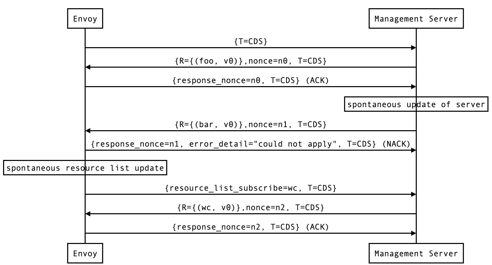

# xDS

xDS协议是“X Discovery Service”的简写，这里的“X”表示它不是指具体的某个协议，是一簇基于不同数据源的服务发现协议的总称，包括CDS、LDS、EDS、RDS和SDS等。客户端可以通过多种方式获取数据资源，比如监听指定文件、订阅gRPC流以及轮询相应REST API等。

在Istio架构中，基于xDS协议提供了标准的控制面规范，并以此向数据面传递服务信息和治理规则。作为控制面Pilot和数据面Envoy的通信协议，在Envoy中，xDS被称为数据平面API，这些API在特定场景里也可以被其他代理解决方法所使用。目前xDS主要有两个版本v2和v3，其中v2版本将于2020年底停止使用。

注：对于通用数据平面标准API的工作将由CNCF下设的UDPA工作组开展，后面一节会专门介绍。

## xDS协议简介

在Pilot和Envoy通信的场景中，xDS协议是基于gRPC实现的传输协议，即Envoy通过gRPC流式订阅Pilot的资源配置，Pilot按照CDS-EDS-LDS-RDS的顺序串行分发配置。


图中的ADS将xDS所有的协议都聚合到一起，即上文提到的CDS、EDS、LDS和RDS等，Envoy通过这些API可以动态地从Pilot获取对Cluster（集群）、Endpoint（集群成员）、Listener（监听器）和Route（路由）等资源的配置。下表整理了主要的xDS API：

|Concept|全称|描述|
|:-:|:-:|:-:|
|LDS|Listener Discovery Service|监听器发现服务|
|RDS|Route Discovery Service|路由发现服务|
|CDS|Cluster Discovery Service|集群发现服务|
|EDS|Endpoint Discovery Service|集群成员发现服务|
|SDS|Service Discovery Service|v1时的集群成员发现服务，后改名为EDS|
|ADS|Aggregated Discovery Service|聚合发现服务|
|HDS|Health Discovery Service|健康度发现服务|
|SDS|Secret Discovery Service|密钥发现服务|
|MS|Metric Service|指标发现服务|
|RLS|Rate Limit Service|限流发现服务|
|xDS||以上各种API的统称|

### CDS 

CDS是Cluster Discovery Service的缩写，Envoy使用它在进行路由的时候发现上游集群。Envoy通常会优雅地添加、更新和删除Cluster。有了CDS协议，Envoy在初次启动的时候不一定要感知拓扑里所有的上游Cluster。在做路由HTTP请求的时候通过在HTTP请求头里添加Cluster信息实现请求转发。

尽管在不使用EDS的情况下也可以使用指定静态集群的方式使用CDS，仍然推荐通过EDS API实现。因为从内部实现来说，Cluster定义会被优雅地更新，也就是说所有已建立的连接池都必须排空然后重连。使用EDS就可以避免这个问题，当通过EDS协议添加或移除hosts时，Cluster里现有的hosts不会受此影响。

### EDS 
EDS即Endpoint Discovery Service的缩写。在Envoy术语中，Endpoint即Cluster的成员。Envoy通过EDS API可以更加智能地动态获取上游Endpoint。使用EDS作为首选服务发现的原因有二：
* EDS可以突破DNS解析的最大记录数限制，同时可以使用负载均衡和路由中的很多信息，因而可以做出更加智能的负载均衡策略
* Endpoint配置包含灰度状态、负载权重和可用域等hosts信息，可用于服务网格负载均衡和实现信息统计等

### LDS

LDS即Listener Discovery Service的缩写。基于此，Envoy可以在运行时发现所有的Listener，包括L3和L4 filter等所有的filter栈，并由此执行各种代理工作，如认证、TCP代理和HTTP代理等。添加LDS使得Envoy的任何配置都可以动态执行，只有发生一些非常罕见的变更（管理员、追踪驱动等）、证书轮转或二进制更新时才会使用热更新。

### RDS

RDS即Router Discovery Service的缩写，用于Envoy在运行时为HTTP连接管理filter获取完整的路由配置，比如HTTP头部修改等。并且路由配置会被优雅地写入而无需影响已有的请求。当RDS和EDS、CDS共同使用时，可以帮助构建一个复杂的路由拓扑蓝绿发布等。

### ADS 

EDS，CDS等每个独立的服务都对应了不同的gRPC服务名称。对于需要控制不同类型资源抵达Envoy顺序的需求，可以使用聚合发现服务，即Aggregated xDS，它可以通过单一的gRPC服务流支持所有的资源类型，借助于有序的配置分发，从而解决资源更新顺序的问题。

## xDS协议的基本流程

作为Pilot和Envoy之间通信协议的xDS，它可以通过两种方式实现：gRPC和REST、无论哪种方法都是通过xDS API发送 DiscoveryRequest 请求，然后解析响应 DiscoveryResponse 中包含的配置信息并动态加载。


### DiscoveryRequest

DiscoveryRequest是结构化的请求，它为某个Envoy请求包含了某些xDS API的一组版本化配置资源。相关字段展示如下表：

|属性名|类型|作用|
|:-:|:-:|:-:|
|VersionInfo|string|成功加载的资源版本号，首次为空|
|Node|*core.Node|发起请求的节点信息，如位置信息等元数据|
|ResourceNames|[]string|请求的资源名称列表，为空表示订阅所有的资源|
|TypeUrl|string|资源类型|
|ResponseNonce|string|ACK/NACK特定的response|
|ErrorDetail|*rpc.Status|代理加载配置失败，ACK为空|


### DiscoveryResponse

类似于DiscoveryRequest，DiscoveryResponse的相关字段如下表：

|属性名|类型|作用|
|:-:|:-:|:-:|
|VersionInfo|string|Pilot响应版本号|
|Resources|[]types.Any|序列化资源，可表示任意类型的资源|
|TypeUrl|string|资源类型|
|Nonce|string|基于gRPC的订阅使用，nonce提供了一种在随后的DiscoveryRequest中明确ACK特定DiscoveryResponse的方法|


### ACK/NACK

当Envoy使用DiscoveryRequest和DiscoveryResponse进行通信的时候，除了可以在类型级别指定版本，还有一种资源实例版本，它不属于API的属性。例如如下的EDS请求：

```yaml
version_info:
node: { id: envoy }
resource_names:
- foo
- bar
type_url: type.googleapis.com/envoy.api.v2.ClusterLoadAssignment
response_nonce:
```

管理服务端可能会立即返回响应，也可能在请求资源可用时通过DiscoveryResponse返回，示例如下：

```yaml
version_info: X
resources:
- foo ClusterLoadAssignment proto encoding
- bar ClusterLoadAssignment proto encoding
type_url: type.googleapis.com/envoy.api.v2.ClusterLoadAssignment
nonce: A
```

当Envoy解析完DiscoveryResponse以后，将通过流发送一个新的请求，指明最近成功应用的版本以及服务器提供的Nonce（注：Nonce是加密通信中用于一次一密的随机数，以免重放攻击）。借助于这个版本给Envoy和管理服务端同时指明当前所使用的配置版本。这种ACK/NACK的机制分别实现对应用新API配置版本或先前的API配置版本进行标识。

#### ACK

如果更新被成功应用，version_info将如图所示置为X：


#### NACK
如果Envoy拒绝了配置更新X，那么会返回具体的error_detail以及之前的版本号，下图中为空：


对于xDS客户端来说，每当收到DiscoveryResponse时都应该进行ACK或NACK。ACK标识成功的配置更新，并且包含来自DiscoveryResponse的version_info，而NACK标识失败的配置更新，并且包含之前的version_info。只有NACK应该有error_detail字段。

## xDS协议的特点
对于通过gRPC流式传输的xDS协议有四个变种，它们覆盖了两个维度。

第一个维度是全量（State of the World：SotW）传输对比增量（Incremental）传输。早期的xDS使用了全量传输，客户端必须在每个请求里指定所有的资源名，服务端返回所有资源。这种方式的扩展性受限。所以后来引入了增量传输，在这种方式里允许客户端和服务端指定相对之前状态变化的部分，这样服务端就只需返回那些发生了变化的资源。同时增量传输还提供了对于资源的“慢加载”。

第二个维度是每种资源独立的gRPC流对比所有资源聚合gRPC流。同样前者是早期xDS早期使用的方式，它提供了最终一致性模型。后者对应于那些需要显式控制传输流的场景。

所以这四个变种分别为：
1. State of the World（Basic xDS）：全量传输独立gRPC流
2. Incremental xDS：增量传输独立gRPC流
3. Aggregated Discovery Service（ADS）：全量传输聚合gRPC流
4. Incremental ADS：增量传输聚合gRPC流

对于所有的全量方法，请求和响应类型分别为DiscoveryRequest和DiscoverResponse；对于所有的增量方法，请求和响应类型分别为DeltaDiscoveryRequest和DeltaDiscoveryResposne。

### 增量xDS

增量xDS利用gRPC全双工流，支持xDS服务器追踪xDS客户端的状态。在增量xDS协议中，nonce域用来指明DeltaDiscoveryResponse和DeltaDiscoveryRequest ACK或NACK。

对于DeltaDiscoveryRequest可以在如下场景里发送：
* xDS全双工gRPC流中的初始化消息
* 作为对前序DeltaDiscoveryResponse的ACK或NACK
* 在动态添加或移除资源时客户端自动发来的DeltaDiscoveryRequest，此场景中必须忽略response_nonce字段

在下面第一个例子中，客户端收到第一个更新并且返回ACK，而第二次更新失败返回了NACK，之后xDS客户端自发请求'wc'资源：



在网络重连以后，因为并没有对之前的状态进行保存，增量xDS客户端需要向服务器告知它已拥有的资源从而避免重复发送：


### 最终一致性

因为Envoy xDS API是满足最终一致性，部分流量可能在更新时被丢弃。比如只有集群X可以通过CDS/EDS发现，那么当引用集群X的路由配置更新时，并且在CDS/EDS更新前将配置指向集群Y，那么在Envoy实例获取配置前的部分流量会被丢弃。

对于一些应用来说可以接受暂时的流量丢弃，在客户端或者其他Envoy Sidecar的重试会掩盖这次丢弃。对于其它无法忍受数据丢弃的场景来说，流量丢弃可以通过更新对集群X和Y的CDS/EDS来避免，然后RDS更新里将X指向Y，并且CDS/EDS更新中丢弃集群X。
 
通常为了避免丢弃，更新的顺序应该遵循 make before break 规则，即：
* CDS更新应该被最先推送
* 对相应集群的EDS更新必须在CDS更新后到达
* LDS更新必须在对应的CDS/EDS更新后到达
* 对新增的相关监听器的RDS更新必须在CDS/EDS/LDS更新后到达
* 对任何新增路由配置相关的VHDS更新必须在RDS更新后到达
* 过期的CDS集群和相关的EDS端点此刻被移除

如果没有新的集群、路由或监听器添加，或者应用可以接受短期的流量丢弃，那么xDS更新可以被独立推送。在LDS更新的场景里，监听器要在收到流量前被预热。当添加、移除或更新集群时要对集群进行预热。另一方面，路由不需要被预热。

## xDS协议生态
按照Envoy的设想，社区中无论是实现控制面的团队，还是实现数据面的团队，都希望能参与和使用github.com/envoyproxy/data-plane-api上规定的这套控制面和数据面之间的data plane api接口。

## 参考资料：
* [Envoy官方文档：xDS协议](https://www.envoyproxy.io/docs/envoy/latest/api-docs/xds_protocol)


