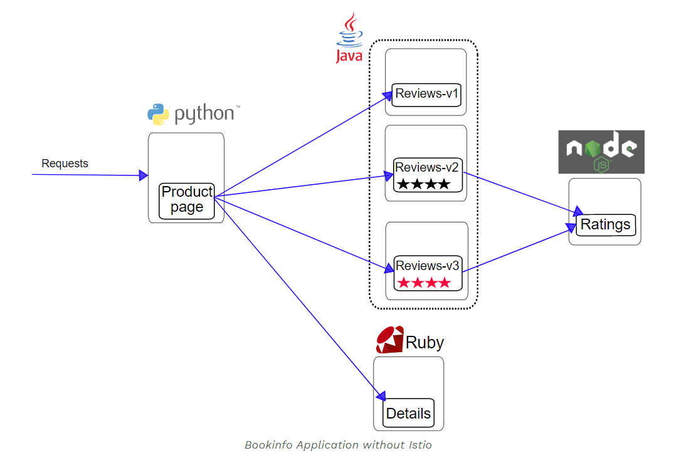
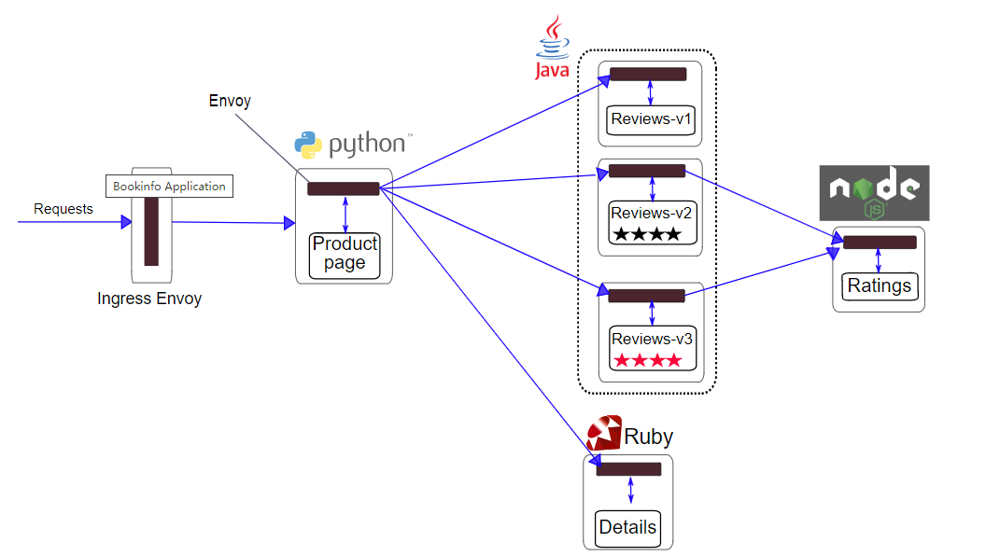

# Bookinfo 示例

Bookinfo 是 Istio 社区官方推荐的示例应用之一。它可以用来演示多种 Istio 的特性，并且它是一个异构的微服务应用。该应用由四个单独的微服务构成。 这个应用模仿了在线书店，可以展示书店中书籍的信息。例如页面上会显示一本书的描述，书籍的细节（ ISBN、页数等），以及关于这本书的一些评论。 

Bookinfo 应用分为四个单独的微服务， 这些服务对 Istio 并无依赖，但是构成了一个有代表性的服务网格的例子：它由多个不同语言编写的服务构成，并且其中有一个应用会包含多个版本。 


- `productpage` 会调用 `details` 和 `reviews` 两个微服务，用来生成页面。
- `details` 中包含了书籍的信息。
- `reviews ` 中包含了书籍相关的评论。它还会调用 `ratings` 微服务。
- `ratings` 中包含了由书籍评价组成的评级信息。

`reviews` 微服务有 3 个版本，可用来展示各服务之间的不同的调用链路：

- v1 版本不会调用 `ratings` 服务。
- v2 版本会调用 `ratings` 服务，并使用 1 到 5 个黑色星形图标来显示评分信息。
- v3 版本会调用 `ratings` 服务，并使用 1 到 5 个红色星形图标来显示评分信息。

下图展示了这个应用的端到端架构。



## 环境准备

3.1.1安装 Istio 小节中描述了 Istio 系统的安装，确认 Istio 安装成功之后，在 Istio 目录下的 samples/bookinfo 下可以找到 Bookinfo 部署和源码文件，使用 kubernetes 命令就可以实现 Bookinfo 的安装部署。

## 部署应用

 想要将应用接入 Istio 服务网格，需要将应用所在的命名空间进行 yaml 配置，以打入对应可自动注入 Sidecar的标签，通过重启应用来完成自动加入网格的动作。最终加入到服务网格中的 Bookinfo 应用架构如下所示：



所有的微服务都和 Envoy sidecar 集成在一起，被集成服务所有的出入流量都被 sidecar 所劫持，这样就为外部控制准备了所需的 Hook，然后就可以利用 Istio 控制平面下发对应的 XDS 协议从而使 Envoy Sidecar 为应用提供服务路由、遥测数据收集以及策略实施等功能。 

## 启动应用服务

- 进入 Istio 安装目录。

- Istio 默认自动注入 Sidecar. 请为 `default` 命名空间打上标签 `istio-injection=enabled`：
```bash
$ kubectl label namespace default istio-injection=enabled
```
-  使用 `kubectl` 部署应用：
```bash
$ kubectl apply -f samples/bookinfo/platform/kube/bookinfo.yaml
```

如果您在安装过程中禁用了 Sidecar 自动注入功能而选择手动注入 Sidecar，请在部署应用之前使用 `istioctl kube-inject`命令修改 `bookinfo.yaml` 文件，该命令可以从 Istio ConfigMap中动态获取网格配置。
```bash
$ kubectl apply -f <(istioctl kube-inject -f samples/bookinfo/platform/kube/bookinfo.yaml)
```

在实际部署中，微服务版本的启动过程需要持续一段时间，并不是同时完成的，上面的命令会启动全部的四个服务，其中也包括了 reviews 服务的三个版本（v1、v2 以及 v3）。

-  确认所有的服务和 Pod 都已经正确的定义和启动：
```bash
$ kubectl get services
   NAME                       CLUSTER-IP   EXTERNAL-IP   PORT(S)              AGE
   details                    10.0.0.31    <none>        9080/TCP             6m
   kubernetes                 10.0.0.1     <none>        443/TCP              7d
   productpage                10.0.0.120   <none>        9080/TCP             6m
   ratings                    10.0.0.15    <none>        9080/TCP             6m
   reviews                    10.0.0.170   <none>        9080/TCP             6m
```
```bash
$ kubectl get pods
   NAME                                        READY     STATUS    RESTARTS   AGE
   details-v1-1520924117-48z17                 2/2       Running   0          6m
   productpage-v1-560495357-jk1lz              2/2       Running   0          6m
   ratings-v1-734492171-rnr5l                  2/2       Running   0          6m
   reviews-v1-874083890-f0qf0                  2/2       Running   0          6m
   reviews-v2-1343845940-b34q5                 2/2       Running   0          6m
   reviews-v3-1813607990-8ch52                 2/2       Running   0          6m
```

- 要确认 Bookinfo 应用是否正在运行，请在某个 Pod 中用 `curl` 命令对应用发送请求，例如 `ratings`：
```bash
$ kubectl exec -it $(kubectl get pod -l app=ratings -o jsonpath='{.items[0].metadata.name}') -c ratings -- curl productpage:9080/productpage | grep -o "<title>.*</title>"
   <title>Simple Bookstore App</title>
```

## 确定 Ingress 的 IP 和端口

现在 Bookinfo 服务启动并运行中，您需要使应用程序可以从外部访问 Kubernetes 集群，可以使用浏览器通过访问 Istio Gateway 来访问应用，通过以下操作步骤来实现。

- 为应用程序定义 Ingress 网关：
```bash
$ kubectl apply -f samples/bookinfo/networking/bookinfo-gateway.yaml
```

- 确认网关创建完成：
```bash
$ kubectl get gateway
   NAME               AGE
   bookinfo-gateway   32s
```

- 设置访问网关的 `INGRESS_HOST` 和 `INGRESS_PORT` 变量，例如node port模式。即当前环境未使用外部负载均衡器，需要通过 node port 访问。执行如下命令
```bash
$ export INGRESS_PORT=$(kubectl -n istio-system get service istio-ingressgateway -o jsonpath='{.spec.ports[?(@.name=="http2")].nodePort}')
$ export SECURE_INGRESS_PORT=$(kubectl -n istio-system get service istio-ingressgateway -o jsonpath='{.spec.ports[?(@.name=="https")].nodePort}')
 $ export INGRESS_HOST=127.0.0.1
```

- 设置 `GATEWAY_URL`：
```bash
$ export GATEWAY_URL=$INGRESS_HOST:$INGRESS_PORT
```

## 集群外部访问应用
确认可以用浏览器打开网址`http://$GATEWAY_URL/productpage`，来浏览应用的 Web 页面。如果刷新几次应用的页面，就会看到 `productpage` 页面中会随机展示 `reviews` 服务的不同版本的效果（红色、黑色的星形或者没有显示）。`reviews` 服务出现这种情况是因为默认情况下的配置会随机访问三个版本，如果想设置个性化配置则可以用 Istio 来控制版本的路由。


## 下一步

现在就可以使用这一应用来体验 Istio 的特性了，其中包括了流量的路由、故障注入、熔断等。 接下来可以根据个人爱好去研究和试验这些功能，可参见后续 3.2 入门实践章节内容。

## 清理

结束对 Bookinfo 示例应用的体验之后，就可以使用官方提供的脚本直接清理即可：

- 删除路由规则，并销毁应用的 Pod
```bash
$ samples/bookinfo/platform/kube/cleanup.sh
```

- 确认应用已经关停
```bash
   $ kubectl get virtualservices   #-- there should be no virtual services
   $ kubectl get destinationrules  #-- there should be no destination rules
   $ kubectl get gateway           #-- there should be no gateway
   $ kubectl get pods              #-- the Bookinfo pods should be deleted
```

## 参考资料：
https://preliminary.istio.io/zh/docs/examples/bookinfo 

