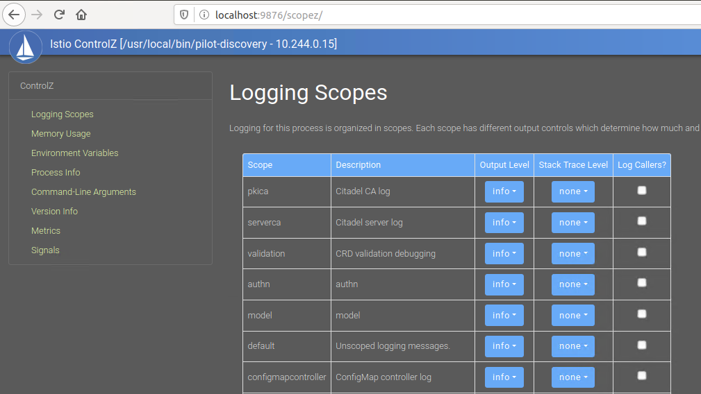

# ControlZ 自检工具

通过上文分析，istioctl 工具在诊断 Istio 配置方面提供了很多非常有效的命令，可以帮助用户尽快发现问题所在并且及时修复它们。除此之外，Istio 还提供了一个基于 web 的可视化自检工具可用于对控制平面的组件进行自检，它使查看和调整正在运行组件的内部状态变得更加容易，这个工具就是 ControlZ。在 Istio 1.5 版本之前，由于控制平面的各个组件都是独立部署的，因此类似于 Pilot、Galley、Mixer 等都拥有各自对应的 ControlZ 查看页面，自 1.5 版本之后，控制面组件合并成了单一的 istiod，对应的 ControlZ 工具页面也统一成了一个。默认情况下，我们使用 istioctl 的 dashboard 命令来开启 ：

```bash
export ISTIOD_POD=$(kubectl get pod -n istio-system -l app=istiod -o jsonpath='{.items[0].metadata.name}')
istioctl dashboard controlz $ISTIOD_POD -n istio-system
```

如果你运行的环境有安装浏览器的话，将会自动打开并且跳转到 ControlZ 的 web 页面，如下图所示：


默认打开首页中显示了当前组件的一些基本信息，例如进程名称、当前堆大小、GC 次数、组件当前时间、Host 名称以及 IP 地址信息，上述信息是实时动态刷新的，通过这些数据可以对组件有一些基础信息了解。

此外首页中有一个 Terminate Process 按钮可以用来直接关闭当前的组件进程，由于配置了健康检查，如果进程被关闭 pod 将会自动被重启，不过在组件开发过程中，通过该页面观察组件状态，当发现异常直接通过页面重启也不失为一种处理方法。

## 查看/修改组件日志记录范围

当我们在调试 istiod 组件时，往往会结合组件本身的日志进行一些问题排查，但是组件默认可能不会打印一些模块日志，ControlZ 工具提供了一个可视化的日志打印范围调整工具，直接通过点击左侧菜单即可访问：



表格中展示的是组件内的日志作用域以及相应的描述信息，可以直接对某个特定的作用域进行日志输出级别调整，默认这些日志作用域的日志输出都是关闭的，如果希望打开日志，只需在表格的最后一列进行勾选即可，这个操作是实时生效的。

## 查看组件内部的其它信息

通过 ControlZ 工具除了上节中提到可以对 Istio 组件进行日志作用域设置之外，其余的几个子页面基本上都是内部的一些信息展示，这些信息分别是内存使用详情、环境变量信息、进程信息、命令行参数、版本信息、监控指标等等，用户可以根据自己关心的内容点开相应的子页面进行查看，以便更好的诊断组件自身是否存在问题。

## 参考

- [Component Introspection](https://istio.io/docs/ops/diagnostic-tools/controlz/)
- [Component Logging](https://istio.io/docs/ops/diagnostic-tools/component-logging/)