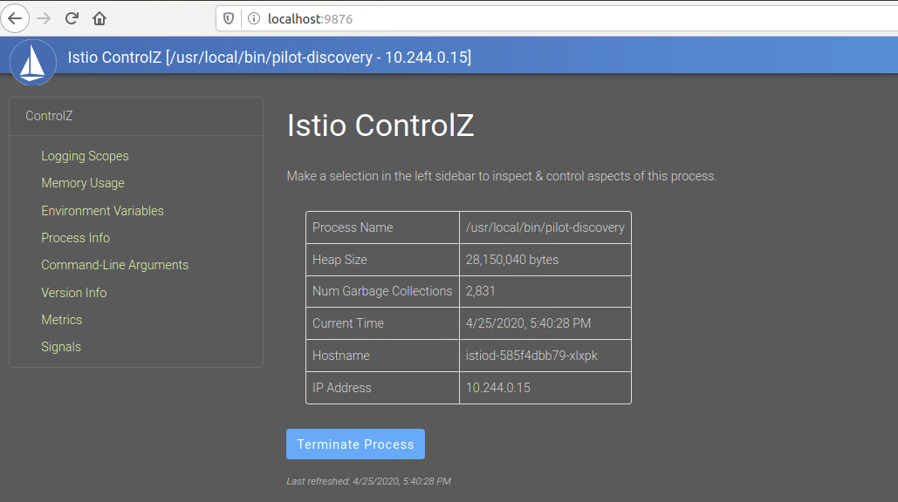

# 诊断工具

“工欲善其事，必先利其器。” —— 这句话出自《论语》，常常被用于比喻想要做好一件事，首先应该把准备工作做充分，例如工具就非常重要。对于 Istio 而言同样如此，为了提高用户在网格使用过程中用户体验和问题排查效率，社区在文档方面的投入有目共睹，从概念介绍、安装指引、入门任务、应用示例、问题排查以及操作运维等方面做得面面俱到，在开源项目中可以堪称典范。

尤其在网格的问题诊断方面，除了在文档方面提供帮助之外，最重要的是提供了配套的辅助诊断工具，本章节将重点介绍如何使用 istioctl 和 ControlZ 这两个工具来对网格进行问题的诊断分析。

## istioctl 命令行工具

istioctl 是官方提供的一个基于命令行的辅助工具，它的版本更新发布与 Istio 版本是绑定的，因为截至目前为止 istioctl 的源码和 Istio 共用一个 git 仓库，作为 Istio 的一个组成部分，只是在发布时考虑用户的分发便捷性独立拆分出了一个二进制文件。从官方对于 istioctl 的定位来看，它并不只是局限于问题诊断方面，同时也涵盖运维相关的职责，例如手工注入sidecar、把服务加入/移除网格、升级网格控制面、管理网格多集群等等，不过下文将侧重介绍下 istioctl 工具在诊断问题方面的相关使用。

### 安装 istioctl 工具

官方提供了一种极为便捷、云原生友好的工具安装方式，在目标环境网络通畅的前提下，通过 curl 命令即可直接下载 istioctl 工具：

```bash
$ curl -sL https://istio.io/downloadIstioctl | sh -
```

上述的命令默认会下载当前最新的 istioctl 二进制文件到本地 `$HOME/.istioctl/bin` 目录，为了后续操作方便，建议将 istioctl 工具添加到用户的 PATH 环境变量中：

```bash
$ export PATH=$PATH:$HOME/.istioctl/bin
```

上述的 PATH 变量修改是临时的，重新登录便会失效，可以通过修改 bash 或者 ZSH 配置文件添加 PATH 环境变量来确保每次登录后都能直接使用 istioctl 命令。

如过你使用的是 bash 或者是 ZSH，还可以参考官方的 [配置自动补全教程](https://istio.io/docs/ops/diagnostic-tools/istioctl/#enabling-auto-completion) 来为 istioctl 工具添加自动补全命令的能力以提升后续的使用体验，这个配置是可选的。

安装完成之后，直接执行 istioctl 即可看到所有支持子命令的相关介绍如下：

```bash
$ istioctl
Istio configuration command line utility for service operators to
debug and diagnose their Istio mesh.

Usage:
  istioctl [command]

Available Commands:
  analyze         Analyze Istio configuration and print validation messages
  authn           Interact with Istio authentication policies
  authz           (authz is experimental. Use `istioctl experimental authz`)
  convert-ingress Convert Ingress configuration into Istio VirtualService configuration
  dashboard       Access to Istio web UIs
  deregister      De-registers a service instance
  experimental    Experimental commands that may be modified or deprecated
  help            Help about any command
  kube-inject     Inject Envoy sidecar into Kubernetes pod resources
  manifest        Commands related to Istio manifests
  operator        Commands related to Istio operator controller.
  profile         Commands related to Istio configuration profiles
  proxy-config    Retrieve information about proxy configuration from Envoy [kube only]
  proxy-status    Retrieves the synchronization status of each Envoy in the mesh [kube only]
  register        Registers a service instance (e.g. VM) joining the mesh
  upgrade         Upgrade Istio control plane in-place
  validate        Validate Istio policy and rules (NOTE: validate is deprecated and will be removed in 1.6. Use 'istioctl analyze' to validate configuration.)
  verify-install  Verifies Istio Installation Status or performs pre-check for the cluster before Istio installation
  version         Prints out build version information
```

如上所示，istioctl 工具的介绍里写明这是一个为服务操作人员提供的基于命令行的程序，用于调试和诊断 Istio 服务网格的。每个命令都可以通过对应的介绍说明看出它的基本作用，如果希望详细了解下具体某个命令的用法，可以通过执行 `istioctl [command] -h` 来查看详细介绍，大部分命令都提供了参数说明和使用示例，上手非常容易。

支持的命令里，manifest 、kube-inject、operator、profile、register、deregister、upgrade 等主要侧重于安装运维等，本书其它章节另有讲解，此章不做深入展开介绍，有兴趣的读者可参阅相应章节或者直接查看命令使用帮助，下文将重点讲解与网格问题诊断相关的命令。

### 使用 verify-install 命令进行安装预检查

verify-install 严格上将不算是网格的诊断工具，因为它的作用在在网格安装前对集群进行预检查，通过它可以诊断出目标环境是否能够支持当前的网格安装，通过预检查手段，可以有效的避免后续在安装过程或者是安装后出现的问题，使用方式也非常简单，直接执行下述命令：

```bash
$ istioctl verify-install             

Checking the cluster to make sure it is ready for Istio installation...

#1. Kubernetes-api
-----------------------
Can initialize the Kubernetes client.
Can query the Kubernetes API Server.

#2. Kubernetes-version
-----------------------
Istio is compatible with Kubernetes: v1.13.12.

#3. Istio-existence
-----------------------
Istio cannot be installed because the Istio namespace 'istio-system' is already in use

#4. Kubernetes-setup
-----------------------
Can create necessary Kubernetes configurations: Namespace,ClusterRole,ClusterRoleBinding,CustomResourceDefinition,Role,ServiceAccount,Service,Deployments,ConfigMap. 

#5. SideCar-Injector
-----------------------
This Kubernetes cluster supports automatic sidecar injection. To enable automatic sidecar injection see https://istio.io/docs/setup/kubernetes/additional-setup/sidecar-injection/#deploying-an-app

-----------------------

Error: 1 error occurred:
	* Istio cannot be installed because the Istio namespace 'istio-system' is already in use
```

命令的执行结果表明工具会从多个维度检查当前环境是否能够正常部署一套全新的 Istio 网格，例如上述信息中因为已经部署了一套 Istio 导致无法重复安装。

正常情况下，如果检查够都能通过，那就表明我们可以开始通过 manifest 命令进行安装操作了。

### 使用 proxy-status 查看配置状态

Istio 网格安装完成后，如果在全新的环境上部署，我们可以使用官方的 Bookinfo demo 进行简单的功能验证。

前面章节中介绍了 istio 系统的核心是基于 envoy 来实现流量管理，其本质是通过控制面来生成和下发对应的配置给数据面，因此配置的下发在整个系统是非常重要的一环，这也是用户最为关心的内容，如果配置由于网络或者是控制面异常导致没有同步成功，数据面的流量控制将会产生一些不符合预期的问题。

因此，istioctl 针对配置的状态和内容检查提供了两个非常实用的命令，其中一个就是本节要介绍的 proxy-status 命令，它为用户提供了获取网格集群内的所有被注入 sidecar 的 pod 配置同步状态，首先查看 proxy-status 的使用帮助：

```bash
$ istioctl ps -h  

Retrieves last sent and last acknowledged xDS sync from Pilot to each Envoy in the mesh

Usage:
  istioctl proxy-status [<pod-name[.namespace]>] [flags]

Aliases:
  proxy-status, ps

Examples:
# Retrieve sync status for all Envoys in a mesh
	istioctl proxy-status

# Retrieve sync diff for a single Envoy and Pilot
	istioctl proxy-status istio-egressgateway-59585c5b9c-ndc59.istio-system


Flags:
  -h, --help       help for proxy-status
  -s, --sds        (experimental) Retrieve synchronization between active secrets on Envoy instance with those on corresponding node agents
      --sds-json   Determines whether SDS dump outputs JSON

Global Flags:
      --context string            The name of the kubeconfig context to use
  -i, --istioNamespace string     Istio system namespace (default "istio-system")
  -c, --kubeconfig string         Kubernetes configuration file
      --log_output_level string   Comma-separated minimum per-scope logging level of messages to output, in the form of <scope>:<level>,<scope>:<level>,... where scope can be one of [ads, all, analysis, attributes, authn, cache, citadelclient, configmapcontroller, default, googleca, grpcAdapter, installer, mcp, model, patch, processing, rbac, resource, sds, secretfetcher, source, stsclient, tpath, translator, util, validation, vault] and level can be one of [debug, info, warn, error, fatal, none] (default "default:info,validation:error,processing:error,source:error,analysis:warn,installer:warn,translator:warn")
  -n, --namespace string          Config namespace
```

从 proxy-status 的介绍看来，这是一个用于检查 istiod 和 envoy 之间配置同步状态的命令，因为是基于 grpc 方式进行通信的，所以判断配置是否有同步下发成功的重要依据条件是 envoy 端是否有应答，如果应答正确，则代表配置已经同步成功。

#### 检查网格中所有配置同步状态

根据命令的帮助提示说明，我们直接执行缩写的 `istioctl ps` 命令即可对网格内的配置状态进行检查：

```bash
$ istioctl ps
NAME                                                   CDS        LDS        EDS        RDS          PILOT                       VERSION
details-v1-68fbb76fc-p5vvc.default                     SYNCED     SYNCED     SYNCED     SYNCED       istiod-585f4dbb79-xlxpk     1.5.1
istio-egressgateway-c8bdb49df-lrhv9.istio-system       SYNCED     SYNCED     SYNCED     NOT SENT     istiod-585f4dbb79-xlxpk     1.5.1
istio-ingressgateway-86f6dbfc55-zznmg.istio-system     SYNCED     SYNCED     SYNCED     SYNCED       istiod-585f4dbb79-xlxpk     1.5.1
productpage-v1-77d9f9fcdf-psv2z.default                SYNCED     SYNCED     SYNCED     SYNCED       istiod-585f4dbb79-xlxpk     1.5.1
prometheus-cd6d96668-699cq.istio-system                SYNCED     SYNCED     SYNCED     SYNCED       istiod-585f4dbb79-xlxpk     1.5.1
ratings-v1-7bdfd65ccc-lbxq9.default                    SYNCED     SYNCED     SYNCED     SYNCED       istiod-585f4dbb79-xlxpk     1.5.1
reviews-v1-6b7ddfc889-9xrb9.default                    SYNCED     SYNCED     SYNCED     SYNCED       istiod-585f4dbb79-xlxpk     1.5.1
reviews-v2-575b55477f-m5wrs.default                    SYNCED     SYNCED     SYNCED     SYNCED       istiod-585f4dbb79-xlxpk     1.5.1
reviews-v3-6584c5887c-fl59f.default                    SYNCED     SYNCED     SYNCED     SYNCED       istiod-585f4dbb79-xlxpk     1.5.1
```

从输出结果看，主要包含了两部分信息，分别是 xds 配置对应不同类型的同步状态，包含 CDS、LDS、EDS、RDS ，另外部分是 pod 所连接的控制面信息，包括 istiod 对应的 pod 名称和版本信息。

针对 xds 的不同类型配置对应在 pod 维度都有一个独立的同步状态，定义如下：

**SYNCED**：正常状态，表明最后一次配置同步操作已经从 istiod 下发到了 envoy，并且收到了正确应答。

**NOT SENT**：表示 istiod 还没有发送任何配置给 envoy，这往往是因为没有配置可以下发，例如上述示例列表中的 istio-egressgateway 这个 pod，因为默认我们没有配置任何外部服务，所以 EDS 的配置是空的，对应的配置状态就是 NOT SENT。

**STALE**：异常状态，它表示 istiod 已经发送了一个配置更新请求给 envoy，但是并没有收到任何的应答，这种情况往往是由于 envoy 和 istiod 之间的网络原因或者是 istio 本身存在的 bug 导致的。

从内部实现上来，`istioctl ps` 获取配置的同步状态信息是依赖于 istiod 控制面实现的，如果你没有在结果列表中找到某个特定 pod，那说明它还没有正常连接至 istiod 控制面，或者是可能根本就没有被注入 sidecar，需要检查下 pod 的 sidecar 注入状态，比如通过 `kubectl get pod -n <namespace> ` 来查看 pod 数量，或者是通过 `kubectl describe pod <pod-name>` 查看 Containers 信息里有没有 istio-proxy，也有更加直接的 describe 命令可以用来直接检查 pod 是否已加入网格，下文另有介绍。

#### 检查 Envoy 和 istiod 之间的配置差异

默认情况下，ps 后面如果不带参数显示的是整个集群内已经注入 sidecar 的 pod 配置状态，并且显示的是比较简要的同步信息。如果想详细检查某个 pod 对应数据面和控制面之间的配置详细差异内容，可以通过 `istioctl ps <pod-name>` 来检查 pod 里的详细的配置差异，如果配置都同步成功，应该是如下结果：

```bash
$ istioctl ps productpage-v1-77d9f9fcdf-psv2z.default
Clusters Match
Listeners Match
Routes Match (RDS last loaded at Tue, 21 Apr 2020 19:55:15 CST)
```

输出中显示了 xds 中的几个关键配置在数据面和控制面是匹配的，如果 istiod 和 envoy 间的配置存在差异，则会显示如下信息：

```bash
$ istioctl ps productpage-v1-77d9f9fcdf-n9tjc.default            
Clusters Match
--- Pilot Listeners
+++ Envoy Listeners
@@ -1,10 +1,11 @@
 {
    "dynamicListeners": [
       # 此处省略大量差异配置文本
     ]
 }  
Routes Don't Match (RDS last loaded at Tue, 21 Apr 2020 18:18:42 CST)
--- Pilot Routes
+++ Envoy Routes
@@ -1,14 +1,31 @@
 {
    "dynamicRouteConfigs": [
       # 此处省略大量差异配置文本
	]
 }
```

上述显示了 `productpage` 这个服务对应 pod 中的 envoy 配置和 istiod 的配置 Clusters 信息是一致的，但是 Listeners 和 Routes 信息存在差异，并显示了内容的差异项，需要留意的是，istio 1.5.0 版本中在对比配置时，会把配置项排列顺序不一致也当成是差异，导致在执行 `istioctl ps <pod-name>` 命令时会给出很多不一致差异内容误报，该问题已经在 1.5.1 版本中修复。

配置的正常同步下发是 istio 后续流量管理控制的基础，也是比较容易发现的问题，需要优先解决处理。如果发现集群内的配置同步存在问题，需要检查控制面和数据面的网络是否存在不稳定，或者是两者版本信息不一致等。

### 使用 proxy-config 命令检查配置详情

上节中我们介绍了 proxy-status 命令，在排查 istiod 和 envoy 之间的配置是否同步问题上为我们提供了帮助。但在实际的使用过程中，大部分问题往往并不是由于同步问题导致的，而是由于配置错误引发的，如果想要详细诊断 Istio 的配置详情，就需要介绍另一个配置相关命令，那就是 proxy-config ,  与 proxy-status 类似，它也有对应的缩写，区别是 proxy-config 提供了子命令，可以指定具体的配置类型进行查看，我们直接运行查看使用说明：

```bash
$ istioctl pc -h
A group of commands used to retrieve information about proxy configuration from the Envoy config dump

Usage:
  istioctl proxy-config [command]

Aliases:
  proxy-config, pc

Examples:
  # Retrieve information about proxy configuration from an Envoy instance.
  istioctl proxy-config <clusters|listeners|routes|endpoints|bootstrap> <pod-name[.namespace]>

Available Commands:
  bootstrap   Retrieves bootstrap configuration for the Envoy in the specified pod
  cluster     Retrieves cluster configuration for the Envoy in the specified pod
  endpoint    Retrieves endpoint configuration for the Envoy in the specified pod
  listener    Retrieves listener configuration for the Envoy in the specified pod
  log         (experimental) Retrieves logging levels of the Envoy in the specified pod
  route       Retrieves route configuration for the Envoy in the specified pod
  secret      (experimental) Retrieves secret configuration for the Envoy in the specified pod

Flags:
  -h, --help            help for proxy-config
  -o, --output string   Output format: one of json|short (default "short")

Global Flags:
      --context string            The name of the kubeconfig context to use
  -i, --istioNamespace string     Istio system namespace (default "istio-system")
  -c, --kubeconfig string         Kubernetes configuration file
      --log_output_level string   Comma-separated minimum per-scope logging level of messages to output, in the form of <scope>:<level>,<scope>:<level>,... where scope can be one of [ads, all, analysis, attributes, authn, cache, citadelclient, configmapcontroller, default, googleca, grpcAdapter, installer, mcp, model, patch, processing, rbac, resource, sds, secretfetcher, source, stsclient, tpath, translator, util, validation, vault] and level can be one of [debug, info, warn, error, fatal, none] (default "default:info,validation:error,processing:error,source:error,analysis:warn,installer:warn,translator:warn")
  -n, --namespace string          Config namespace

Use "istioctl proxy-config [command] --help" for more information about a command.
```

proxy-config 的子命令支持了基本上 envoy 所涉及的所有配置类型，除了 xds 之外，甚至连日志的配置级别都能够查询，不过目前仍然是一个实验性的功能。proxy-config 在结果的输出上，除了支持默认的 short 类型之外，还支持 json 格式的内容展示，前者只是简单的将结果进行筛选并通过列表的形式进行输出，在视图上更加友好，但是相对来说输出内容有限，可能会有一些关键配置信息遗漏。json 格式则是一个全面的配置结果展示，在诊断问题的时候，比较推荐使用 json 格式输出进行查看。

#### 查看指定 pod 的网格配置详情

例如我们想要查看 productpage 这个服务对应的 cluster 配置信息，直接通过下述命令就可以获取：

```bash
$ istioctl pc cluster productpage-v1-77d9f9fcdf-psv2z.default
SERVICE FQDN                                                 PORT      SUBSET         DIRECTION     TYPE
BlackHoleCluster                                             -         -              -             STATIC
InboundPassthroughClusterIpv4                                -         -              -             ORIGINAL_DST
PassthroughCluster                                           -         -              -             ORIGINAL_DST
details.default.svc.cluster.local                            9080      -              outbound      EDS
grafana.istio-system.svc.cluster.local                       3000      -              outbound      EDS
httpbin.default.svc.cluster.local                            8000      -              outbound      EDS
istio-egressgateway.istio-system.svc.cluster.local           80        -              outbound      EDS
istio-egressgateway.istio-system.svc.cluster.local           443       -              outbound      EDS
# 省略部分相似 cluster 信息
```

上述命令中也可以替换成其它支持的类型来获取对应的 envoy 配置，如果希望展示更加全面的信息，需要指定配置的输出类型为 json，如下所示：

```bash
$ istioctl pc cluster productpage-v1-77d9f9fcdf-psv2z.default -o json  
[
    {
        "name": "BlackHoleCluster",
        "type": "STATIC",
        "connectTimeout": "1s",
        "filters": [
            {
                "name": "envoy.filters.network.upstream.metadata_exchange",
                "typedConfig": {
                    "@type": "type.googleapis.com/udpa.type.v1.TypedStruct",
                    "typeUrl": "type.googleapis.com/envoy.tcp.metadataexchange.config.MetadataExchange",
                    "value": {
                        "protocol": "istio-peer-exchange"
                    }
                }
            }
        ]
    },
    {
        "name": "InboundPassthroughClusterIpv4",
        "type": "ORIGINAL_DST",
        "connectTimeout": "1s",
        "lbPolicy": "CLUSTER_PROVIDED",
        "circuitBreakers": {
            "thresholds": [
                {
                    "maxConnections": 4294967295,
                    "maxPendingRequests": 4294967295,
                    "maxRequests": 4294967295,
                    "maxRetries": 4294967295
                }
            ]
        },
    # 此处省去大量类似的配置
```

json 格式输出的配置信息基本上是 envoy 原生的配置格式定义，相比 short 类型的格式，json 里还能展示到更加细节的配置内容，比如上述结果里的连接超时配置、负载均衡策略、熔断参数配置等等。

#### 通过过滤条件快速定位配置内容

通过 json 格式输出的配置内容虽然很详细，但是仍然不利于我们诊断具体的问题，实际场景中我们往往只关注具体的某个服务端口或者是已经确定是 inbound 方向出了问题，这个时候我们可以通过再添加过滤的条件将配置的输出范围再缩小一些，根据命令介绍我们添加 `--port` 和 `--direction` 参数：

```bash
$ istioctl pc cluster productpage-v1-77d9f9fcdf-psv2z.default --port 9080 --direction inbound -o json
[
    {
        "name": "inbound|9080|http|productpage.default.svc.cluster.local",
        "type": "STATIC",
        "connectTimeout": "1s",
        "loadAssignment": {
            "clusterName": "inbound|9080|http|productpage.default.svc.cluster.local",
            "endpoints": [
                {
                    "lbEndpoints": [
                        {
                            "endpoint": {
                                "address": {
                                    "socketAddress": {
                                        "address": "127.0.0.1",
                                        "portValue": 9080
                                    }
                                }
                            }
                        }
                    ]
                }
            ]
        },
        "circuitBreakers": {
            "thresholds": [
                {
                    "maxConnections": 4294967295,
                    "maxPendingRequests": 4294967295,
                    "maxRequests": 4294967295,
                    "maxRetries": 4294967295
                }
            ]
        }
    }
]
```

通过添加特定条件的对配置进行过滤，能够非常精确的输出我们想要的具体某块配置，方便我们进行问题的诊断和定位，比如检查下 endpoint 信息是否正确、服务治理配置是否存在问题等等。

### 使用 analyze 命令诊断网格配置

上文中介绍了 proxy-status 和 proxy-config 两个配置相关的命令，通过它们可以很方便得检查网格内的配置同步状态，并且能够快速获取特定某个 pod 内对应 envoy 上用户关心的某块配置，极大提高了在配置检查方面的效率。如果说这两个命令足以满足用户日常的配置诊断场景的话，那接下来要介绍的同样集成在 istioctl 工具里的可以算的上是另外一个诊断利器，那就是 analyze 命令。

istioctl analyze 是一个专用于分析和定位问题的命令，可以理解成这是一个基于配置的更加上层的诊断工具，帮助用户发现网格内存在的潜在问题，该命令可以针对一个正在运行的集群，或者是一堆本地配置文件，甚至还可以针对多个文件和在线集群组合进行分析，以帮助用户在配置被应用到集群之前进行分析检查，从而预防一些潜在的配置问题。

通过自带的帮助参数来查看命令的使用方式：

```bash
$ istioctl analyze -h  
Analyze Istio configuration and print validation messages

Usage:
  istioctl analyze <file>... [flags]

Examples:

# Analyze the current live cluster
istioctl analyze

# Analyze the current live cluster, simulating the effect of applying additional yaml files
istioctl analyze a.yaml b.yaml my-app-config/

# Analyze the current live cluster, simulating the effect of applying a directory of config recursively
istioctl analyze --recursive my-istio-config/

# Analyze yaml files without connecting to a live cluster
istioctl analyze --use-kube=false a.yaml b.yaml my-app-config/

# Analyze the current live cluster and suppress PodMissingProxy for pod mypod in namespace 'testing'.
istioctl analyze -S "IST0103=Pod mypod.testing"

# Analyze the current live cluster and suppress PodMissingProxy for all pods in namespace 'testing',
# and suppress MisplacedAnnotation on deployment foobar in namespace default.
istioctl analyze -S "IST0103=Pod *.testing" -S "IST0107=Deployment foobar.default"

# List available analyzers
istioctl analyze -L


Flags:
  -A, --all-namespaces            Analyze all namespaces
      --color                     Default true.  Disable with '=false' or set $TERM to dumb (default true)
      --failure-threshold Level   The severity level of analysis at which to set a non-zero exit code. Valid values: [Info Warn Error] (default Warn)
  -h, --help                      help for analyze
  -L, --list-analyzers            List the analyzers available to run. Suppresses normal execution.
      --meshConfigFile string     Overrides the mesh config values to use for analysis.
  -o, --output string             Output format: one of [log json yaml] (default "log")
      --output-threshold Level    The severity level of analysis at which to display messages. Valid values: [Info Warn Error] (default Info)
  -R, --recursive                 Process directory arguments recursively. Useful when you want to analyze related manifests organized within the same directory.
  -S, --suppress stringArray      Suppress reporting a message code on a specific resource. Values are supplied in the form <code>=<resource> (e.g. '--suppress "IST0102=DestinationRule primary-dr.default"'). Can be repeated. You can include the wildcard character '*' to support a partial match (e.g. '--suppress "IST0102=DestinationRule *.default" ).
      --timeout duration          the duration to wait before failing (default 30s)
  -k, --use-kube                  Use live Kubernetes cluster for analysis. Set --use-kube=false to analyze files only. (default true)
  -v, --verbose                   Enable verbose output

Global Flags:
      --context string            The name of the kubeconfig context to use
  -i, --istioNamespace string     Istio system namespace (default "istio-system")
  -c, --kubeconfig string         Kubernetes configuration file
      --log_output_level string   Comma-separated minimum per-scope logging level of messages to output, in the form of <scope>:<level>,<scope>:<level>,... where scope can be one of [ads, all, analysis, attributes, authn, cache, citadelclient, configmapcontroller, default, googleca, grpcAdapter, installer, mcp, model, patch, processing, rbac, resource, sds, secretfetcher, source, stsclient, tpath, translator, util, validation, vault] and level can be one of [debug, info, warn, error, fatal, none] (default "default:info,validation:error,processing:error,source:error,analysis:warn,installer:warn,translator:warn")
  -n, --namespace string          Config namespace
```

帮助信息里的使用示例已经覆盖了绝大多数的使用场景，包括分析集群配置、分析文件配置、组合进行分析等等，默认 analyze 命令只会分析 default namespace 下的配置问题，如果你希望针对所有的 namespace 进行配置分析，需要添加参数 `--all-namespaces` 或者缩写 `-A` 来指明分析范围。

#### 通过 analyze 命令诊断网格集群

参考帮助说明，直接通过运行下述命令来对集群内的网格进行分析：

```bash
$ istioctl analyze
```

仅此而已，无需输入其它参数，这个命令就能够通过收集当前集群内的 Istio 配置，分析出存在的潜在问题风险。举个例子，如果默认安装 bookinfo 的 namespace 没有添加自动注入标签的话，这条命令的执行结果就会将这个问题诊断出来：

```bash
$ istioctl analyze
Warn [IST0102](Namespace default) The namespace is not enabled for Istio injection. Run 'kubectl label namespace default istio-injection=enabled' to enable it, or 'kubectl label namespace default istio-injection=disabled' to explicitly mark it as not needing injection
```

从结果输出来看，这是一条告警，详细描述了潜在的问题并为我们提供了相对应的解决方案，比如上面就提示我们可以通过执行 `'kubectl label namespace default istio-injection=enabled'` 命令来为 default namespace 添加 Istio 自动注入的标签，非常人性化。此外，每条问题对应有一个 `IST` 开头的编号，这是 Istio 专门为诊断问题而定义的错误信息编号，截止目前为止，analyze 命令支持多达几十种问题类型，并且仍然在不断的补充完善，详细内容列表可参考 [Istio 配置分析信息](https://istio.io/docs/reference/config/analysis/)。

每一种问题类型基本上都有对应的详细解释，以其中编号 `IST0105` 为例，文档中对错误进行了定义说明：

错误的名称为 `IstioProxyImageMismatch` ，代表 Istio 的某个 pod 数据面 Proxy 镜像与控制面的定义不一致，这个问题的级别是告警，而且这个错误可能会在以下的情况下被触发：

- 启用了 sidecar 自动注入功能
- pod 在启用了 sidecar 注入的命名空间中运行（命名空间带有标签 `istio-injection=enabled`）。
- sidecar 上运行的代理版本与自动注入使用的版本不匹。

文档中还指出这个问题往往发生在升级 Istio 控制平面后，但是 pod 没有被重建。升级 Istio（包括 sidecar 注入）后，用户必须重新创建 Istio sidecar 的所有正在运行的工作负载，以允许注入新版本的 sidecar。

并且给出了相关的问题解决思路：

通过使用常规的部署策略重新部署应用来更新 sidecar 版本是最简单的方式。对于 Kubernetes deployment：

- 如果您使用的是 Kubernetes 1.15 或更高版本，则可以运行 `kubectl rollout restart` 来重新部署。
- 或者，您可以修改 deployment 的 `template` 字段来强制进行新的部署。通常是通过在 pod 模板定义中添加一个类似 `force-redeploy=` 的标签来完成的。

通过上文可以看到，analyze 分析命令不只是提出问题，甚至把问题出现的可能原因，以及如何解决这个问题都做了详细的说明，哪怕是对于一个 Istio 新用户而言，使用好工具并配合文档，足以能够解决大部分可被识别出来的问题，这正是 Istio 文档和工具方面做得令人佩服的方面。

#### 通过 analyze 命令诊断配置文件

analyze 命令不仅能够直接针对集群进行分析诊断，还同时支持输入的参数为一组 yaml 配置文件，或者是直接输入整个文件夹，如下所示：

```bash
$ istioctl analyze a.yaml b.yaml my-app-config/
```

在处理文件夹的时候，默认只会分析文件夹下的 yaml 配置文件，如果用户希望分析包含子文件夹里的所有配置文件，需要添加上 `--recursive` 参数：

```bash
$ istioctl analyze --recursive a.yaml b.yaml my-app-config/
```

需要注意的是，analyze 命令在执行分析诊断的时候，默认会读取当前集群内的网格配置，再结合输入参数里的配置文件内容进行分析。默认的这种分析策略在用户实际的应用场景里是非常实用的，比如运维人员在准备应用一大堆配置文件的时候，如果逐一进行内容检查，显然是一项非常耗时且头疼的工作，况且人工排查还有可能会出现差错。通过结合 istioctl 命令行工具，就可以非常方便的执行一次 analyze 命令进行配置应用前的检查分析，从而一定程度上发现可能存在的潜在问题，及时避免问题发生。

但是，在某些特殊的场景，用户可能又不希望结合所在集群的配置进行分析，比如是在开发环境上编辑的配置或者是将要应用在另外一个集群的配置等等，这个时候可以我们通过设置 `--use-kube=false` 来控制，该参数表示本次分析诊断是否需要组合当前集群内的 istio 配置，默认值是 `ture`，如果用户是想脱离集群仅对输入的文件配置进行分析，显式设定参数为 `false` 即可：

```bash
$ istioctl analyze --use-kube=false --recursive a.yaml b.yaml my-app-config/
```

#### 忽略 analyze 特定的错误类型

在有些时候，用户希望针忽略某些已知的可被容忍的错误类型。比如我们上文中分析出来的默认注入问题的告警信息，默认会提示我们存在错误。

```bash
$ istioctl analyze -k --all-namespaces
Warn [IST0102] (Namespace frod) The namespace is not enabled for Istio injection. Run 'kubectl label namespace frod istio-injection=enabled' to enable it, or 'kubectl label namespace frod istio-injection=disabled' to explicitly mark it as not needing injection
Error: Analyzers found issues.
See https://istio.io/docs/reference/config/analysis for more information about causes and resolutions.
```

这也许是因为我们没有更新命名空间的权限，或者已经知晓这个问题，并且 default namespace 确实不需要被设置为自动注入，此时可以直接使用 `istioctl analyze` 添加 `--suppress` 参数来忽略上述输出中的错误消息。

```bash
$ istioctl analyze -k --all-namespaces --suppress "IST0102=Namespace frod"
✔ No validation issues found.
```

如果需要忽略多个错误类型，则可以重复使用 `--suppress` 参数或使用通配符：

```bash
$ # Suppress code IST0102 on namespace frod and IST0107 on all pods in namespace baz
$ istioctl analyze -k --all-namespaces --suppress "IST0102=Namespace frod" --suppress "IST0107=Pod *.baz"
```

除了上述可以通过在 istioctl analyze 命令中指定忽略信息之外，还可以通过在资源上设置注释来忽略特定的分析器错误消息。例如，忽略资源 `deployment/my-deployment` 上的代码为 `IST0107`（`MisplacedAnnotation`）的错误类型：

```bash
$ kubectl annotate deployment my-deployment galley.istio.io/analyze-suppress=IST0107
```

要忽略该资源上的多种错误类型，可以使用逗号分隔每处代码。

```bash
$ kubectl annotate deployment my-deployment galley.istio.io/analyze-suppress=IST0107,IST0002
```

#### 启用 galley 自动配置分析诊断

除了手工通过命令工具来执行分析检查之外，从 Istio 1.4 版本开始，可以通过设置 `galley.enableAnalysis` 标志位让 galley 在分发配置的时候自动执行分析检查：

```bash
$ istioctl manifest apply --set values.galley.enableAnalysis=true
```

在 1.5 版本之前，这是内置在 galley 组件的配置分析器，在 1.5 版本的架构调整之后，它随着 galley 一起被整合进了 istiod 组件。该分析器与 `istioctl analyze` 有着相同的代码逻辑以及错误定义，不同的是，通过该分析器可以直接将诊断的结果信息写入到对应出现问题的资源状态字段里。

例如，如果用户在 ratings 虚拟服务上网关配置错误，运行 `kubectl get virtualservice ratings` 将会得到如下的信息：

```bash
apiVersion: networking.istio.io/v1alpha3
kind: VirtualService
metadata:
  annotations:
    kubectl.kubernetes.io/last-applied-configuration: |
      {"apiVersion":"networking.istio.io/v1alpha3","kind":"VirtualService","metadata":{"annotations":{},"name":"ratings","namespace":"default"},"spec":{"hosts":["ratings"],"http":[{"route":[{"destination":{"host":"ratings","subset":"v1"}}]}]}}
  creationTimestamp: "2020-04-23T20:33:23Z"
  generation: 2
  name: ratings
  namespace: default
  resourceVersion: "12760031"
  selfLink: /apis/networking.istio.io/v1alpha3/namespaces/default/virtualservices/ratings
  uid: dec86702-cf39-11e9-b803-42010a8a014a
spec:
  gateways:
  - bogus-gateway
  hosts:
  - ratings
  http:
  - route:
    - destination:
        host: ratings
        subset: v1
status:
  validationMessages:
  - code: IST0101
    level: Error
    message: 'Referenced gateway not found: "bogus-gateway"'
```

该分析器默认会在后台运行，自动校验网格里的资源配置是否存在问题，并将问题信息同步更新在资源的状态字段里，但是它并不能完全替代 istioctl analyze 命令，因为有一些局限性：

- 并非所有的资源类型都具备自定义的状态字段（例如 Kubernetes 的 `namespace` 资源），因此如果有错误信息是针对这部分资源的话并不能显示在它的资源状态字段里。
- `enableAnalysis` 是从 istio 1.4 版本开始引入的，而 `istioctl analyze` 命令可以用于较早的版本
- 最关键的是，用户可以方便的通过资源文件看到它存在的潜在问题，但是如果想要了解整个网格内的所有配置诊断信息的话会比较麻烦，因为要检查查看多个资源配置文件并找到对应的 status 字段，相比之下 istioctl analyze 命令可以一键分析出整个网格集群内存在的潜在问题。

综上，galley 的自动配置分析可以作为一种辅助的配置诊断手段，用户可以自行根据实际情况选择是否启用。

### 使用 describe 命令理解网格

早在 istio 1.3 版本的 istioctl 命令行工具里，就引入了一个实验性的命令 —— describe，该命令可以帮助我们更好的理解一些配置是如何影响网格内的pod，在排查问题的时候，相比直接查看 CRD 配置文件这种手段，通过 describe 命令可以大大提高问题的诊断效率。

与上节 analyze 命令不同的是，analyze 更加偏重于整个 Istio 网格层面的问题，比如 Proxy 的镜像版本是否匹配、是否缺少必要的注解配置、Sidecar 是否被正常注入等等。而 describe 命令则更加像是针对网格流量方面的配置检查和验证，尤其是当一些配置出现冲突或者没有闭环时，能够被检查出来告知用户并提供相应的解决建议。

下文我们将通过一些简单的示例来说明下如何用 describe  命令来对 pod 进行一些网格的状态检查和配置验证。

describe 命令的基本使用方式如下所示，因为是实验性命令，所以需要在命令前面添加 experimental , 同样可以用缩写 x 代替：

```bash
$ istioctl experimental describe pod <pod-name>[.<namespace>]
```

对于 pod 名称，通过名字后面加上一个命名空间和使用 `istioctl` 的 `-n` 参数来指定一个非默认的命名空间效果是一样的。

#### 验证 pod 是否加入网格

上文里有提到，我们通过可以查看 pod 的容器数量或者使用 `kubectl describe pod` 的方式来检查 sidecar 是否被注入。istioctl describe 命令从网格维度也提供了一种方法帮助用户更好的了解 pod 的状态，其中最基础的能力就是检查 pod 是否已经成功加入网格，如果 pod 里没有 Envoy 代理或者代理没启动，`istioctl describe` 命令会返回告警信息。 此外，如果 pod 的 相关配置不符合 [Istio 的基本要求](https://istio.io/zh/docs/ops/deployment/requirements/)， 该命令也会给出告警信息。

例如，我们对一个并没有被注入 sidecar 的 pod 进行检查，以 `kubernetes-dashboard` 这个 pod 为例：

```bash
$ export DASHBOARD_POD=$(kubectl -n kube-system get pod -l k8s-app=kubernetes-dashboard -o jsonpath='{.items[0].metadata.name}')
$ istioctl x describe pod -n kube-system $DASHBOARD_POD
WARNING: kubernetes-dashboard-7996b848f4-nbns2.kube-system is not part of mesh; no Istio sidecar
```

可以看出，describe 命令指出 `kubernetes-dashboard` 这个 pod 不在网格内，它并没有被注入 sidecar。但对于服务网格内的 pod，如 Bookinfo 的 `ratings` 服务，该命令就不会报警，而是输出该 pod 的 Istio 配置：

```bash
$ export RATINGS_POD=$(kubectl get pod -l app=ratings -o jsonpath='{.items[0].metadata.name}')
$ istioctl experimental describe pod $RATINGS_POD
Pod: ratings-v1-f745cf57b-qrxl2
Pod Ports: 9080 (ratings), 15090 (istio-proxy)
--------------------
Service: ratings
   Port: http 9080/HTTP
Pilot reports that pod enforces HTTP/mTLS and clients speak HTTP
```

通过输出的结果我们可以得到以下 Istio 相关的信息：

- Pod 内的服务容器的端口，如本例中的 `ratings` 容器的 `9080`。
- Pod 内的 `istio-proxy` 容器的端口，如本例中的 `15090`。
- Pod 内的服务所用的协议，如本例中的端口 `9080` 上的 `HTTP`。
- Pod 的双向 TLS 设置。

以上就是 describe 命令的基础使用方法，通过它可以帮助我们更加高效地获取某个服务当前针对 Istio 相关的配置，在诊断某些问题的时候可以作为一个辅助的检查手段。

#### 验证 destination rule 配置

除了查看 Istio 相关的基本信息，我们还可以通过 `istioctl describe` 命令查看哪些 [destination rule](https://istio.io/zh/docs/concepts/traffic-management/#destination-rules) 规则配置被用来将流量请求路由到指定 pod。通过应用 Bookinfo 自带提供的 [双向 TLS destination rule 规则](https://raw.githubusercontent.com/istio/istio/release-1.5/samples/bookinfo/networking/destination-rule-all-mtls.yaml) 举例说明：

```bash
$ kubectl apply -f samples/bookinfo/networking/destination-rule-all-mtls.yaml
```

再使用 `describe` 命令来描述下 `ratings` 这个 pod 的 Istio 相关信息：

```bash
$ istioctl x describe pod $RATINGS_POD
Pod: ratings-v1-f745cf57b-qrxl2
   Pod Ports: 9080 (ratings), 15090 (istio-proxy)
--------------------
Service: ratings
   Port: http 9080/HTTP
DestinationRule: ratings for "ratings"
   Matching subsets: v1
      (Non-matching subsets v2,v2-mysql,v2-mysql-vm)
   Traffic Policy TLS Mode: ISTIO_MUTUAL
Pilot reports that pod enforces HTTP/mTLS and clients speak mTLS
```

相比上面小节，这次同样的命令返回了更多的信息：

- 用于路由到 `ratings` 服务的请求的 destination rule。
- 匹配该 pod 的名为 `ratings` 的 destination rule 的子集，本例中为 `v1`。
- 该 destination rule 所定义的其它子集。
- 该 pod 同时接受 HTTP 和 双向 TLS 请求，客户端使用 双向 TLS。

上述例子展示了 `describe`  命令是如何展示某个 pod 里的 destination rule 配置的，在实际的使用中我们可以通过它来检查某条 destination rule 规则配置是否被正确应用到某个 pod 上。

#### 验证 virtual service 配置

除了上节中的 destination rule 之外，当 [virtual services](https://istio.io/zh/docs/concepts/traffic-management/#virtual-services) 配置被创建应用到一个 pod 时，`istioctl describe` 也会在它的输出信息中描述这些路由规则。 以 [Bookinfo virtual services](https://raw.githubusercontent.com/istio/istio/release-1.5/samples/bookinfo/networking/virtual-service-all-v1.yaml) 这个为例，规则中的配置会将所有请求都路由到 `v1` pods ，同样先创建应用该配置：

```bash
$ kubectl apply -f samples/bookinfo/networking/virtual-service-all-v1.yaml
```

然后，通过 describe 命令来查看 `reviews` 服务对应 `v1` 版本的 pod：

```bash
$ export REVIEWS_V1_POD=$(kubectl get pod -l app=reviews,version=v1 -o jsonpath='{.items[0].metadata.name}')
$ istioctl x describe pod $REVIEWS_V1_POD
...
VirtualService: reviews
   1 HTTP route(s)
```

该输出包括了与上面展示的 `ratings` pod 类似的信息，除此之外路由到该 pod 的 virtual service 的信息。

`istioctl describe` 命令不仅仅能够展示影响该 pod 的 virtual service 规则信息，如果一条 virtual service 配置了 pod 的服务主机但却没有流量到达它，该命令将会输出一个告警信息。 这种情况可能会发生在 virtual service 实际上拦截了流量但却没有将流量路由到该 pod 的某个子集，例如 `reviews` 的 `v2` 版本：

```bash
$ export REVIEWS_V2_POD=$(kubectl get pod -l app=reviews,version=v2 -o jsonpath='{.items[0].metadata.name}')
$ istioctl x describe pod $REVIEWS_V2_POD
...
VirtualService: reviews
   WARNING: No destinations match pod subsets (checked 1 HTTP routes)
      Route to non-matching subset v1 for (everything)
```

这个告警信息包含了这个问题产生的原因，以及检查了多少条路由配置，甚至还会告诉我们其它路由的信息。 在本例中，实际上没有流量会到达 `v2` 的 pod，因为 virtual service 中的路由将所有流量都路由到了 `v1` 子集。

当我们删除掉 Bookinfo destination rules ：

```bash
$ kubectl delete -f samples/bookinfo/networking/destination-rule-all-mtls.yaml
```

可以看到 `istioctl describe` 的另外一个有用的功能：

```bash
$ istioctl x describe pod $REVIEWS_V1_POD
...
VirtualService: reviews
   WARNING: No destinations match pod subsets (checked 1 HTTP routes)
      Warning: Route to subset v1 but NO DESTINATION RULE defining subsets!
```

这个输出信息说明 destination rule 被删除之后，但是依赖它的 virtual service 还在。virtual service 想将流量路由到 `v1` 子集，但是没有 destination rule 来定义 `v1` 子集。 因此，要去 `v1` 的流量就无法流向该 pod。

这个时候我们刷新浏览器来向 Bookinfo 发送一个新的请求，将会看到这条消息：`Error fetching product reviews`。 要修复这个问题，需要重新应用 destination rule：

```bash
$ kubectl apply -f samples/bookinfo/networking/destination-rule-all-mtls.yaml
```

此时刷新浏览器，就可以看到应用恢复正常了，运行 `istioctl x describe pod $REVIEWS_V1_POD` 也不再报出告警信息了。

通过上述的例子，不难看出 istioctl describe 命令在验证 istio 路由规则配置中发挥的作用，类似当定义了 virtual service 却忘记定义相对应的 destinations rule 的场景，使用 describe 该命令就能及时发现问题所在，也是一种比较有效的诊断手段。

#### 验证 traffic routes 配置

除了验证 destination rule 和 virtual service 规则之外， `istioctl describe` 命令还可以展示流量的权重分配。 例如，通过运行以下命令将 90% 的流量路由到 `revis` 服务的 `v1` 子集，将另外的 10% 路由到 `v2` 子集：

```bash
$ kubectl apply -f samples/bookinfo/networking/virtual-service-reviews-90-10.yaml
```

然后通过 describe 来查看 `reviews v1` 对应 pod 的信息：

```bash
$ istioctl x describe pod $REVIEWS_V1_POD
...
VirtualService: reviews
   Weight 90%
```

可以很直观得通过输出信息看到针对 `reviews` 这个pod，在 virtual service 配置上对 `v1` 子集设置了 90% 的权重。该功能对于其它类型的路由也很有用。例如，可以创建通过指定请求头匹配的路由：

```bash
$ kubectl apply -f samples/bookinfo/networking/virtual-service-reviews-jason-v2-v3.yaml
```

然后，再次通过 describe 命令来检查 pod 的 Istio 配置信息：

```bash
$ istioctl x describe pod $REVIEWS_V1_POD
...
VirtualService: reviews
   WARNING: No destinations match pod subsets (checked 2 HTTP routes)
      Route to non-matching subset v2 for (when headers are end-user=jason)
      Route to non-matching subset v3 for (everything)
```

以上输出内容显示了一个告警信息，因为目标 pod 被定义为成了 `v1` 子集，而我们部署的两条路由分别被指向 `v2` 和  `v3` 两个子集。 规则显示，如果请求头中包含 `end-user=jason`，该 virtual service 配置将会把流量路由到 `v2` 子集，其余情况下都路由到 `v3` 子集。

通过 describe 命令可以有效且快速地帮助我们校验一些路由配置，相比直接通过应用的 Istio 配置文件去查询检查，工具提供了更加高效、聚合且人性化的直观诊断数据，在大规模的 istio 应用场景里显得尤为重要。

#### 验证 strict mutual TLS 配置

参考 [双向 TLS 迁移](https://istio.io/zh/docs/tasks/security/authentication/mtls-migration/) 的说明，我们可以为 `ratings` 服务启用严格双向 TLS：

```bash
$ kubectl apply -f - <<EOF
apiVersion: "authentication.istio.io/v1alpha1"
kind: "Policy"
metadata:
  name: "ratings-strict"
spec:
  targets:
  - name: ratings
  peers:
  - mtls:
      mode: STRICT
EOF
```

同样通过 describe 命令来描述 `ratings` 对应 pod：

```bash
$ istioctl x describe pod $RATINGS_POD
Pilot reports that pod enforces mTLS and clients speak mTLS
```

上述输出说明到 `ratings` 对应的 pod 请求已被锁定并且是基于严格双向 TLS 的。

尽管如此，一个 deployment 在切换双向 TLS 到 `STRICT` 模式时有时还是会出现流量中断的情况， 这可能是因为 destination rule 与新配置不匹配导致的。 例如，如果当我们配置 Bookinfo 的客户端不用双向 TLS 而是用 [普通 HTTP destination rules](https://raw.githubusercontent.com/istio/istio/release-1.5/samples/bookinfo/networking/destination-rule-all.yaml)：

```bash
$ kubectl apply -f samples/bookinfo/networking/destination-rule-all.yaml
```

如果在浏览器中打开 Bookinfo，将会看到 `Ratings service is currently unavailable` 的错误，此时我们也可以通过运行 describe 命令来查看详细的出错原因：

```bash
$ istioctl x describe pod $RATINGS_POD
...
WARNING Pilot predicts TLS Conflict on ratings-v1-f745cf57b-qrxl2 port 9080 (pod enforces mTLS, clients speak HTTP)
  Check DestinationRule ratings/default and AuthenticationPolicy ratings-strict/default
```

同样上述的输出包含了一个告警信息，描述了 destination rule 和认证策略之间的冲突。

我们可以通过应用一个使用双向 TLS 的 destination rule 来修复以上问题：

```bash
$ kubectl apply -f samples/bookinfo/networking/destination-rule-all-mtls.yaml
```

以上就是我们使用 istioctl 命令行工具中的 describe 命令来诊断 istio 系统中由于安全认证配置不一致而导致的问题，并最终通过工具找到原因并修复的过程。从工具的使用过程来看，特别是输出结果信息中明确指出了问题原因和解决思路，对于 Istio 的使用者而言可谓是非常友好。

## ControlZ 组件自检工具  

通过上文分析，istioctl 工具在诊断 Istio 配置方面提供了很多非常有效的命令，可以帮助用户尽快发现问题所在并且及时修复它们。除此之外，Istio 还提供了一个基于 web 的可视化自检工具可用于对控制平面的组件进行自检，它使查看和调整正在运行组件的内部状态变得更加容易，这个工具就是 ControlZ。在 Istio 1.5 版本之前，由于控制平面的各个组件都是独立部署的，因此类似于 Pilot、Galley、Mixer 等都拥有各自对应的 ControlZ 查看页面，自 1.5 版本之后，控制面组件合并成了单一的 istiod，对应的 ControlZ 工具页面也统一成了一个。默认情况下，我们使用 istioctl 的 dashboard 命令来开启 ：

```bash
export ISTIOD_POD=$(kubectl get pod -n istio-system -l app=istiod -o jsonpath='{.items[0].metadata.name}')
istioctl dashboard controlz $ISTIOD_POD -n istio-system
```

如果你运行的环境有安装浏览器的话，将会自动打开并且跳转到 ControlZ 的 web 页面，如下图所示：



默认打开首页中显示了当前组件的一些基本信息，例如进程名称、当前堆大小、GC 次数、组件当前时间、Host 名称以及 IP 地址信息，上述信息是实时动态刷新的，通过这些数据可以对组件有一些基础信息了解。

此外首页中有一个 Terminate Process 按钮可以用来直接关闭当前的组件进程，由于配置了健康检查，如果进程被关闭 pod 将会自动被重启，不过在组件开发过程中，通过该页面观察组件状态，当发现异常直接通过页面重启也不失为一种处理方法。

#### 查看/修改组件日志记录范围

当我们在调试 istiod 组件时，往往会结合组件本身的日志进行一些问题排查，但是组件默认可能不会打印一些模块日志，ControlZ 工具提供了一个可视化的日志打印范围调整工具，直接通过点击左侧菜单即可访问：


表格中展示的是组件内的日志作用域以及相应的描述信息，可以直接对某个特定的作用域进行日志输出级别调整，默认这些日志作用域的日志输出都是关闭的，如果希望打开日志，只需在表格的最后一列进行勾选即可，这个操作是实时生效的。

#### 查看组件内部的其它信息

通过 ControlZ 工具除了上节中提到可以对 Istio 组件进行日志作用域设置之外，其余的几个子页面基本上都是内部的一些信息展示，这些信息分别是内存使用详情、环境变量信息、进程信息、命令行参数、版本信息、监控指标等等，用户可以根据自己关心的内容点开相应的子页面进行查看，以便更好的诊断组件自身是否存在问题。

## 小结

本章节主要介绍了 Istio 服务网格相关的诊断工具，其中 istioctl 作为官方标配工具集调试、诊断、运维等能力一体，极大提高了用户排查和解决问题的能力。诊断工具中 proxy-status 和 proxy-config 两个命令主要用来检查各类 xds 配置的同步状态和内容详情，而 analyze 和 describe 命令则用于分析和诊断网格里存在的潜在问题，并给出相应的解决方案。该工具足以满足我们在日常应用场景下的各类问题，当你在使用 Istio 时遇到问题时，不妨用 istioctl 工具进行分析诊断一番，也许问题就会迎刃而解了。

## 参考

- [Using the Istioctl Command-line Tool](https://istio.io/docs/ops/diagnostic-tools/istioctl/)
- [Debugging Envoy and Istiod](https://istio.io/docs/ops/diagnostic-tools/proxy-cmd/)
- [Understand your Mesh with Istioctl Describe](https://istio.io/docs/ops/diagnostic-tools/istioctl-describe/)
- [Diagnose your Configuration with Istioctl Analyze](https://istio.io/docs/ops/diagnostic-tools/istioctl-analyze/)
- [Component Introspection](https://istio.io/docs/ops/diagnostic-tools/controlz/)
- [Pods and Services](https://istio.io/docs/ops/deployment/requirements/)
- [Configuration Analysis Messages](https://istio.io/docs/reference/config/analysis/)