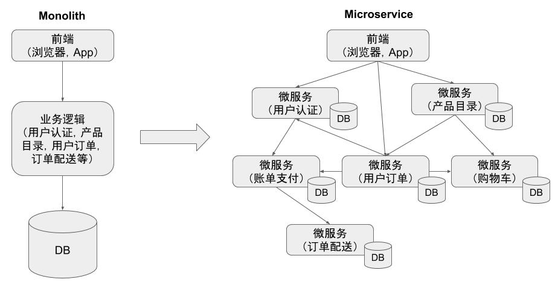

# 分布式追踪

相比传统的“巨石”应用，微服务的一个主要变化是将应用中的不同模块拆分为了独立的进程。在微服务架构下，原来进程内的方法调用成为了跨进程的远程方法调用。相对于单一进程内的方法调用而言，跨进程调用的调试和故障分析是非常困难的，难以使用传统的代码调试程序或者日志打印来对分布式的调用过程进行查看和分析。

如上图右边所示，微服务架构中系统中各个微服务之间存在复杂的调用关系。一个来自客户端的请求在其业务处理过程中经过了多个微服务进程。我们如果想要对该请求的端到端调用过程进行完整的分析，则必须将该请求经过的所有进程的相关信息都收集起来并关联在一起，这就是“分布式调用跟踪”。