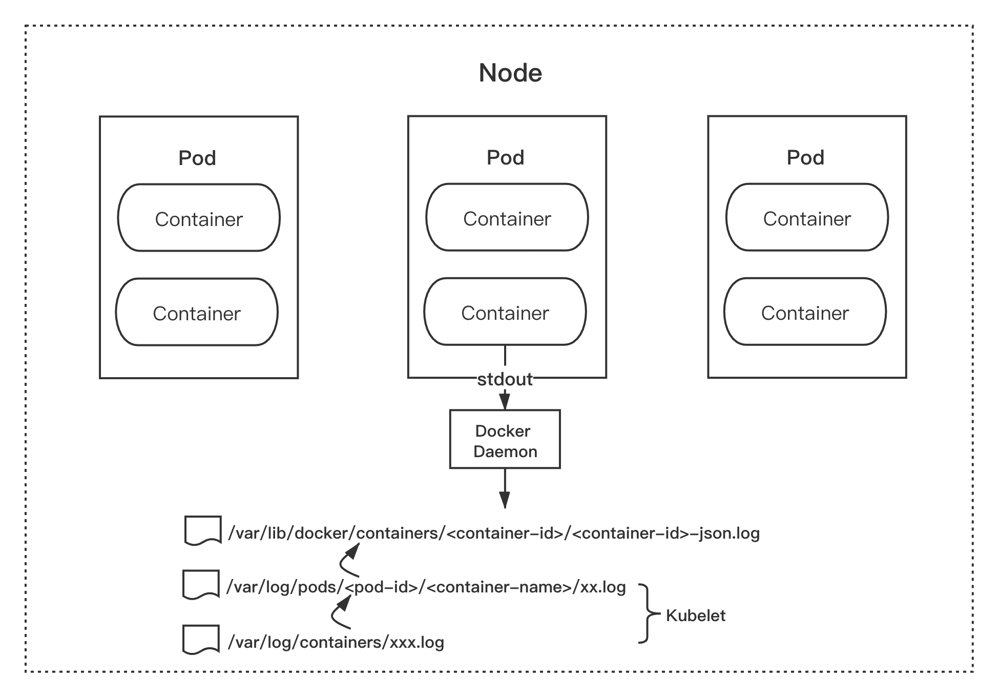
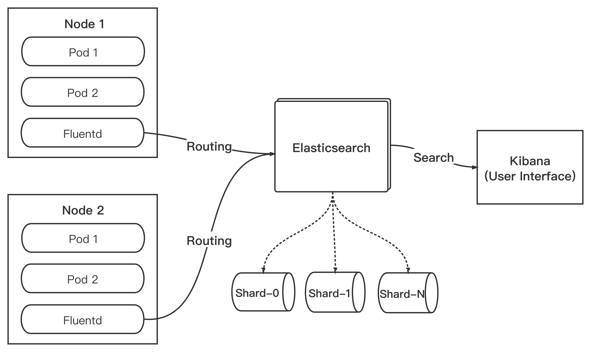
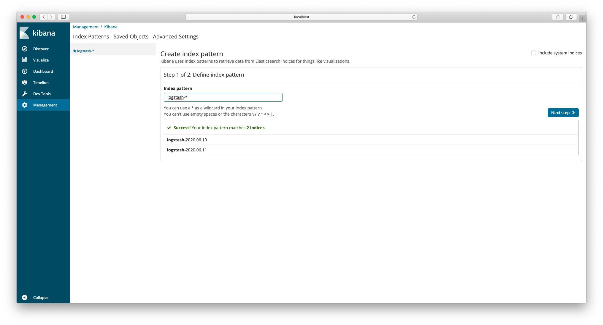
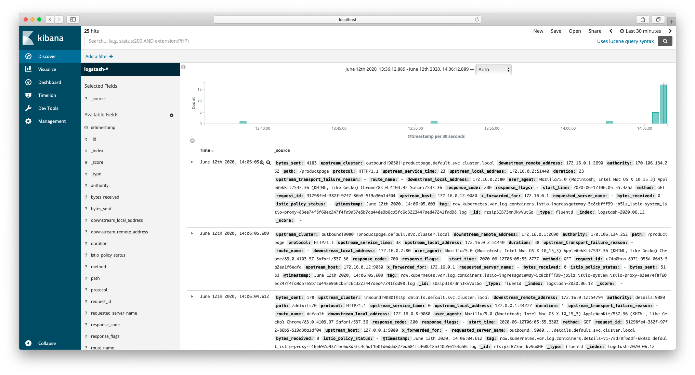

# EFK
EFK 指的是由 Elasticsearch + Fluentd + Kibana 组成的日志采集、存储、展示为一体的日志解决方案，简称 "EFK Stack"， 是目前官方推荐的日志采集方案，我认为也是目前 Kubernetes 生态日志收集的最佳实践。
## Elasticsearch
Elasticsearch 是一个分布式、RESTful 风格的搜索和数据分析引擎，官网对他的定义为：

>  Elasticsearch is a distributed, RESTful search and analytics engine capable of solving a growing number of use cases.

Elasticsearch 是用 JAVA 开发的，基于 `Apache License 2.0` 开源协议，也是目前最受欢迎的企业级搜索引擎。

## Fluentd
在传统的日志实践中，我们需要用各种不同的手段进行日志的收集和处理（例如 shell 脚本）。Fluentd 的出现，使得不同类型、不同来源的日志都可以通过 Fluentd 来进行统一的日志聚合和处理，同时发送到后端进行存储，并实现了较小资源消耗以及高性能。

除此之外，Fluentd 灵活的插件配置，使得我们对日志的收集、处理、过滤和输出提供了极大的便利。

## Kibana
在实践中，我们一般使用 Kibana 对 Elasticsearch 存储的数据进行图形化的界面展示。

官网的定义更加准确：
> Kibana 是一款开源的数据分析和可视化平台，它是 Elastic Stack 成员之一，设计用于和 Elasticsearch 协作。您可以使用 Kibana 对 Elasticsearch 索引中的数据进行搜索、查看、交互操作。您可以很方便的利用图表、表格及地图对数据进行多元化的分析和呈现。


## 采集原理
Dokcer 默认的日志驱动是 `json-file`，该驱动将来自容器的 `stdout` 和 `stderr` 日志都统一以 json 的形式存储到 Node 节点的 `/var/lib/docker/containers/<container-id>/<container-id>-json.log` 目录结构内。

而 Kubernetes kubelet 会将 `/var/lib/docker/containers/` 目录内的日志文件重新软链接至 `/var/log/containers` 目录和  `/var/log/pods` 目录下。这种统一的日志存储规则，为我们收集容器的日志提供了基础和便利。

也就是说，我们只需采集集群节点的 `/var/log/containers` 目录的日志，就相当于采集了该节点所有容器输出 `stdout` 的日志。



## 采集方案
从 Istio 1.5 开始，旧版本的 Mixer 已被废弃，对应的功能已迁移至 Envoy。使用原来的 Mixer handler 直接上报遥测数据至 Fluentd 的方案已不再推荐。

所以我们将方案调整为：开启 Envoy 的访问日志输出到 `stdout` ，以 DaemonSet 的方式在每一台集群节点部署 Fluentd ，并将日志目录挂载至 Fluentd Pod，实现对 Envoy 访问日志的采集。




## 环境准备
在开始之前，请确认已经按照 3.1.1 章节正确安装了 Istio。
部署 `sleep` 示例应用程序用来发送 `curl` 请求测试。如果启用了 sidecar 自动注入（为命名空间配置了 label:istio-injection=enabled），进入 istio 安装目录，运行命令部署示例应用：
```
$ kubectl apply -f samples/sleep/sleep.yaml
```
如果没有开启 sidecar 自动注入，请执行命令手动注入 sidecar
```
$ kubectl apply -f <(istioctl kube-inject -f samples/sleep/sleep.yaml)
```

部署 `httpbin` 示例提供 HTTP Server：
```
$ kubectl apply -f samples/httpbin/httpbin.yaml
```
同理，如果没有开启 sidecar 自动注入，执行命令手动注入 sidecar：
```
$ kubectl apply -f <(istioctl kube-inject -f samples/httpbin/httpbin.yaml)
```

### 开启 Envoy 的访问日志
使用 `istioctl` 修改配置，打开 Envoy 的访问日志，执行命令：
```
$ istioctl manifest apply --set profile=demo --set values.global.proxy.accessLogFile="/dev/stdout"

- Applying manifest for component Base...
✔ Finished applying manifest for component Base.
- Applying manifest for component Pilot...
✔ Finished applying manifest for component Pilot.
- Applying manifest for component IngressGateways...
- Applying manifest for component EgressGateways...
- Applying manifest for component AddonComponents...
✔ Finished applying manifest for component EgressGateways.
✔ Finished applying manifest for component IngressGateways.
✔ Finished applying manifest for component AddonComponents.

✔ Installation complete
```


> 请注意，将 profile 修改为你安装 Istio 时候使用的配置名称（本书为 "demo"）

命令完成后，就开启了 Envoy 的访问日志，并输出至 `stdout`。

你可以通过 `istioctl manifest apply --set` 方法修改以下三个参数：
* values.global.proxy.accessLogFile
* values.global.proxy.accessLogEncoding
* values.global.proxy.accessLogFormat

更加详细的信息可以在 `/istio 安装目录/install/kubernetes/istio-demo.yaml` 查看：

```
# Set accessLogFile to empty string to disable access log.
accessLogFile: "/dev/stdout"

# If accessLogEncoding is TEXT, value will be used directly as the log format
# example: "[%START_TIME%] %REQ(:METHOD)% %REQ(X-ENVOY-ORIGINAL-PATH?:PATH)% %PROTOCOL%\n"
# If AccessLogEncoding is JSON, value will be parsed as map[string]string
# example: '{"start_time": "%START_TIME%", "req_method": "%REQ(:METHOD)%"}'
# Leave empty to use default log format
accessLogFormat: ""

# Set accessLogEncoding to JSON or TEXT to configure sidecar access log
accessLogEncoding: 'TEXT'
```

请注意，`accessLogFormat` 并未配置，Envoy 将以 Istio 定制的默认日志格式输出：
```
EnvoyTextLogFormat13 = "[%START_TIME%] \"%REQ(:METHOD)% %REQ(X-ENVOY-ORIGINAL-PATH?:PATH)% " +
		"%PROTOCOL%\" %RESPONSE_CODE% %RESPONSE_FLAGS% \"%DYNAMIC_METADATA(istio.mixer:status)%\" " +
		"\"%UPSTREAM_TRANSPORT_FAILURE_REASON%\" %BYTES_RECEIVED% %BYTES_SENT% " +
		"%DURATION% %RESP(X-ENVOY-UPSTREAM-SERVICE-TIME)% \"%REQ(X-FORWARDED-FOR)%\" " +
		"\"%REQ(USER-AGENT)%\" \"%REQ(X-REQUEST-ID)%\" \"%REQ(:AUTHORITY)%\" \"%UPSTREAM_HOST%\" " +
		"%UPSTREAM_CLUSTER% %UPSTREAM_LOCAL_ADDRESS% %DOWNSTREAM_LOCAL_ADDRESS% " +
		"%DOWNSTREAM_REMOTE_ADDRESS% %REQUESTED_SERVER_NAME% %ROUTE_NAME%\n"
```

如果你需要自定义输出日志格式，可以前往 Envoy 官网查看相关文档，此内容不在本章节讨论范围内。

### 测试 Envoy 访问日志
开启 Envoy 日志开关后，开始测试 Envoy 是否正常打印了访问日志。

执行命令，进入 `sleep` 容器使用 `curl` 向 `httpbin` 发送请求：
```
$ kubectl exec -it $(kubectl get pod -l app=sleep -o jsonpath='{.items[0].metadata.name}') -ic sleep -- curl -v httpbin:8000/status/418

* Trying 172.16.255.114:8000...
* Connected to httpbin (172.16.255.114) port 8000 (#0)
> GET /status/418 HTTP/1.1
> Host: httpbin:8000
> User-Agent: curl/7.69.1
> Accept: */*
>
* Mark bundle as not supporting multiuse
< HTTP/1.1 418 Unknown
< server: envoy
< date: Thu, 11 Jun 2020 07:23:11 GMT
< x-more-info: http://tools.ietf.org/html/rfc2324
< access-control-allow-origin: *
< access-control-allow-credentials: true
< content-length: 135
< x-envoy-upstream-service-time: 8
<

    -=[ teapot ]=-

       _...._
     .'  _ _ `.
    | ."` ^ `". _,
    \_;`"---"`|//
      |       ;/
      \_     _/
        `"""`
* Connection #0 to host httpbin left intact
```

查看 `sleep` 的访问日志：
```
$ kubectl logs -l app=sleep -c istio-proxy

[2020-06-11T07:23:11.948Z] "GET /status/418 HTTP/1.1" 418 - "-" "-" 0 135 22 8 "-" "curl/7.69.1" "05192384-ebf5-9067-9cc1-3d1faa5464b5" "httpbin:8000" "172.16.0.25:80" outbound|8000||httpbin.default.svc.cluster.local 172.16.0.24:50126 172.16.255.114:8000 172.16.0.24:35316 - default
```

查看 `httpbin` 的访问日志：
```
$ kubectl logs -l app=httpbin -c istio-proxy

[2020-06-11T07:23:11.954Z] "GET /status/418 HTTP/1.1" 418 - "-" "-" 0 135 2 2 "-" "curl/7.69.1" "05192384-ebf5-9067-9cc1-3d1faa5464b5" "httpbin:8000" "127.0.0.1:80" inbound|8000|http|httpbin.default.svc.cluster.local 127.0.0.1:39668 172.16.0.25:80 172.16.0.24:50126 outbound_.8000_._.httpbin.default.svc.cluster.local default
```
至此，Envoy 已经打印出我们所需要的访问日志。

请注意，这里查询的容器名 `istio-proxy` 其实就是 Envoy sidecar 代理，Envoy 将请求和响应日志都进行了打印并输出至 `stdout` ，所以可以通过 `kubectl logs` 查询。

需要留意的是，当 Pod 被销毁后，旧的日志将不复存在，并且无法通过 `kubectl logs` 查看。

接下来，将部署 `EFK` ，解决日志的收集、存储以及展示。

## 部署 EFK
有了以上的基础，我们开始部署 `EFK Stack`

### 部署 Elasticsearch
首先，创建一个新的 namespace 用于部署 `EFK`：
```
# Logging Namespace. All below are a part of this namespace.
apiVersion: v1
kind: Namespace
metadata:
  name: logging
```

1. 部署 Elasticsearch Service：
```
# Elasticsearch Service
apiVersion: v1
kind: Service
metadata:
  name: elasticsearch
  namespace: logging
  labels:
    app: elasticsearch
spec:
  ports:
  - port: 9200
    protocol: TCP
    targetPort: db
  selector:
    app: elasticsearch
```

2. 部署 Elasticsearch Deployment：
```
# Elasticsearch Deployment
apiVersion: apps/v1
kind: Deployment
metadata:
  name: elasticsearch
  namespace: logging
  labels:
    app: elasticsearch
spec:
  replicas: 1
  selector:
    matchLabels:
      app: elasticsearch
  template:
    metadata:
      labels:
        app: elasticsearch
      annotations:
        sidecar.istio.io/inject: "false"
    spec:
      containers:
      - image: docker.elastic.co/elasticsearch/elasticsearch-oss:6.1.1
        name: elasticsearch
        resources:
          # need more cpu upon initialization, therefore burstable class
          limits:
            cpu: 1000m
          requests:
            cpu: 100m
        env:
          - name: discovery.type
            value: single-node
        ports:
        - containerPort: 9200
          name: db
          protocol: TCP
        - containerPort: 9300
          name: transport
          protocol: TCP
        volumeMounts:
        - name: elasticsearch
          mountPath: /data
      volumes:
      - name: elasticsearch
        emptyDir: {}
```

* sidecar.istio.io/inject=false 标识此服务无需 sidecar 注入

请注意，本次实践使用 Deployment 类型创建 Elasticsearch 服务，并且创建了 `emptyDir` 类型的数据卷，当 Pod 从 Node 移除时，`emptyDir` 内的数据将会被删除。

在生产实践中，你可以使用 `StatefulSet` 的部署方式，并使用 `volumeClaimTemplates` 来为 Pod 提供持久化存储。

### 部署 Fluentd
1. 部署 Fluentd Service：
```
# Fluentd Service
apiVersion: v1
kind: Service
metadata:
  name: fluentd-es
  namespace: logging
  labels:
    app: fluentd-es
spec:
  ports:
  - name: fluentd-tcp
    port: 24224
    protocol: TCP
    targetPort: 24224
  - name: fluentd-udp
    port: 24224
    protocol: UDP
    targetPort: 24224
  selector:
    app: fluentd-es
```

2. 生成 Fluentd ConfigMap：
```
# Fluentd ConfigMap, contains config files.
kind: ConfigMap
apiVersion: v1
data:
  forward.input.conf: |-
    # Takes the messages sent over TCP
    <source>
      @id fluentd-containers.log
      @type tail
      path /var/log/containers/*.log
      pos_file /var/log/es-containers.log.pos
      time_format %Y-%m-%dT%H:%M:%S.%NZ
      tag raw.kubernetes.*
      format json
      read_from_head false
    </source>
    <filter **>
      @id filter_concat
      @type concat
      key message
      multiline_end_regexp /\n$/
      separator ""
    </filter>
    <filter **>
      @type parser
      format json # apache2, nginx, etc...
      key_name log
      reserve_data false
    </filter>
  output.conf: |-
    <match **>
       type elasticsearch
       log_level info
       include_tag_key true
       host elasticsearch
       port 9200
       logstash_format true
       # Set the chunk limits.
       buffer_chunk_limit 2M
       buffer_queue_limit 8
       flush_interval 5s
       # Never wait longer than 5 minutes between retries.
       max_retry_wait 30
       # Disable the limit on the number of retries (retry forever).
       disable_retry_limit
       # Use multiple threads for processing.
       num_threads 2
    </match>
metadata:
  name: fluentd-es-config
  namespace: logging
```
**forward.input.conf：**
* id：日志的唯一标识。
* type：tail 代表从上次的读取位置不断 tail 读取数据。
* path：采集日志的位置，这里采集了该目录下所有的日志，如果只需要采集 Envoy 的日志，可以将 path 修改为 `/var/log/containers/*istio-proxy*.log`
* pos_file：检查点记录文件，用于恢复日志收集。
* filter：对 Log 内容重新进行处理，以便将日志内容以 key 和 value 的形式发送到 elasticsearch。
* concat：这里使用 `concat` 插件对多行日志进行处理。
* reserve_data：发送日志时，仅保留处理后的日志，不保留原日志信息。

**output.conf:**
* match：** 代表发送所有的日志到 Elasticsearch。
* type：插件标识，这里配置成 elasticsearch。
* host/port：配置部署的 elasticsearch 服务的地址和端口。
* logstash_format：是否以 logstash 格式转发日志数据。
* buffer：当日志数据发送到目标方失败的时进行缓存，同时也有助于降低磁盘 IO。

3. 使用 DaemonSet 方式创建 Fluentd 服务：
```
apiVersion: apps/v1
kind: DaemonSet
metadata:
  name: fluentd-es
  namespace: logging
  labels:
    app: fluentd-es
spec:
  selector:
    matchLabels:
      app: fluentd-es
  template:
    metadata:
      labels:
        app: fluentd-es
      annotations:
        sidecar.istio.io/inject: "false"
    spec:
      containers:
      - name: fluentd-es
        image: quay.io/fluentd_elasticsearch/fluentd:v3.0.2
        env:
        - name: FLUENTD_ARGS
          value: --no-supervisor -q
        resources:
          limits:
            memory: 500Mi
          requests:
            cpu: 100m
            memory: 200Mi
        volumeMounts:
        - name: varlog
          mountPath: /var/log
        - name: varlibdockercontainers
          mountPath: /var/lib/docker/containers
          readOnly: true
        - name: config-volume
          mountPath: /etc/fluent/config.d
      terminationGracePeriodSeconds: 30
      volumes:
      - name: varlog
        hostPath:
          path: /var/log
      - name: varlibdockercontainers
        hostPath:
          path: /var/lib/docker/containers
      - name: config-volume
        configMap:
          name: fluentd-es-config
```
* 这里声明了两个 `hostPath` 类型的数据卷，路径为日志存储的路径。
* 将宿主机的 `/var/log` 和 `/var/lib/docker/containers` 挂载到了 Fluentd Pod 内便于 Fluentd 收集日志。
* 同时将之前配置的 ConfigMap `fluentd-es-config` 作为配置文件挂载到 Pod 的 `/etc/fluent/config.d` 目录，此目录下将生成两个文件：`forward.input.conf` 和 `output.conf` 用作 Fluentd 的配置。


### 部署 Kibana
1. 创建 Kibana Service：
```
# Kibana Service
apiVersion: v1
kind: Service
metadata:
  name: kibana
  namespace: logging
  labels:
    app: kibana
spec:
  ports:
  - port: 5601
    protocol: TCP
    targetPort: ui
  selector:
    app: kibana
```

2. 部署 Kibana Deployment
```
# Kibana Deployment
apiVersion: apps/v1
kind: Deployment
metadata:
  name: kibana
  namespace: logging
  labels:
    app: kibana
spec:
  replicas: 1
  selector:
    matchLabels:
      app: kibana
  template:
    metadata:
      labels:
        app: kibana
      annotations:
        sidecar.istio.io/inject: "false"
    spec:
      containers:
      - name: kibana
        image: docker.elastic.co/kibana/kibana-oss:6.1.1
        resources:
          # need more cpu upon initialization, therefore burstable class
          limits:
            cpu: 1000m
          requests:
            cpu: 100m
        env:
          - name: ELASTICSEARCH_URL
            value: http://elasticsearch:9200
        ports:
        - containerPort: 5601
          name: ui
          protocol: TCP
```
这里将环境变量 `ELASTICSEARCH_URL` 设置为之前部署的 Elasticsearch Service 和端口 `elasticsearch:9200` 。

为了方便，你可以将以上代码合并在一个文件内，不同的资源之间使用 `---` 分隔，合并后文件命名为：logging-stack.yaml，执行命令创建所有资源：
```
$ kubectl apply -f logging-stack.yaml

namespace "logging" created
service "elasticsearch" created
deployment "elasticsearch" created
service "fluentd-es" created
daemonset.apps/fluentd-es created
configmap "fluentd-es-config" created
service "kibana" created
deployment "kibana" created
```

## 查看日志
现在，已经成功部署了 `EFK` ，接下来进行验证。

1. 执行命令产生访问日志：
```
$ kubectl exec -it $(kubectl get pod -l app=sleep -o jsonpath='{.items[0].metadata.name}') -c sleep -- curl -v httpbin:8000/status/418
```
> 如果你已经按照 3.1.3 章节部署了 `Bookinfo` 示例，你也可以直接通过浏览器访问 /productpage 页面也可以产生访问日志。

2. 设置 Kibana 的端口转发：
```
$ kubectl -n logging port-forward $(kubectl -n logging get pod -l app=kibana -o jsonpath='{.items[0].metadata.name}') 5601:5601 &
```
* 此命令将 Kibaba Pod 的 `5601` 端口转发到 `localhost:5601` ，`&` 代表后台运行。

3. 使用浏览器打开：`http://localhost:5601/`，在首页 `index pattern` 输入框输入 `logstash-*`，点击 "Next step"



4. 现在，Kibana 已经能够查询到刚才的访问日志了。


## 生产建议
由于篇幅原因，本文对 `Fluentd` 并没有做非常细致的配置。如果用于生产环境，读者可以前往 Kubernetes 官方 github 仓库找到完整的 `EFK` 配置来进行部署：

[https://github.com/kubernetes/kubernetes/tree/master/cluster/addons/fluentd-elasticsearch](https://github.com/kubernetes/kubernetes/tree/master/cluster/addons/fluentd-elasticsearch)

## 清理
结束了本章的体验之后，你可以执行以下命令进行清理：
1. 删除 `sleep` 和 `httpbin`
```
$ kubectl delete -f samples/sleep/sleep.yaml
$ kubectl delete -f samples/httpbin/httpbin.yaml
```

2. 删除 `EFK`
```
kubectl delete -f logging-stack.yaml
```

3. 确认应用已经停止并删除
```
kubectl get pods | grep sleep   # there should be no result
kubectl get pods | grep httpbin   # there should be no result
kubectl get pods -n logging   # there should be no result
kubectl get svc -n logging   # there should be no result
kubectl get ds -n logging   # there should be no result
```

## 参考
[Getting Envoy's Access Logs](https://archive.istio.io/v1.5/docs/tasks/observability/logs/access-log/)

[Logging with Mixer and Fluentd](https://archive.istio.io/v1.5/docs/tasks/observability/mixer/logs/fluentd/)

[Elasticsearch Add-On](https://github.com/kubernetes/kubernetes/tree/master/cluster/addons/fluentd-elasticsearch)

[Kibana 用户手册](https://www.elastic.co/guide/cn/kibana/current/introduction.html)

[elastic-stack](https://www.elastic.co/cn/elastic-stack)

[fluentd](https://www.fluentd.org/)


[在 Kubernetes 上搭建 EFK 日志收集系统](https://www.qikqiak.com/post/install-efk-stack-on-k8s/)
