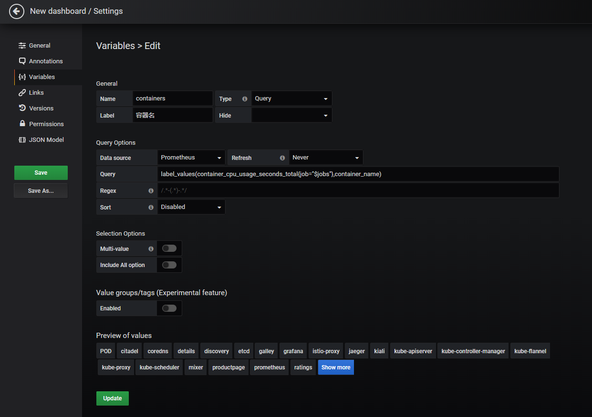

# Grafana

Grafana 是一款开源的指标数据可视化工具，有着功能齐全的度量仪表盘、图表等时序数据展示面板，支持 Zabbix、InfluentDB、Prometheus、Elasticsearch、MySQL 等数据源的指标展示，详情查看：[Grafana 支持的数据源类型](https://grafana.com/docs/grafana/latest/features/datasources/#supported-data-sources/)。

在 Istio 中，也引入了 Grafana 这样一款提供了将时间序列数据库（TSDB）数据转换为精美的图形和可视化面板的工具。Grafana 让用户能够更直观地观测到集群中各项数据指标的变化趋势（网格流量变化、组件资源使用情况等），是 Istio 实现可观测性最重要的组件之一。在 Istio 安装时，我们可以通过配置将 Grafana 服务默认安装在 Istio-system 命名空间下，Istio安装完成后，默认配置了 Istio 中的 Prometheus 作为数据源，定时地从 Prometheus 中采集 Istio 各组件的指标数据，进行可视化展示。

## Grafana 的使用和配置

### 安装

在安装 Istio 时，我们使用 istioctl 的方式进行安装，如果在 istioctl 中使用了 demo 选项进行安装，Grafana 组件将会默认被安装：

```bash
$ istioctl manifest apply --set profile=demo
```

如果使用了默认选项进行安装，则需要指定 --set addonComponents.grafana.enabled=true 参数：

```bash
$ istioctl manifest apply --set addonComponents.grafana.enabled=true
```

### 访问主页

Istio 安装完成后，想要在浏览器中访问 Grafana 主页，有多种方式：

方法一、可以将 Grafana 的 service 设置为 NodePort类型：

```bash
# 设置 Grafana 的 service 为 NodePort 类型
$ kubectl edit service grafana -n istio-system
kind: Service
metadata:
  ...
  labels:
    app: grafana
    release: istio
  name: grafana
  namespace: istio-system
  ...
spec:
  clusterIP: 10.96.188.25
  externalTrafficPolicy: Cluster
  ports:
  - name: http
    port: 3000
    protocol: TCP
    targetPort: 3000
  selector:
    app: grafana
  sessionAffinity: None
  type: NodePort
status:
  loadBalancer: {}
# Grafana 的 service 已经设置为 NodePort 类型
$ kubectl get service grafana -n istio-system
NAME      TYPE       CLUSTER-IP     EXTERNAL-IP   PORT(S)          AGE
grafana   NodePort   10.96.188.25   <none>        3000:31652/TCP   25d

```

设置为 NodePort 类型后，集群为 Grafana 服务随机分配了一个3万以上的端口，同时集群中的所有节点的 kube-proxy 进程都监听了这个端口（这里我的集群为我分配了 31652 端口，下文以该端口为例），此时我们打开浏览器，访问集群中的任意一台机器的 31652 端口，都能访问到 Grafana 服务的主页。

方法二、在 Kubernetes 环境中，执行以下命令：

```bash
$ kubectl -n istio-system port-forward $(kubectl -n istio-system get pod -l app=grafana -o jsonpath='{.items[0].metadata.name}') 3000:3000 &
```

在浏览器中访问 http://localhost:3000/ 即可访问 Grafana 主页。


### 登录设置

我们打开 Grafana 主页，发现没有跳转到登录页面，可以直接访问：


原因是 Istio 在安装 Grafana 时对 Grafana 做了免登录配置，我们查看 Grafana 的 deployment 中 **GF_AUTH_ANONYMOUS_ENABLED** 和 **GF_AUTH_ANONYMOUS_ORG_ROLE** 环境变量：

``` bash
$ kubectl get deployment grafana -n istio-system -o yaml
apiVersion: extensions/v1beta1
kind: Deployment
metadata:
...
spec:
  progressDeadlineSeconds: 600
  replicas: 1
  ...
  template:
    metadata:
      annotations:
    ...
    spec:
	  ...
      containers:
      - env:
        - name: GRAFANA_PORT
          value: "3000"
        - name: GF_AUTH_BASIC_ENABLED
          value: "false"
        - name: GF_AUTH_ANONYMOUS_ENABLED
          value: "true"
        - name: GF_AUTH_ANONYMOUS_ORG_ROLE
          value: Admin
        - name: GF_PATHS_DATA
          value: /data/grafana
      ...
```

当 **GF_AUTH_ANONYMOUS_ENABLED** 环境变量设置为 "true" 时，表示开启匿名免登录访问。而 **GF_AUTH_ANONYMOUS_ORG_ROLE** 环境变量设置为 Admin 则表示匿名免登录时具有 Admin 权限。

Grafana 里面的用户有三种权限：Admin、Editor 和 Viewer。Admin 权限为管理员权限，具有最高的执行权限，包括对用户、Data Sources（数据源）、DashBoard（可视化仪表盘）的增删改查操作。拥有 Editor 权限的用户仅对 DashBoard（可视化仪表盘）有增删改查操作。而拥有 Viewer 权限的用户仅可以查看 DashBoard（可视化仪表盘），详情查看：[Grafana 的用户权限角色说明](https://grafana.com/docs/grafana/latest/permissions/organization_roles/)。

### 查看应用流量与工作负载

在浏览器中访问 http://localhost:3000/dashboard/db/istio-mesh-dashboard 打开 Istio 流量仪表盘。


在集群中部署 [Bookinfo](https://istio.io/latest/zh/docs/examples/bookinfo/) 应用后，在浏览器中访问 `http://$GATEWAY_URL/productpage` 访问 Bookinfo 应用的产品主页或者在命令行中使用以下命令访问（`$GATEWAY_URL` 是在 [Bookinfo](https://istio.io/latest/zh/docs/examples/bookinfo/) 示例中设置的值）：

```bash
$ curl http://$GATEWAY_URL/productpage
```

不断刷新 Bookinfo 页面（或在命令行中不断发送请求命令）以产生少量流量。再次查看 Istio 流量仪表盘，发现仪表盘中出现可视化图表数据，它反映了集群中所产生的流量。


在浏览器中访问 http://localhost:3000/dashboard/db/istio-service-dashboard 打开 Istio 可视化服务仪表盘。可以查看服务自身的网络指标以及服务的客户端工作负载（调用该服务的工作负载）和服务端工作负载（提供该服务的工作负载）的详细指标。


在浏览器中访问 http://localhost:3000/dashboard/db/istio-workload-dashboard 打开 Istio 可视化工作负载仪表盘。这里给出了每一个服务的工作负载，以及该服务的入站工作负载（将请求发送到该服务的工作负载）和出站工作负载（该服务向其它服务发送请求的工作负载）的详细指标。


### 数据源配置

上文中提到，Grafana 支持多种数据源指标的可视化展示，那么数据源是在哪里配置的呢？回到 Grafana 首页，点击左侧边菜单栏的 Configuration 菜单列表中的 Data Sources 菜单进入数据源配置页面：


发现 Grafana 已经默认配置好了 Istio 中的 Prometheus 数据源，如要添加新的数据源，可以点击绿色的 Add data source 按钮进行添加。我们点击默认配置好的 Prometheus 数据源查看具体配置：


Grafana 的 Prometheus 数据源配置主要由四部分组成：

- 数据源的名称；
- Prometheus 数据源的 HTTP 地址和访问方式（分为 Grafana 服务器访问和浏览器直接访问两种方式）；
- 抓取数据源时所使用的认证授权信息（包含各种认证授权协议和证书信息），因为 Istio 的 Prometheus 默认没有对访问设置权限且走的是 HTTP 协议，这里默认不填；
- 抓取时间间隔、超时时间和请求数据源的 HTTP 请求方法设置。

### 数据仪表盘配置

我们回到首页，点击左上角的 Home 按钮进入 Dashboard （仪表盘）总览页面，可以看到总览页面中有一组名为 Istio 的仪表盘列表：


选择其中的 Istio Galley Dashboard 查看具体的仪表盘信息，发现 Galley 相关指标信息都以图表的形式展示了出来：


回到仪表盘总览页面，右侧有仪表盘的新建（New dashboard）和导入（Import dashboard）按钮。

Grafana 的仪表盘可以通过三种方式创建：

- 页面中点击 New dashboard，通过可视化界面进行具体的参数配置；
- 页面中点击 Import dashboard，导入 JSON 配置文件（Grafana 仪表盘可以通过 JSON 数据格式的文件进行配置）；
- 在 Grafana 的配置文件中指定仪表盘的 JSON 配置文件路径，启动后默认加载所配置的仪表盘。

Istio 的仪表盘就是通过第三种方式创建的，Istio 在安装 Grafana 组件时，在 Grafana 的 Pod 中以 ConfigMap 的形式挂载了 Istio 各个组件的仪表盘 JSON 配置文件：

```bash
# 查看 Grafana 相关的 ConfigMap， Istio 各组件的仪表盘配置在 ConfigMap 中
$ kubectl get cm -n istio-system |grep istio-grafana
istio-grafana                                                        2         20d
istio-grafana-configuration-dashboards-citadel-dashboard             1         20d
istio-grafana-configuration-dashboards-galley-dashboard              1         20d
istio-grafana-configuration-dashboards-istio-mesh-dashboard          1         20d
istio-grafana-configuration-dashboards-istio-performance-dashboard   1         20d
istio-grafana-configuration-dashboards-istio-service-dashboard       1         20d
istio-grafana-configuration-dashboards-istio-workload-dashboard      1         20d
istio-grafana-configuration-dashboards-mixer-dashboard               1         20d
istio-grafana-configuration-dashboards-pilot-dashboard               1         20d
# 查看 Grafana 的 Pod yaml文件，发现 Grafana 以 ConfigMap 的形式将 Istio 各个组件的仪表盘配置文件挂载到了
# /var/lib/grafana/dashboards/istio/ 目录下
$ kubectl get pod grafana-6565cc4b48-w9dsj -n istio-system -o yaml
apiVersion: v1
kind: Pod
metadata:
...
spec:
  ...
  containers:
  - ...
    volumeMounts:
    - mountPath: /data/grafana
      name: data
    - mountPath: /var/lib/grafana/dashboards/istio/citadel-dashboard.json
      name: dashboards-istio-citadel-dashboard
      readOnly: true
      subPath: citadel-dashboard.json
    - mountPath: /var/lib/grafana/dashboards/istio/galley-dashboard.json
      name: dashboards-istio-galley-dashboard
      readOnly: true
      subPath: galley-dashboard.json
    - mountPath: /var/lib/grafana/dashboards/istio/istio-mesh-dashboard.json
      name: dashboards-istio-istio-mesh-dashboard
      readOnly: true
      subPath: istio-mesh-dashboard.json
    - mountPath: /var/lib/grafana/dashboards/istio/istio-performance-dashboard.json
      name: dashboards-istio-istio-performance-dashboard
      readOnly: true
      subPath: istio-performance-dashboard.json
    - mountPath: /var/lib/grafana/dashboards/istio/istio-service-dashboard.json
      name: dashboards-istio-istio-service-dashboard
      readOnly: true
      subPath: istio-service-dashboard.json
    - mountPath: /var/lib/grafana/dashboards/istio/istio-workload-dashboard.json
      name: dashboards-istio-istio-workload-dashboard
      readOnly: true
      subPath: istio-workload-dashboard.json
    - mountPath: /var/lib/grafana/dashboards/istio/mixer-dashboard.json
      name: dashboards-istio-mixer-dashboard
      readOnly: true
      subPath: mixer-dashboard.json
    - mountPath: /var/lib/grafana/dashboards/istio/pilot-dashboard.json
      name: dashboards-istio-pilot-dashboard
      readOnly: true
      subPath: pilot-dashboard.json
    - mountPath: /etc/grafana/provisioning/datasources/datasources.yaml
      name: config
      subPath: datasources.yaml
    - mountPath: /etc/grafana/provisioning/dashboards/dashboardproviders.yaml
      name: config
      subPath: dashboardproviders.yaml
      ...
    volumes:
  - configMap:
      defaultMode: 420
      name: istio-grafana
    name: config
  - emptyDir: {}
    name: data
  - configMap:
      defaultMode: 420
      name: istio-grafana-configuration-dashboards-citadel-dashboard
    name: dashboards-istio-citadel-dashboard
  - configMap:
      defaultMode: 420
      name: istio-grafana-configuration-dashboards-galley-dashboard
    name: dashboards-istio-galley-dashboard
  - configMap:
      defaultMode: 420
      name: istio-grafana-configuration-dashboards-istio-mesh-dashboard
    name: dashboards-istio-istio-mesh-dashboard
  - configMap:
      defaultMode: 420
      name: istio-grafana-configuration-dashboards-istio-performance-dashboard
    name: dashboards-istio-istio-performance-dashboard
  - configMap:
      defaultMode: 420
      name: istio-grafana-configuration-dashboards-istio-service-dashboard
    name: dashboards-istio-istio-service-dashboard
  - configMap:
      defaultMode: 420
      name: istio-grafana-configuration-dashboards-istio-workload-dashboard
    name: dashboards-istio-istio-workload-dashboard
  - configMap:
      defaultMode: 420
      name: istio-grafana-configuration-dashboards-mixer-dashboard
    name: dashboards-istio-mixer-dashboard
  - configMap:
      defaultMode: 420
      name: istio-grafana-configuration-dashboards-pilot-dashboard
    name: dashboards-istio-pilot-dashboard
  ...

# 进入 Grafana 的 Pod 中查看 Istio 各组件的仪表盘 JSON 配置文件
$ kubectl exec -it grafana-6565cc4b48-w9dsj sh -n istio-system
/usr/share/grafana $ ls /var/lib/grafana/dashboards/istio/
citadel-dashboard.json            istio-performance-dashboard.json  mixer-dashboard.json
galley-dashboard.json             istio-service-dashboard.json      pilot-dashboard.json
istio-mesh-dashboard.json         istio-workload-dashboard.json

```

由于仪表盘的 JSON 配置文件组成较为复杂，一般情况下仅对其做导入和导出操作，不涉及对 JSON 文件的修改，这里不对 JSON 配置文件的具体组成做详细讲解。在日常使用中创建自定义的仪表盘一般使用上面提到的第一种方式：点击 New dashboard 按钮在可视化界面中创建。点击创建按钮后，选择 Add Query 创建可视化面板：


进入面板的 Query 页面，在 Query 旁的数据源下拉框中选择 Istio 的 Prometheus 数据源，在 Metrics 输入框中输入 PromQL（一种用于查询 Prometheus 指标数据的特殊查询语句）：sum(rate(container_cpu_usage_seconds_total{job="kubernetes-cadvisor",container_name=~"galley", pod_name=~"istio-galley-.*"}[1m]))，右上角选择 5 min 即可查询到 Galley 组件近 5 分钟的 CPU 使用情况：


点击左侧第二个圆钮进入 Visualization 配置页面，该页面可以调整图表的样式、选择可视化面板的类型等，还可以为图表中的数据设置跳转链接。


点击左侧第三个圆钮进入 General 配置页面，该页面主要对该面板做常规配置，如：面板标题、描述、链接等。


点击左侧第四个圆钮进入 Alert 配置页面，该页面用于配置告警规则。


### Variables 配置

在 Grafana 中，Variables (变量)充当占位符的作用，我们可以在指标查询和面板标题中使用变量。同时，我们可以使用仪表板顶部的下拉框来选择变量不同的值，动态地改变面板的指标查询语句。这里我们通过配置变量下拉框，来创建一个可选择不同 Pod 的 CPU 使用量的可视化面板。

在上一步中，我们已经完成了可视化面板的创建，在面板的 Query 配置页面中，我们发现 Prometheus 查询语句的 job、container_name、pod_name 三个标签是通过赋值进行硬编码的：


我们将它的值替换成变量占位符（以$开头）：


现在开始初始化这三个变量，我们点击右上角的设置按钮，进入设置界面：


选择 Variables 菜单，点击 Add variable 添加变量：


我们首先添加名为 jobs 的变量，因为该变量的值是通过下拉框进行选择查询的，因此为 Query 类型。为该变量下拉框设置一个标题：数据源。该变量的值来自于 Prometheus 数据源中 container_cpu_usage_seconds_total 指标中的 job 标签，因此我们在 Query 输入框中配置 label_values( Prometheus 指标名, Prometheus 指标标签) 语句来为 job 变量获取值，我们也可以在 Regex 中对查询结果进行正则匹配筛选我们想要的值。设置完成后，在页面下方的 Preview of values 栏中可以预览该变量匹配到的值。


和添加 jobs 变量方式相同，我们继续添加 contianers 和 pods 变量，由于这三个变量之间存在依赖关系：containers 变量的值依赖于 jobs 变量的值，pods 变量的值又依赖于 containers 变量的值，我们在 containers 变量的配置中的 Query 输入框中为 container_cpu_usage_seconds_total 指标引入 jobs 变量作为标签的筛选条件：



在 pods 变量的配置中的 Query 输入框中为 container_cpu_usage_seconds_total 指标引入 jobs 和 containers 变量同时作为标签的筛选条件：


变量配置完后保存仪表盘设置，回到仪表盘首页，发现页面顶部多了三个下拉选择框，下拉框的值分别对应了三个变量的值：jobs、containers、pods。通过动态调整这三个变量的值，可以查看不同数据源、不同容器、不同 Pod 的 CPU 使用量的可视化图表面板。


Variable 不仅仅可以通过下拉框的方式赋值，它还有 custom、text box、constant、data source、interval 等类型，这里不详细介绍，更多关于 Variables 设置的详细信息可参考：[Grafana 的 Variables 设置文档](https://grafana.com/docs/grafana/latest/variables/templates-and-variables/)。

## 参考

- [Istio Visualizing Metrics with Grafana](https://istio.io/latest/docs/tasks/observability/metrics/using-istio-dashboard/)

- [Grafana 官方文档](https://grafana.com/docs/grafana/latest/)

