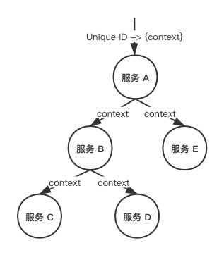
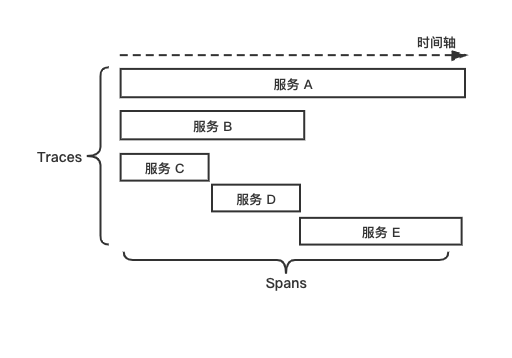
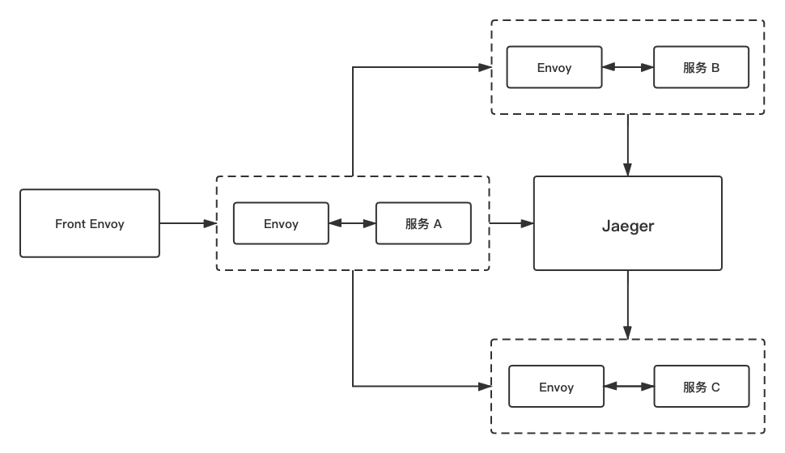
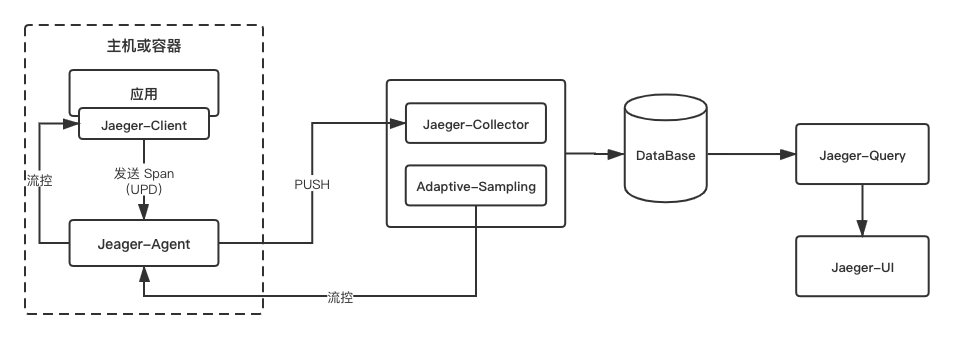
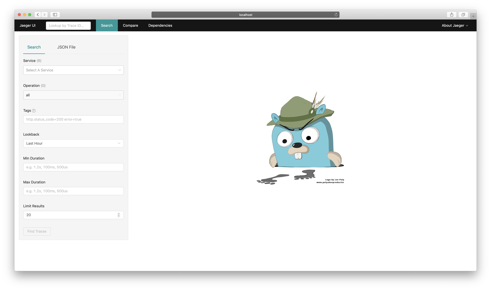
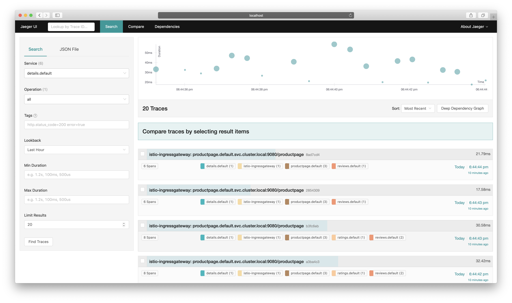
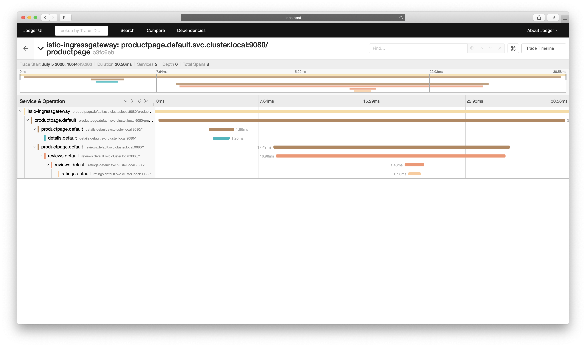
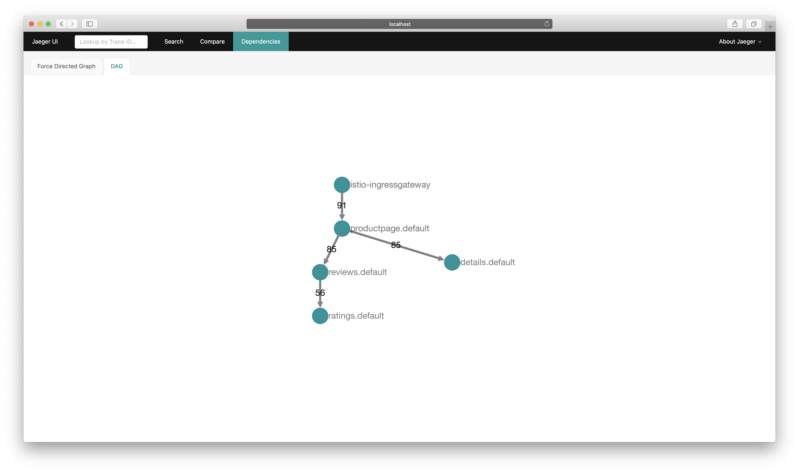
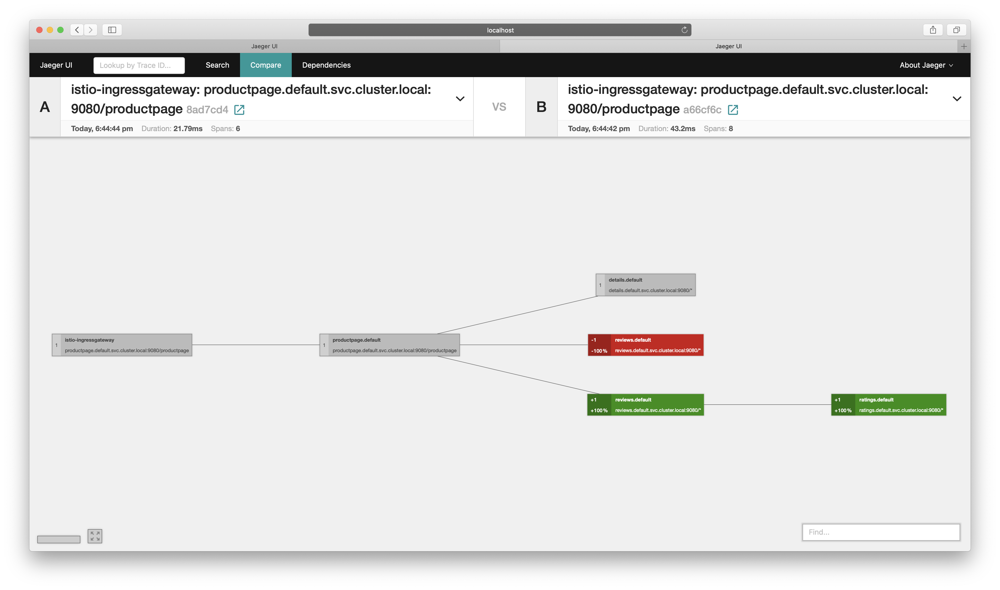

# Jaeger
`Jaeger` 是由 Uber 开源的分布式追踪系统，它采用 Go 语言编写，主要借鉴了 `Google Dapper` 论文和 `Zipkin` 的设计，兼容 `OpenTracing` 以及 `Zipkin` 追踪格式，目前已成为 CNCF 基金会的开源项目。

## 术语
让我们来快速回顾一下 OpenTracing 规范定义的术语。

### Span
Span 是 `Jaeger` 的逻辑工作单元，具有请求名称、请求开始时间、请求持续时间。Span 会被嵌套并排序以展示服务间的关系。



### Trace
`Jaeger` 在微服务系统中记录的完整的请求执行过程，并显示为 `Trace`， `Trace` 是系统的数据/执行路径。一个端到端的 `Trace` 由一个或多个 `Span` 组成。

## Envoy-Jaeger 架构
`Envoy` 原生支持 `Jaeger`，追踪所需 `x-b3` 开头的 Header 和 `x-request-id` 在不同的服务之间由业务逻辑进行传递，并由 `Envoy` 上报给 `Jaeger`，最终 `Jaeger` 生成完整的追踪信息。

在 `Istio` 中，`Envoy` 和 `Jaeger` 的关系如下：



图中 Front Envoy 指的是第一个接收到请求的 Envoy Sidecar，它会负责创建 Root Span 并追加到请求 Header 内，请求到达不同的服务时，Envoy Sidecar 会将追踪信息进行上报。

`Jaeger` 的内部组件架构与 EFK 日志系统架构有一定相似性：



`Jaeger` 主要由以下几个组件构成：
* Client：Jaeger 客户端，是 OpenTracing API 的具体语言实现，可以为各种开源框架提供分布式追踪工具。
* Agent：监听在 UDP 端口的守护进程，以 Daemonset 的方式部署在宿主机或以 sidecar 方式注入容器内，屏蔽了 Client 和 Collector 之间的细节以及服务发现。用于接收 Client 发送过来的追踪数据，并将数据批量发送至 Collector。
* Collector：用来接收 Agent 发送的数据，验证追踪数据，并建立索引，最后异步地写入后端存储，Collector 是无状态的。
* DataBase：后端存储组件，支持内存、Cassandra、Elasticsearch、Kafka 的存储方式。
* Query：用于接收查询请求，从数据库检索数据并通过 UI 展示。
* UI：使用 React 编写，用于 UI 界面展示。

在 `Istio` 提供“开箱即用”的追踪环境中，`Jaeger` 的部署方式是 `all-in-on` 的方式。该模式下部署的 Pod 为 `istio-tracing`，使用 `jaegertracing/all-in-one` 镜像，包含：`Jaeger-agent`、`Jaeger-collector`、`Jaeger-query(UI)` 几个组件。

不同的是，`Bookinfo` 的业务代码并没有集成 `Jaeger-client` ，而是由 `Envoy` 将追踪信息直接上报到 `Jaeger-collector`，另外，存储方式默认为内存，随着 Pod 销毁，追踪数据将会被删除。

## 部署方式
`Jaeger` 的部署方式主要有以下几种：
* `all-in-one` 部署 - 适用于快速体验 `Jaeger` ，所有追踪数据存储在内存中，不适用于生产环境。
* `Kubernetes` 部署 - 通过在集群独立部署 `Jaeger` 各组件 manifest 完成，定制化程度高，可使用已有的 Elasticsearch、Kafka 服务，适用于生产环境。
* `OpenTelemetry` 部署 - 适用于使用 `OpenTelemetry` API 的部署方式。
* `Windows` 部署 - 适用于 `Windows` 环境的部署方式，通过运行 exe 可执行文件安装和配置。

## 环境准备
请先按照本书指引部署 `Bookinfo` 示例应用程序，再进行以下配置：
1. 如已经使用 `demo` 配置安装 `Istio`，则会自动安装 `Jaeger`，也可以通过以下命令启用：
    ```
    $ istioctl manifest apply --set values.tracing.enabled=true
    ✔ Istio core installed
    ✔ Istiod installed
    ✔ Ingress gateways installed
    ✔ Addons installed
    ✔ Installation complete
    ```
    此命令会启用一个“开箱即用”的 Jaeger 演示环境。
    > 注意：默认采样率为 1%，你可以通过 `--set values.pilot.traceSampling=<Value>` 来配置采样率。Value 范围在 0.0 到 100.0 之间，精度为 0.01 。例如，Value 配置 0.01 意味着 10000 请求中跟踪 1 个请求。

2. 如果集群内已部署 `Jaeger` ，可以使用以下命令进行配置：
    ```
    istioctl manifest apply --set values.global.tracer.zipkin.address=<jaeger-collector-service>.<jaeger-collector-namespace>:9411
    ```

3. 访问 Bookinfo `/productpage` 页面以便生成并上报追踪数据，默认 1% 的采样率意味着需要至少请求 100 次才能看到追踪数据：
    ```
    for i in `seq 1 100`; do curl -s -o /dev/null http://$GATEWAY_URL/productpage; done
    ```
    * 请将 GATEWAY_URL 替换为 `ingressgateway` 的 IP 地址。
    
    命令执行完成后，追踪数据就会上报至 `Jaeger` 了。

## 访问 Jaeger Dashboard

如果 Istio 部署在本地环境，可以通过 istioctl dashboard 命令访问：
```
$ istioctl dashboard jaeger
http://localhost:43262
Failed to open browser; open http://localhost:43262 in your browser.
```

如果 Istio 部署在远程集群，也可以使用 kubectl 配置本地端口转发：
```
$ kubectl port-forward svc/tracing 8080:80 -n istio-system
```
使用 kubectl 配置端口转发后，打开浏览器访问 `http://localhost:8080`，即可访问 Jaeger Dashboard。



选择一个 `Service` ，如 `details.default` ，点击 "Find Traces" 按钮展示追踪结果。



点击列表项目进入追踪详情，详细记录了一次请求涉及到的 Services、深度、Span 总数、请求总时长等信息。也可以对下方的单项服务展开，观察每一个服务的请求耗时和详情。



`Jaeger` 还能够展示服务依赖，点击顶部的“Dependencies” 菜单获取。



除此之外，从 `Jaeger` 1.7 开始新加入一项强大的功能：对比不同请求的差异。点击顶部的 “Compare” 菜单，输入想要对比的 TraceId 查看差异。



`Jaeger` 出生虽然较晚，相比较其他的分布式追踪工具，具有以下特性：
* 高可用性，`Jaeger` 的后端服务设计为没有单点故障，可以根据需要进行伸缩。
* 兼容 Zipkin 追踪格式。
* 完善的语言支持

`Jaeger` 目前已成为 `Istio` 默认的分布式追踪工具。

## 生产建议
对于生产环境，我们提供以下几点建议：
1. Istio 提供“开箱即用”的 `Jaeger` 采用内存的存储方式，POD 被销毁后数据随即消失。在生产中需要单独配置持久化存储如：Cassandra ，具体可参阅 `Jaeger` 官方文档。
2. Demo 中 `Jaeger` 默认采样率为 `1%`，在生产环境中建议根据业务系统的流量大小进行合理配置。
3. `Jaeger Collector` 默认采用直接写入存储服务的方式，大规模的使用场景下建议使用 Kafka 作为中间缓存区。

## 参考
* [introducing-istio-service-mesh-microservices](https://developers.redhat.com/books/introducing-istio-service-mesh-microservices/)
* [distributed-tracing-with-envoy-service-mesh-jaeger](https://www.servicemesher.com/blog/distributed-tracing-with-envoy-service-mesh-jaeger/)
* [ossm-jaeger](https://access.redhat.com/documentation/zh-cn/openshift_container_platform/4.3/html/service_mesh/ossm-jaeger)
* [jaegertracing.io](https://www.jaegertracing.io/docs/1.18/getting-started/)
* [Service Mesh with Envoy 101](https://medium.com/hackernoon/service-mesh-with-envoy-101-e6b2131ee30b)
* [Istio Trace 链路追踪方案](https://juejin.im/post/5bc9dc815188254a387ea11c)
