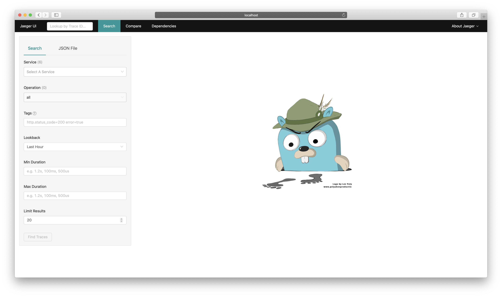
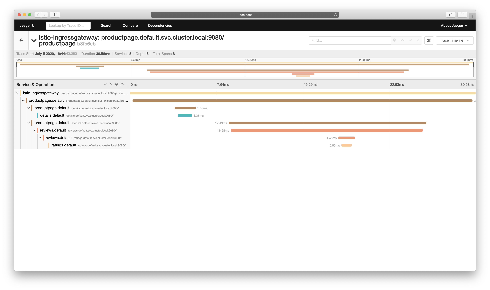
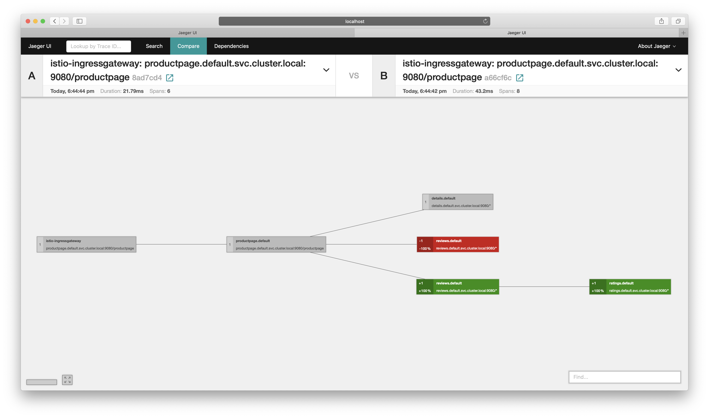

# Jeager
Jeager 是由 Uber 开源的分布式追踪系统。它采用 Go 语言编写，主要借鉴了 Google Dapper 论文和 Zipkin 的设计，目前已成为 CNCF 基金会的开源项目。

## Envoy-Jeager 架构
`Envoy` 原生支持 `Jeager`，追踪所需的 `x-b3` 和 `x-request-id` Header 在不同的服务之间由业务逻辑进行传递，并由 `Envoy` 上报给 `Jeager`，最终由 `Jeager` 生成完整的追踪链路。


`Jeager` 的内部组件架构与 EFK 日志系统架构有一定相似性：


`Jeager` 主要由以下几部分组成：
* Client：Jaeger 客户端，提供不同语言的 SDK 进行集成使用。
* Agent：是一个监听在 UDP 端口的守护进程，主要用来屏蔽 Client 和 Collector 的细节，接收 Client 发送过来的追踪数据，并将数据批量发送至 Collector。
* Collector：用来接收 Agent 发送的数据，并将数据写入后端存储，Collector 是无状态的。
* DataBase：后端存储组件，支持内存、Cassandra、Elasticsearch。
* Query：用于接收查询请求，从数据库检索数据并通过 UI 展示。
* UI：使用 React 编写，用于 UI 界面展示。

在 `Istio` 提供“开箱即用”的追踪环境中，`Jeager` 部署的 Pod 为 `istio-tracing`，使用 `jaegertracing/all-in-one` 镜像，包含：`Jaeger-agent`、`Jaeger-collector`、`Jaeger-query`、`Jaeger-UI` 几个组件。

不同的是，业务代码并没有集成 `Jeager-Client` ，而是由 `Envoy` 将追踪信息直接发送到 `Jaeger-collector`，存储默认采用内存的存储方式，随着 Pod 销毁，追踪数据将会被删除。

## 环境准备
请先按照本书指引使用 `demo` 配置安装 `Istio` ，并部署 `Bookinfo` 示例应用程序，再进行以下配置：
1. 如使用 Demo 配置安装 `Istio`，会自动安装 `Jeager`。也可以通过以下命令手动启用：
    ```
    $ istioctl manifest apply --set values.tracing.enabled=true
    ✔ Istio core installed
    ✔ Istiod installed
    ✔ Ingress gateways installed
    ✔ Addons installed
    ✔ Installation complete
    ```
    此命令会启用一个“开箱即用”的 Jaeger 演示环境。
    > 注意：默认采样率为 1%，你可以通过 `--set values.pilot.traceSampling=<Value>` 来配置采样率。Value 范围在 0.0 到 100.0 之间，精度为 0.01 。例如，Value 配置 0.01 意味着 10000 请求中跟踪 1 个请求。

2. 如果你的集群已部署 `Jaeger` ，你可以直接使用以下命令进行配置：
    ```
    istioctl manifest apply --set values.global.tracer.zipkin.address=<jaeger-collector-service>.<jaeger-collector-namespace>:9411
    ```

3. 访问 Bookinfo `/productpage` 页面以便生成并上报追踪数据，默认 1% 的采样率意味着需要至少请求 100 次才能看到追踪数据：
    ```
    for i in `seq 1 100`; do curl -s -o /dev/null http://$GATEWAY_URL/productpage; done
    ```
    * 请将 GATEWAY_URL 替换为 `ingressgateway` 的 IP 地址。
    
    命令执行完成后，追踪数据就会上报至 `Jaeger` 了。

## 访问 Jeager Dashboard
`Jaeger` 可以通过配置 Ingress Gateway 来进行访问，请参考官方文档获取配置信息：[https://istio.io/latest/docs/tasks/observability/gateways/](https://istio.io/latest/docs/tasks/observability/gateways/)，本文不再赘述。

如果 Istio 部署在本地环境，可以通过 istioctl dashboard 命令访问：
```
$ istioctl dashboard jaeger
http://localhost:43262
Failed to open browser; open http://localhost:43262 in your browser.
```

如果 Istio 部署在远程集群，也可以使用 kubectl 配置本地端口转发：
```
$ kubectl port-forward svc/tracing 8080:80 -n istio-system
```
使用 kubectl 配置端口转发后，打开浏览器访问 `http://localhost:8080`，即可访问 Jaeger Dashboard。



选择一个 `Service` ，点击 "Find Traces" 展示追踪结果。


点击列表进入追踪详情，详细记录了一次请求涉及到的 Services、Span 总数、请求总耗时等信息。



`Jeager` 还具备图形化展示依赖的功能，点击顶部的“Dependencies” 菜单即可获取。


除此之外，`Jeager` 还有一项强大的功能：对比不同请求的差异。点击顶部的 “Compare” 菜单，输入想要对比的两个 TraceId 即可获取。


和其他分布式追踪系统不同，`Jaeger` 凭借其完善的 `Client` 以及优秀的架构设计。XXXXX

## 参考
