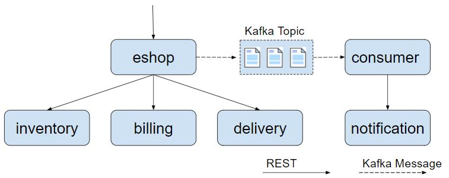
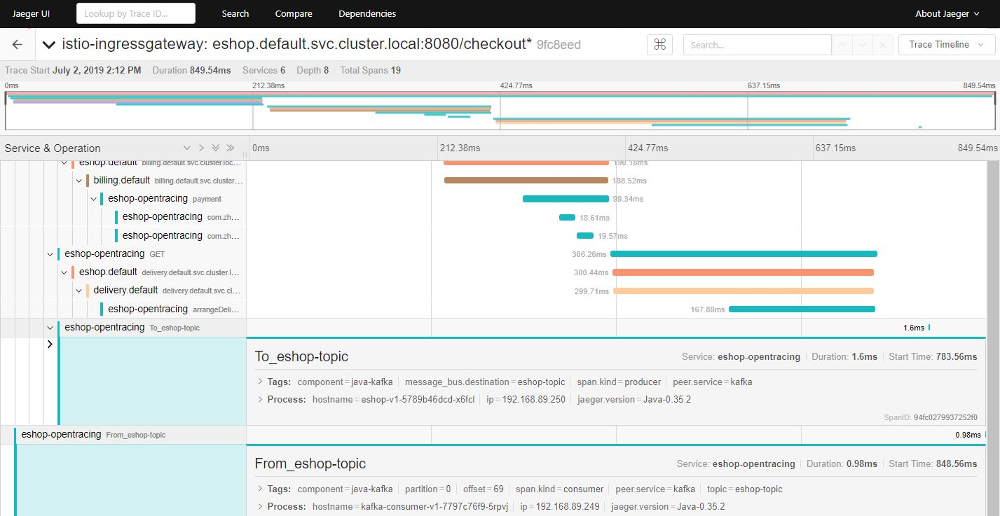
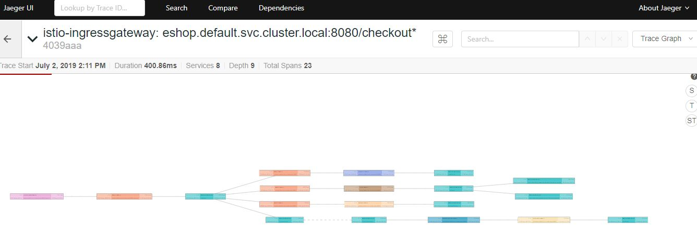

# 实现 Kafka 消息跟踪

在上一章节中，我们通过一个网上商店的示例程序学习了如何使用 Opentracing 在 Istio 服务网格中传递分布式追踪的上下文，以及如何将方法级的调用信息加入到 Istio/Envoy 生成的调用链中。采用 Opentracing 可以减少应用代码中传递 HTTP header 的重复代码；也可以根据需要在调用链中加入更细粒度的 Span，用于分析系统的性能瓶颈。

在实际项目中，除了同步调用之外，异步消息也是微服务架构中常用的一种通信方式。在本节中，我将继续利用 eshop demo 程序来探讨如何通过 Opentracing 将 Kafka 异步消息也纳入到 Istio 的分布式调用追踪中。

## eshop 示例程序结构

如下图所示，demo 程序中增加了发送和接收 Kafka 消息的代码。eshop 微服务在调用 inventory、billing、delivery 服务后，发送了一个 kafka 消息通知，consumer 接收到通知后，调用 notification 服务的 REST 接口向用户发送购买成功的邮件。



## 将 Kafka 消息处理加入调用链跟踪

### 植入 Kafka Opentracing 代码

首先将上一章节中从 github 下载的示例代码切换到 kafka-tracing 分支。

```bash
git checkout kafka-tracking
```

你可以直接使用 kafka-tracking 这个分支的代码，但建议跟随下面的步骤查看相关的代码，以了解各个步骤背后的原理。

根目录下分为了 rest-service 和 kafka-consumer 两个目录，rest-service 下包含了各个 REST 服务的代码，kafka-consumer 下是 Kafka 消息消费者的代码。

首先需要将 spring kafka和 Opentracing  kafka 的依赖加入到两个目录下的 pom 文件中。

```xml
<dependency>
	<groupId>org.springframework.kafka</groupId>
	<artifactId>spring-kafka</artifactId>
</dependency>
 <dependency>
	<groupId>io.opentracing.contrib</groupId>
	<artifactId>opentracing-kafka-client</artifactId>
	<version>${version.opentracing.kafka-client}</version>
</dependency>
```

在 rest-service 目录中的 KafkaConfig.java 中配置消息 Producer 端的 Opentracing  Instrument。 TracingProducerInterceptor 会在发送 Kafka 消息时生成发送端的 Span。

```java
@Bean
public ProducerFactory<String, String> producerFactory() {
    Map<String, Object> configProps = new HashMap<>();
    configProps.put(ProducerConfig.BOOTSTRAP_SERVERS_CONFIG, bootstrapAddress);
    configProps.put(ProducerConfig.KEY_SERIALIZER_CLASS_CONFIG, StringSerializer.class);
    configProps.put(ProducerConfig.VALUE_SERIALIZER_CLASS_CONFIG, StringSerializer.class);
    configProps.put(ProducerConfig.INTERCEPTOR_CLASSES_CONFIG, TracingProducerInterceptor.class.getName());
    return new DefaultKafkaProducerFactory<>(configProps);
}
```

在 kafka-consumer 目录中的 KafkaConfig.java 中配置消息 Consumer 端的 Opentracing  Instrument。 TracingConsumerInterceptor 会在接收到 Kafka 消息是生成接收端的 Span。

```java
@Bean
public ConsumerFactory<String, String> consumerFactory() {
    Map<String, Object> props = new HashMap<>();
    props.put(ConsumerConfig.BOOTSTRAP_SERVERS_CONFIG, bootstrapAddress);
    props.put(ConsumerConfig.GROUP_ID_CONFIG, groupId);
    props.put(ConsumerConfig.KEY_DESERIALIZER_CLASS_CONFIG, StringDeserializer.class);
    props.put(ConsumerConfig.VALUE_DESERIALIZER_CLASS_CONFIG, StringDeserializer.class);
    props.put(ConsumerConfig.INTERCEPTOR_CLASSES_CONFIG, TracingConsumerInterceptor.class.getName());
    return new DefaultKafkaConsumerFactory<>(props);
}
```

只需要这两步即可完成 Spring 程序的 Kafka Opentracing 代码植入。下面安装并运行示例程序查看效果。

### 安装 Kafka 集群

我们需要部署一个 Kafka 集群来提供消息服务。可以参照 [Kafka Quickstart](https://kafka.apache.org/quickstart) 在 Kubernetes 集群外部署 Kafka；也可以使用 [Kafka Operator](https://github.com/strimzi/strimzi-kafka-operator) 直接将 Kafka 部署在 Kubernetes 集群中。

### 部署 demo 应用

修改 Kubernetes yaml 部署文件 k8s/eshop.yaml，设置 Kafka bootstrap server，以用于 demo 程序连接到 Kafka 集群中。

```yml
apiVersion: extensions/v1beta1
kind: Deployment
metadata:
  name: eshop-v1
  ......
    spec:
      containers:
      - name: eshop
        image: zhaohuabing/istio-opentracing-demo:kafka-opentracing
        ports:
        - containerPort: 8080
        env:
          ....
          - name: KAFKA_BOOTSTRAP_SERVERS
		    # 请根据你实验环境的实际情况将 KAFKA_IP 改为正确的 IP 地址
            value: "${KAFKA_IP}:9092"

---
apiVersion: extensions/v1beta1
kind: Deployment
metadata:
  name: kafka-consumer-v1
  ......
    spec:
      containers:
      - name: kafka-consumer
        image: zhaohuabing/istio-opentracing-demo-kafka-consumer:kafka-opentracing
        env:
          ....
          - name: KAFKA_BOOTSTRAP_SERVERS
            # 请根据你实验环境的实际情况将 KAFKA_IP 改为正确的 IP 地址
            value: "${KAFKA_IP}:9092"
```

然后部署应用程序，相关的镜像可以直接从 dockerhub 下载，也可以通过源码编译生成。

```bash
kubectl apply -f k8s/eshop.yaml
```

在浏览器中打开地址： http://${NODE_IP}:31380/checkout ，以触发调用 eshop 示例程序的 REST 接口。然后打开 Jaeger 的界面 http://${NODE_IP}:30088 查看生成的分布式调用跟踪信息。



从图中可以看到，在调用链中增加了两个 Span，分布对应于 Kafka 消息发送和接收的两个操作。由于 Kafka 是以异步的方式处理消息的，消息发送端不直接依赖接收端的处理。根据 Opentracing 对引用关系的定义，From_eshop_topic Span  对 To_eshop_topic Span 的引用关系是 FOLLOWS_FROM 而不是 CHILD_OF 关系。

## 将调用跟踪上下文从 Kafka 传递到 REST 服务

现在 eshop 代码中已经加入了 REST 和 Kafka 的 Opentracing Instrumentation，可以在进行 REST 调用和发送 Kafka 消息时生成调用跟踪信息。但如果需要从 Kafka 的消息消费者的处理方法中调用一个 REST 接口呢？

我们会发现，在缺省情况下，Kafka 消费者 Span 和调用 notification 服务的 REST 请求的 Span 在两个不同的 Trace 中。这并不符合我们的预期，由于这两个 Span 属于同一个事务，因此我们希望将这两个 Span 关联在同一个 Trace 中。

要分析导致该问题的原因，我们首先需要了解 [“Active Span”](https://opentracing.io/docs/overview/scopes-and-threading/) 的概念。在 Opentracing 中，一个线程可以有一个 Active Span，该 Active Span 代表了目前该线程正在执行的工作。在调用 Tracer.buildSpan() 方法创建新的 Span 时，如果 Tracer 目前存在一个 Active Span，则会将该 Active Span 缺省作为新创建的 Span 的 Parent Span。

Tracer.buildSpan 方法的说明如下：

```
Tracer.SpanBuilder buildSpan(String operationName)
Return a new SpanBuilder for a Span with the given `operationName`.
You can override the operationName later via BaseSpan.setOperationName(String).

A contrived example:


   Tracer tracer = ...

   // 如果存在 active span，则其创建的新 Span 会隐式地创建一个 CHILD_OF 引用到该 active span
   try (ActiveSpan workSpan = tracer.buildSpan("DoWork").startActive()) {
       workSpan.setTag("...", "...");
       // etc, etc
   }

   // 也可以通过 asChildOf 方法指定新创建的 Span 的 Parent Span
   Span http = tracer.buildSpan("HandleHTTPRequest")
                     .asChildOf(rpcSpanContext)  // an explicit parent
                     .withTag("user_agent", req.UserAgent)
                     .withTag("lucky_number", 42)
                     .startManual();
```

分析 Kafka Opentracing Instrumentation 的代码，会发现 TracingConsumerInterceptor 在调用 Kafka 消费者的处理方法之前已经把消费者的 Span 结束了，因此发起 REST 调用时 tracer 没有 active span，不会将 Kafka 消费者的 Span 作为后面 REST 调用的 parent span。

```java
public static <K, V> void buildAndFinishChildSpan(ConsumerRecord<K, V> record, Tracer tracer,
      BiFunction<String, ConsumerRecord, String> consumerSpanNameProvider) {
    SpanContext parentContext = TracingKafkaUtils.extractSpanContext(record.headers(), tracer);

    String consumerOper =
        FROM_PREFIX + record.topic(); // <====== It provides better readability in the UI
    Tracer.SpanBuilder spanBuilder = tracer
        .buildSpan(consumerSpanNameProvider.apply(consumerOper, record))
        .withTag(Tags.SPAN_KIND.getKey(), Tags.SPAN_KIND_CONSUMER);

    if (parentContext != null) {
      spanBuilder.addReference(References.FOLLOWS_FROM, parentContext);
    }

    Span span = spanBuilder.start();
    SpanDecorator.onResponse(record, span);

    //在调用消费者的处理方法之前，该 Span 已经被结束。
    span.finish();

    // Inject created span context into record headers for extraction by client to continue span chain
    //这个 Span 被放到了 Kafka 消息的 header 中
    TracingKafkaUtils.inject(span.context(), record.headers(), tracer);
  }
```

此时 TracingConsumerInterceptor 已经将 Kafka 消费者的 Span 放到了 Kafka 消息的 header 中，因此从 Kafka 消息头中取出该 Span，显示地将 Kafka 消费者的 Span 作为 REST 调用的 Parent Span 即可。

为 MessageConsumer.java 使用的 RestTemplate 设置一个 TracingKafka2RestTemplateInterceptor。

```java
@KafkaListener(topics = "eshop-topic")
public void receiveMessage(ConsumerRecord<String, String> record) {
    restTemplate
            .setInterceptors(Collections.singletonList(new TracingKafka2RestTemplateInterceptor(record.headers())));
    restTemplate.getForEntity("http://notification:8080/sendEmail", String.class);
}
```

TracingKafka2RestTemplateInterceptor 是基于 Spring Opentracing Instrumentation 的 TracingRestTemplateInterceptor 修改的，将从 Kafka header 中取出的 Span 设置为出向请求的 Span 的 Parent Span。

```java
@Override
public ClientHttpResponse intercept(HttpRequest httpRequest, byte[] body, ClientHttpRequestExecution xecution)
        throws IOException {
    ClientHttpResponse httpResponse;
    SpanContext parentSpanContext = TracingKafkaUtils.extractSpanContext(headers, tracer);
    Span span = tracer.buildSpan(httpRequest.getMethod().toString()).asChildOf(parentSpanContext)
            .withTag(Tags.SPAN_KIND.getKey(), Tags.SPAN_KIND_CLIENT).start();
    ......
}
```

在浏览器中打开地址： http://${NODE_IP}:31380/checkout ，以触发调用 eshop 示例程序的 REST 接口。然后打开 Jaeger 的界面 http://${NODE_IP}:30088 查看生成的分布式调用跟踪信息。


从上图可以看到，调用链中出现了 Kafka 消费者调用 notification 服务的 sendEmail REST 接口的 Span。从图中可以看到，由于调用链经过了 Kafka 消息，sendEmail Span 的时间没有包含在 checkout Span 中。

在 Jaeger UI上 将图形切换为 trace graph，可以更清晰地表示出各个 Span 之间的调用关系。



## 小结

Istio 服务网格通过分布式调用跟踪来提高微服务应用的可见性。我们可以使用 Opentracing Instrumentation 来代替应用编码传递分布式跟踪的相关 http header；还可以将方法级的调用跟踪和 Kafka 消息的调用跟踪加入到 Istio 生成的调用跟踪链中，以提供更细粒度的调用跟踪信息。

该方案可以达到分布式调用跟踪的目的，但需要在代码框架层进行一定的改动，以植入调用跟踪的相关代码。一个更为理想的方案是由服务网格来完成所有调用跟踪的数据收集和生成，这样应用代码只需关注业务逻辑，而不用处理调用跟踪信息的生成。可以在 Envoy 中加入插件来为 Kafka 消息生成调用跟踪信息，但目前看来服务网格还没有很好的办法在上下游服务之前传递调用跟踪上下文。

## 参考资料

* [本文中 eshop 示例程序的源代码](https://github.com/servicemesher/istio-handbook-resources)
* [Distributed Tracing with Apache Kafka and Jaeger](https://objectpartners.com/2019/04/25/distributed-tracing-with-apache-kafka-and-jaeger/)