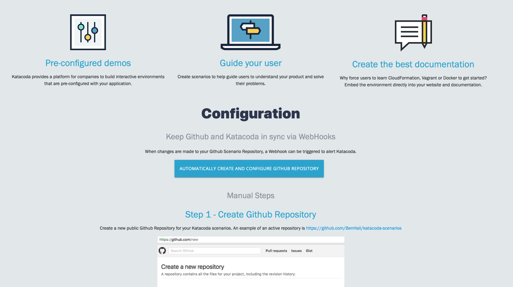
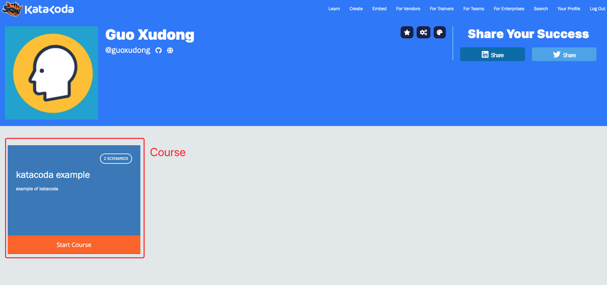
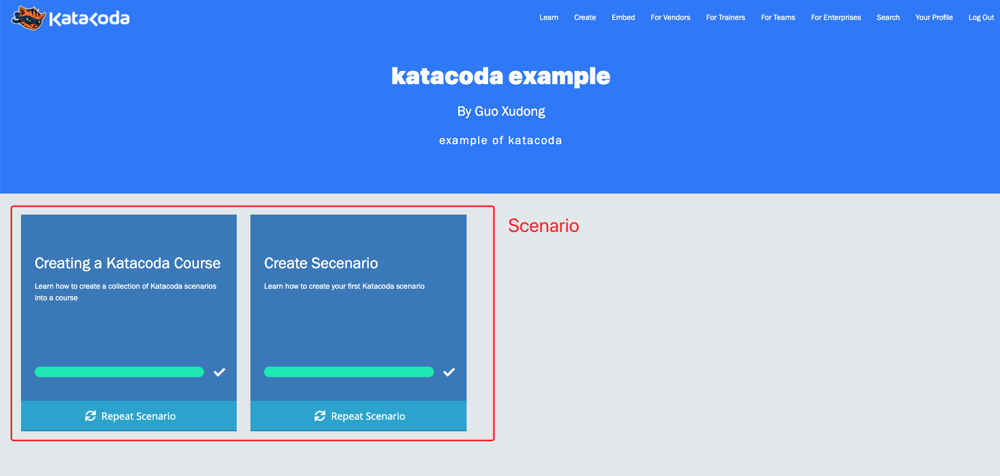
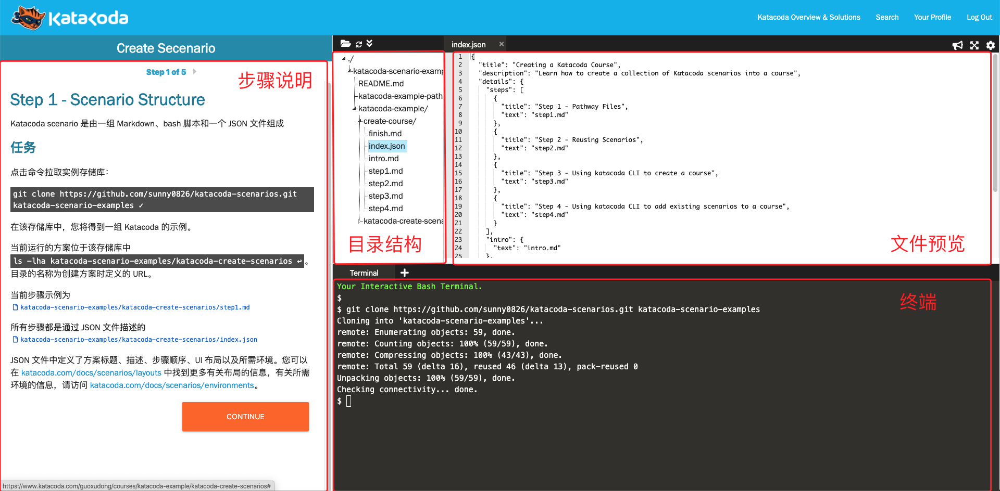

# Katacoda 实验环境

Katacoda 是一个面向软件工程师的交互式学习和培训平台，可在浏览器中使用真实环境学习和测试新技术，帮助开发人员学习，并掌握最佳实践。该平台于 2019 年 11 月被 O'Reilly 收购。

Katacoda 可以快速的提供一套完整的临时环境，并在使用后将其回收。用户可以根据设计好的引导步骤，通过浏览器上的终端界面操作一套完整的环境，一步步的学习和实践。尤其是在学习 Kubernetes 这种复杂的应用时，单单是创建一个集群就要花去不少时间，同时消耗的资源也令一些初学者望而生畏，Katacoda 的出现很好的解决了这些问题。课程设计者可以定制应用程序所需环境，并设计循序渐进的指导路径，旨在确保用户以最佳方式学习。

本书所有章节的实践项目都基于 Istio 1.5 版本以及 Katacoda 提供的 Kubernetes 环境完成。

本节讲解如何使用 Katacoda。

## 概念

在 Katacoda 每个用户都可以免费的学习和创建课程，其中：
- Course：课程，可包含一系列的 scenarios。
    - 官方教程入口：https://katacoda.com/scenario-examples/scenarios/create-course
    - 汉化教程入口：https://www.katacoda.com/guoxudong/courses/katacoda-example/create-course
- Scenarios：场景、方案。
    - 官方教程入口：https://www.katacoda.com/scenario-examples/scenarios/create-scenario-101
    - 汉化教程入口：https://www.katacoda.com/guoxudong/courses/katacoda-example/katacoda-create-scenarios

## 新建仓库

Katacoda 需要注册账号登录，这里直接使用 GitHub 账号登录即可，毕竟之后创建的方案都是存放在 GitHub 上的。

这里推荐在页面新建仓库，访问 https://www.katacoda.com/teach/git-hosted-scenarios ，点击 `Automatically Create and Configure Github Repository` 按钮，Katacoda 会自动在您的 Github 中创建一个名为 `katacoda-scenarios` 的仓库，并自动为您配置 Webhook，每次更新该仓库时，都会自动更新您 Katacoda 中课程的内容。



创建完成后，就可以在您的 Github 上找到名为 `katacoda-scenarios` 的代码仓库。

## Scenarios

Scenarios 即为方案、场景，由一组 Markdown、bash 脚本和一个 JSON 文件组成，这些文件保存了该 Scenarios 的所有配置。

Katacoda 官方提供了 CLI 工具，帮助您创建 Scenarios。

### 安装 CLI

通过 npm 命令安装 `npm i katacoda-cli --global`。

命令遵循语法的是 `$ katacoda COMMAND`

安装完成后，可以通过运行命令 `katacoda --help` 查看帮助信息。

### 创建 Scenarios 目录

例如，要创建新的方案，可以通过运行命令 `katacoda scenarios:create`，CLI 将会提示一些信息，帮助您创建方案：
- **Friendly URL:** 此处可输入 `test-scenario`，该属性将确定 scenarios 文件夹的名称，以及用来访问他的 URL。因此，该属性不能包括空格，需要是小写字母等。例如，如果您的用户名是 test-username 并且您的方案称为 test-scenario（如建议的那样），用于在平台中指向该方案的URL将为 https://katacoda.com/test-username/scenarios/test-scenario/
- **Title:** 方案的标题，将会显示在简介上
- **Description:** 方案的描述，将会显示在简介上
- **Difficulty level:** 难度级别，将会显示在简介上
- **Estimated time:** 估计完成的时间，将会显示在简介上
- **Number of steps:** 方案的步骤数。CLI 将会为您的所有步骤创建文件
- **Image:** 确定适用于您的方案的基本软件。例如，如果您需要 docker，java，go 等作为前提条件。更多相关信息，请阅读 https://katacoda.com/docs/scenarios/environments
- **Layout:** 它将确定方案界面元素的配置。例如，如果您只想显示终端，或编辑器+终端等形式，更多相关信息，请阅读 https://katacoda.com/docs/scenarios/layouts

输入这些信息，CLI 将帮您创建一个文件夹，其中引入了 ***friendly URL*** 的名称，并将在该文件夹内创建方案所需的文件。

### 编辑 Scenarios

Scenarios 目录创建好之后，可以看到目录的结构：
```bash
.
├── finish.md
├── index.json
├── intro.md
├── step1.md
├── step2.md
├── step3.md
├── step4.md
└── step5.md
```
- `index.json` ：文件中定义了标题、描述、步骤顺序、UI 布局以及所需环境，内容与您使用 CLI 工具创建时输入的是一致的，如果想对输入的内容进行修改，也可以在这里修改
- `intro.md`：介绍页，用来介绍您这个 Scenarios
- `finish.md` ：结束页
- `step1-setpN.md`：步骤介绍，数目与您使用 CLI 工具创建 Scenarios 时输入的数目相同

## Course

Course 课程，其包含一系列的 scenarios。其可以对相关方案进行分组，以便为​​用户提供清晰解释和学习的顺序。

### 创建 Course

同样需要使用 CLI 工具，安装方法见：[安装 CLI](###安装&nbsp;CLI)。

使用命令 `katacoda courses:create` 创建 Course。

CLI 将会提示您如下问题：
- **Title:** 课程的标题，将会显示在简介上
- **Description:** 方案的描述，将会显示在简介上
- **Friendly-url:** 此处可输入 `test-course`，该属性将确定课程文件夹的名称，以及用来访问他的 URL。因此，该属性不能包括空格，需要是小写字母等。例如，如果您的用户名是 test-username 并且您的方案称为 test-course，用于在平台中指向该课程的URL将为 https://katacoda.com/test-username/courses/test-course/

在生成的 `test-course-pathway.json`文件中可以看到刚才生成的课程定义：
```json
{
  "title": "test-course",
  "description": "Example course",
  "courses": []
}
```

### 将现有的 Scenarios 添加到课程中

运行以下命令将现有的 scenarios 添加到课程中：
`katacoda courses:add:scenarios`

CLI 将提示您以下问题：
- Scenario path: type `./quiz`（这个路径是现有 scenarios 的相对路径）
- Course path: type `./test-course`（这个路径是课程的相对路径)

然后选择是否要将 scenario 复制或移动到课程文件夹。

现在，就可以看到 scenario 已添加到 `test-course` 中了：
```json
{
  "title": "test-course",
  "description": "Example course",
  "courses": [
    {
      "course_id": "quiz",
      "title": "Interactive Quiz",
      "description": "Verify understand and key points by using an interactive quiz"
    }
  ]
```

## 上传

将创建的 Scenarios 或 Course 移动到之前[新建仓库](##新建仓库)时创建的 git 项目中。例如，下面这个项目包含1个 Course，且这个 Course 中又有2个 Scenario，将其上传到 Github。

```bash
$ tree
.
├── README.md
├── katacoda-example    # Course
│   ├── create-course   # Scenario
│   │   ├── finish.md
│   │   ├── index.json
│   │   ├── intro.md
│   │   ├── step1.md
│   │   ├── step2.md
│   │   ├── step3.md
│   │   └── step4.md
│   └── katacoda-create-scenarios   # Scenario
│       ├── finish.md
│       ├── index.json
│       ├── intro.md
│       ├── step1.md
│       ├── step2.md
│       ├── step3.md
│       ├── step4.md
│       └── step5.md
└── katacoda-example-pathway.json
$ git add .
$ git commit -m "New course"
$ git push origin master
```
上传成功后，在 **Your Profile** 页面就可以看到您上传的课程。

## 效果

**Your Profile 页面**



**Course 内容**

可以显示 Scenario 的学习进度




**Scenario 详情**

最终用户可以根据左侧的步骤说明来操作右侧的终端，同时如果有需要预览的文件，可以通过终端上面的窗口进行浏览。



## 总结

Katacoda 是一个面向软件工程师的交互式学习和培训平台，开发人员根据产品特色设计学习流程，方便用户的学习；学习者则无需关心环境的搭建与依赖的安装，通过开发人员设计的最佳实践来进行学习，快速又高效。
