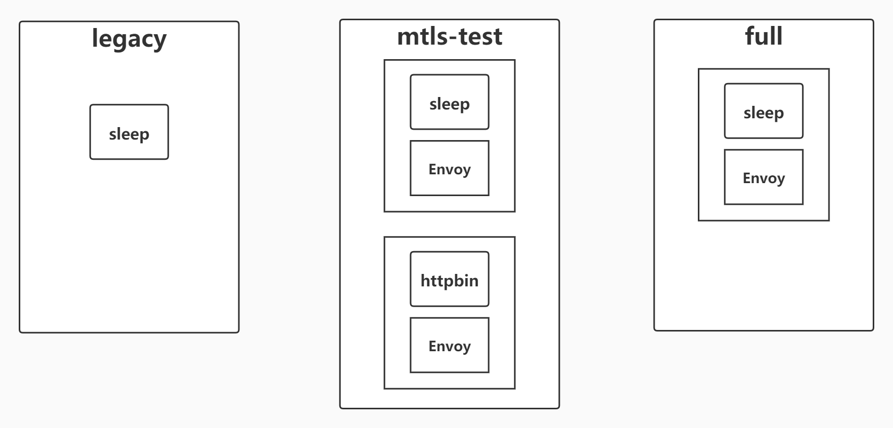

# 双向 TLS

TLS 在 web 端的使用非常广泛，针对传输的内容进行加密，能够有效的防止中间人攻击。双向TLS（Two way TLS/Mutual TLS，后文均简称 mTLS）的主要使用场景是在 B2B 和 Server-to-Server 的场景中，以支持服务与服务之间身份认证与授权。


上图源引[Istio官网](https://istio.io/docs/concepts/security/authz.svg)
，图中非常明确的表示 Istio 所希望的是在网格中能够使用 mTLS 进行授权，而在网格外使用 JWT+mTLS 进行授权。服务间身份认证是使用 mTLS，来源身份验证中则是使用 JWT。

我们将一一阐述 mTLS 在 Istio 中身份认证和授权两个方面的实验，在 Kubernetes 集群中使用有哪些注意事项，和 mTLS 的使用建议两个方面。

## mTLS 在 Istio 中进行身份认证和授权

Istio 中提供了 AuthorizationPolicy 用于对 trust domain 进行设置，能够对证书做到更加细粒度的验证。具体的一些实验我们也会在后面的章节中进行实验与探讨。

我们将构建测试环境用于验证 mTLS 身份认证是否在服务间启用，mTLS 身份认证在不同的模式下将对服务与服务之的通信有何影响，授权规则对服务与服务之间的通信有何影响。
实验环境结构如图，共拥有 `full`，`legacy`，`mtls-test` 三个命名空间，对 `full`，`mtls-test` 设置为自动注入 sidecar。



### 使用 mTLS 实现服务间身份认证

为验证 mTLS 实现服务间身份认证，我们将在网格外（`legacy`）和网格内（`mtls-test` 和 `full`）使用 sleep 向 httpbin 发起通信，配置不同的模式，观察不同的返回结果来体验 mTLS 服务间身份认证。

#### mTLS 身份认证原理与模式简介

mTLS 主要负责服务与服务之间传输层面的认证，具体实现在 sidecar 中，在具体进行请求时，将经历如下的过程：
1. 客户端发出的请求将被发送到客户端 sidecar 。
2. 客户端 sidecar 与服务端 sidecar 开始 mTLS 握手，在握手的同时，客户端 sidecar 讲进行 secure naming check 的额外操作，对服务端中的 server identity (存储在证书中的 SAN 中) 进行检查，以确保其能够运行服务，该操作能够防止一些常见 HTTP/TCP 的流量劫持攻击。
3. 在完成身份认证以及之后要讲到的授权之后，客户端和服务端开始建立连接进行通信。

Istio 提供如下三种 mTLS 身份认证 模式，在不同的场景下进行使用。

- PERMISSIVE: 同时支持密文传输和明文传输，则不管是在 Istio 管理下的 Pod 还是在 Istio 管理外的 Pod，相互之间的通信畅通无阻。PERMISSIVE 模式的主要用途是在用户迁移的过程中，服务与服务之间也仍旧能够通信，例如部分 workload 并未注入 sidecar。对于刚接触 Istio 的用户而言非常友好，官方建议在完成迁移之后调整为 STRICT 模式。
- STRICT: workload 只支持密文传输。
- DISABLE: 关闭 Mutual TLS。从安全的角度而言，官方并不建议在没有其他安全措施的情况下使用该模式。
- UNSET: 具体的策略将从父级配置中继承（命名空间或网格层面），如果父级没有进行相应的配置，则使用 PERMISSIVE 模式。

针对此我们需要重点关注的 CRD 为 `PeerAuthentication` 和 `DestinationRule`。`PeerAuthentication` 将会定义流量在 sidecar 之间如何进行传输。 `DestinationRule` 将定义在发生路由之后对于流量的相应策略，我们主要关注其中的 `TLSSettings`，需要与 `PeerAuthentication` 两者配合进行设置。

实验将从默认的 PERMISSIVE 模式开始，转变为 STRICT 模式，最终对于部分的服务启用 DISABLE 模式，通过观察其返回内容，判断是否使用密文传输，从而熟悉在不同模式下的行为模式。

#### 使用默认 PERMISSIVE 模式

默认情况下，PERMISSIVE 模式能够支持明文传输，则不管是在 Istio 管理下的 Pod 还是在 Istio 管理外的 Pod，相互之间的通信畅通无阻。PERMISSIVE 是一种过渡态，当你开始将所有的 workload 都迁移到网格中时，可以使用 PERMISSIVE 过渡态，在完成迁移工作后，可以通过 Grafana Dashboard 或者在 istio-proxy 中使用 tcpdump 来检查是否仍存在明文传输的情况。最终将模式转换为 STRICT 完成迁移。

为简单辨识请求是否使用密文传输，我们将显示返回中的SPIFFE URL ，它来自X509证书的客户端标识，它指示通信是在相互的TLS中发送的。

```bash
for from in "mtls-test" "legacy"; do for to in "mtls-test"; do echo "sleep.${from} to httpbin.${to}";kubectl exec $(kubectl get pod -l app=sleep -n ${from} -o jsonpath={.items..metadata.name}) -c sleep -n ${from} -- curl http://httpbin.${to}:8000/headers  -s  -w "response code: %{http_code}\n" | egrep -o 'URI\=spiffe.*sa/[a-z]*|response.*$';  echo -n "\n"; done; done

sleep.mtls-test to httpbin.mtls-test
URI=spiffe://cluster.local/ns/mtls-test/sa/sleep
response code: 200
sleep.legacy to httpbin.mtls-test
response code: 200
sleep.full to httpbin.mtls-test
URI=spiffe://cluster.local/ns/full/sa/sleep
response code: 200
```

从输出内容可以发现 `sleep.mtls-test` 到 `httpbin.mtls-test` 能够找到 SPIFFE 的相关内容，SPIFFE URI 显示来自 X.509 证书的客户端标识，它表明流量是在 mTLS 中发送的。如果流量为明文，将不会显示客户端证书。可以验证 PERMISSIVE 模式既能支持明文传输，又能支持密文传输。

#### 启用 STRICT 模式

```yaml
apiVersion: "networking.istio.io/v1alpha3"
kind: "DestinationRule"
metadata:
  name: "httpbin-mtls-test-mtls"
spec:
  host: httpbin.mtls-test.svc.cluster.local
  trafficPolicy:
    tls:
      mode: ISTIO_MUTUAL
---
apiVersion: "security.istio.io/v1beta1"
kind: "PeerAuthentication"
metadata:
  name: "httpbin"
  namespace: "mtls-test"
spec:
  selector:
    matchLabels:
      app: httpbin
  mtls:
    mode: STRICT
```

此时我们已经要求进入到 `httpbin.mtls-test` 的流量必须是密文传输，则 `httpbin.legacy` 没有办法获取到最终的结果，再次发送请求以验证：

```
sleep.mtls-test to httpbin.mtls-test
URI=spiffe://cluster.local/ns/mtls-test/sa/sleep
response code: 200
sleep.legacy to httpbin.mtls-test
response code: 000
command terminated with exit code 56
sleep.full to httpbin.mtls-test
URI=spiffe://cluster.local/ns/full/sa/sleep
response code: 200
```

#### 启用 DISABLE 模式

此时，我们因为种种的原因不能将 `sleep.legacy` 迁移到网格中，但仍旧希望其可以与 `httpbin.mtls-test` 进行通信，因此我们针对 `httpbin.mtls-test` 启用 DISABLE 模式

```yaml
apiVersion: "security.istio.io/v1beta1"
kind: "PeerAuthentication"
metadata:
  name: "httpbin"
  namespace: "mtls-test"
spec:
  selector:
    matchLabels:
      app: httpbin
  mtls:
    mode: DISABLE
---
apiVersion: "networking.istio.io/v1alpha3"
kind: "DestinationRule"
metadata:
  name: "httpbin-mtls-test-mtls"
spec:
  host: httpbin.mtls-test.svc.cluster.local
  trafficPolicy:
    tls:
      mode: DISABLE
```

```
sleep.mtls-test to httpbin.mtls-test
response code: 200
sleep.legacy to httpbin.mtls-test
response code: 200
sleep.full to httpbin.mtls-test
response code: 200
```

实验的结果上能体现相互之间的通讯是畅通的，但是没有展示 SPIFFE URI，因此所有的流量都是明文传输的。请一定注意这样的配置是非常危险的，在没有其他安全措施的情况下请避免这类情况的发生。

### 使用 mTLS 实现服务间授权

为验证 mTLS 实现服务间授权，我们将沿用相关的测测试环境，主要验证在网格内部的进行通信时，如何使用服务间授权来进一步细粒度保护相应服务。

#### mTLS 服务间授权原理

身份认证主要解决的是证明“我是谁”的问题，授权则是列举出“我能做什么”，对于 mTLS 而言，则是需要回答该流量 ALLOW 还是 DENY，其中的主要依据是 Identity，通常，Trust Domain 指定身份所属的网格。

针对此我们需要重点关注的 CRD 为 `AuthorizationPolicy`。`AuthorizationPolicy` 对网格中的 workload 访问控制负责，在不同的条件下判定是否准入。

Istio 在1.5版本前，会在每一个命名空间下创建一个 `istio.default` 的 secret，存储默认的 CA 文件，并会被挂载在 sidecar 中以供使用，但是在1.5版本中，不会再存储在 secret 中，只能通过 rpc 调用才能获取到响应的内容，内容最终会被分配在内存中，但我们可以使用 `openssl s_client` 进行访问来获得证书。

```bash
kubectl exec <pod> -c istio-proxy -- openssl s_client -alpn istio -connect <service:port> # 获取到证书
openssl x509 -text -noout -in server.pem # 对上一个cmd返回内容中的server.pem 进行解析
Certificate:
  # Ignore something now is not important
        X509v3 extensions:
            X509v3 Subject Alternative Name: critical
                URI:spiffe://cluster.local/ns/default/sa/default
```

我们接下来要重点关注的就是这里所展示的 SAN（Subject Alternative Name）。

Trust Domain 是 Istio 1.4 版本进入 alpha 的一个功能，在我们修改 Trust Domain 时，实质上是修改了 SAN 区域的值，重新签发了新的证书(重新签发证书需要一定的时间，因此在配置之后需要等待一段时间才能生效)。

#### 使用授权策略拒绝请求

在我们的实验中，我们将拒绝 `sleep.full` 访问 `httpbin.mlts-test` 的任何 GET 请求。
```yaml
apiVersion: security.istio.io/v1beta1
kind: AuthorizationPolicy
metadata:
  name: httpbin.mtls-test.svc.cluster.local
  namespace: mtls-test
spec:
  action: DENY
  rules:
  - from:
    - source:
        principals:
        - cluster.local/ns/full/sa/sleep
    to:
    - operation:
        methods:
        - GET
  selector:
    matchLabels:
      app: httpbin
```

我们再次进行测试，最终的结果如下：

```
sleep.mtls-test to httpbin.mtls-test
URI=spiffe://cluster.local/ns/mtls-test/sa/sleep
response code: 200
sleep.legacy to httpbin.mtls-test
response code: 000
command terminated with exit code 56
sleep.full to httpbin.mtls-test
response code: 403
```

我们看到当 `sleep.full` 请求 `httpbin.mtls-test` 时，此时返回403，说明其存在证书，但是证书的的 SAN 值域并不在 Trust Domain 中，因此返回403以表示访问权限不足。

### 使用 mTLS 与网格外部服务通信

在许多情况下，服务网格中的微服务序并不是应用程序的全部。有时，网格内部的微服务需要使用在服务网格外部的服务，在网格外部署服务，有如下几种原由：
1. 相关服务是第三方服务，无法被直接迁移到服务网格中。
2. 从性能方面进行考量，认为相关服务不适合加入到网格中。
3. 由于行政管理方面的原因，需要使用到其他团队的服务，但对方团队并没有服务网格的相关背景。

我们仍旧希望能够享受服务网格带来的 mTLS 的便利，来使整个系统更加安全。本节就以 MongoDB 为例，首先实现 MongoDB 内置 mTLS，之后将服务端迁移到网格内部，在网格内通过 mTLS 访问网格外部 MongoDB 服务。

#### 使用 MongoDB 内置 mTLS 创建安全连接

MongoDB 自身能够提供 mTLS 的服务，可以通过签发相应的证书来完成 mTLS的配置。

##### 使用 openssl 签发证书

首先使用 openssl 自行签发证书：

```bash
openssl req -out ca.pem -new -x509 -days 3650 -subj "/C=CN/CN=root/emailAddress=11111@qq.com" # 生成根证书
openssl genrsa -out server.key 2048 # 生成服务器私钥
openssl req -key server.key -new -out server.req -subj "/C=CN/CN=mongo/emailAddress=11111@qq.com" # 生成服务端证书申请文件
openssl x509 -req -in server.req -CAkey privkey.pem -CA ca.pem -days 36500 -CAcreateserial -CAserial serial -out server.crt # 生成服务端证书
cat server.key server.crt > server.pem # 合并证书与私钥
openssl verify -CAfile ca.pem server.pem # 验证证书
openssl genrsa -out client.key 2048 # 生成客户端私钥
openssl req -key client.key -new -out client.req -subj "/C=CN/CN=client/emailAddress=11111@qq.com" # 生成客户端证书申请文件
openssl x509 -req -in client.req -CAkey privkey.pem -CA ca.pem -days 36500 -CAserial serial -out client.crt # 生成客户端证书
cat client.key client.crt > client.pem # 合并证书与私钥
openssl verify -CAfile ca.pem client.pem # 验证证书
```

至此我们已经获得了三个证书，`ca.pem`作为根证书，`server.pem` 和`client.pem`分别作为服务端和客户端的证书。

##### 使用 ConfigMap 部署 MongoDB 客户端和服务端

创建 `ConfigMap` 以供挂载在客户端和服务端。

```bash
kubectl create configmap -n mongo mongo-server-pem --from-file=./ssl/server.pem --from-file=./ssl/ca.pem
kubectl create configmap -n mongo mongo-client-pem --from-file=./ssl/client.pem --from-file=./ssl/ca.pem
```

服务端:

```yaml
apiVersion: v1
kind: Service
metadata:
  name: mongo
  namespace: mongo
  labels:
    name: mongo
spec:
  ports:
  - port: 27017
    targetPort: 27017
  clusterIP: None
  selector:
    app: mongo
---
apiVersion: apps/v1beta1
kind: StatefulSet
metadata:
  name: mongo
  namespace: mongo
spec:
  serviceName: mongo
  replicas: 1
  template:
    metadata:
      labels:
        app: mongo
    spec:
      terminationGracePeriodSeconds: 10
      containers:
        - name: mongo
          image: mongo:4.2
          command:
            - mongod
            - "--bind_ip"
            - 0.0.0.0
            - "--tlsMode"
            - "requireTLS"
            - "--tlsCertificateKeyFile"
            - "/pem/server.pem"
            - "--tlsCAFile"
            - "/pem/ca.pem"
          ports:
            - containerPort: 27017
          volumeMounts:
          - name: ssl
            mountPath: /pem
      volumes:
        - name: ssl
          configMap:
            name: mongo-server-pem  
```

服务端中我们挂载了 `mongo-server-pem` 的 `ConfigMap` 用于启动 mongod，要求 mongod 在建立连接时，必须使用 mTLS 建立连接。

客户端:

```yaml
apiVersion: apps/v1
kind: Deployment
metadata:
  namespace: mongo
  name: mongo-client
spec:
  replicas: 1
  selector:
    matchLabels:
      app: mongo-client
      version: v1
  template:
    metadata:
      labels:
        app: mongo-client
        version: v1
    spec:
      containers:
      - image: mongo:4.2
        imagePullPolicy: IfNotPresent
        name: mongo-client
        volumeMounts:
          - name: ssl
            mountPath: /pem
      volumes:
        - name: ssl
          configMap:
            name: mongo-client-pem
```

类似的，客户端也通过 `ConfigMap` 将客户端证书和根证书挂载到客户端容器中，以供后序客户端对服务端进行访问。

##### 客户端进行访问实验

```bash
root@mongo-client: mongo --tls --tlsCAFile /pem/ca.pem --tlsCertificateKeyFile /pem/client.pem --host mongo.mongo
Welcome to the MongoDB shell.
```

在 `mongo-client` 中我们使用正确的客户端证书和根证书对 `mongo.mongo` 尝试连接，能够正常通信。

```bash
root@mongo-client:/ mongo  --host mongo.mongo
2020-05-02T06:19:11.562+0000 I  NETWORK  [js] DBClientConnection failed to receive message from mongo.mongo:27017 - HostUnreachable: Connection closed by peer
```

在尝试连接时不设置任何证书，将会在握手阶段被拒绝。

```bash
root@mongo-client:/ mongo --tls --tlsCAFile /pem/ca.pem --tlsCertificateKeyFile /pem/ca.pem --host mongo.mongo
2020-05-02T06:30:25.551+0000 E  NETWORK  [main] cannot read PEM key file: /pem/ca.pem error:0909006C:PEM routines:get_name:no start line
Failed global initialization: InvalidSSLConfiguration Can not set up PEM key file.
```

我们用根证书替代客户端证书，根证书的格式不正确导致无法完成握手。

```bash
root@mongo-client:/ mongo --tls --tlsCAFile /pem/client.pem --tlsCertificateKeyFile /pem/client.pem --host mongo.mongo
2020-05-02T06:30:36.144+0000 E  NETWORK  [js] SSL peer certificate validation failed: self signed certificate in certificate chain
```

我们用客户端证书替代根证书，服务端将在握手阶段验证，最终发现客户端是自签名证书，不可被信任。

上述的输出可以表明，在没有证书和证书不正确的情况下都无法连入数据库，我们能够正确使用 mTLS 模式访问 MongoDB，在访问 MongoDB 上现在已经有了非常安全的保障，但是在客户端需要开发者自行处理有关证书的事宜，这不仅仅会给开发者带来困扰，也会将证书与私钥对外暴露，如果客户端在网格内部，我们可以让 sidecar 来负责相关的工作。

#### Istio mTLS 结合 MongoDB

我们主要针对客户端进行改造，将其部署在网格中，并让 istio-proxy 进行 mTLS 的相关处理。

```yaml
apiVersion: apps/v1
kind: Deployment
metadata:
  namespace: mtls-test
  name: mongo-client
spec:
  replicas: 1
  selector:
    matchLabels:
      app: mongo-client
      version: v1
  template:
    metadata:
      labels:
        app: mongo-client
        version: v1
      annotations:
        sidecar.istio.io/userVolume: '[{"name":"client-ssl", "configMap":{"name":"mongo-client-pem"}}]'
        sidecar.istio.io/userVolumeMount: '[{"name":"client-ssl", "mountPath":"/pem"}]'
      
    spec:
      containers:
      - image: mongo:4.2
        imagePullPolicy: IfNotPresent
        name: mongo-client
```

其中 `template.annotations` 可参考 [Resource Annotations](https://preliminary.istio.io/docs/reference/config/annotations/)，这里主要的用途是将客户端端的相关证书等内容挂载进入到 `istio-proxy` 容器中。

```yaml
apiVersion: networking.istio.io/v1alpha3
kind: DestinationRule
metadata:
  namespace: mtls-test
  name: db-mtls
spec:
  host: mongo.mongo.svc.cluster.local
  trafficPolicy:
    tls:
      mode: MUTUAL
      clientCertificate: /pem/client.pem
      privateKey: /pem/client.key
      caCertificates: /pem/ca.pem
```

设置相应的 `DestinationRule`，应要注意 `tls.mode` 为 `MUTUAL`，并未使用 `ISTIO_MUTUAL`。相应证书的路径和 `Deployment` 中的 `annotation` 相呼应。
在部署后我们进入到 `mongo-client` 容器中，进行连接的实验：

```bash
root@mongo-client-7557b58674-f2rvc:/ mongo --host mongo.mongo
MongoDB shell version v4.2.6
connecting to: MongoDB://mongo.mongo:27017/?compressors=disabled&gssapiServiceName=MongoDB
Implicit session: session { "id" : UUID("19b8f417-4e6b-4ef6-9fda-15e9f1703ebf") }
MongoDB server version: 4.2.6
Welcome to the MongoDB shell.
```

可以看到这次我们在创建连接时并没有使用设置相应 TLS 的内容，这就是因为将 TLS 层的内容前移到了 istio-proxy 中。

### mTLS 与 Kubernetes 探针

我们常在 Kubernetes 集群中使用探针，用于检测服务的健康状态，而这样的探针，往往是一个 HTTP 请求，那么在我们使用探针时，如果开启 mTLS STRICT 模式，则会出现探针报错的情况，但实际上我们的服务应该是可以正常运行的。

```bash
kubectl get pods -n mtls-test --watch
NAME                            READY   STATUS             RESTARTS   AGE
httpbin-5446f4d9b4-kxsjx        2/2     Running            0          4h4m
httpbin-probe-79d8c47c6-rmwkl   1/2     CrashLoopBackOff   4          115s
sleep-666475687f-cp252          2/2     Running            0          6h23m
```

因为探针的最终实施者是 kubelet，但是 kubelet 在执行探测时，并不会携带相应合法的证书，因此会被 sidecar 拒绝请求，返回一个非 2xx 的返回值，TCP 同理，因此需要在该方面上得到豁免。

Istio 官方文档也给出了相应的答案，通过添加注解的方式达成豁免。
修改 Deployment，在 `template.metadata` 中添加了 `sidecar.istio.io/rewriteAppHTTPProbers` 通过改写的方式保证探针能够正常工作。

```yaml
spec:
  template:
    metadata:
      annotations:
        sidecar.istio.io/rewriteAppHTTPProbers: "true"
```

## mTLS 的使用建议

微服务架构中，服务与服务之间的调用是非常频繁的，这也是 Istio 启用 mTLS 的一个原因，但是我们在实际的使用中，我们需要从安全和性能两者综合考虑。

从安全方面而言，mTLS 的使用最大限度的保障了网格内服务的安全。大多数用户会选择从一些基础的镜像开始构建，用户无法确保这些镜像是否包含恶意代码。假设用户在网格外部署了一个名为 Hack 的 Pod ，其注入的恶意代码将在容器启动时尝试连接网格中的 mysql 数据库，如果我们选择使用 PERMISSIVE 或 DISABLE 模式，则 Hack 的行为合法，将为其创造条件对数据库密码进行破解，如果使用 STRICT 模式，则 Hack 将无法访问到相应资源，返回状态码503，从根源上阻止了其行为。

然而从性能角度考虑，用户可以创建更少的连接来避免总的握手次数（多路复用），但是对称加密/解密本身是非常耗时和耗 CPU 资源的——有关性能消耗的分析，可见一些评测机构对此作出的相关评测。

综上，如果是对性能较为敏感，且数据的敏感性不强，数据库也仅限集群内部访问，可以考虑使用明文传输。但如果数据敏感或业务逻辑需要安全方面的考量，建议使用 mTLS。

## 参考资料

* [Authentication Architecture](https://istio.io/docs/concepts/security/#authentication-architecture)
* [Subject Alternative Name](https://en.wikipedia.org/wiki/Subject_Alternative_Name)
* [Authz-td-Migration](https://istio.io/docs/tasks/security/authorization/authz-td-migration)
* [Istio 1.5 upgrade notes](https://istio.io/news/releases/1.5.x/announcing-1.5/upgrade-notes)
* [MongoDB Configure TLS](https://docs.MongoDB.com/manual/tutorial/configure-ssl)
* [MongoDB TLS Performance](https://www.synopsys.com/content/dam/synopsys/sig-assets/case-studies/tls-performance-overhead-MongoDB.pdf)
