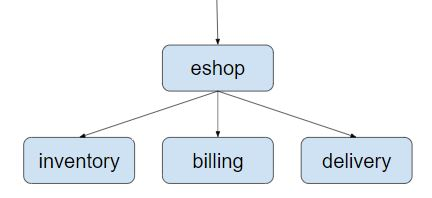
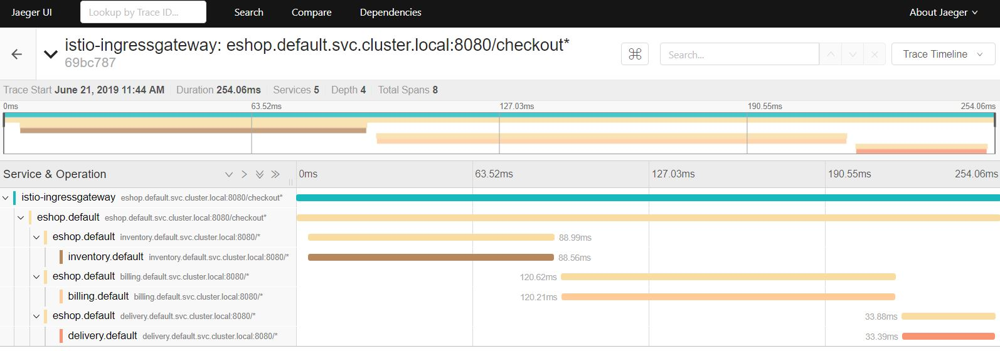
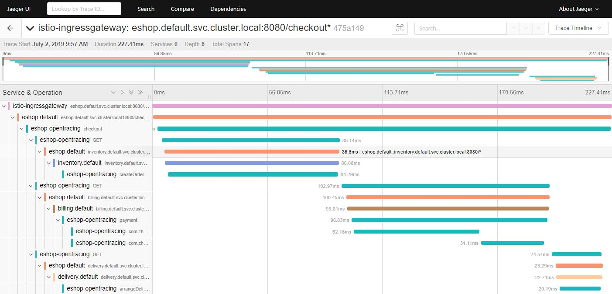
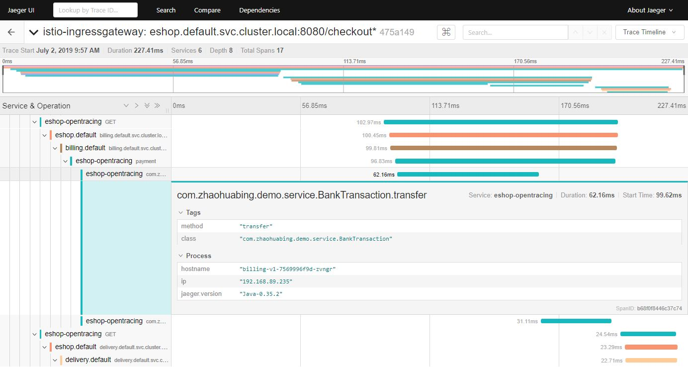

# 实现方法级的调用跟踪

Istio 为微服务提供了开箱即用的分布式追踪功能。在安装了 Istio 的微服务系统中， Sidecar 会拦截服务的入向和出向请求，为微服务的每个HTTP远程调用请求自动生成调用跟踪数据。通过在服务网格中接入一个分布式跟踪的后端，例如 zipkin 或者 Jaeger ，就可以查看一个分布式调用请求的端到端详细内容，例如该请求经过了哪些服务，调用了哪个 REST 接口，每个 REST 接口所花费的时间等。

在某些情况下，进程/服务级别的调用跟踪信息有可能不足以分析系统中的问题。例如分析导致客户端调用耗时过长的原因时，我们可以通过Istio提供的分布式追踪找到导致瓶颈的微服务进程，但无法进一步找到导致该问题的程序模块和方法。在这种情况下，我们就需要用到进程内方法级的调用跟踪来对调用链进行更细粒度的分析。本文将介绍如何在Isti的分布式追踪加入方法级别的调用链。

## Isito的分布式追踪

需要注意的是， Istio 虽然在此过程中完成了大部分工作，但还是要求对应用代码进行少量修改：应用代码中需要将收到的上游 HTTP 请求中的 b3 header 拷贝到其向下游发起的 HTTP 请求的 header 中，以将调用跟踪上下文传递到下游服务。这部分代码不能由 Sidecar 代劳，原因是 Sidecar 并不清楚其代理的服务中的业务逻辑，无法将入向请求和出向请求按照业务逻辑进行关联。这部分代码量虽然不大，但需要对每一处发起 HTTP 请求的代码都进行修改，非常繁琐而且容易遗漏。当然，可以将发起 HTTP 请求的代码封装为一个代码库来供业务模块使用，来简化该工作。

下面以一个简单的网上商店示例程序来展示 Istio 如何提供分布式追踪。该示例程序由 eshop、inventory、billing、delivery 几个微服务组成，结构如下图所示：



eshop 微服务接收来自客户端的请求，然后调用 inventory、billing、delivery 这几个后端微服务的 REST 接口来实现用户购买商品的 checkout 业务逻辑。本例的代码可以从 github 下载： https://github.com/zhaohuabing/istio-opentracing-demo.git

如下面的代码所示，我们需要在 eshop 微服务的应用代码中传递 b3 HTTP Header，以将 eshop 微服务进程中的 Span 和其下游微服务的 Span 关联到同一个 Trace 中。

```java
 @RequestMapping(value = "/checkout")
public String checkout(@RequestHeader HttpHeaders headers) {
    String result = "";
    // 在这里中使用了 HTTP GET， 在真实的案例中，一般会使用 HTTP POST 方法。
    // 为了简单起见，三个微服务打包在了一个 jar 中， 我们需要在 Kubernetes 中定义三个 Service 。
    result += restTemplate.exchange("http://inventory:8080/createOrder", HttpMethod.GET,
            new HttpEntity<>(passTracingHeader(headers)), String.class).getBody();
    result += "<BR>";
    result += restTemplate.exchange("http://billing:8080/payment", HttpMethod.GET,
            new HttpEntity<>(passTracingHeader(headers)), String.class).getBody();
    result += "<BR>";
    result += restTemplate.exchange("http://delivery:8080/arrangeDelivery", HttpMethod.GET,
            new HttpEntity<>(passTracingHeader(headers)), String.class).getBody();
    return result;
}
private HttpHeaders passTracingHeader(HttpHeaders headers) {
    HttpHeaders tracingHeaders = new HttpHeaders();
    extractHeader(headers, tracingHeaders, "x-request-id");
    extractHeader(headers, tracingHeaders, "x-b3-traceid");
    extractHeader(headers, tracingHeaders, "x-b3-spanid");
    extractHeader(headers, tracingHeaders, "x-b3-parentspanid");
    extractHeader(headers, tracingHeaders, "x-b3-sampled");
    extractHeader(headers, tracingHeaders, "x-b3-flags");
    extractHeader(headers, tracingHeaders, "x-ot-span-context");
    return tracingHeaders;
}

```
在 Kubernetes 中部署该程序，查看 Istio 分布式追踪的效果。

* 首先部署 Kubernetes cluster ，注意需要启用 API Server 的 Webhook 选项
* 在 Kubernetes cluster 中部署 Istio ，并且启用 default namespace 的 sidecar auto injection 
* 在 Kubernetes cluster 中部署 eshop 应用

```bash
git clone https://github.com/zhaohuabing/istio-opentracing-demo.git
cd istio-opentracing-demo
git checkout without-opentracing
kubectl apply -f k8s/eshop.yaml
```

* 在浏览器中打开地址： http://${NODE_IP}:31380/checkout ，以触发调用 eshop 示例程序的 REST 接口。
* 在浏览器中打开 Jaeger 的界面 http://${NODE_IP}:30088 ，查看生成的分布式追踪信息。

注意:为了能在 Kubernetes Cluster 外部访问到 Jaeger 的界面，需要修改 Istio 的缺省安装脚本，为 Jaeger Service 指定一个 NodePort。修改方式参见下面的代码：

```yaml
apiVersion: v1
  kind: Service
  metadata:
    name: jaeger-query
    namespace: istio-system
    annotations:
    labels:
      app: jaeger
      jaeger-infra: jaeger-service
      chart: tracing
      heritage: Tiller
      release: istio
  spec:
    ports:
      - name: query-http
        port: 16686
        protocol: TCP
        targetPort: 16686
        nodePort: 30088
    type: NodePort
    selector:
      app: jaeger
```

Jaeger 用图形直观地展示了这次调用的详细信息，可以看到客户端请求从 Ingressgateway 进入到系统中，然后调用了 eshop 微服务的 checkout 接口， checkout 调用有三个 child span ，分别对应到 inventory、billing 和 delivery 三个微服务的 REST 接口。



## 使用 Opentracing 来传递分布式跟踪上下文

Opentracing 提供了基于 Spring 的代码埋点，因此我们可以使用 Opentracing Spring 框架来提供 HTTP header 的传递，以避免这部分硬编码工作。在 Spring 中采用 Opentracing 来传递分布式跟踪上下文非常简单，只需要下述两个步骤：

* 在 Maven POM 文件中声明相关的依赖，一是对 Opentracing SPring Cloud Starter 的依赖；另外由于后端接入的是 Jaeger ，也需要依赖 Jaeger 的相关 jar 包。
* 在 Spring Application 中声明一个 Tracer bean 。

```java
@Bean
public Tracer jaegerTracer() {
	// 我们需要设置下面的环境变量：
	// JAEGER_ENDPOINT="http://10.42.126.171:28019/api/traces"
	// JAEGER_PROPAGATION="b3"
	// JAEGER_TRACEID_128BIT="true" 使用 128bit 的 tracer id， 以兼容 Istio
	return Configuration.fromEnv("eshop-opentracing").getTracer();
}
```

> 注意：
>
> * Jaeger tracer 缺省使用的是 uber-trace-id header ,而 Istio/Envoy 不支持该 header 。因此需要指定 Jaeger tracer 使用 b3 header 格式，以和 Istio/Envoy 兼容。
> * Jaeger tracer 缺省使用64 bit 的 trace id , 而 Istio/Envoy 使用了128 bit 的 trace id 。因此需要指定 Jaeger tracer 使用128 bit 的 trace id，以和 Istio/Envoy 生成的 trace id 兼容。

部署采用 Opentracing 进行 HTTP header 传递的程序版本，其调用跟踪信息如下所示：



从上图中可以看到，相比在应用代码中直接传递 HTTP header 的方式，采用 Opentracing 进行代码埋点后，相同的调用增加了7个 Span ，这7个 Span 是由 Opentracing 的 tracer 生成的。虽然我们并没有在代码中显示创建这些 Span ，但 Opentracing 的代码埋点会自动为每一个 REST 请求生成一个 Span ，并根据调用关系关联起来。

Opentracing 生成的这些 Span 为我们提供了更详细的分布式追踪信息，从这些信息中可以分析出一个 HTTP 调用从客户端应用代码发起请求，到经过客户端的 Envoy ，再到服务端的 Envoy ，最后到服务端接受到请求各个步骤的耗时情况。从图中可以看到， Envoy 转发的耗时在1毫秒左右，相对于业务代码的处理时长非常短，对这个应用而言， Envoy 的处理和转发对于业务请求的处理效率基本没有影响。

## 在 Istio 中加入方法级的调用跟踪

Istio 提供了跨服务边界的调用链信息，在大部分情况下，服务粒度的调用链信息对于系统性能和故障分析已经足够。但对于某些服务，需要采用更细粒度的调用信息来进行分析，例如一个 REST 请求内部的业务逻辑和数据库访问分别的耗时情况。在这种情况下，我们需要在服务代码中进行埋点，并将服务代码中上报的调用跟踪数据和 Envoy 生成的调用跟踪数据进行关联，以统一呈现 Envoy 和服务代码中生成的调用数据。

在方法中增加调用跟踪的代码是类似的，因此我们用 AOP + Annotation 的方式实现，以简化代码。
首先定义一个 Traced 注解和对应的 AOP 实现逻辑：

```java
@Retention(RetentionPolicy.RUNTIME)
@Target(ElementType.METHOD)
@Documented
public @interface Traced {
}
```

```java
@Aspect
@Component
public class TracingAspect {
    @Autowired
    Tracer tracer;

    @Around("@annotation(com.zhaohuabing.demo.instrument.Traced)")
    public Object aroundAdvice(ProceedingJoinPoint jp) throws Throwable {
        String class_name = jp.getTarget().getClass().getName();
        String method_name = jp.getSignature().getName();
        Span span = tracer.buildSpan(class_name + "." + method_name).withTag("class", class_name)
                .withTag("method", method_name).start();
        Object result = jp.proceed();
        span.finish();
        return result;
    }
}
```

然后在需要进行调用跟踪的方法上加上 Traced 注解：

```java
@Component
public class DBAccess {

    @Traced
    public void save2db() {
        try {
            Thread.sleep((long) (Math.random() * 100));
        } catch (InterruptedException e) {
            e.printStackTrace();
        }
    }
}
```

```java
@Component
public class BankTransaction {
    @Traced
    public void transfer() {
        try {
            Thread.sleep((long) (Math.random() * 100));
        } catch (InterruptedException e) {
            e.printStackTrace();
        }
    }
}
```

demo 程序的 master branch 已经加入了方法级代码跟踪，可以直接部署。

```bash
git checkout master
kubectl apply -f k8s/eshop.yaml
```

效果如下图所示，可以看到 trace 中增加了 transfer 和 save2db 两个方法级的 Span。



打开一个方法的 Span ，可以看到其详细信息中包括 Java 类名和调用的方法名等内容，我们还可以根据需要在详细信息中添加异常堆栈等信息，只需要在 AOP 代码中进行修改，增加相应的内容即可。


## 小结

Istio 为微服务应用提供了进程级的分布式追踪功能，提高了服务调用的可见性。为了使用该功能，我们需要在应用中添加传递调用跟踪上下文相关 HTTP header 的代码。通过使用 Opentracing ，我们可以去掉这部分代码； 我们还可以通过 Opentracing 将方法级的调用信息加入到 Istio 缺省提供的调用链跟踪信息中，以提供更细粒度的调用跟踪信息，方便分析程序调用流程中的故障和性能瓶颈。

除了同步调用之外，异步消息也是微服务架构中常见的一种通信方式。在下一节中，我们将继续利用 eshop demo 程序来探讨如何通过 Opentracing 将 Kafka 异步消息也纳入到 Istio 的分布式追踪中。

## 参考资料

* [本文中eshop示例程序的源代码](https://github.com/zhaohuabing/istio-opentracing-demo)
* [Istio Trace context propagation](https://istio.io/docs/tasks/telemetry/distributed-tracing/overview/#trace-context-propagation)
* [Using OpenTracing with Istio/Envoy](https://medium.com/jaegertracing/using-opentracing-with-istio-envoy-d8a4246bdc15)
* [Zipkin-b3-propagation](https://github.com/apache/incubator-zipkin-b3-propagation)
* [Istio 调用链埋点原理剖析—是否真的“零修改”？](https://www.infoq.cn/article/pqy*PFPhox9OQQ9iCRTt)
* [OpenTracing Project Deep Dive](https://www.youtube.com/watch?v=ySR_FVNX4bQ&t=184s)
