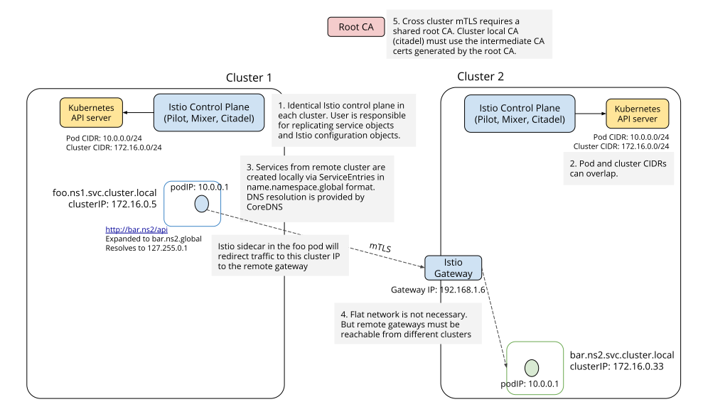
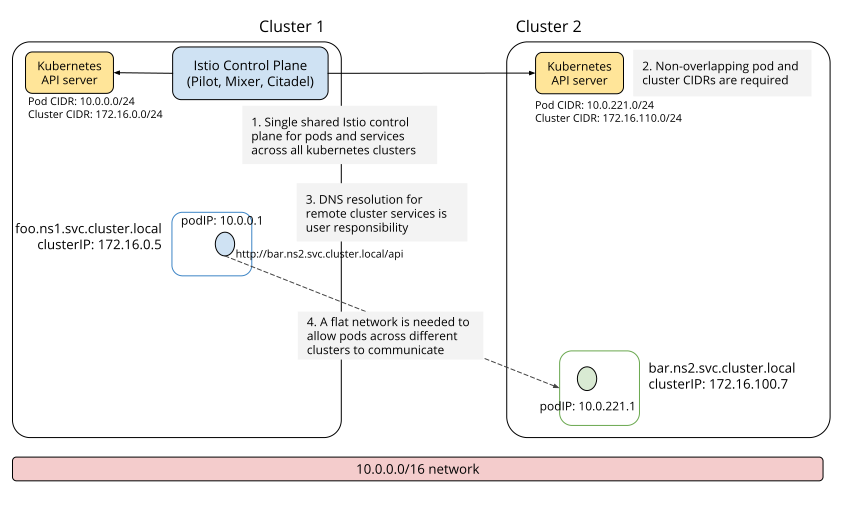

# 多集群部署与管理

Istio 在 1.1 后提供了两类多集群的连通的部署模式：

1. 多控制面
2. 单控制面，也称为“共享控制面”模式

**多控制面模式**

多控制面模式，各网格之间服务实例无法自动共享，互相访问不透明。应用场景有限，实现相对简单。

**单控制面模式**

单控制面模式，根据各集群是否属于同一个网络，还可以细分为「单网络单控制面」和「多网络单控制面」:
- **单网络单控制面模式**，支持多 Kubernetes 集群融合为一个服务网格，但是该种模式对网络有严格的要求: 需要所有集群处于同一个扁平网络，Pod IP 互通且不重叠，使用 VPN 连通多集群网络是常见的一个选项。不过这些网络需求在实际环境可能难以满足，也限制了该模式的应用场景。
- **多网络单控制面模式**，同样实现了多 Kubernetes 集群融合为一个服务网格，且在网络上没有上述限制，每个多 Kubernetes 集群是一个独立的网络，甚至可以分布于不同地域。但其实现也最复杂，且该模式要求开启服务间 mTLS 通信，通信效率上也有一定影响。

## 多控制面



多控制面部署模式中，每个 Kubernetes 集群中都包含一套独立的 istio 控制面，istio 并不会主动打通各集群间的服务访问，用户需要主动注册集群间互访的服务条目，这些包括设置 DNS 和 gateway，注册 ServiceEntry 等。下面我们以集群 1 访问集群 2 中的 httpbin.bar 服务为例，解析多控制面服务网格连通的核心流程。

### 配置各集群 CA 证书

多控制面模式下的集群间互访，要求使用双向 TLS 通信。因为每个集群中都有独立的 CA，如果这些 CA 使用自签名证书将无法互相验证，因此各集群需要共享 root CA，利用root CA 再为每个子集群签发 intermediate CA 证书。

我们以 istio 源码中提供的示例 CA 证书为例，在各集群中创建一个名为 `cacerts` 的 secret，istiod 中的 CA 会自动读取并使用这些证书。

```shell
kubectl create namespace istio-system
kubectl create secret generic cacerts -n istio-system \
    --from-file=samples/certs/ca-cert.pem \
    --from-file=samples/certs/ca-key.pem \
    --from-file=samples/certs/root-cert.pem \
    --from-file=samples/certs/cert-chain.pem
```

> istio 源码中提供了一套示例的 CA 证书，位于 `samples/certs/` 目录下，需要注意这套证书已广泛传播，仅供线下测试使用，**一定不要**在生产环境使用！以避免不必要的安全风险。

### 安装控制面

使用 `IstioOperator` 在各集群中分别安装控制面：

```bash
$ istioctl install \
    -f manifests/examples/multicluster/values-istio-multicluster-gateways.yaml
```

Operator manifest 配置概要如下：

```yaml
apiVersion: install.istio.io/v1alpha1
kind: IstioOperator
spec:
  addonComponents:
    istiocoredns:
      enabled: true

  components:
    egressGateways:
      - name: istio-egressgateway
        enabled: true

  values:
    global:
      podDNSSearchNamespaces:
        - global
        - default.svc.cluster.global

      multiCluster:
        enabled: true

      controlPlaneSecurityEnabled: true

    gateways:
      istio-egressgateway:
        env:
          # Needed to route traffic via egress gateway if desired.
          ISTIO_META_REQUESTED_NETWORK_VIEW: "external"
```

上面的配置会安装一个 `istiocoredns` 服务，用于解析远端服务的 DNS 地址。该服务使用的镜像是 coredns 官方镜像。

`podDNSSearchNamespaces` 配置会影响后续 Pod 注入的内容，具体地会调整 Pod 的 dnsConfig，该配置将修改 Pod `/etc/resolv.conf` 文件中 DNS searches 配置，为 Pod 增加了 2 个 DNS 搜索域。

```yaml
dnsConfig:
  searches:
  - global
  - default.svc.cluster.global
```

在多控制面网格拓扑中，每个集群身份都是对等的，对某个集群来说，任何其他集群都是远端集群。Kubernetes service 默认使用 `svc.cluster.local` 作为域名后缀，Kubernetes 集群内自带的 DNS 服务（KubeDNS 或者 CoreDNS），负责解析 service 域名。

在该模式下，为了区别请求的目的端是本集群服务还是远端集群服务，istio 使用 `svc.cluster.global` 指向远端集群服务。默认情况下，istio 本身不会影响 Kubernetes 集群内的 DSN 条目。不过我们上一步中安装了一个 `istiocoredns`，该组件会负责解析 `svc.cluster.global` 的域名查询。

### 配置 ServiceEntry

为了实现在本集群中访问远端集群的服务，我们需要在本集群中注册远端服务的 ServiceEntry，设置 ServiceEntry 需要注意以下几点：

* Host 格式 `<service name>.<namespace>.global`，对该域名的查询请求，将由上一步配置的 istiocoredns 进行解析。
* 需要在 ServiceEntry 提供 VIP，可以理解为远端目标服务在本集群中的 service IP，每个远端服务需要配置不同的 VIP，同时这些 VIP 不能和本集群中的其他 service IP 重叠。

以集群 1 访问 集群 2 中的 httpbin.bar 服务为例，我们需要在 集群 1 中配置以下 ServiceEntry：


```yaml
apiVersion: networking.istio.io/v1alpha3
kind: ServiceEntry
metadata:
  name: httpbin-bar
spec:
  hosts:
  - httpbin.bar.global
  location: MESH_INTERNAL
  ports:
  - name: http1
    number: 8000
    protocol: http
  resolution: DNS
  addresses:
  - 240.0.0.2
  endpoints:
  - address: {{ CLUSTER2_GW_ADDR }}
    ports:
      http1: 15443 # Do not change this port value
```

其中`addresses` (240.0.0.2) 用于设置目的服务的 VIP，同时该服务的 `endpoints` 中，`CLUSTER2_GW_ADDR` 需要填写集群 2 的 ingress gateway 地址。这会告诉 istio: 应该将集群 1 访问 `240.0.0.2` 的流量，路由到集群 2 的 ingress gateway。

以上配置的 VIP 并不会作为集群间 IP 层的实际目的地址，当集群 1 中的某个 client 发起对该 IP 访问后，流量会被拦截到对应的 sidecar 中，sidecar 会根据 xDS 信息，将目的 IP 转换为 集群 2 的 ingress gateway 地址。为了避免冲突，这里推荐使用 E 类网络地址 240.0.0.0/4，该网络地址段作为保留范围并未广泛使用。

### SNI 感知网关分析

> SNI（Server Name Indication）指定了 TLS 握手时要连接的主机名。SNI 协议是为了支持同一个 IP（和端口）支持多个域名。

目的网关端口 15443 预设了 SNI 感知的 listener，具体地，从集群 1 中 client 发出的流量拦截到 sidecar 后，sidecar 会将其转换为 mTLS 流量，并带上 SNI 信息（httpbin）转发出去。流量到达集群 2 的 ingress gateway 15443 端口后，该 ingress gateway 会提取 SNI 信息，分析出实际的目的服务为 httpbin 服务，最终转发给集群 2 中 httpbin 服务的 pod。


```json
{
  "name": "0.0.0.0_15443",
  "active_state": {
    "listener": {
      "name": "0.0.0.0_15443",
      "address": {
        "socket_address": {
          "address": "0.0.0.0",
          "port_value": 15443
        }
      },
      "filter_chains": [
        {
          "filter_chain_match": {
            "server_names": [
              "*.global"
            ]
          },
          "filters": [
            {
              "name": "envoy.filters.network.sni_cluster"
            },
            {
              "name": "envoy.filters.network.tcp_cluster_rewrite",
              "config": {
                "cluster_pattern": "\\.global$",
                "cluster_replacement": ".svc.cluster.local"
              }
            },
              ......
            {
              "name": "envoy.tcp_proxy",
              "typed_config": {
                "stat_prefix": "BlackHoleCluster",
                "cluster": "BlackHoleCluster"
              }
            }
          ]
        }
      ],
      "listener_filters": [
        {
          "name": "envoy.listener.tls_inspector",
          ......
        }
      ],
      "traffic_direction": "OUTBOUND"
    }
  }
}
```

其中，`envoy.listener.tls_inspector` 将检测 TLS 流量，并可以提取 SNI 作为 server name，进行路由决策。`tcp_cluster_rewrite` 将后缀以 `global$` 结尾的 `cluster` 替换为 `svc.cluster.local`，进而转发到网格内部，以此实现了 TLS 层的路由。

## 单控制面



与多控制面网格不同，单控制面网格中的所有集群，共享一个 istio 控制面，单控制面作为流控规则的唯一下发入口，会 watch 所有 Kubernetes 集群的服务发现数据，所有集群数据面的 Envoy 都会连接单控制面，获得 xDS 信息。

「单网络单控制面」和 「多网络单控制面」的安装流程类似，简述如下。

### 配置各集群 CA 证书

对于「多网络」模式，跨集群通信必须经过 istio gateway，gateway 同样利用 SNI 进行路由感知，这种模式必须开启 mTLS，因此需要提前配置各集群的 CA 证书，步骤和「多控制面」流程一致，不再赘述。

「单网络」模式中的跨集群通信是 pod 与 pod 直连，没有经过 istio gateway，因此并不需要强制使用 mTLS，可以不用配置 mTLS 证书，但是如果业务上需要开启 mTLS 通信，多个集群各自的自签名证书无法互相验证，因此也需要配置自签名的 CA 证书。

### 主集群安装控制面

我们将控制面所在的 Kubernetes 称为主集群，其他集群称为远端集群。

我们使用 IstioOperator 进行安装，安装之前，每个集群都要确定以下 2 个重要的拓扑配置：

* 集群标识：每个集群都需要有一个唯一的集群名；
* 网络标识：标识集群所属的网络，「单网络模式」中，所有集群的网络标识都相同，「多网络模式」中，某些或者所有集群的网络标识不同。

以上两个配置，会作为 pod 元数据写入到各集群的 sidecar injector 的配置中（configmap `istio-sidecar-injector`），然后再以环境变量的形式注入到 pod 的模板中，分别名为 `ISTIO_META_CLUSTER_ID` 和 `ISTIO_META_NETWORK`。

istio 会结合这些信息，来判断 2 个 pod 是否属于同一个集群，以及是否属于同一个网络，进而配置不同的路由策略。比如在「多网络单控制面」模式下，处于同一网络的 pod 访问，将使用 pod ip 互通，而当访问另一个网络中的 pod 时，流量目的端将配置为对方网络的 gateway 地址。

### 远端集群安装

```yaml
apiVersion: install.istio.io/v1alpha1
kind: IstioOperator
spec:
  values:
    global:
      multiCluster:
        clusterName: ${REMOTE_CLUSTER_NAME}
      network: ${REMOTE_CLUSTER_NETWORK}

      remotePilotAddress: ${ISTIOD_REMOTE_EP}

  ## 多网络模式需要以下配置，单网络模式不需要
  # components:
  #  ingressGateways:
  #  - name: istio-ingressgateway
  #    enabled: false
```

远端集群中仍然安装了一个完整的 istiod，似乎和主集群一样。不过如果我们仔细分析远端集群的配置，我们可以发现，远端集群其实只需要独立的 sidecar injector 和负责本集群证书的 citadel ，在 istio 1.5 之前，远端集群中的确只有这2个组件。不过 istio 1.5 将所有控制面组件合并为一个单体，因此目前远端集群中也安装了一个完整的 istiod。

> 理论上，主集群中的 istiod 也应该可以提供远端集群的 pod 注入服务和证书服务，不过这些在 istio 1.5 中还未完成，预计在后续版本中会逐步提供，届时远端集群中不再需要安装 istiod，会更加的简单。

### 配置多网络模式的 Gateway

如果是选择「多网络单控制面」，各集群都需要安装一个入流量网关。这包括 2 个步骤，首先需要在每个集群中安装网关对应的 deployment 和 service。然后要在控制面所在集群中安装 istio gateway CRD:

```yaml
apiVersion: networking.istio.io/v1alpha3
kind: Gateway
metadata:
  name: cluster-aware-gateway
  namespace: istio-system
spec:
  selector:
    istio: ingressgateway
  servers:
  - port:
      number: 443
      name: tls
      protocol: TLS
    tls:
      mode: AUTO_PASSTHROUGH
    hosts:
    - "*.local"
```

### 关于 mTLS 和 AUTO_PASSTHROUGH

通常来说，istio ingress gateway 需要配套指定服务的 VirtualService，用以指定 ingress 流量的后端服务. 但在「多网络模式」中，该 ingress gateway 需要作为本数据面所有服务的流量入口. 也就是所有服务共享单个 ingress gateway (单个 IP)，这里其实是利用了 TLS 中的 [SNI(Server Name Indication)](https://en.wikipedia.org/wiki/Server_Name_Indication)。

传统的 ingress gateway 承载的是南北流量(server-client)，这里的 ingress gateway 属于网格内部流量，承载的是东西流量(server-server)。 设置`AUTO_PASSTHROUGH`，可以允许服务无需配置 VirtualService，而直接使用 TLS 中的 SNI 值来表示 upstream，服务相关的 service/subset/port 都可以编码到 SNI 内容中。

### 注册远端集群服务发现

对最简单的单集群服务网格，pilot 会连接所在 kubernetes 集群的 api server，自动将该集群的服务发现数据（如 service，endpoint 等）接入控制面。
对于多集群模式，pilot 需要用户主动提供，如何去连接远端集群的 api server。istio 约定方式是：用户将远端集群的访问凭证(kube config 文件)存于主集群的 secret 中，同时打上固定 label `istio/multiCluster: "true"`。

一份远端集群访问凭证 secret 模板类似这样：

```yaml
apiVersion: v1
kind: Secret
metadata:
  name: istio-remote-secret-{{ REMOTE_CLUSTER_NAME }}
  namespace: istio-system
  labels:
    istio/multiCluster: "true"
type: Opaque
stringData:
  {{ REMOTE_CLUSTER_NAME }}: |-
    apiVersion: v1
    clusters:
      - cluster:
          server: {{ REMOTE_CLUSTER_API_SERVER_ADDRESS }}
        name: {{ REMOTE_CLUSTER_NAME }}
    contexts:
      - context:
          cluster: {{ REMOTE_CLUSTER_NAME }}
          user: {{ REMOTE_CLUSTER_USER }}
        name: {{ REMOTE_CLUSTER_NAME }}
    current-context: {{ .REMOTE_CLUSTER_CTX }}
    kind: Config
    users:
      - name: {{ REMOTE_CLUSTER_USER }}
        user:
          token: {{ REMOTE_CLUSTER_TOKEN }}
```

secret name 并不重要，pilot 会 watch 所有包含 label `istio/multiCluster: "true"` 的 secret。istio 提供了生成以上 secret 的简化命令，注意生成的远端集群 secret，最终是 apply 到主集群中：

```shell
$ istioctl x create-remote-secret --name ${REMOTE_CLUSTER_NAME} --context=${REMOTE_CLUSTER_CTX} | \
    kubectl apply -f - --context=${MAIN_CLUSTER_CTX}
```

至此「单控制面」服务网格搭建完毕。如果配置正确，主集群中的控制面将会 watch 远端集群的服务数据，pilot 会整合所有集群的服务发现数据和流控规则，以 xDS 形式下发到各集群数据面。

## 部署模式选择

「多控制面」模式，严格的讲每个 kubernetes 集群仍然是独立的服务网格，适合于业务界限明显的多集群，集群间服务互访不多，大部分场景下，各集群服务和流控偏向于独立治理，对于有互访需求的小部分服务，需要用户显式地进行服务连通注册。

「单控制面」模式，将多个集群联结为一个统一的服务网格，集群间同名服务自动共享服务实例。这种模式适合于业务联系紧密的多集群，甚至是业务对等的多集群。这些集群间服务互访较多，所有集群共享流控治理规则。可以实现「地域感知路由」、「异地容灾」等高级的网格应用场景。

至于选择「单网络单控制面」还是「多网络单控制面」，更多的是依赖集群间的网络连通现状。「单网络」模式要求集群与集群处于同一个网络平面，pod IP 不重叠且可以直连；如果网络拓扑不满足，那么可以选择「多网络」模式，该模式下每个集群都有一个入口网关，供其他集群访问流量进入，不过需要考虑的是业务能否接受 mTLS 带来的开销。

以上是 istio 最常见的多集群模式，istio 还可以实现其他更复杂的拓扑，比如多个远端集群，有部分属于相同网络，另一部分属于不同网络；另外控制面组件还可能以冗余的方式，分布到多个集群，这样可以有多个主集群，用以提高控制面的可用性。不过这些模式对服务网格的理解和运维能力要求更高，用户应该谨慎选型。
