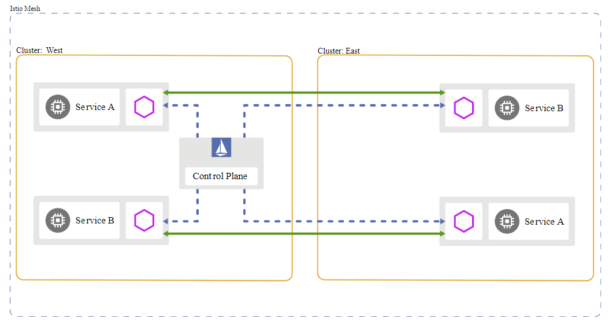
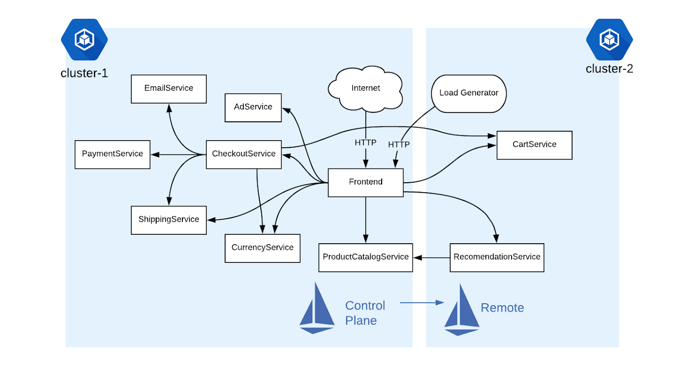
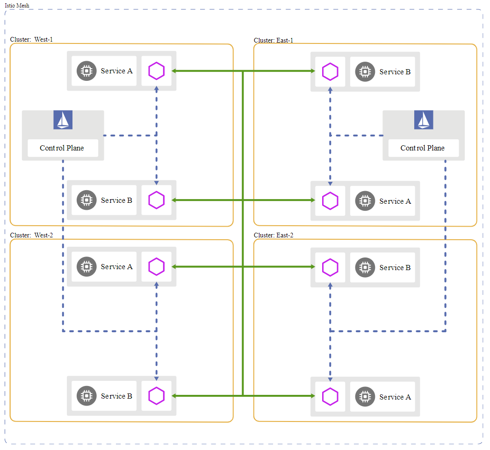

# 多集群部署与管理
Kubernetes多集群的集成应用一直得到广泛的关注，当前已经有许多项目试图解决这个问题，如KubeFed(Fedreation V2)，Cluster Registry，Cilium，Kubemci等。Istio的出现为跨环境，多集群的集成应用提供了一个新的思路。

## 部署模型
Istio多集群部署模型主要取决于硬件环境，以及对隔离性，性能和高可靠性方面的要求。常见影响因素有：
- 单一或多个网格
- 单一或多个控制平面
- 单一或多个网络

理论上来讲，以上各种组合都有可能，但在实际部署中，大部分企业级应用都是部署在多个集群并分布在不同的区域。因此，选择单一网格或多个网格是构架师要面临的首要问题。在多个网格的部署中，跨网格之间的通信有限，实现的功能也有限，主要目的以物理隔离为主，但网格内部仍然是按单一网格来部署运行的。本节也主要针对单一网格的部署模型进行讨论。

**1. 单一控制平面，单一网络，多个集群**

单一集群是Istio最基本的部署模型。本书中的示例基本都是在此平台上建立的。单一控制平面，单一网络，多集群模型则是单一集群模型的自然延申，实现相对比较简单。因为处于同一网络，可以利用kubernetes API直接管理多个集群，但对高可靠性和弹性扩展的支持有限，限制了它的应用和发展。

<!-- .element width="300px" -->

**2. 单一控制平面，多个网络，多个集群**

随着混合云的迅速发展，各大厂商都纷纷推出了各种解决方案。Google的Anthos方案就是基于跨环境，多集群的单一控制平面基础上的。

<!-- .element width="300px" -->

上图是两个不同地区的Google GKE集群配置示例。其中集群1上安装了Istio控制平面，集群2上安装Istio的远程组件。远程组件将不断和控制平面进行同步通信，并依此刷新sidecar的配置，从而可以保证跨集群的应用程序能正常工作。

**3. 多个控制平面，多个网络，多个集群**

单一控制平面最大的局限性就是缺乏高可靠性。一旦控制平面出现故障，就会严重影响企业应用的正常运行，因此多个控制平面方案就应运而生了。

<!-- .element width="300px" -->

上图在每个地区(西部和东部)各部署了一个控制平面，两个控制平面之间相互复制，并且配置管理各自集群内部的sidecar。它的主要优点：
- 高可靠性。如果某个控制平面出了故障，影响将被限制在该控制平面之内，对其他集群没有直接影响。
- 高隔离性。对单个控制平面的修改将不会影响其它的集群运行

对于高可靠性要求高的应用，一般都会要求部署多个控制平面，但具体实施方案要考虑实际情况，灵活运用。以3个集群部署为例，可以使用单一控制平面部署2个集群，然后在另一个网络中添加第3个集群和第2个控制平面。这样可以把每个集群配置为共享这两个控制平面，从而确保每个集群都有2个控制平面。既保证了高可靠性，同时也降低了实施的复杂程度。

## 小结
本节主要讨论了几种常见的部署模型和应用实例。Istio多集群部署目前还处于初期阶段，主要厂商如Google Anthos, Openshift/IBM Cloud Pak的方案都还有待于进一步的完善。但是跨环境，多集群的单一网格部署将大大简化企业应用的管理，不仅提高了安全性和可靠性，同时也兼顾了公有云和企业私有云的优势，具有很好的应用前景。 

## 参考
- [Istio Deployment Models](https://istio.io/docs/ops/deployment/deployment-models)
- [The service mesh era: Istio’s role in the future of hybrid cloud](https://cloud.google.com/blog/topics/hybrid-cloud/the-service-mesh-era-istios-role-in-the-future-of-hybrid-cloud)