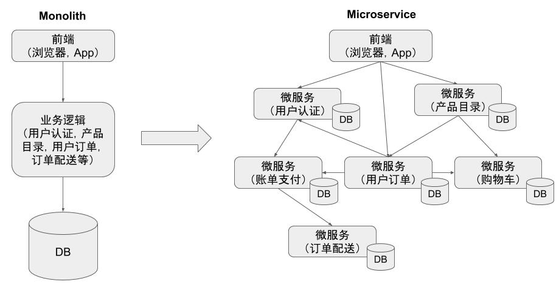
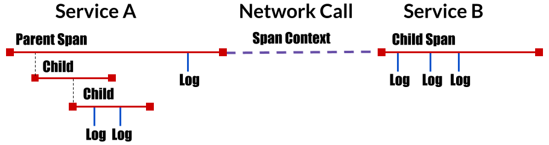

# 分布式调用跟踪和OpenTracing

## 什么是分布式调用跟踪？

相比传统的“巨石”应用，微服务的一个主要变化是将应用中的不同模块拆分为了独立的进程。在微服务架构下，原来进程内的方法调用成为了跨进程的远程方法调用。相对于单一进程内的方法调用而言，跨进程调用的调试和故障分析是非常困难的，难以使用传统的代码调试程序或者日志打印来对分布式的调用过程进行查看和分析。



如上图右边所示，微服务架构中系统中各个微服务之间存在复杂的调用关系。一个来自客户端的请求在其业务处理过程中经过了多个微服务进程。我们如果想要对该请求的端到端调用过程进行完整的分析，则必须将该请求经过的所有进程的相关信息都收集起来并关联在一起，这就是“分布式调用跟踪”。

## OpenTracing 项目

实现分布式调用跟踪的方式一般是在程序代码中进行埋点，采集调用的相关信息后发送到后端的一个调用跟踪服务器进行分析处理。在这种实现方式中，应用代码需要依赖于调用跟踪服务器的 API，导致业务逻辑和调用跟踪的逻辑耦合。为了解决该问题，[CNCF](https://www.cncf.io/) （云原生计算基金会）下的 [OpenTracing](http://https://opentracing.io/) 项目定义了一套分布式调用跟踪的标准，以统一各种分布式调用跟踪实现的实现。OpenTracing 中包含了一套分布式调用跟踪的标准规范，各种语言的 API，以及实现了该标准的编程框架和函数库。

目前已有大量支持 [OpenTracing 规范的 Tracer 实现](https://opentracing.io/docs/supported-tracers/)，包括 Jager、Skywalking、LightStep 等。在微服务应用中采用 OpenTracing API 实现分布式调用跟踪，可以避免厂商锁定，能够以较小的代价和任意一个兼容 OpenTracing 的分布式调用跟踪后端 （Tracer） 进行对接。

## OpenTracing 概念模型

下面我们来介绍 OpenTracing 的工作原理，首先我们需要先了解 OpenTracing 中下列这些重要的概念。



如图所示，OpenTracing 中主要包含下述几个概念：

* Trace： 描述一个分布式系统中的端到端事务，例如来自客户端的一个请求从接收到处理完成的过程。
* Span：一个具有名称和时间长度的操作，例如一个 REST 调用或者数据库操作等。Span 是分布式调用跟踪的最小跟踪单位，一个 Trace 由多段 Span 组成。
* SpanContext：分布式调用跟踪的上下文信息，包括 Trace id，Span id 以及其它需要传递到下游服务的内容。一个 OpenTracing 的实现需要将 SpanContext 通过某种序列化协议 (Wire Protocol) 在进程边界上进行传递，以将不同进程中的 Span 关联到同一个 Trace 上。对于 HTTP 请求来说，SpanContext 一般是采用 HTTP header 进行传递的。

从上面的介绍，我们可以看到在 OpenTracing 的概念中，Trace 和 Span 组成了一个调用链：Trace 代表了一个端到端的分布式调用，Span 是该调用中间的一段。SpanContext 则用于将一个 Span 的上下文传递到其下游的 Span 中，以将这些 Span 关联起来。

## OpenTracing 数据模型

一个 Trace 可以看成由多个相互关联的 Span 组成的有向无环图 （DAG 图）。例如下图是一个由8个 Span 组成的 Trace：

```text

        [Span A]  ←←←(Root Span)
            |
     +------+------+
     |             |
 [Span B]      [Span C] ←←←(Span C 和 Span A是 `ChildOf` 关系)
     |             |
 [Span D]      +---+-------+
               |           |
           [Span E]    [Span F] >>> [Span G] >>> [Span H]
                                       ↑
                                       ↑
                                       ↑
                         (Span G 和 Span F 是 `FollowsFrom` 关系)

```


上图中的 Span 也可以按照时间按照时间先后顺序进行排列，如下图所示：

```text
––|–––––––|–––––––|–––––––|–––––––|–––––––|–––––––|–––––––|–> time

 [Span A···················································]
   [Span B··············································]
      [Span D··········································]
    [Span C········································]
         [Span E·······]        [Span F··] [Span G··] [Span H··]
```


一个 Span 的数据结构中包含以下内容：

* name: Span 所代表的操作名称，例如 REST 接口对应的资源名称。
* Start timestamp: Span 所代表操作的开始时间
* Finish timestamp: Span 所代表的操作的的结束时间
* Tags：一系列标签，每个标签由一个键值对组成。该标签可以是任何有利于调用分析的信息，例如方法名，URL 等。
* SpanContext：用于跨进程边界传递 Span 相关信息，在进行传递时需要结合一种序列化协议 （Wire Protocol） 使用。
* References：该Span引用的其它关联 Span，主要有两种引用关系，Childof 和 FollowsFrom。
    * Childof： 最常用的一种引用关系，表示 Parent Span 和 Child Span 之间存在直接的依赖关系。例 PRC 服务端 Span 和 RPC 客户端 Span，或者数据库 SQL 插入 Span 和 ORM Save 动作 Span 之间的关系。
    * FollowsFrom：如果 Parent Span 并不依赖 Child Span 的执行结果，则可以用 FollowsFrom 表示。例如网上商店购物付款后会向用户发一个邮件通知，但无论邮件通知是否发送成功，都不影响付款成功的状态，这种情况则适用于用 FollowsFrom 表示。

## 跨进程调用信息传播

SpanContext 是 OpenTracing 中一个让人比较迷惑的概念。在 OpenTracing 的概念模型中我们讲到 SpanContext 用于跨进程边界传递分布式调用的上下文，但实际上 OpenTracing 只定义一个 SpanContext 的抽象接口，该接口封装了分布式调用中一个 Span 的相关上下文内容，包括该 Span 所属的 Trace id，Span id 以及其它需要传递到下游服务的信息。SpanContext 自身并不能实现跨进程的上下文传递，而是需要由 Tracer（Tracer 是一个遵循 OpenTracing 协议的实现，如 Jaeger，Skywalking 的 Tracer） 将 SpanContext 序列化后通过 Wire Protocol 传递到下一个进程中，然后在下一个进程将 SpanContext 反序列化，得到相关的上下文信息，以用于生成 Child Span。

为了为各种具体实现提供最大的灵活性，OpenTracing 只是提出了跨进程传递 SpanContext 的要求，并未规定将 SpanContext 进行序列化并在网络中传递的具体实现方式。各个不同的 Tracer 可以根据自己的情况使用不同的 Wire Protocol 来传递 SpanContext。

在基于 HTTP 协议的分布式调用中，通常会使用 HTTP Header 来传递 SpanContext 的内容。常见的 Wire Protocol 包含 Zipkin 使用的 [b3 HTTP header](https://github.com/openzipkin/b3-propagation)，Jaeger 使用的 [uber-trace-id HTTP Header](https://www.jaegertracing.io/docs/1.7/client-libraries/#trace-span-identity)，LightStep 使用的 "x-ot-span-context" HTTP Header 等。

Istio/Envoy 支持 b3 header 和 x-ot-span-context header，可以和 Zipkin、Jaeger 及 LightStep 对接。其中 b3 HTTP header 的示例如下：

```text
X-B3-TraceId: 80f198ee56343ba864fe8b2a57d3eff7
X-B3-ParentSpanId: 05e3ac9a4f6e3b90
X-B3-SpanId: e457b5a2e4d86bd1
X-B3-Sampled: 1
```

假如使用 HTTP header 传递 SpanContext，在向下游服务发起 HTTP 请求时，我们需要在 JAVA 代码中调用 Tracer.inject 方法将 SpanContext 注入到 HTTP header 中。
```JAVA
tracer.inject(tracer.activeSpan().context(), Format.Builtin.HTTP_HEADERS, new RequestBuilderCarrier(requestBuilder));
```

在下游服务中收到该 HTTP 调用后，需要采用 Tracer.extract 方法将 SpanContext 从 HTTP header 中取出来。
```JAVA
SpanContext parentSpan = tracer.extract(Format.Builtin.HTTP_HEADERS, new TextMapExtractAdapter(headers));
```

OpenTracing 中的 Tracer API 只定义了 inject 和 extract 两个方法接口，其实现由不同 Tracer 提供。除此之外，我们一般不需要在代码中直接调用这两个方法，因为 OpenTracing 项目已经提供了一些和 Tracer 集成的代码库，可以自动完成该工作，例如为 Spring 提供 Jaeger Tracer 集成的 [opentracing-spring-jaeger-starter](https://github.com/opentracing-contrib/java-spring-jaeger)。

## 小结

在本节中，我们介绍了分布式调用跟踪和 OpenTracing 的一些基本概念，在下面的章节中，我们将继续介绍如何使用 OpenTracing 来增强 Istio 的分布式调用跟踪，包括实现 SpanContext 传递，提供方法级别的调用跟踪以及异步消息的调用跟踪。

## 参考资料

1. [OpenTracing docs](https://opentracing.io/docs/)
1. [OpenTracing specification](https://github.com/opentracing/specification/blob/master/specification.md)
1. [OpenTracing wire protocols](https://github.com/opentracing/specification/blob/master/rfc/trace_identifiers.md)
1. [Istio Trace context propagation](https://istio.io/docs/tasks/telemetry/distributed-tracing/overview/#trace-context-propagation)