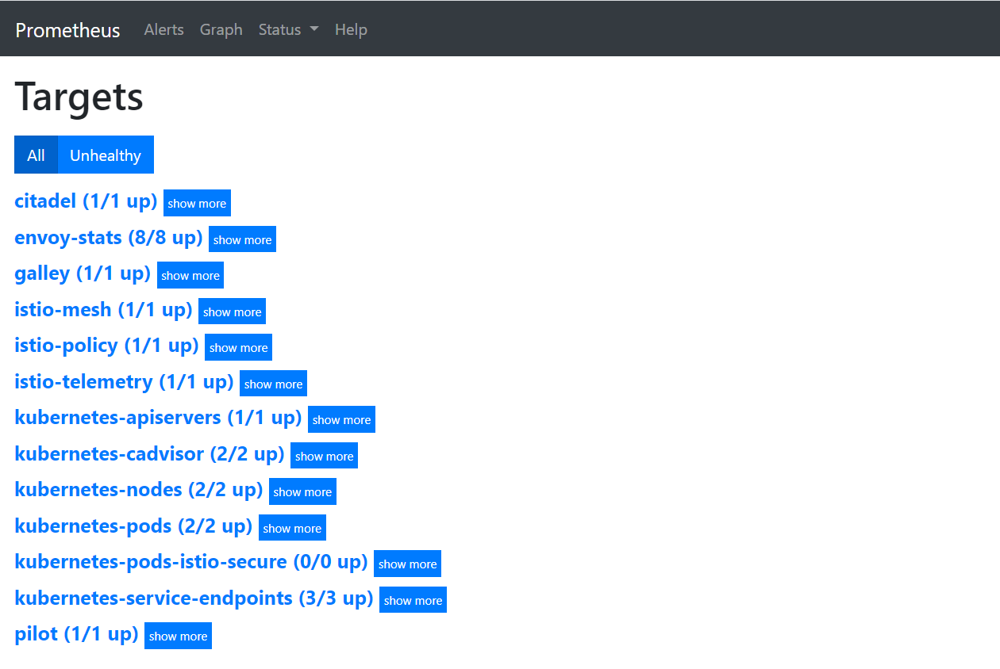
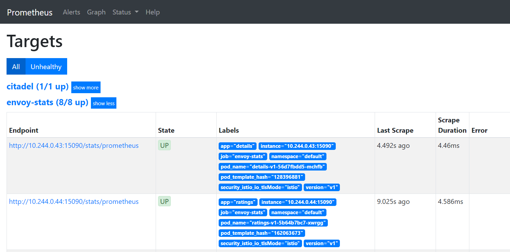
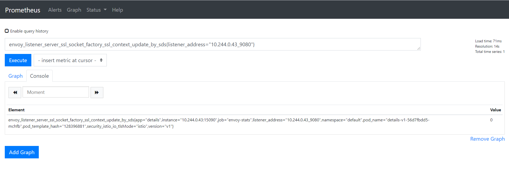
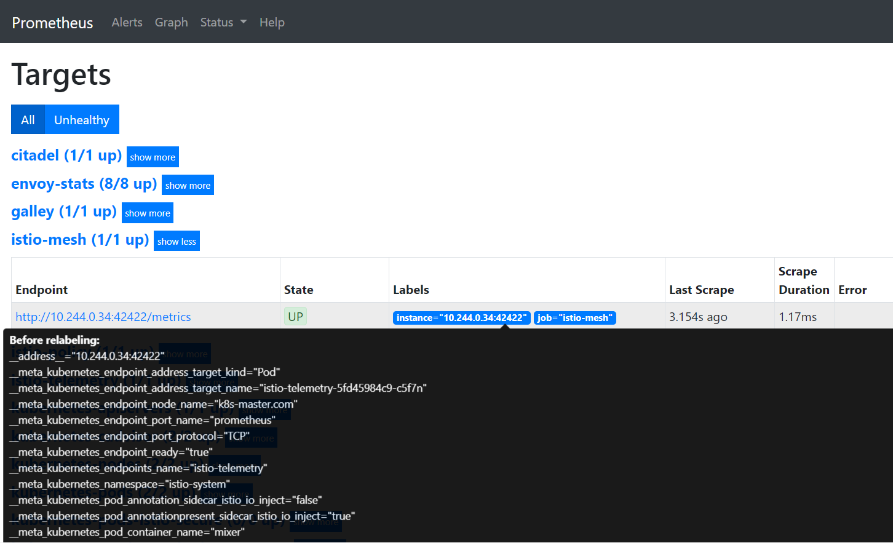
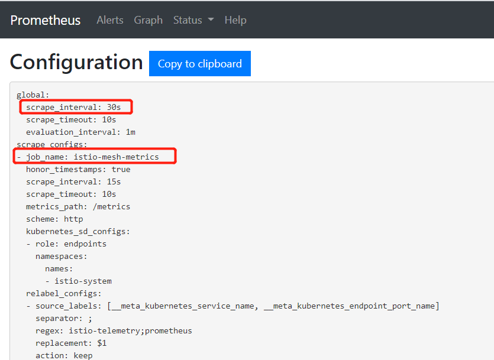

# Prometheus

## Prometheus简介
Prometheus是一款开源的、自带时序数据库的监控告警系统。目前，Prometheus已成为Kubernetes集群中监控告警系统的标配。Prometheus的架构如下图所示：


Prometheus通过规则对Kubernetes集群中的数据源做服务发现（Service Dicovery），再从数据源中抓取数据，存在它的时序数据库TSDB中。再根据配置的告警规则，触发告警条件后，将数据推给AlertManager服务，做告警服务的推送。同时，Prometheus中的数据也暴露了HTTP接口，通过PromQL（一种特定的查询语法）可以将收集的数据查出，并展示出来。

从上图可以看出，Prometheus主要从两种数据源抓取指标：PushGateway和Exporters。PushGateway指的是服务将指标数据主动推给PushGateway服务，Prometheus再异步从PushGateway服务中抓取。而Exporters则主动暴露了HTTP服务接口，Prometheus定时从接口中抓取指标。

在istio中，各个组件是通过暴露HTTP接口的方式让Prometheus定时抓取的（采用了Exporters的方式）。在Kubernetes集群中，istio安装完成后，会在istio-system的命名空间中部署Prometheus，并将istio组件各相关指标的数据源默认配置在Prometheus中。

打开Prometheus页面，在导航栏输入/targets上下文查看Prometheus通过服务发现得到的指标数据源：

```bash
http://<Prometheus URL>/targets

```



点开其中的envoy-stats，可以看到该数据源中有Endpoint、State、Labels、Last Scrape、Scrape Duration、Error六列：

 - Endpoint：抓取指标的地址
 - State：该指标接口能否正常提供数据（UP代表正常，DOWN代表指标服务异常）
 - Labels：该指标所带的标签，用于标识指标，如下图中的第一行指标：该集群中default这个命名空间下pod名为details-v1-56d7fbdd5-mchfb的envoy-stats指标，根据Target名字我们可以猜测，这是用于查询pod的envoy容器状态的指标
 - Last Scrape：Prometheus最后一次从数据源中抓取指标的时间到当前的时间间隔
 - Scrape Duration：Prometheus调该接口抓取指标的耗时
 - Error：错误原因


在集群中可以直接访问上图中envoy-stats这个target中第一行的Endpoint URL（URL中的IP为Pod在集群中的IP，因此在集群外部无法访问），得到Prometheus格式的指标数据

```bash
$ curl http://10.244.0.43:15090/stats/prometheus
# TYPE envoy_tcp_mixer_filter_total_remote_call_successes counter
envoy_tcp_mixer_filter_total_remote_call_successes{} 0
# TYPE envoy_tcp_mixer_filter_total_remote_check_calls counter
envoy_tcp_mixer_filter_total_remote_check_calls{} 0
# TYPE envoy_tcp_mixer_filter_total_remote_call_send_errors counter
envoy_tcp_mixer_filter_total_remote_call_send_errors{} 0
# TYPE envoy_tcp_mixer_filter_total_quota_calls counter
envoy_tcp_mixer_filter_total_quota_calls{} 0
# TYPE envoy_tcp_mixer_filter_total_remote_report_successes counter
envoy_tcp_mixer_filter_total_remote_report_successes{} 0
# TYPE envoy_cluster_client_ssl_socket_factory_ssl_context_update_by_sds counter
envoy_cluster_client_ssl_socket_factory_ssl_context_update_by_sds{cluster_name="outbound|15004||istio-policy.istio-system.svc.cluster.local"} 0
# TYPE envoy_listener_server_ssl_socket_factory_ssl_context_update_by_sds counter
envoy_listener_server_ssl_socket_factory_ssl_context_update_by_sds{listener_address="[fe80__48ad_9ff_feee_915f]_9080"} 0

```
Prometheus格式的指标数据由两行组成：
- 第一行以#号开头，是对指标的说明，包括指标名、指标类型
- 第二行为指标具体的数据，包括指标名、当前采集到的指标值，指标名后面的花括号则标识指标带有的Label标签，例如要查询envoy_cluster_client_ssl_socket_factory_ssl_context_update_by_sds这个指标中Label为listener_address="10.244.0.43_9080"的数据，打开Promehteus的Graph界面，输入以下PromQL语句，点击Execute查询即可

```
envoy_listener_server_ssl_socket_factory_ssl_context_update_by_sds{listener_address="10.244.0.43_9080"}
```

以上是Prometheus的简介和基本用法

## Prometheus基本配置

在istio安装完成后，其自带的Prometheus已经能够从各istio组件中正常抓取指标数据了，为什么Pormetheus能够采集到istio各组件的指标数据呢？答案就在Prometheus的配置文件中。
Kubernetes集群中的Prometheus的配置信息以ConfigMap的形式挂载在Prometheus所在Pod的 /etc/prometheus 目录下

```bash
$ kubectl exec -it prometheus-7cb88b5945-8jbkf -n istio-system sh
/prometheus $ ls /etc/prometheus/
prometheus.yml
```
打开prometheus.yml查看Prometheus的配置（也可以直接打开istio-system命名空间下的名为Prometheus的ConfigMap查看）

```bash
/prometheus $ vi /etc/prometheus/prometheus.yml
global:
  scrape_interval: 15s
scrape_configs:

# Mixer scrapping. Defaults to Prometheus and mixer on same namespace.
#
- job_name: 'istio-mesh'
  kubernetes_sd_configs:
  - role: endpoints
    namespaces:
      names:
      - istio-system
  relabel_configs:
  - source_labels: [__meta_kubernetes_service_name, __meta_kubernetes_endpoint_port_name]
    action: keep
    regex: istio-telemetry;prometheus

# Scrape config for envoy stats
- job_name: 'envoy-stats'
  metrics_path: /stats/prometheus
  kubernetes_sd_configs:
  - role: pod

  relabel_configs:
  - source_labels: [__meta_kubernetes_pod_container_port_name]
    action: keep
    regex: '.*-envoy-prom'
  - source_labels: [__address__, __meta_kubernetes_pod_annotation_prometheus_io_port]
    action: replace
    regex: ([^:]+)(?::\d+)?;(\d+)
    replacement: $1:15090
    target_label: __address__  
    ...
```
由于配置文件太长，这里截取了开头的一部分。我们发现Prometheus中已经帮我们配置好了从istio组件中抓取指标数据的各项配置规则，那这些配置具体是什么意思呢？
Prometheus的配置文件主要由一下几部分组成：
- global：Prometheus的全局配置，比如指标的采样间隔、指标的抓取超时时间等。
- scrape_configs：抓取指标的数据源配置，称为target，每个target用job_name命名。有静态配置和服务发现两种配置方式。
- rule_files：指定告警规则文件，Prometheus根据这些规则，将匹配的告警信息推送到alertmanager中。
- alerting：告警配置， 这里主要是指定Prometheus将报警信息推送到具体哪一个alertmanager实例地址。
- remote_write：指定后端的存储的写入api地址。
- remote_read：指定后端的存储的读取api地址。

这里主要关注前两个配置：global和scrape_configs。以上文提到的istio的Prometheus配置为例：

```yaml
# 这里指定了Prometheus全局的采样间隔为15秒
global:
  scrape_interval: 15s
scrape_configs:
# 这是一个名为istio-mesh的target
- job_name: 'istio-mesh'
  # 这里配置Prometheus的服务发现规则：发现Kubernetes集群中istio-system命名空间下的所有endpoint
  kubernetes_sd_configs:
  - role: endpoints
    namespaces:
      names:
      - istio-system
  # 在Prometheus抓取指标前做一些内置标签的聚合或去除操作：这里把标签值分别为istio-telemetry和prometheus的内置标签__meta_kubernetes_service_name和__meta_kubernetes_endpoint_port_name保留下来，其它的内置标签则丢弃
  relabel_configs:
  - source_labels: [__meta_kubernetes_service_name, __meta_kubernetes_endpoint_port_name]
    action: keep
    regex: istio-telemetry;prometheus
# 这是一个名为envoy-stats的target
- job_name: 'envoy-stats'
  metrics_path: /stats/prometheus
  # 这里配置Prometheus的服务发现规则：发现Kubernetes集群中所有命名空间下的所有pod
  kubernetes_sd_configs:
  - role: pod
  # 在Prometheus抓取指标前做一些内置标签的聚合或去除操作
  relabel_configs:
  # 这里把标签值为-envoy-prom结尾的内置标签__meta_kubernetes_pod_container_port_name保留下来
  - source_labels: [__meta_kubernetes_pod_container_port_name]
    action: keep
    regex: '.*-envoy-prom'
  # 这里把标签值分别匹配([^:]+)(?::\d+)?和(\d+)正则表达式的内置标签__address__和__meta_kubernetes_pod_annotation_prometheus_io_port合并成__address__:15090的格式，替换掉原来的__address__标签值
  - source_labels: [__address__, __meta_kubernetes_pod_annotation_prometheus_io_port]
    action: replace
    regex: ([^:]+)(?::\d+)?;(\d+)
    replacement: $1:15090
    target_label: __address__  
```
配置文件中提到的内置标签替换是怎么回事呢？我们先回到Prometheus的targets页面，把鼠标指针放在Labels列中的蓝色标签上，发现弹出了一些以双下划线开头的标签，这就是上面所提到的内置标签。因为Prometheus天然兼容Kubernetes，当它部署在Kubernetes集群中，且通过kubernetes_sd_configs这种方式配置服务发现时，会默认给各指标加上Kubernetes相关的内置标签，如：该指标服务所在的计算节点名、Pod IP、命名空间、暴露的端口等。



总而言之，在istio中，Prometheus通过配置中的每个target（job_name）的服务发现规则，找到Kubernetes集群中的指标数据源，再根据relabel_configs配置做内置标签的去除、聚合等操作，得到最终的指标数据。
此外，我们可以通过修改Prometheus的ConfigMap对其配置进行修改

```bash
$ kubectl edit configmap prometheus -n istio-system
apiVersion: v1
data:
  prometheus.yml: |-
    global:
      # 这里将采样间隔改为30s
      scrape_interval: 30s
    scrape_configs:
    # 这里将job_name改为istio-mesh-metrics
    - job_name: 'istio-mesh-metrics'
      kubernetes_sd_configs:
      - role: endpoints
        namespaces:
          names:
          - istio-system
      relabel_configs:
      - source_labels: [__meta_kubernetes_service_name, __meta_kubernetes_endpoint_port_name]
        action: keep
        regex: istio-telemetry;prometheus
    ...
```
修改完成后保存，Prometheus的配置支持热更新，我们只需要再Prometheus所在Pod的容器中调用重载HTTP接口即可更新配置
```bash
$ kubectl exec -it prometheus-7cb88b5945-8jbkf -n istio-system sh
/prometheus $ curl -X POST http://localhost:9090/-/reload
```
打开Prometheus的config页面检查配置是否生效
```bash
http://<Prometheus URL>/config
```



以上主要介绍了Kubernetes集群中Prometheus的基本配置，以及解释了在istio安装完成后，其自带的Pormetheus默认对istio各组件做了服务发现、指标标签修改等配置，最后演示了如何对Prometheus的配置做修改和热更新。

## Istio中Prometheus的指标
