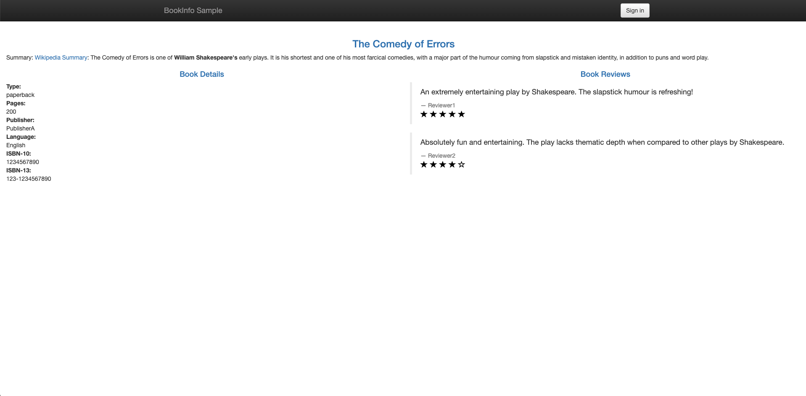
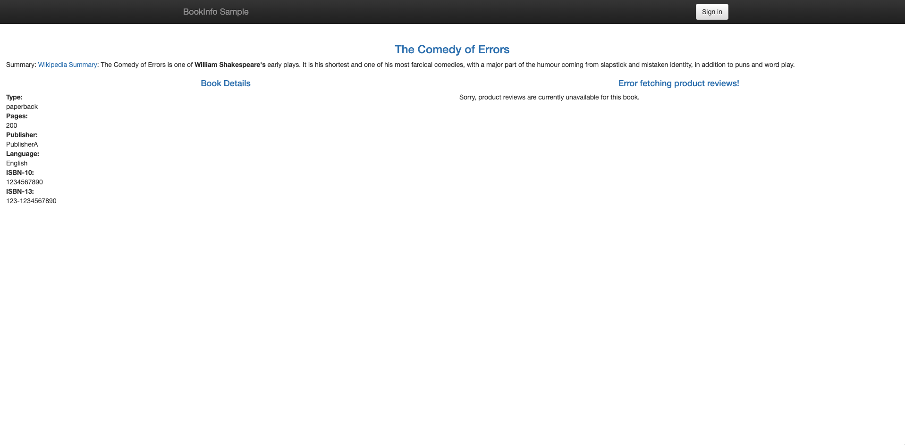

# 超时

如果程序请求长时间无法返回结果，则需要设置超时机制，超过设置的时间则返回错误信息。这样做既可以节约等待时消耗的资源，也可以避免由于级联错误引起的一系列问题。设置超时的方式也有很多种，比如通过修改代码在应用程序侧设置请求超时时间，但是这样很不灵活，也容易出现遗漏的现象，而 Istio 则可以在基础设施层解决这一问题。

## 原理

使用 Istio 对`ratings`服务的调用注入延迟故障，来模拟`ratings`服务异常，服务调用延迟过高的现象。在这种情况下，通过设置不同的超时时间，观察延迟对`productpage`服务的影响。学习 Istio 的超时设置和注入延迟的方法，理解超时的原理，了解如果单个服务发生异常，可能对系统整体造成的影响。

在本实践中 Bookinfo 服务间的调用关系：
```bash
productpage v1 -（设置超时）-> reviews v2 -（注入延迟）-> ratings v1
               \
                -> details v1
```

## 实践

**环境准备**

本节默认读者已按照**安装与部署**章节中的说明安装 Istio 的 [demo 配置](https://istio.io/zh/docs/setup/additional-setup/config-profiles/)和 Bookinfo 应用，并且除了`bookinfo-gateway`并无其他配置。

**设置默认目标规则**

在目标规则中定义可用的版本：

```bash
$ kubectl apply -f samples/bookinfo/networking/destination-rule-all.yaml
```

**初始化版本路由**

```bash
$ kubectl apply -f samples/bookinfo/networking/virtual-service-all-v1.yaml
```

**设置虚拟服务**

通过配置路由规则（HTTPRoute）的`timeout`字段来指定 http 请求的超时时间（默认情况下，超时是被禁用的）。

配置`reviews`服务，请求路由到 v2 版本，使其可以发起对`ratings`服务的调用：
```bash
$ kubectl apply -f - <<EOF
apiVersion: networking.istio.io/v1alpha3
kind: VirtualService
metadata:
  name: reviews
spec:
  hosts:
    - reviews
  http:
  - route:
    - destination:
        host: reviews
        subset: v2
EOF
```
目前服务的调用关系为：
```bash
productpage v1 --> reviews v2 --> ratings v1
               \
                -> details v1
```

给`ratings`服务的调用注入 2 秒延迟的故障：
```bash
$ kubectl apply -f - <<EOF
apiVersion: networking.istio.io/v1alpha3
kind: VirtualService
metadata:
  name: ratings
spec:
  hosts:
  - ratings
  http:
  - fault:
      delay:
        percent: 100
        fixedDelay: 2s
    route:
    - destination:
        host: ratings
        subset: v1
EOF
```
目前服务的调用关系：
```bash
productpage v1 --> reviews v2 -（延迟2秒）-> ratings v1
               \
                -> details v1
```

在浏览器中打开 Bookinfo 的网址`http://$GATEWAY_URL/productpage`，可以明显感到延迟，但是应用是运行正常。


使用`curl`检测延迟，可以看到由于`reviews`调用`ratings`存在 2 秒的延迟，导致整个页面的延迟增加了 2 秒：
```bash
$ curl -o /dev/null -s -w "time_starttransfer:%{time_starttransfer}\ntime_total:%{time_total}\n" http://$GATEWAY_URL/productpage
time_starttransfer:2.048042
time_total:2.048224
```

现在给对`reviews`服务的调用增加一个 0.5 秒的请求超时：
```bash
$ kubectl apply -f - <<EOF
apiVersion: networking.istio.io/v1alpha3
kind: VirtualService
metadata:
  name: reviews
spec:
  hosts:
  - reviews
  http:
  - route:
    - destination:
        host: reviews
        subset: v2
    timeout: 0.5s
EOF
```

刷新 Bookinfo 页面，这是就可以看到`reviews`已显示不可用：


目前服务的调用关系：
```bash
productpage v1 -（0.5秒超时）-> reviews v2 -（延迟2秒）-> ratings v1
               \
                -> details v1
```

使用`curl`检测延迟，可以看到访问`productpage`的延迟已经降低到 1 秒左右：
```bash
$ curl -o /dev/null -s -w "time_starttransfer:%{time_starttransfer}\ntime_total:%{time_total}\n" http://$GATEWAY_URL/productpage
time_starttransfer:1.064081
time_total:1.064210
```

使用 kubectl 进入`productpage`容器访问`reviews`服务，返回 `504` 超时错误：

```bash
$ apt-get update
...
$ apt install curl  # 该镜像本身并不自带 curl，需要手动安装
...
$ kubectl exec -it productpage-v1-55cd77bf9-j8gjz bash
$ curl --silent -w"\nStatus: %{http_code}\n" http://reviews:9080/reviews/0
upstream request timeout
Status: 504
```

>即使超时配置为 0.5 秒，响应仍需要 1 秒，是因为`productpage`服务中存在硬编码重试，因此它在返回之前调用 reviews 服务超时两次

**清理**

验证完毕后请删除延迟的注入和超时策略。

删除目标规则：
```bash
$ kubectl delete -f samples/bookinfo/networking/destination-rule-all.yaml
```

删除应用程序的路由规则：
```bash
$ kubectl delete -f samples/bookinfo/networking/virtual-service-all-v1.yaml
```

如果您想清理整个 Bookinfo 应用，请参阅 [Bookinfo 清理](https://istio.io/zh/docs/examples/bookinfo/#cleanup)的说明关闭应用程序。

## 小结

通过本节的实践，可以看到如果一个服务异常，则可能影响到整个系统的稳定，甚至引发级联错误导致整个系统崩溃。而设置超时时间，则可有效的改善这种情况，即使部分服务异常，也只是部分服务不可用，而不是整个系统的崩溃。

## 参考

- [设置请求超时 - istio.io](https://istio.io/zh/docs/tasks/traffic-management/request-timeouts/)
