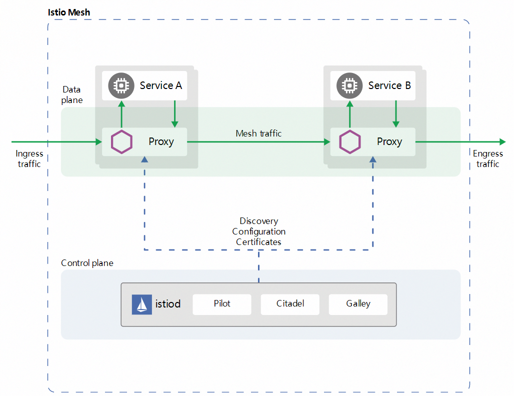

# 流量控制

顾名思义，流量控制是指对系统站点流量的管控。它包括了对入站流量，出站流量以及在系统内部 service-to-service 类型流量的控制。我们都知道，Istio 架构在逻辑上分为 Control plane（控制平面）和 Data plane（数据平面），Control plane 负责整体管理和配置代理， Data plane 负责网格内所有微服务间的网络通信，同时还收集报告网络请求的遥测数据等。流量控制则是在 Data plane 层实现。如下图所示：



与传统的微服务架构一样，想要实现流量的管控，首先就需要知道在一个网格中有多少 Endpoints（端点），这些 Endpoints 都属于哪些 Service ，然后将这些信息都记录到注册中心去便于实现服务发现。Istio 也有一个 Service Registry 用来存储网格内所有可以被路由的服务列表，如果您是 Kubernetes 用户，Istio 会自动从 Kubernetes 的 Etcd 中拉取可用 Service 列表并维护到自己的 Service Registry 中。

Istio 的流量控制是通过一系列的 CRD （Kubernetes 的自定义资源）来实现，它包括以下这些资源：

- VirtualService
- DestinationRule
- Gateway
- ServiceEntry
- Sidecar

### VirtualService

VirtualService 与 DestinationRule 是流量控制最关键的两个自定义资源。在 VirtualService 中定义了一组路由规则，当流量进入时，逐个规则进行匹配，直到匹配成功后将流量转发给给定的路由地址。它的一个简单示例如下：

```yaml
apiVersion: networking.istio.io/v1alpha3
kind: VirtualService
metadata:
  name: reviews
spec:
  hosts:
  - reviews
  http:
  - match:
    - headers:
        end-user:
          exact: jason
    route:
    - destination:
        host: reviews
        subset: v2
  - route:
    - destination:
        host: reviews
        subset: v3
```

**hosts**: 

​	用来配置下游访问的可寻址地址。配置一个 String[] 类型的值，可以配置多个。指定了发送流量的目标主机， 可以使用FQDN（Fully Qualified Domain Name - 全限定域名）或者短域名， 也可以一个前缀匹配的域名格式或者一个具体的IP地址。

**match：**

​	这部分用来配置路由规则，通常情况下配置一组路由规则，当请求到来时，自上而下依次进行匹配，直到匹配成功后跳出匹配。它可以对请求的 uri、method、authority、headers、port、queryParams 以及是否对 uri 大小写敏感等进行配置。

**route：**

​	用来配置路由转发目标规则，可以指定需要访问的 subset （服务子集），同时可以对请求权重进行设置、对请求头、响应头中数据进行增删改等操作。subset （服务子集）是指同源服务而不同版本的 Pod，通常在 Deployment 资源中设置不同的 label 来标识。

以上配置表示 ：当访问 reviews 服务时，如果请求标头中存在`end-user:jason`这样的键值对则转发到 `v2` 版本的 reviews 服务子集中，其他的请求则转发到 `v3` 版本的 reviews 服务子集中。

**补充：**在 Istio 1.5 中，VirtualService 资源之间是无法进行转发的，在 Istio 1.6版本中规划了 VirtualService Chain 机制，也就是说，我们可以通过 delegate 配置项将一个 VirtualService 代理到另外一个 VirtualService 中进行规则匹配。

### DestinationRule

DestinationRule 是 Istio 中定义的另外一个比较重要的资源，它定义了网格中某个 Service 对外提供服务的策略及规则，这包括负载均衡策略、异常点检测、熔断控制、访问连接池等。负载均衡策略支持简单的负载策略（ROUND_ROBIN、LEAST_CONN、RANDOM、PASSTHROUGH）、一致性 Hash 策略和区域性负载均衡策略。异常点检测配置在服务连续返回了5xx的错误时进行及时的熔断保护，避免引起雪崩效应。DestinationRule 也可以同 VirtualService 配合使用实现对同源服务不同子集服务的访问配置。下面是一个简单的示例：

```yaml
apiVersion: networking.istio.io/v1alpha3
kind: DestinationRule
metadata:
  name: bookinfo-ratings
spec:
  host: ratings.prod.svc.cluster.local
  trafficPolicy:
    loadBalancer:
      simple: LEAST_CONN
```

上面的配置中，在它的 metadata 中定义了的 `name` 叫做 `bookinfo-ratings`，这个 `name` 通常被使用在 VirtualService 的 `destination` 配置中。它定义的 `host` 为 `ratings.prod.svc.cluster.local`，表示流量将被转发到 `ratings.prod` 这个服务中去。同时指定路由的全局负载均衡策略是 `LEAST_CONN`（最少连接）策略。

### Gateway

Gateway 是 Istio 中对流量控制的第一层服务资源，它定义了所有HTTP/TCP流量进入网格或者从网格中出站的统一入口和出口。它描述了一组对外公开的端口、协议、负载均衡、以及 SNI 配置。Istio Gateway 包括 Ingress Gateway 与 Egress Gateway。Ingress Gateway 使用 istio-ingressgateway 负载均衡器来代理流量，而 istio-ingressgateway 的本质是一个 Envoy 代理。它的一个简单示例如下：

```yaml
apiVersion: networking.istio.io/v1alpha3
kind: Gateway
metadata:
  name: my-gateway
  namespace: some-config-namespace
spec:
  selector:
    app: my-gateway-controller
  servers:
  - port:
      number: 80
      name: http
      protocol: HTTP
    hosts:
    - uk.bookinfo.com
    - eu.bookinfo.com
    tls:
      httpsRedirect: true # sends 301 redirect for http requests
  - port:
      number: 443
      name: https-443
      protocol: HTTPS
    hosts:
    - uk.bookinfo.com
    - eu.bookinfo.com
    tls:
      mode: SIMPLE # enables HTTPS on this port
      serverCertificate: /etc/certs/servercert.pem
      privateKey: /etc/certs/privatekey.pem
  - port:
      number: 9443
      name: https-9443
      protocol: HTTPS
    hosts:
    - "bookinfo-namespace/*.bookinfo.com"
    tls:
      mode: SIMPLE # enables HTTPS on this port
      credentialName: bookinfo-secret # fetches certs from Kubernetes secret
  - port:
      number: 9080
      name: http-wildcard
      protocol: HTTP
    hosts:
    - "ns1/*"
    - "ns2/foo.bar.com"
  - port:
      number: 2379 # to expose internal service via external port 2379
      name: mongo
      protocol: MONGO
    hosts:
    - "*"
```

这个示例中，该 Gateway 被引用在`some-config-namespace`这个 Namespace 下，并使用 label `my-gateway-controller`来关联负载均衡器代理的 Pod 。它对外公开了`80`、`443`、`9443`、`9080`、`2379`端口。

- `80`端口附属配置的 host 为`uk.bookinfo.com`，`eu.bookinfo.com`，同时在`tls`中配置如果使用 HTTP1.1 协议访问将会被返回301，要求使用 HTTPS 访问，通过这种配置变相的禁止了对`uk.bookinfo.com`，`eu.bookinfo.com`域名的 HTTP1.1 协议的访问入口。
- `443`端口为 TLS/HTTPS 访问的端口，表示接受`uk.bookinfo.com`，`eu.bookinfo.com`域名的 HTTPS 协议的访问，`protocol`属性指定了他的协议类型。在`tls`的配置中指定了他的会话模式为单向 TLS ，也指定了服务端证书和私钥的存放地址。
- `9443`端口也是提供 TLS/HTTPS 访问，与 `443`不同的是他的认证不是指定存放证书的地址，而是通过 credentialName 名称从 Kubernetes 的证书管理中心拉取。
- `9080`端口为一个提供简单 HTTP1.1 协议请求的端口。这里我们注意到它的hosts中配置了 `ns1/*` 与 `ns2/foo.bar.com` 这个配置项表示只允许`ns1`这个 Namespace 下的 VirtualService 绑定它以及 `ns2` 这个命名空间下配置了 `host` 为`foo.bar.com` 的 VirtualService 绑定它。
- `2379`端口提供了一个`MONGO`协议的请求端口。允许所有 `host` 绑定它。

Egress Gateway 提供了对网格的出口流量进行统一管控的功能，在安装 Istio 时默认是不开启的。可以使用以下命令查看是否开启。

```shell
kubectl get pod -l istio=egressgateway -n istio-system
```

 若没有开启，使用以下命令添加。

```
istioctl manifest apply --set values.global.istioNamespace=istio-system \
    --set values.gateways.istio-egressgateway.enabled=true
```

Egress Gateway 的一个简单示例如下：

```yaml
apiVersion: networking.istio.io/v1alpha3
kind: Gateway
metadata:
  name: istio-egressgateway
spec:
  selector:
    istio: egressgateway
  servers:
  - port:
      number: 80
      name: http
      protocol: HTTP
    hosts:
    - edition.cnn.com
```

可以看出，与 Ingress Gateway 不同，Egress Gateway 使用有 istio: egressgateway 标签的 Pod 来代理流量，实际上这也是一个 Envoy 代理。当网格内部需要访问 edition.cnn.com 这个地址时，流量将会统一先转发到 Egress Gateway 上，再由 Egress Gateway 将流量转发到 edition.cnn.com 上。

### ServiceEntry

ServiceEntry 允许将 Istio 网格外的服务注册到网格内部 Istio 的注册表中去，这样在 Istio 内部就可以对外部服务进行管理，把它当做 Istio 内部的服务操作。包括服务发现，路由控制等，在 ServiceEntry 中可以配置 `hosts`，`vips`，`ports`，`protocols`，`endpoints`等。它的一个简单示例如下：

```yaml
apiVersion: networking.istio.io/v1alpha3
kind: ServiceEntry
metadata:
  name: external-svc-https
spec:
  hosts:
  - api.dropboxapi.com
  - www.googleapis.com
  - api.facebook.com
  location: MESH_EXTERNAL
  ports:
  - number: 443
    name: https
    protocol: TLS
  resolution: DNS
```

这个示例定义了在网格内部使用 HTTPS 协议访问外部的几个服务的配置。通过上面配置，网格内部的服务就可以把`api.dropboxapi.com`，`www.googleapis.com`,`www.googleapis.com`这几个外部的服务当做网格内部服务去访问了。`MESH_EXTERNAL` 表示是网格外服务。

在 ServiceEntry 测试时，很多同学会发现，即使不用配置 ServiceEntry，也能正常的访问外部域名，这是因为 global.outboundTrafficPolicy.mode 配置了默认值为 ALLOW_ANY 。它有两个值：

- ALLOW_ANY： Istio 代理允许调用未知的服务。
- REGISTRY_ONLY： Istio 代理会阻止任何没有在网格中定义的 HTTP 服务或 ServiceEntry 的主机。

使用以下命令来查看该配置项：

```shell
$ kubectl get configmap istio -n istio-system -o yaml | grep -o "mode: ALLOW_ANY“	
```

使用以下命令修改该配置项：

```shell
$ kubectl get configmap istio -n istio-system -o yaml  \
             | sed 's/mode: REGISTRY_ONLY/mode: ALLOW_ANY/g' | kubectl replace -n istio-system -f -

```

### Sidecar

在默认的情况下，Istio 中所有Pod中的 Envoy 代理都是可以被寻址的。然而在某些场景下，我们为了做资源隔离，希望只访问某些 Namespace 下的资源。这个时候，我们就可以使用 Sidecar 配置来实现。下面是一个简单的实例：

```yaml
apiVersion: networking.istio.io/v1alpha3
kind: Sidecar
metadata:
  name: default
  namespace: bookinfo
spec:
  egress:
  - hosts:
    - "./*"
    - "istio-system/*"
```

该示例就规定了在命名空间为 bookinfo 下的所有资源仅可以访问本命名空间下的资源以及 istio-system 命名空间下的资源。

### 总结

上面简单介绍了 Istio 架构中的流量控制以及相关资源的基本概念及功能。实际上对于每一种资源，它都提供了丰富的配置项来解决各种场景下流量分发的需求。在下面的章节中，我们将详细分析各个资源的功能。
