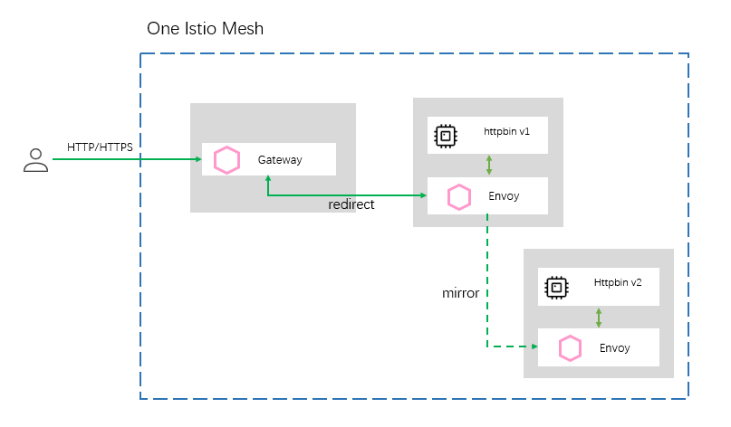

# 流量镜像

在前面的章节中，我们介绍了流量镜像的概念以及它的一些实现原理，明确了流量镜像能解决什么样的问题，以及在使用过程中应该注意的一些问题，具体参考[**流量镜像概念介绍**](https://www.servicemesher.com/istio-handbook/concepts/traffic-shadow.html)。本章节则介绍下实际使用时如何配置流量镜像，同时细究下在不同场景下流量镜像服务功能的表现形式。

## 准备工作

在您开始之前，如果没有安装 Istio , 请先安装，具体步骤请参考 [**安装 Istio**](https://www.servicemesher.com/istio-handbook/practice/setup-istio.html) 章节。

首先准备两个不同版本的同一服务用来模拟正常业务服务与镜像服务。这两个版本的服务中有相同 URL 的接口，但他们内部实现不同，我们通过观察他们的日志打印信息来观察。本文中演示服务的下载地址为 ：https://github.com/servicemesher/istio-handbook-resources.git 下，code/practice/istio-mirror 模块。本示例中包括三部分内容。

- `service-business-v1`：接收原始流量，其中一个接口 `request/times` 用来模拟业务接口。如下：

```java
@GetMapping("/request/times")
public ResponseEntity<String> times() {
    int i = count.incrementAndGet();
    String info = String.format("receive %s times request", i);
    log.info(info);
    return ResponseEntity.ok(info);
}
```

- `service-business-v2`：接收镜像流量，其中也存在`request/times`接口， 用来观察镜像流量，它打印的日志信息与`service-business-v1`不同。

```java
@GetMapping("/request/times")
public ResponseEntity<String> times() {
    int i = count.incrementAndGet();
    String info = String.format("I'm a shadow service, receive %s times request", i);
    log.info(info);
    return ResponseEntity.ok(info);
}
```

- `deploy` ：定义了一些测试部署编排文件。

## 部署测试服务

准备好相关坏境之后，我们在使用下面的命令将这两个服务都运行起来。

```shell
$ kubectl apply -f deploy/service-business-deploy.yaml -f deploy/network-all.yaml
```

等待一分钟左右，我们来验证下服务是否正常启动，资源是否全部创建完成。

```shell
$ kubectl get svc,po,vs,dr
```

```shell
NAME                       TYPE       CLUSTER-IP       EXTERNAL-IP  PORT(S)  AGE
service/service-business   ClusterIP  172.20.188.157   <none>       80/TCP   43s

NAME                                       READY   STATUS        RESTARTS   AGE
pod/service-business-v1-5d975dbd5f-8hc9k   2/2     Running       0          45s
pod/service-business-v2-5879797985-xlpt5   2/2     Running       0          45s

NAME                                                  GATEWAYS                        HOSTS   AGE
virtualservice.networking.istio.io/service-business   [istio-system/ingressgateway]   [*]     43s
virtualservice.networking.istio.io/service-shadow     [istio-system/ingressgateway]   [*]     43s

NAME                                                   HOST                                         AGE
destinationrule.networking.istio.io/service-business   service-business.default.svc.cluster.local   44s
```

接下来我们使用如下命令将来验证服务是否均可正常访问。

```shell
$ export GATEWAY_URL=$(kubectl -n istio-system get service istio-ingressgateway -o jsonpath='{.status.loadBalancer.ingress[0].hostname}')

$ curl http://${GATEWAY_URL}/service-business/actuator/info
{"app":{"name":"service-business","version":"1.0.0.0"}}

$ curl http://${GATEWAY_URL}/service-shadow/actuator/info
{"app":{"name":"service-business","version":"1.0.0.0"}}
```

至此，两个服务均正常运行且可以被单独访问。

## 流量镜像测试

#### 场景一：一个集群中不同版本服务间流量镜像

流量镜像最常用的一个场景便是在一个集群内，将一个服务的流量镜像到另一个服务中或者将流量从同一个服务的`v1`版本镜像到`v2`版本中。他们的配置都是类似的，这里我们介绍将`service-business-v1`服务的流量镜像到`service-business-v2`服务中。它的场景模型如下图所示：



使用下面的命令来配置将`service-business-v1`的流量镜像到`service-business-v2`服务中。

```shell
$ kubectl apply -f deploy/virtual-service-business-shadow-percent-100.yaml
```

`virtual-service-business-shadow-percent-100.yaml`配置文件中主要是在`service-business-v1`服务的 VirtualService 中增加了流量镜像相关配置，具体是下面这一部分：

```yaml
    ...
    mirror:
      host: service-business
      subset: v2
    mirror_percent: 100
```

`mirror_percent`配置表示将`100%`的流量镜像到`service-business-v2`服务上。

现在我们调用`service-business-v1`服务的`request/times` 接口，调用完成后，查看`service-business-v2`服务日志信息，查看它是否接受到了镜像过来的流量。

```shell
$ curl http://${GATEWAY_URL}/service-business/request/times
receive 1 times request

$ kubectl logs service-business-v2-5879797985-xlpt5 -c service-business --tail 2
2020-04-22 09:51:06.857  INFO 1 --- [nio-8080-exec-1] o.s.web.servlet.DispatcherServlet        : FrameworkServlet 'dispatcherServlet': initialization completed in 9 ms
2020-04-22 11:06:12.104  INFO 1 --- [nio-8080-exec-5] com.tony.unit.controller.DemoController  : I'm a shadow service, receive 1 times request

```

观察`service-business-v2`服务的日志后发现，它的`request/times` 接口也被调用了，这表示我们的流量镜像配置已经生效。当访问`service-business-v1`服务时，流量成功的被镜像了一份到`service-business-v2`服务上相同的接口中，这表示我们的流量镜像配置已经生效。然后我们再观察`service-business-v1`服务的`request/times` 接口的响应信息，发现只返回了`service-business-v1`服务自己本身的响应信息，并没有返回`service-business-v2`服务的响应信息，这说明本次请求忽略`service-business-v2`服务的处理结果，这也佐证了流量镜像的特点：fire and forget。

接下来我们重复10次调用`service-business-v1`的`request/times`接口后查看`service-business-v2`服务的日志信息，观察是否每一个的请求都会被镜像了一份进去。

```shell
$ kubectl logs service-business-v2-5879797985-xlpt5  -c service-business --tail 5
2020-04-22 11:37:12.703  INFO 1 --- [nio-8080-exec-3] com.tony.unit.controller.DemoController  : I'm a shadow service, receive 6 times request
2020-04-22 11:37:14.239  INFO 1 --- [nio-8080-exec-6] com.tony.unit.controller.DemoController  : I'm a shadow service, receive 7 times request
2020-04-22 11:37:15.333  INFO 1 --- [nio-8080-exec-7] com.tony.unit.controller.DemoController  : I'm a shadow service, receive 8 times request
2020-04-22 11:37:16.381  INFO 1 --- [nio-8080-exec-9] com.tony.unit.controller.DemoController  : I'm a shadow service, receive 9 times request
2020-04-22 11:37:17.926  INFO 1 --- [nio-8080-exec-1] com.tony.unit.controller.DemoController  : I'm a shadow service, receive 10 times request
```

通过观察发现，的确每一次请求都被镜像，说明我们的`mirror_percent: 100`配置生效了。

接下来，我们通过执行下面的命令更改`mirror_percent`属性值，执行此命令后，该值被修改成了`50`。

```shell
$ kubectl apply -f deploy/virtual-service-business-shadow-percent-50.yaml
```

接下来我们测试该属性对流量镜像功能的影响。在测试之前，首先使用以下接口来重置测试数据，以免历史数据对新一轮的测试产生误导。

```shell
$ curl http://${GATEWAY_URL}/service-business/request/times/reset
reset 0
$ curl http://${GATEWAY_URL}/service-shadow/request/times/reset
reset 0
```

之后，此时再连续20次调用`service-business-v1`的`request/times`接口，继续观察`service-business-v2`服务的日志信息。

```shell
...
$ curl http://${GATEWAY_URL}/service-business/request/times
receive 20 times request

$ kubectl logs service-business-v2-5879797985-xlpt5  -c service-business --tail 5
2020-04-22 12:07:13.534  INFO 1 --- [nio-8080-exec-1] com.tony.unit.controller.DemoController  : I'm a shadow service, receive 5 times request
2020-04-22 12:07:14.539  INFO 1 --- [nio-8080-exec-3] com.tony.unit.controller.DemoController  : I'm a shadow service, receive 6 times request
2020-04-22 12:07:15.599  INFO 1 --- [nio-8080-exec-4] com.tony.unit.controller.DemoController  : I'm a shadow service, receive 7 times request
2020-04-22 12:07:16.553  INFO 1 --- [nio-8080-exec-6] com.tony.unit.controller.DemoController  : I'm a shadow service, receive 8 times request
2020-04-22 12:07:18.589  INFO 1 --- [nio-8080-exec-8] com.tony.unit.controller.DemoController  : I'm a shadow service, receive 9 times request

```

通过上面的日志信息分析，我们发现`service-business-v1`请求在被调用20次时，只有9次请求镜像到了`service-business-v2`服务当中，并不是准确的50%。实际上，Istio 允许这种误差的存在，该属性值只能表示它大概的一个百分比，读者可以再尝试更多次调用`request/times`接口观察效果。

**提示**：以上两个服务中还提供了 `request/info`接口，这个接口会返回请求的所有请求标头信息，读者可以通过这个接口观察业务流量与镜像流量请求标头的区别。

#### 场景二：将一个集群的流量镜像到另外一个集群当中

很多情况下，我们需要将生产坏境的流量镜像到测试坏境中一份进行测试，它的场景模型如下图所示：

基于场景一中的配置，首先我们登录到测试坏境的集群里，使用下面的命令在测试坏境创建镜像服务`service-business-v2`。

```shell
$ kubectl apply -f deploy/service-business-v2-in-other-cluster-all-deploy.yaml
```

创建后稍等片刻，使用以下命令查看是否创建成功。

```shell
NAME                       TYPE         CLUSTER-IP     EXTERNAL-IP   PORT(S)  AGE
service/service-business   ClusterIP    10.100.10.14   <none>        80/TCP   115s

NAME                                       READY   STATUS    RESTARTS   AGE
pod/service-business-v2-6dc7f869c9-tnbcf   2/2     Running   0          115s

NAME                                                GATEWAYS                        HOSTS  AGE
virtualservice.networking.istio.io/service-shadow   [istio-system/ingressgateway]   [*]    115s
```

接下来我们使用如下命令将来验证这个服务是否可以单独正常访问。

```shell
$ export TEST_GATEWAY_URL=$(kubectl -n istio-system get service istio-ingressgateway -o jsonpath='{.status.loadBalancer.ingress[0].hostname}')

$ curl http://${TEST_GATEWAY_URL}/service-shadow/actuator/info
{"app":{"name":"service-business","version":"1.0.0.0"}}
```

完成以上部署之后，我们回到业务集群中，先将`deploy/virtual-service-business-shadow-to-other-cluster.yaml`文件中的`${TEST_GATEWAY_URL}`替换成真实的测试集群 ingressgateway 的主机地址。之后执行以下命令修改`service-business-v1`服务的 VirtualService 配置。

```shell
$ kubectl apply -f deploy/virtual-service-business-shadow-to-other-cluster.yaml
```

可以使用以下命令查看修改后的结果，发现`mirror.host`配置项已经生效。

```shell
$ kubectl get vs service-business -o yaml

...
    mirror:
      host: xxxxxxxxx.us-west-2.elb.amazonaws.com
    mirror_percent: 100

```

同样需要先调用`request/times/reset`接口对测试数据归零，避免本次测试受到历史测试数据的影响。然后多次调用`serveice-business-v1`服务并显示正常响应。

```shell
$ curl http://${GATEWAY_URL}/service-business/request/times/reset
reset 0

$ curl http://${GATEWAY_URL}/service-business/request/times
...
receive 5 times request

```

此时我们观察测试环境中的`service-business-v2`服务的日志信息。

```shell
$ kubectl logs service-business-v2-6dc7f869c9-tnbcf -c service-business --tail 2

2020-04-24 06:32:43.800  INFO 1 --- [nio-8080-exec-2] com.tony.unit.controller.DemoController  : I'm a shadow service, receive 4 times request
2020-04-24 06:32:44.722  INFO 1 --- [nio-8080-exec-3] com.tony.unit.controller.DemoController  : I'm a shadow service, receive 5 times request

```

至此，我们完成了将一个集群中的流量镜像转发到另外一个集群的操作。当然，这只是简单的在不同集群中流量镜像的示例，在实际操作过程中，我们可能需要在业务集群中使用 ServiceEntry 将对测试坏境的调用使用 Envoy 托管，也可能需要配置 TLS 实现安全访问等，这些功能这里不再一一展开说明。

实际上，对于上产坏境中一些比较有代表性的流量，我们使用流量镜像复制到其他集群之后，将这些流量通过文件或者日志的形式收集起来，而这些数据既可以作为自动化测试脚本的数据源，也可以作为大数据分析客户画像等功能的部分数据源，通过对这些数据的提取以及二次开采，分析客户的购物行为，习惯等特征信息，并将加工后的数据应用到推荐服务当中，可以帮助实现系统的千人千面，定向推荐等功能。

## 坏境清除

使用以下命令清除上面创建的所有资源。

```shell
$ kubectl delete -f deploy/network-all.yaml
$ kubectl delete -f deploy/service-business-deploy.yaml
$ kubectl delete -f deploy/service-business-v2-in-other-cluster-all-deploy.yaml
```

## 参考

[istio-mirror-demo 示例下载](https://github.com/servicemesher/istio-handbook-resources.git)


