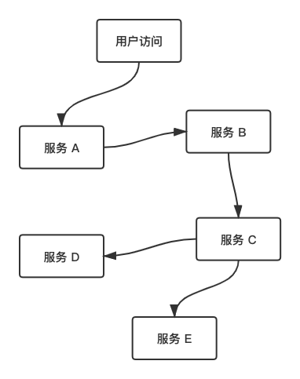
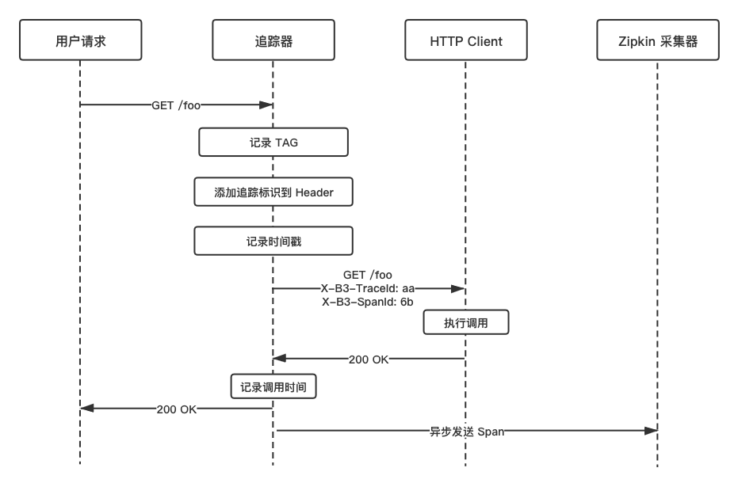
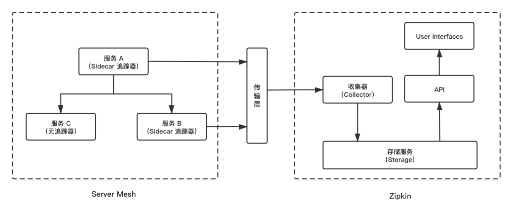
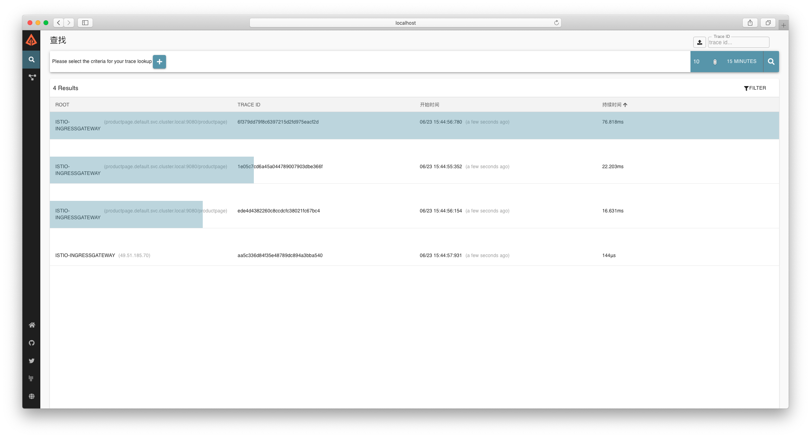
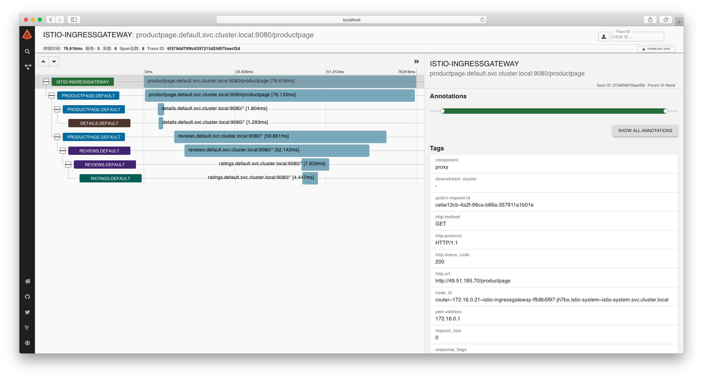

# Zipkin
Zipkin 是一个分布式跟踪系统，它有助于收集服务的调用关系和服务的调用时序数据，包括收集数据和结果展示。它基于 Google Dapper 论文设计，由 Twitter 实现并基于 Apache 2.0 协议开源。

## 追踪原理
在分布式系统架构中，用户的一次请求，往往需要经过不同的服务和模块，最终才能够返回请求结果。不同的“微服务”之间，每次调用都会形成一个完整的调用链，组成一个树形结构。


这样一颗完整的树，我们称为 `Trace`， 树里的每一个节点，我们称之为 `Span` 。当服务被调用的时，都会为 `Trace` 和 `Span` 生成唯一的 `ID` 标识，通过记录调用发起方 `parentId` ，我们就可以很清晰的将每一个 `Span` 串联起来，形成一条完整的调用链，这是分布式调用链追踪的基本原理。

当然，Zipkin 兼容 `OpenTracing` 协议，所以 `Span` 还会记录其他的信息，例如：时间戳、Span 上下文、以及额外的 K/V Tag 等。

## Envoy-Zipkin 架构
在 `Istio` 中，`Envoy` 原生支持分布式追踪系统 Zipkin。当请求流量被 `Envoy` Sidecar 拦截时，`Envoy` 会自动为 HTTP Headers 添加 `x-b3` 开头的 Headers 和 `x-request-id`。业务系统在调用下游服务时需要将这些 Headers 信息加入到请求中，下游的 `Envoy` Sidecar 收到请求后，会将 `Span` 上报给 `Zipkin` ，最终由 Zipkin 解析出完整的调用链。

详细的过程大致为：
* 如果请求来源没有 Trace 相关的 Headers，则会在流量进入 POD 之前创建一个 Root Span。
* 如果请求来源包含 Trace 相关的 Headers，Envoy 将会解析 Span 上下文信息，然后在流量进入 POD 之前创建一个新的 Span 继承自旧的 Span 上下文。



在 Istio 服务网格内，调用链的 `Span` 信息由 `Envoy` 通过 proxy 直接上报给 `ZipkinServer`。服务和 `Zipkin` 的调用流程以及 Zipkin 内部结构大致如下：



* 传输层：默认为 HTTP 的方式，当然还可以使用 Kafka、Scribe 的方式。
* 收集器（Collector）：收集发送过来的 Span 数据，并进行数据验证、存储以及创建必要的索引。
* 存储（Storage）：默认是 in-memory 的方式，仅用于测试。请注意此方式的追踪数据并不会被持久化。其他可选方式有 JDBC（Mysql）、Cassandra、Elasticsearch 。
* API：提供 API 外部调用查询，主要是 Web UI 调用。
* User Interfaces（Web UI）：提供追踪数据查询的 Web UI 界面展示。

以 Bookinfo 为例，通过分析 `productpage` Python 服务，可以发现代码里使用了 `OpenTracing` 库从请求内提取了所需的 Headers，并在调用下游服务时，附带这些 Headers 参数。
```
def getForwardHeaders(request):
    headers = {}
    # x-b3-*** headers can be populated using the opentracing span
    span = get_current_span()
    carrier = {}
    tracer.inject(
        span_context=span.context,
        format=Format.HTTP_HEADERS,
        carrier=carrier)

    headers.update(carrier)
    # ...
    incoming_headers = ['x-request-id']
    # ...
    for ihdr in incoming_headers:
        val = request.headers.get(ihdr)
        if val is not None:
            headers[ihdr] = val
    return headers
```

另外，使用 JAVA 编写的 `reviews` 服务也是如此：
```
@GET
@Path("/reviews/{productId}")
public Response bookReviewsById(@PathParam("productId") int productId,
    @HeaderParam("end-user") String user,
    @HeaderParam("x-request-id") String xreq,
    @HeaderParam("x-b3-traceid") String xtraceid,
    @HeaderParam("x-b3-spanid") String xspanid,
    @HeaderParam("x-b3-parentspanid") String xparentspanid,
    @HeaderParam("x-b3-sampled") String xsampled,
    @HeaderParam("x-b3-flags") String xflags,
    @HeaderParam("x-ot-span-context") String xotspan) {

    if (ratings_enabled) {
        JsonObject ratingsResponse = getRatings(Integer.toString(productId), user, xreq, xtraceid, xspanid, xparentspanid, xsampled, xflags, xotspan);
    }
```

## 环境准备
请先按照本书指引使用 `demo` 配置安装 Istio ，并部署 `Bookinfo` 示例应用程序，再进行以下配置：

1. 打开 tracing 功能，并配置 tracing provider 为 Zipkin：
    ```
    $ istioctl manifest apply --set values.tracing.enabled=true --set values.tracing.provider=zipkin
    ✔ Istio core installed
    ✔ Istiod installed
    ✔ Ingress gateways installed
    ✔ Addons installed
    ✔ Installation complete
    ```
    此命令会启用“开箱即用”的 Zipkin 演示环境。
    > 注意，默认采样率为 1%，你可以通过 `--set values.pilot.traceSampling=<Value>` 来配置采样率。Value 范围在 0.0 到 100.0 之间，精度为 0.01 。例如，Value 配置 0.01 意味着 10000 请求中跟踪 1 个请求。

2. 如果你的集群已部署 Zipkin ，你可以直接使用以下命令进行配置：
    ```
    --set values.global.tracer.zipkin.address=<zipkin-collector-service>.<zipkin-collector-namespace>:9411
    ```

3. 访问 Bookinfo `/productpage` 页面以便生成并上报追踪数据，默认 1% 的采样率意味着需要至少请求 100 次才能看到追踪数据：
    ```
    for i in `seq 1 100`; do curl -s -o /dev/null http://$GATEWAY_URL/productpage; done
    ```
    * 请将 GATEWAY_URL 替换为 `ingressgateway` 的 IP 地址。
    
    命令执行完成后，追踪数据已经上报至 Zipkin 了。


## 访问 Zipkin Dashboard
Zipkin 作为 Istio 的插件，可以通过配置 Ingress Gateway 来进行访问，请参考官方文档获取配置信息：[https://istio.io/latest/docs/tasks/observability/gateways/](https://istio.io/latest/docs/tasks/observability/gateways/)，本文不再赘述。

如果 Istio 部署在本地环境，可以使用以下命令配置端口转发，此命令会随机使用一个本地端口作为请求访问端口：
```
$ istioctl dashboard zipkin
http://localhost:39877
open http://localhost:39877 in your browser.
```

如果 Istio 部署在远程集群，也可以使用 kubectl 配置本地端口转发：
```
$ kubectl port-forward svc/tracing 8080:80 -n istio-system
```
使用 kubectl 配置端口转发后，打开浏览器访问 `http://localhost:8080`，即可打开 Zipkin Dashboard。


点击右侧“搜索”图标后，出现追踪数据，点击列表进入追踪数据详情：


从追踪数据可以得出，访问一次 Bookinfo，涉及到了 5 个服务（包含 Istio-IngressGateway），Span 总数为 8 ，同时记录了请求的 TraceID 、每个服务的请求耗时以及请求总耗时。

有了 Zipkin，我们能够非常清晰地查看每一个服务的依赖以及每一次请求的时序数据，为我们在庞大的微服务系统里排查延迟问题、调用链异常等问题提供了极大的便利。

最后，需要留意到的是：采集追踪信息并不是对业务毫无侵入性，业务系统需要在调用下游服务时传递用于追踪的 Headers 。在实践中，我们可以将这部分业务逻辑编写至我们的“中间件”或者“拦截器”内，减轻对业务的负担和侵入性。

## 生产建议
对于生产环境，我们提供以下几点建议：
1. Istio 提供“开箱即用”的 Zipkin 采用内存的存储方式，Zipkin POD 被销毁后数据随即消失。在生产中需要单独配置持久化存储如：Elasticserach ，具体可参阅 Zipkin 官方文档。
2. Demo 中 Zipkin 默认采样率为 `1%`，在生产环境中建议根据业务系统的流量大小进行合理配置。
3. Zipkin 传输层默认使用 HTTP 的方式传输，大规模的使用场景建议使用 Kafka 进行数据传输。
4. Zipkin 设计初衷是纯粹的追踪系统，为了做到更高性能的追踪数据采集和展示，应尽可能减少 Span 中自定义 K/V 信息，尤其避免将日志信息存存储至 Span 。


## 参考
* [Envoy - Traceing](https://www.servicemesher.com/envoy/intro/arch_overview/tracing.html)
* [Zipkin - Architecture](https://zipkin.io/pages/architecture.html)
* [Istio - Distributed-tracing](https://istio.io/latest/docs/tasks/observability/distributed-tracing/overview/)
* [Istio - Zipkin](https://istio.io/latest/docs/tasks/observability/distributed-tracing/zipkin/)
* [Distributed Tracing, Istio and Your Applications](https://thenewstack.io/distributed-tracing-Istio-and-your-applications/)
* [ServiceMesher - Envoy - Traceing](https://www.servicemesher.com/envoy/intro/arch_overview/tracing.html)
* [分布式集群环境下调用链路追踪](https://www.ibm.com/developerworks/cn/web/wa-distributed-systems-request-tracing/index.html)
* [一文搞懂基于zipkin的分布式追踪系统原理与实现](https://juejin.im/post/5c3d4df0f265da61307517ad)
* [专访 Zipkin 项目 Leader：如何用 Zipkin 做好分布式追踪？](https://www.infoq.cn/article/9cboE5lVeQeOuB_dwyRg)