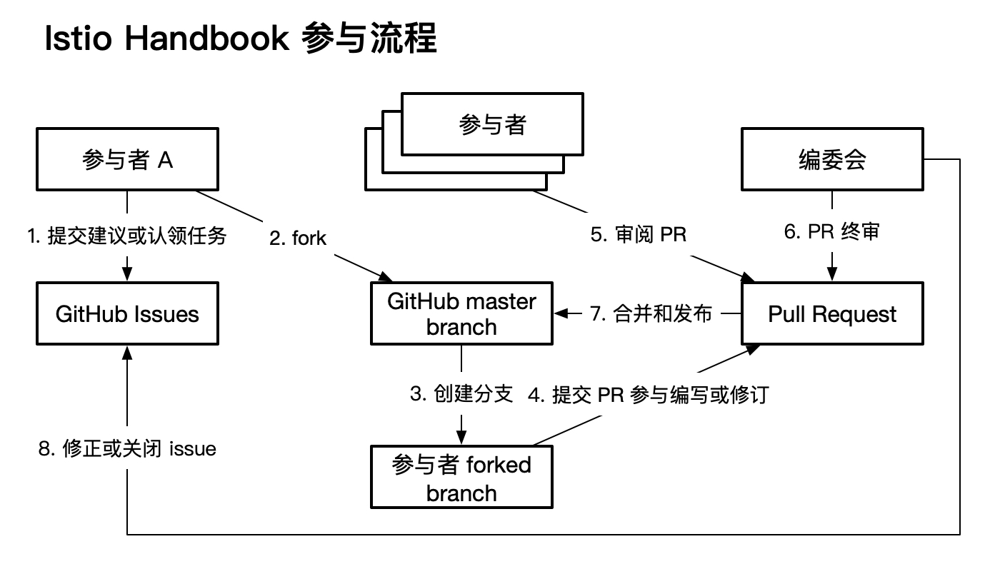

# 参与流程

本文档说明参与本书的流程。

## 基本流程

Istio Handbook 参与流程如下图所示。



参与本书写作的基本流程如下：

- 任务领取：在本仓库的 [issue 页面](https://github.com/servicemesher/istio-handbook/issues)领取 `status/pending` 状态任务；
- 提交：参与人员提交 PR 等待 review；
- 审阅：所有参与人员都可以审阅 PR；
- 终审：[编委会](editorial-board.md)对 review 后的内容进行最后确认；
- 合并：merge 到 master 分支，任务结束。

我们通过审阅、终审两轮 review 保证本书的质量；通过预览保证显示的准确性。

## 参与指南

下面具体介绍参与进来的具体工作。

### 准备工作

- 账号：您需要先准备一个 GitHub 账号。本书通过微信用来协作和沟通，Github 进行任务认领和 PR 提交。
- 申请加入：请添加 [Jimmy Song](https://jimmysong.io/contact) 微信，备注（姓名-公司）并说明加入 Istio Handbook 协作群，之后管理员会将您添加到 ServiceMesher 的 GitHub 组织，即可正式参与写作。


- 为保证本书内容的一致性和准确性，请在参与前仔细阅读[协作规范](specification.md)；
- 仓库和分支管理
  - fork [istio-handbook](https://github.com/servicemesher/istio-handbook) 的仓库，并作为自己仓库的上游： `git remote add upstream` ；
  - 在自己的仓库，也就是 origin 上进行翻译；
  - 一个任务新建一个 branch；

### 参与步骤

下面列出的是具体的参与步骤。

#### Step1：任务浏览

访问[任务列表](https://github.com/servicemesher/istio-handbook/issues)，会看到待领取任务（默认 Open 状态，label 中带有 `status/pending` 字样）。通常情况下，您只需要关心状态。

**状态 label**

- `status/pending`：待领取的任务，本文尚未开始编写或该任务尚未开始；
- `status/waiting-for-pr`：已认领任务，尚未提交 PR；
- `status/revewing`：已提交 PR，正在 review；
- `status/merged`：PR 已合并，任务完成。

除此以外，我们还设置了版本号、错误类型等标签。

可以简单的通过点击标签来进行过滤，也可以参考 [GitHub 查询语法](https://help.github.com/articles/searching-issues-and-pull-requests/)，来完成更复杂的查询。

#### Step2：任务领取

找到未经认领的任务（`status/pending` 标签），在 issue 中回复 `/accept` 可以领取任务，Bot 会将任务分配给你，并修改状态为 `status/waiting-for-pr`。

> 注意：为保证质量，同一译者只能拥有三个 `status/waiting-for-pr` 状态的 Issue，超过数量无法继续认领。

#### Step3：本地构建和预览

本书使用 Gitbook 构建，请先安装 [Gitbook](https://github.com/GitbookIO/gitbook/blob/master/docs/setup.md)。安装完成后在本书根目录下执行以下命令可以预览本书。

```bash
# 安装 Gitbook 插件，只需执行一次
gitbook install
# 预览
gitbook serve
```

在浏览器中打开 <http://localhost:4000> 可以预览本书。

#### Step4：提交 PR

在确认本书构建和预览没有问题之后，就可以[提交 PR](https://github.com/servicemesher/istio-handbook/pulls) 了，为方便管理和辨识，请遵守下面的模板定义您的 PR：

```bash
# PR 标题
若为新增文章则前缀为 add: 文章标题
若为修改文章则前缀为 fix: 文章标题
# 内容：指定你引用的 issue 编号
ref: https://github.com/servicemesher/istio-handbook/issues/<issueID>
```

提交 PR 后在该 PR 对应的 issue 中回复 `/pushed`，GitHub bot 会自动去掉 `status/waiting-for-pr` 标签，并增加 `status/reviewing` 标签。

#### Step5：审阅

所有参与人员都可以参与审阅。为保证质量，我们设置了两轮 review：

- 初审：所有人都可以参与，为文章提出建设性意见；
- 终审：终审由本书编委会执行，approve 当前 PR 并回复 `/LGTM`，就可以自动合并了。

#### Step6：任务完成

通过终审后的任务会被编委会 approve，并合并到本书的 master 分支中。需要您在对应的 issue 中输入指令 `/merged`，Bot 会设置 Issue 的状态为 `status/merged`，并关闭 issue。一次参与流程就算正式完成了。您可以继续领取新的任务，或参与审阅工作。
