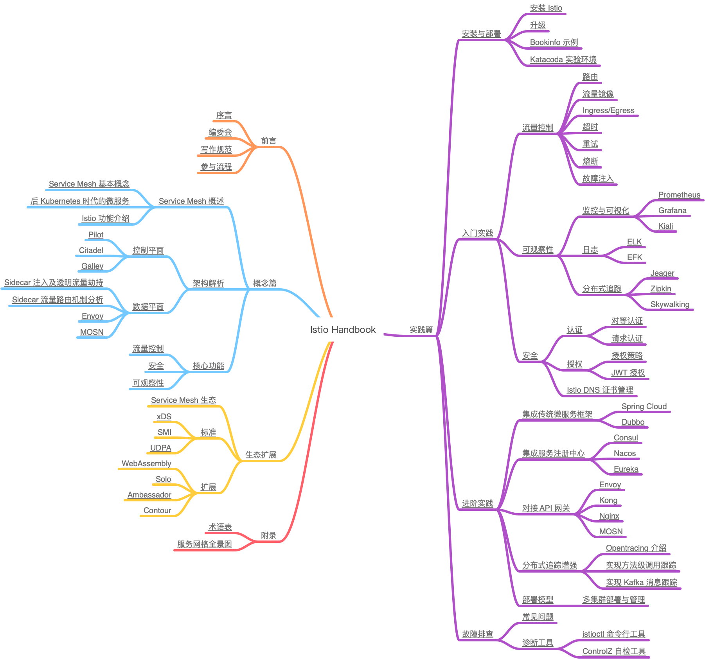

# 目录

> Draft: v0.3
> Date: 2020-03-16
> MindNode 脑图：[mind-map.mindnode](mind-map.mindnode)

## 概念篇

### Service Mesh 概述

#### Service Mesh 基本概念

#### 后 Kubernetes 时代的微服务

#### Istio 功能介绍

### 架构解析

#### 控制平面

##### Pilot

##### Citadel

##### Galley

#### 数据平面

##### Sidecar 注入及透明流量劫持

##### Sidecar 流量路由机制分析

##### Envoy

##### MOSN

### 核心功能

#### 流量控制

#### 安全

#### 可观察性

## 实践篇

### 安装与部署

#### 安装 Istio

#### 升级

#### Bookinfo 示例

#### KataCoda 实验环境

### 入门实践

#### 流量控制

##### 路由

##### 流量镜像

##### Ingress/Egress

##### 超时

##### 重试

##### 熔断

##### 故障注入

#### 可观察性

##### 监控与可视化

###### Prometheus

###### Grafana

###### Kiali

##### 日志

###### ELK

###### EFK

##### 分布式追踪

###### Jeager

###### Zipkin

###### Skywalking

#### 安全

##### 认证

###### 对等认证

###### 请求认证

##### 授权

###### 授权策略

###### JWT 授权

##### Istio DNS 证书管理

### 进阶实践

#### 集成传统微服务框架

##### Spring Cloud

##### Dubbo

#### 集成注册中心配置中心

##### Consul

##### Nacos

##### Apollo

#### 对接 API 网关

##### Envoy

##### Kong

##### Nginx

##### MOSN

#### 分布式追踪增强

##### Opentracing 介绍

##### 实现方法级调用跟踪

##### 实现 Kafka 消息跟踪

#### 部署模型

##### 多集群部署与管理

## 故障排查

### 常见问题

### 诊断工具

#### istioctl 命令行工具

#### ControlZ 自检工具

## 生态扩展

### Service Mesh 生态

### 标准

#### xDS

#### SMI

#### UDPA

### 扩展

#### WebAssembly

#### Solo

#### Ambassador

#### Contour

## 附录

## 术语表

## 服务网格全景图